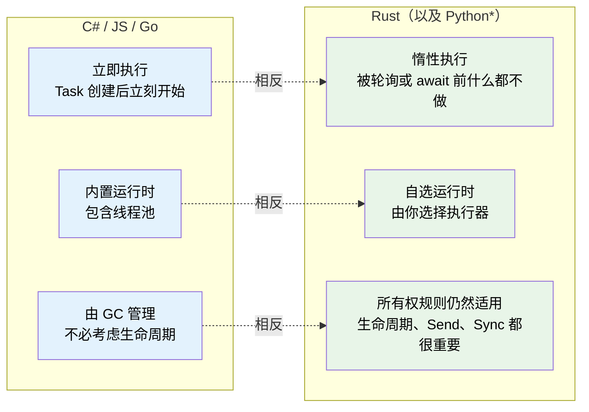
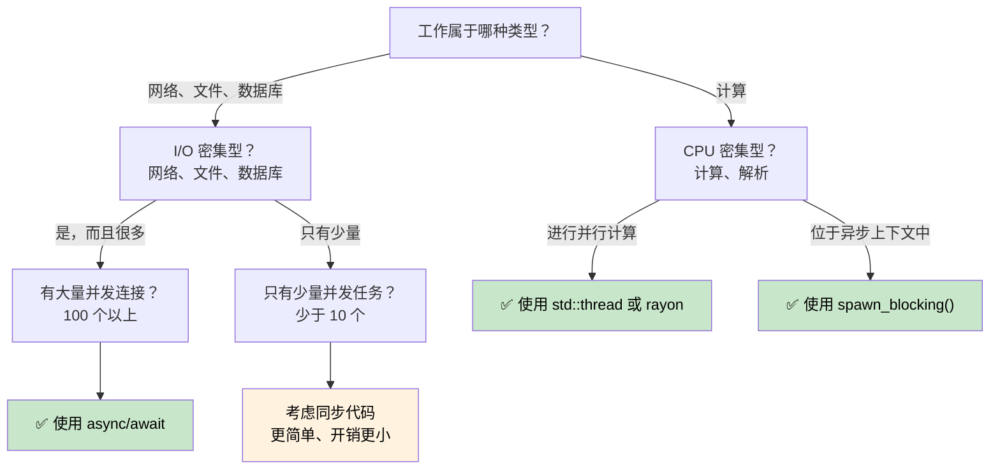

# 第 1 章：为什么 Rust 的异步与众不同 🟢

> **你将学到什么：**
> - Rust 为什么没有内置异步运行时，以及这对你意味着什么
> - 三个关键特性：惰性执行、没有内置运行时、零成本抽象
> - 什么时候异步是合适的工具，什么时候反而更慢
> - Rust 的模型与 C#、Go、Python 和 JavaScript 有何不同

## 根本差异

大多数支持 `async/await` 的语言都会隐藏背后的机械结构。C# 有 CLR 线程池，JavaScript 有事件循环，Go 把 goroutine 和调度器内置在运行时中，Python 则有 `asyncio`。

**Rust 什么都没有内置。**

它没有内置运行时、线程池或事件循环。`async` 关键字是一种零成本的编译策略：它把函数转换成一个实现了 `Future` trait 的状态机。必须由另一个角色——*执行器（executor）*——驱动这个状态机向前运行。

### Rust 异步的三个关键特性



> \* Python 协程和 Rust Future 一样是惰性的：只有被 `await` 或交给调度器后才会执行。不过 Python 仍依赖垃圾回收，也没有所有权和生命周期方面的约束。

### 没有内置运行时

```rust
// This compiles but does NOTHING:
async fn fetch_data() -> String {
    "hello".to_string()
}

fn main() {
    let future = fetch_data(); // Creates the Future, but doesn't execute it
    // future is just a struct sitting on the stack
    // No output, no side effects, nothing happens
    drop(future); // Silently dropped — work was never started
}
```

对比 C#：其中的 `Task` 会立即开始执行。

```csharp
// C# — this immediately starts executing:
async Task<string> FetchData() => "hello";

var task = FetchData(); // Already running!
var result = await task; // Just waits for completion
```

### 惰性 Future 与立即执行的 Task

这是最重要的一次思维转换：

| | C# / JavaScript | Python | Go | Rust |
|---|---|---|---|---|
| **创建时** | `Task` 立即开始执行 | 协程是**惰性的**——返回一个对象，被等待或调度前不会运行 | goroutine 立即开始运行 | `Future` 被轮询前什么都不做 |
| **丢弃时** | 分离的任务会继续运行 | 未等待的协程会被垃圾回收（并产生警告） | goroutine 一直运行到返回 | 丢弃 Future 就会取消它 |
| **运行时** | 内置于语言或虚拟机 | `asyncio` 事件循环（必须显式启动） | 内置于二进制程序（M:N 调度器） | 由你选择（Tokio、smol 等） |
| **调度方式** | 自动（线程池） | 事件循环 + `await` 或 `create_task()` | 自动（GMP 调度器） | 显式（`spawn`、`block_on`） |
| **取消方式** | `CancellationToken`（协作式） | `Task.cancel()`（协作式，引发 `CancelledError`） | `context.Context`（协作式） | 丢弃 Future（立即发生） |

```rust
// To actually RUN a future, you need an executor:
#[tokio::main]
async fn main() {
    let result = fetch_data().await; // NOW it executes
    println!("{result}");
}
```

### 什么时候使用异步，什么时候不要使用



**经验法则**：异步适用于 I/O 并发——在等待期间同时推进许多工作；它不等于 CPU 并行——不能天然让单项计算更快。若要维持 10,000 个网络连接，异步大显身手；若要进行大量数值运算，应使用 `rayon` 或操作系统线程。

### 异步何时反而更慢

异步并非没有代价。面对低并发工作负载，同步代码可能比异步代码更快：

| 成本 | 原因 |
|------|------|
| **状态机开销** | 每个 `.await` 都会增加一个枚举状态；深层嵌套的 Future 会产生庞大而复杂的状态机 |
| **动态分派** | `Box<dyn Future>` 会增加一次间接访问，并阻碍内联优化 |
| **上下文切换** | 协作式调度仍有成本——执行器需要管理任务队列、Waker 和 I/O 注册 |
| **编译时间** | 异步代码会生成更复杂的类型，减慢编译 |
| **可调试性** | 穿过状态机的调用栈更难阅读（参见第 12 章） |

**性能测试建议**：如果并发 I/O 操作少于约 10 个，在决定采用异步前先做性能分析。现代 Linux 上，每个连接使用一个简单的 `std::thread::spawn`，扩展到数百个线程也通常没有问题。

> **深入理解：零成本不等于零开销**
>
> “零成本抽象”是指：你不会为没有使用的能力付费，而且高级抽象能够编译成接近手写状态机的代码；它并不表示调度、保存状态、注册 I/O 和唤醒任务完全没有运行成本。选择异步的正确理由是它能以少量线程承载大量等待中的任务，而不是因为 `async` 这个关键字天然更快。

### 练习：你会在何时使用异步？

<details>
<summary>🏋️ 练习（点击展开）</summary>

判断异步是否适合以下场景，并说明理由：

1. 处理 10,000 个并发 WebSocket 连接的 Web 服务器
2. 压缩一个大型文件的命令行工具
3. 查询 5 个不同数据库并合并结果的服务
4. 以 60 FPS 运行物理模拟的游戏引擎

<details>
<summary>🔑 答案</summary>

1. **异步**——I/O 密集且并发量巨大。每个连接的大部分时间都在等待数据；使用线程将需要一万个线程栈。
2. **同步/线程**——这是单项 CPU 密集型工作。异步只会增加开销而没有收益；并行压缩可使用 `rayon`。
3. **异步**——这是五次可并发进行的 I/O 等待。`tokio::join!` 能让五个查询同时推进。
4. **同步/线程**——CPU 密集且对延迟敏感。异步的协作式调度可能引入帧时间抖动。

</details>
</details>

> **要点回顾——为什么 Rust 的异步与众不同**
> - Rust Future 是**惰性的**——执行器轮询它以前什么都不会发生
> - Rust **没有内置运行时**——由你选择或亲自构建
> - 异步是一种生成状态机的**零成本编译策略**
> - 异步擅长 **I/O 密集型并发**；CPU 密集型工作应使用线程或 Rayon

> **另请参阅：** [第 2 章——Future Trait](ch02-the-future-trait.md) 讲解支撑这一切的 trait；[第 7 章——执行器与运行时](ch07-executors-and-runtimes.md) 讲解如何选择运行时。

***
