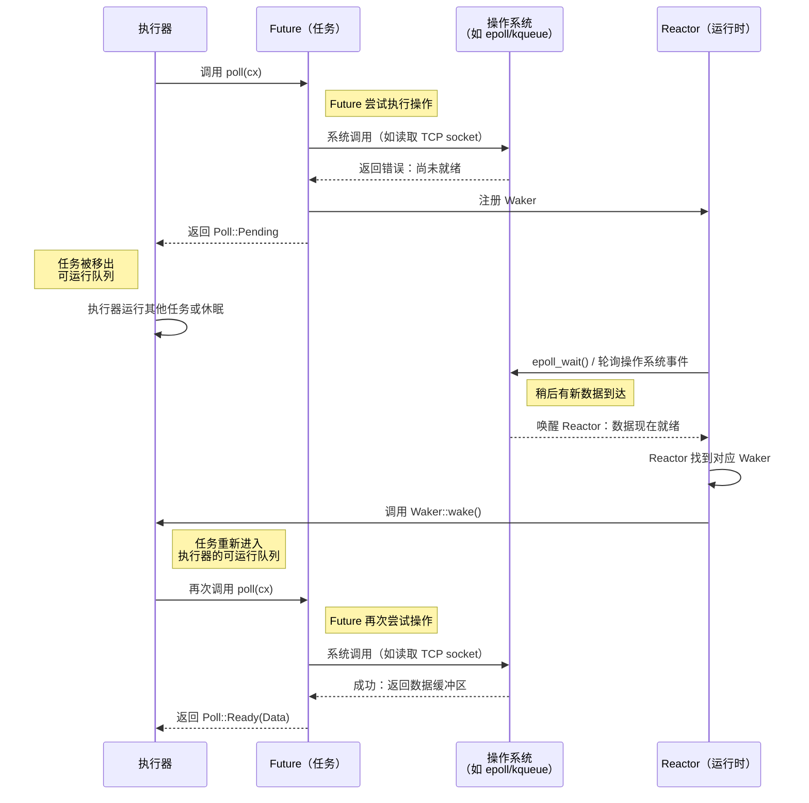

# 第 2 章：Future Trait 🟡

> **你将学到什么：**
> - `Future` trait：`Output`、`poll()`、`Context`、`Waker`
> - Waker 如何告诉执行器“再次轮询我”
> - 核心契约：从不调用 `wake()`，程序就会悄无声息地挂起
> - 手工实现一个真正的 Future（`Delay`）

## Future 的结构

Rust 异步世界中的一切，最终都会实现这个 trait：

```rust
pub trait Future {
    type Output;

    fn poll(self: Pin<&mut Self>, cx: &mut Context<'_>) -> Poll<Self::Output>;
}

pub enum Poll<T> {
    Ready(T),   // The future has completed with value T
    Pending,    // The future is not ready yet — call me back later
}
```

仅此而已。`Future` 就是任何可以被*轮询*的东西：外界问它“完成了吗？”，它回答“完成了，这是结果”，或者“还没有，等我准备好后会唤醒你”。

### Output、poll()、Context 与 Waker



下面逐项拆解：

```rust
use std::future::Future;
use std::pin::Pin;
use std::task::{Context, Poll};

// A future that returns 42 immediately
struct Ready42;

impl Future for Ready42 {
    type Output = i32; // What the future eventually produces

    fn poll(self: Pin<&mut Self>, _cx: &mut Context<'_>) -> Poll<i32> {
        Poll::Ready(42) // Always ready — no waiting
    }
}
```

各组成部分的含义如下：

- **`Output`**——Future 完成时产生的值的类型
- **`poll()`**——由执行器调用以检查进度；返回 `Ready(value)` 或 `Pending`
- **`Pin<&mut Self>`**——保证 Future 不会在内存中移动（原因将在第 4 章讲解）
- **`Context`**——携带 `Waker`，Future 可以借它在能够继续推进时通知执行器

### Waker 契约

`Waker` 是一种回调机制。Future 返回 `Pending` 时，*必须*安排在未来调用 `waker.wake()`；否则执行器永远不会再次轮询它，程序便会挂起。

```rust
use std::task::{Context, Poll, Waker};
use std::pin::Pin;
use std::future::Future;
use std::sync::{Arc, Mutex};
use std::thread;
use std::time::Duration;

/// A future that completes after a delay (toy implementation)
struct Delay {
    completed: Arc<Mutex<bool>>,
    waker_stored: Arc<Mutex<Option<Waker>>>,
    duration: Duration,
    started: bool,
}

impl Delay {
    fn new(duration: Duration) -> Self {
        Delay {
            completed: Arc::new(Mutex::new(false)),
            waker_stored: Arc::new(Mutex::new(None)),
            duration,
            started: false,
        }
    }
}

impl Future for Delay {
    type Output = ();

    fn poll(mut self: Pin<&mut Self>, cx: &mut Context<'_>) -> Poll<()> {
        // Check if already completed before storing waker
        if *self.completed.lock().unwrap() {
            return Poll::Ready(());
        }

        // Store the waker - executor may pass a new one on each poll
        *self.waker_stored.lock().unwrap() = Some(cx.waker().clone());

        // Start the background timer on first poll
        if !self.started {
            self.started = true;
            let completed = Arc::clone(&self.completed);
            let waker = Arc::clone(&self.waker_stored);
            let duration = self.duration;

            thread::spawn(move || {
                thread::sleep(duration);
                *completed.lock().unwrap() = true;

                // CRITICAL: wake the executor so it polls us again
                if let Some(w) = waker.lock().unwrap().take() {
                    w.wake(); // "Hey executor, I'm ready — poll me again!"
                }
            });
        }

        // Double-check completion after storing waker (handles race condition)
        if *self.completed.lock().unwrap() {
            return Poll::Ready(());
        }

        Poll::Pending // Not done yet
    }
}
```

> **核心认识**：在 C# 中，TaskScheduler 会自动处理唤醒。在 Rust 中，调用 `waker.wake()` 是**你**（或者你使用的 I/O 库）的责任。忘记它，程序就会悄无声息地挂起。

> **深入理解：为什么既要保存 Waker，又要二次检查？**
>
> “检查完成状态”和“登记 Waker”之间存在竞态窗口：后台线程可能恰好在第一次检查之后完成。如果它当时找不到已登记的 Waker，通知就会丢失。示例先保存 Waker，再检查一次完成状态，因此即使完成事件落在窗口内，也会直接返回 `Ready`。生产级 Future 还应使用 `Waker::will_wake` 判断是否需要替换 Waker，并以恰当的原子操作或同步原语保证可见性。

### 练习：实现 CountdownFuture

<details>
<summary>🏋️ 练习（点击展开）</summary>

**挑战**：实现一个从 N 倒数到 0 的 `CountdownFuture`，每次被轮询时打印当前计数；到达 0 后，以 `Ready("Liftoff!")` 完成。

*提示*：Future 需要保存当前计数，并在每次轮询时将其减一。记得始终重新登记 Waker！

<details>
<summary>🔑 答案</summary>

```rust
use std::future::Future;
use std::pin::Pin;
use std::task::{Context, Poll};

struct CountdownFuture {
    count: u32,
}

impl CountdownFuture {
    fn new(start: u32) -> Self {
        CountdownFuture { count: start }
    }
}

impl Future for CountdownFuture {
    type Output = &'static str;

    fn poll(mut self: Pin<&mut Self>, cx: &mut Context<'_>) -> Poll<Self::Output> {
        if self.count == 0 {
            println!("Liftoff!");
            Poll::Ready("Liftoff!")
        } else {
            println!("{}...", self.count);
            self.count -= 1;
            cx.waker().wake_by_ref(); // Schedule re-poll immediately
            Poll::Pending
        }
    }
}
```

**关键点**：这个 Future 每个计数会被轮询一次。每次返回 `Pending` 时，它都会立即唤醒自己，要求再次被轮询。生产代码应使用计时器，而不是这种忙轮询方式。

</details>
</details>

> **要点回顾——Future Trait**
> - `Future::poll()` 返回 `Poll::Ready(value)` 或 `Poll::Pending`
> - Future 返回 `Pending` 前必须登记 `Waker`；执行器据此知道何时再次轮询
> - `Pin<&mut Self>` 保证 Future 不会在内存中移动（自引用状态机需要这一保证，参见第 4 章）
> - Rust 异步中的一切——`async fn`、`.await`、组合器——都建立在这一个 trait 上

> **另请参阅：** [第 3 章——poll 如何工作](ch03-how-poll-works.md) 讲解执行器循环；[第 6 章——手工构建 Future](ch06-building-futures-by-hand.md) 给出更复杂的实现。

***
