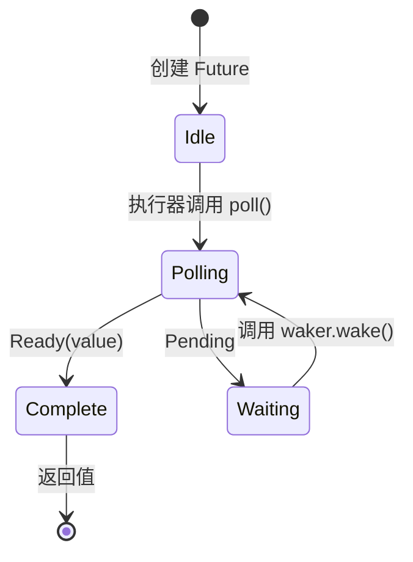

# 第 3 章：poll 如何工作 🟡

> **你将学到什么：**
> - 执行器的轮询循环：poll → pending → wake → 再次 poll
> - 如何从零构建一个最小执行器
> - 伪唤醒规则及其重要性
> - 实用函数：`poll_fn()` 与 `yield_now()`

## 轮询状态机

执行器不断循环：轮询一个 Future；若结果为 `Pending`，就让它停驻，直到对应 Waker 被触发，再次轮询。这与由内核负责调度的操作系统线程有根本区别。



> **重要：** Future 处于 *Waiting* 状态时，**必须**已经向某个 I/O 事件源登记 Waker。没有登记，就会永远挂起。

### 最小执行器

为了揭开执行器的神秘面纱，我们来构建最简单的版本：

```rust
use std::future::Future;
use std::task::{Context, Poll, RawWaker, RawWakerVTable, Waker};
use std::pin::Pin;

/// The simplest possible executor: busy-loop poll until Ready
fn block_on<F: Future>(mut future: F) -> F::Output {
    // Pin the future on the stack
    // SAFETY: `future` is never moved after this point — we only
    // access it through the pinned reference until it completes.
    let mut future = unsafe { Pin::new_unchecked(&mut future) };

    // Create a no-op waker (just keeps polling — inefficient but simple)
    fn noop_raw_waker() -> RawWaker {
        fn no_op(_: *const ()) {}
        fn clone(_: *const ()) -> RawWaker { noop_raw_waker() }
        let vtable = &RawWakerVTable::new(clone, no_op, no_op, no_op);
        RawWaker::new(std::ptr::null(), vtable)
    }

    // SAFETY: noop_raw_waker() returns a valid RawWaker with a correct vtable.
    let waker = unsafe { Waker::from_raw(noop_raw_waker()) };
    let mut cx = Context::from_waker(&waker);

    // Busy-loop until the future completes
    loop {
        match future.as_mut().poll(&mut cx) {
            Poll::Ready(value) => return value,
            Poll::Pending => {
                // A real executor would park the thread here
                // and wait for waker.wake() — we just spin
                std::thread::yield_now();
            }
        }
    }
}

// Usage:
fn main() {
    let result = block_on(async {
        println!("Hello from our mini executor!");
        42
    });
    println!("Got: {result}");
}
```

> **不要在生产环境使用这个实现！** 它会忙循环，浪费 CPU。真正的执行器（Tokio、smol）会借助 `epoll`、`kqueue` 或 `io_uring` 休眠，直到 I/O 就绪。不过，这段代码展示了核心思想：执行器本质上就是调用 `poll()` 的循环。

### 唤醒通知

真正的执行器由事件驱动。当所有 Future 都处于 `Pending` 时，执行器会休眠，而 Waker 就是中断并通知它的机制：

```rust
// Conceptual model of a real executor's main loop:
fn executor_loop(tasks: &mut TaskQueue) {
    loop {
        // 1. Poll all tasks that have been woken
        while let Some(task) = tasks.get_woken_task() {
            match task.poll() {
                Poll::Ready(result) => task.complete(result),
                Poll::Pending => { /* task stays in queue, waiting for wake */ }
            }
        }

        // 2. Sleep until something wakes us up (epoll_wait, kevent, etc.)
        //    This is where mio/polling does the heavy lifting
        tasks.wait_for_events(); // blocks until an I/O event or waker fires
    }
}
```

### 伪唤醒

即使对应 I/O 尚未就绪，Future 也可能被轮询，这叫作*伪唤醒（spurious wake）*。Future 必须正确处理它：

```rust
impl Future for MyFuture {
    type Output = Data;

    fn poll(self: Pin<&mut Self>, cx: &mut Context<'_>) -> Poll<Data> {
        // ✅ CORRECT: Always re-check the actual condition
        if let Some(data) = self.try_read_data() {
            Poll::Ready(data)
        } else {
            // Re-register the waker (it might have changed!)
            self.register_waker(cx.waker());
            Poll::Pending
        }

        // ❌ WRONG: Assuming poll means data is ready
        // let data = self.read_data(); // might block or panic
        // Poll::Ready(data)
    }
}
```

实现 `poll()` 时必须遵守以下规则：

1. **绝不阻塞**——尚未就绪时立即返回 `Pending`
2. **始终重新登记 Waker**——两次轮询之间，Waker 可能已经变化
3. **正确处理伪唤醒**——检查真实条件，不要假定已经就绪
4. **返回 `Ready` 后不要再轮询**——此时行为是**未指定的**：可能 panic、返回 `Pending`，也可能再次返回 `Ready`。只有 `FusedFuture` 保证完成后仍可安全轮询

<details>
<summary><strong>🏋️ 练习：能够应对伪唤醒的 Flag Future</strong>（点击展开）</summary>

**挑战**：实现 `FlagFuture`，包装一个共享的 `Arc<AtomicBool>` 标志。每次轮询时检查标志是否为 `true`：若是，以 `Ready(())` 完成；否则保存 Waker 并返回 `Pending`。关键要求是：它必须正确处理**伪唤醒**，每次轮询都重新检查标志，绝不能因为自己被唤醒过就假定标志已经设置。

*提示*：需要使用 `Arc<Mutex<Option<Waker>>>`（或类似结构），让外部线程能够设置标志并唤醒 Future。也可以使用 `poll_fn` 给出更简洁的版本。

<details>
<summary>🔑 答案</summary>

```rust
use std::future::Future;
use std::pin::Pin;
use std::sync::{Arc, Mutex};
use std::sync::atomic::{AtomicBool, Ordering};
use std::task::{Context, Poll, Waker};

struct FlagFuture {
    flag: Arc<AtomicBool>,
    waker_slot: Arc<Mutex<Option<Waker>>>,
}

impl FlagFuture {
    fn new(flag: Arc<AtomicBool>, waker_slot: Arc<Mutex<Option<Waker>>>) -> Self {
        FlagFuture { flag, waker_slot }
    }
}

impl Future for FlagFuture {
    type Output = ();

    fn poll(self: Pin<&mut Self>, cx: &mut Context<'_>) -> Poll<Self::Output> {
        // Always re-check the actual condition — never trust the wake alone
        if self.flag.load(Ordering::Acquire) {
            return Poll::Ready(());
        }

        // Store/update the waker so we get notified
        let mut slot = self.waker_slot.lock().unwrap();
        *slot = Some(cx.waker().clone());

        // Re-check after storing the waker to avoid a race:
        // the flag could have been set between our first check
        // and storing the waker
        if self.flag.load(Ordering::Acquire) {
            Poll::Ready(())
        } else {
            Poll::Pending
        }
    }
}

// The setter side (e.g., another thread or task):
fn set_flag(flag: &AtomicBool, waker_slot: &Mutex<Option<Waker>>) {
    flag.store(true, Ordering::Release);
    if let Some(waker) = waker_slot.lock().unwrap().take() {
        waker.wake();
    }
}

// Equivalent using poll_fn:
// async fn wait_for_flag(flag: Arc<AtomicBool>, waker_slot: Arc<Mutex<Option<Waker>>>) {
//     std::future::poll_fn(|cx| {
//         if flag.load(Ordering::Acquire) {
//             return Poll::Ready(());
//         }
//         *waker_slot.lock().unwrap() = Some(cx.waker().clone());
//         if flag.load(Ordering::Acquire) { Poll::Ready(()) } else { Poll::Pending }
//     }).await
// }
```

**关键点**：“检查 → 保存 Waker → 再次检查”的模式对于避免“条件变化”和“登记 Waker”之间的竞态至关重要。真实世界中的所有 I/O Future 内部都会采用这类模式；它也说明了为什么必须正确处理伪唤醒。

</details>
</details>

### 实用工具：`poll_fn` 与 `yield_now`

标准库和 Tokio 提供了两个工具，使你不必编写完整的 `Future` 实现：

```rust
use std::future::poll_fn;
use std::task::Poll;

// poll_fn: create a one-off future from a closure
let value = poll_fn(|cx| {
    // Do something with cx.waker(), return Ready or Pending
    Poll::Ready(42)
}).await;

// Real-world use: bridge a callback-based API into async
async fn read_when_ready(source: &MySource) -> Data {
    poll_fn(|cx| source.poll_read(cx)).await
}
```

```rust
// yield_now: voluntarily yield control to the executor
// Useful in CPU-heavy async loops to avoid starving other tasks
async fn cpu_heavy_work(items: &[Item]) {
    for (i, item) in items.iter().enumerate() {
        process(item); // CPU work

        // Every 100 items, yield to let other tasks run
        if i % 100 == 0 {
            tokio::task::yield_now().await;
        }
    }
}
```

> **何时使用 `yield_now()`**：如果异步函数在循环中执行 CPU 工作，却没有任何 `.await` 点，它就会独占执行器线程。周期性插入 `yield_now().await`，可以恢复协作式多任务调度。

> **深入理解：wake 不是一次函数调用的“继续执行”**
>
> `wake()` 通常只表示“把任务标记为可运行并放回队列”，不保证立刻轮询，也不保证在哪个线程轮询。Future 不能依赖调用栈延续、线程局部状态或及时性；所有跨暂停点所需状态都必须保存在状态机中。

> **要点回顾——poll 如何工作**
> - 执行器反复对已被唤醒的 Future 调用 `poll()`
> - Future 必须应对**伪唤醒**，始终重新检查真实条件
> - `poll_fn()` 可以根据闭包创建临时 Future
> - `yield_now()` 是 CPU 密集型异步代码主动参与协作调度的出口

> **另请参阅：** [第 2 章——Future Trait](ch02-the-future-trait.md) 给出 trait 定义；[第 5 章——揭开状态机的面纱](ch05-the-state-machine-reveal.md) 展示编译器生成的结构。

***
