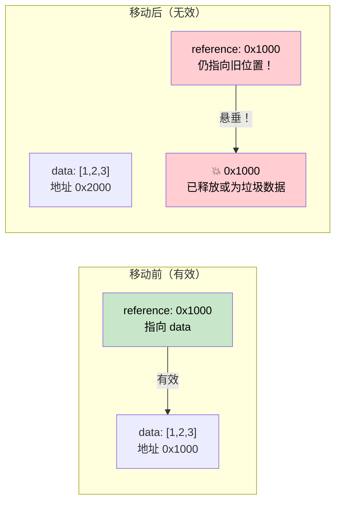

# 第 4 章：Pin 与 Unpin 🔴

> **你将学到什么：**
> - 自引用结构在内存中移动后为什么会失效
> - `Pin<P>` 保证什么，以及它如何阻止移动
> - 三种实用固定方式：`Box::pin()`、`tokio::pin!()`、`Pin::new()`
> - `Unpin` 何时能提供一个逃生通道

## 为什么需要 Pin

这是 Rust 异步中最令人困惑的概念。下面逐步建立直觉。

### 问题：自引用结构

编译器把 `async fn` 转换为状态机时，状态机可能包含指向自身字段的引用，从而形成*自引用结构*。如果它在内存中移动，这些内部引用就会失效。

```rust
// What the compiler generates (simplified) for:
// async fn example() {
//     let data = vec![1, 2, 3];
//     let reference = &data;       // Points to data above
//     use_ref(reference).await;
// }

// Becomes something like:
enum ExampleStateMachine {
    State0 {
        data: Vec<i32>,
        // reference: &Vec<i32>,  // PROBLEM: points to `data` above
        //                        // If this struct moves, the pointer is dangling!
    },
    State1 {
        data: Vec<i32>,
        reference: *const Vec<i32>, // Internal pointer to data field
    },
    Complete,
}
```



### 自引用结构并非纸上谈兵

每个跨越 `.await` 点持有引用的 `async fn`，都会创建自引用状态机：

```rust
async fn problematic() {
    let data = String::from("hello");
    let slice = &data[..]; // slice borrows data
    
    some_io().await; // <-- .await point: state machine stores both data AND slice
    
    println!("{slice}"); // uses the reference after await
}
// The generated state machine has `data: String` and `slice: &str`
// where slice points INTO data. Moving the state machine = dangling pointer.
```

### 实际使用 Pin

`Pin<P>` 是一个包装器，它阻止移动指针背后的值：

```rust
use std::pin::Pin;

let mut data = String::from("hello");

// Pin it — now it can't be moved
let pinned: Pin<&mut String> = Pin::new(&mut data);

// Can still use it:
println!("{}", pinned.as_ref().get_ref()); // "hello"

// But we can't get &mut String back (which would allow mem::swap):
// let mutable: &mut String = Pin::into_inner(pinned); // Only if String: Unpin
// String IS Unpin, so this actually works for String.
// But for self-referential state machines (which are !Unpin), it's blocked.
```

真实代码中，Pin 主要出现在三个地方：

```rust
// 1. poll() signature — all futures are polled through Pin
fn poll(self: Pin<&mut Self>, cx: &mut Context<'_>) -> Poll<Output>;

// 2. Box::pin() — heap-allocate and pin a future
let future: Pin<Box<dyn Future<Output = i32>>> = Box::pin(async { 42 });

// 3. tokio::pin!() — pin a future on the stack
tokio::pin!(my_future);
// Now my_future: Pin<&mut impl Future>
```

### Unpin 逃生通道

Rust 中的大多数类型都是 `Unpin`：它们没有自引用，所以固定对它们而言等于没有额外限制。由 `async fn` 生成的编译器状态机则是典型的 `!Unpin`。

```rust
// These are all Unpin — pinning them does nothing special:
// i32, String, Vec<T>, HashMap<K,V>, Box<T>, &T, &mut T

// These are !Unpin — they MUST be pinned before polling:
// The state machines generated by `async fn` and `async {}`

// Practical implication:
// If you write a Future by hand and it has NO self-references,
// implement Unpin to make it easier to work with:
impl Unpin for MySimpleFuture {} // "I'm safe to move, trust me"
```

> **深入理解：Pin 固定的是值，不是智能指针变量**
>
> 移动 `Pin<Box<T>>` 或 `Pin<&mut T>` 包装器本身完全没问题：前者移动的是指向堆分配的指针，后者移动的是引用值；底层 `T` 的地址都没有改变。`Pin` 的核心承诺是：从该值被固定起，直到析构完成，不再通过安全 API 把这个 `!Unpin` 值从原地址搬走。

### 快速参考

| 做什么 | 适用场景 | 方法 |
|--------|----------|------|
| 在堆上固定 Future | 存进集合或从函数返回 | `Box::pin(future)` |
| 在栈上固定 Future | 在 `select!` 中使用或手工轮询 | `std::pin::pin!(future)` 或 `tokio::pin!(future)` |
| 在函数签名中使用 Pin | 接收已固定的 Future | `future: Pin<&mut F>` |
| 要求 Unpin | 创建后仍需要移动 Future | `F: Future + Unpin` |

<details>
<summary><strong>🏋️ 练习：固定与移动</strong>（点击展开）</summary>

**挑战**：以下哪些代码片段能够编译？对不能编译的片段说明原因并修复。

```rust
// Snippet A
let fut = async { 42 };
let pinned = Box::pin(fut);
let moved = pinned; // Move the Box
let result = moved.await;

// Snippet B
let fut = async { 42 };
tokio::pin!(fut);
let moved = fut; // Move the pinned future
let result = moved.await;

// Snippet C
use std::pin::Pin;
let mut fut = async { 42 };
let pinned = Pin::new(&mut fut);
```

<details>
<summary>🔑 答案</summary>

**片段 A**：✅ **可以编译。** `Box::pin()` 把 Future 放在堆上。移动 `Box` 只移动*指针*，不会移动 Future 本身；Future 仍固定在原堆地址。

**片段 B**：✅ **可以编译。** `tokio::pin!` 把 Future 固定在栈上，并把 `fut` 重新绑定为 `Pin<&mut ...>`。`let moved = fut` 移动的是 **`Pin` 包装器**（一个指针），不是底层 Future；Future 仍固定在栈上的原位置。这与移动 `Box` 不会搬动堆分配类似。但 `fut` 会被这次移动消耗，之后只能使用 `moved`：

```rust
let fut = async { 42 };
tokio::pin!(fut);
let moved = fut;        // Moves the Pin<&mut> wrapper — OK
// fut.await;           // ❌ Error: fut was moved
let result = moved.await; // ✅ Use moved instead
```

**片段 C**：❌ **无法编译。** `Pin::new()` 要求 `T: Unpin`，而异步块会生成 `!Unpin` 类型。**修复方法**：使用 `Box::pin()`，或者使用 `unsafe Pin::new_unchecked()`：

```rust
let fut = async { 42 };
let pinned = Box::pin(fut); // Heap-pin — works with !Unpin
```

**关键点**：`Box::pin()` 是固定 `!Unpin` Future 最安全、简单的方式。`tokio::pin!()` 在栈上固定；可以移动 `Pin<&mut>` 包装器，但底层 Future 不会移动。`Pin::new()` 只适用于 `Unpin` 类型。

</details>
</details>

> **要点回顾——Pin 与 Unpin**
> - `Pin<P>` 是一个**阻止所指对象被移动**的包装器，对自引用状态机至关重要
> - `Box::pin()` 是在堆上固定 Future 时安全、简单的默认选择
> - `tokio::pin!()` 在栈上固定；包装器 `Pin<&mut>` 可以移动，底层 Future 保持原位
> - `Unpin` 是一个自动 trait：实现它的类型即使已固定也可以移动（大多数类型是 `Unpin`，异步块不是）

> **另请参阅：** [第 2 章——Future Trait](ch02-the-future-trait.md) 中 `poll` 的 `Pin<&mut Self>`；[第 5 章——揭开状态机的面纱](ch05-the-state-machine-reveal.md) 解释异步状态机为什么会自引用。

***
