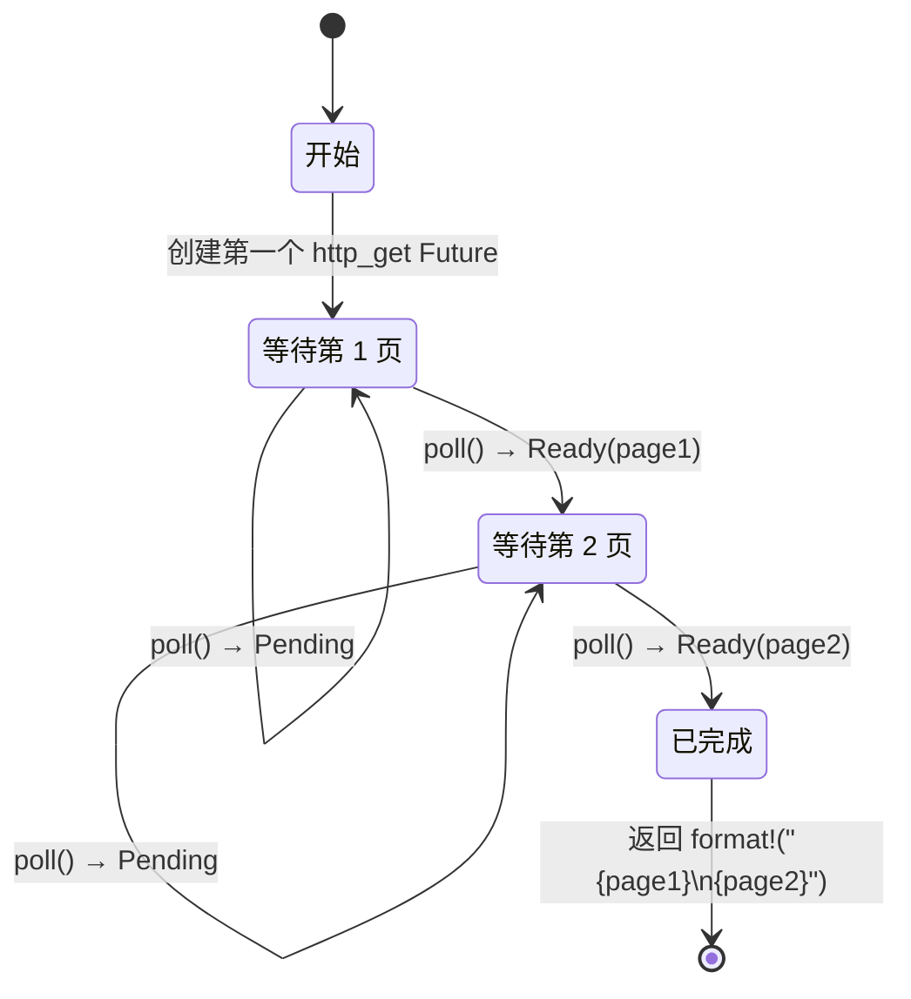

# 第 5 章：揭开状态机的面纱 🟢

> **你将学到什么：**
> - 编译器如何把 `async fn` 转换为枚举状态机
> - 源代码与生成状态的并排对照
> - 为什么跨 `.await` 保存的大型内联值会让 Future 体积暴涨
> - 析构优化：不再需要的值会尽早被丢弃

## 编译器究竟生成了什么

编写 `async fn` 时，编译器会把看似顺序执行的代码转换成基于枚举的状态机。理解这一转换，是理解 Async Rust 性能特征和许多特殊行为的关键。

### 并排对照：async fn 与状态机

```rust
// What you write:
async fn fetch_two_pages() -> String {
    let page1 = http_get("https://example.com/a").await;
    let page2 = http_get("https://example.com/b").await;
    format!("{page1}\n{page2}")
}
```

编译器在概念上会生成类似下面的结构：

```rust
enum FetchTwoPagesStateMachine {
    // State 0: About to call http_get for page1
    Start,

    // State 1: Waiting for page1, holding the future
    WaitingPage1 {
        fut1: HttpGetFuture,
    },

    // State 2: Got page1, waiting for page2
    WaitingPage2 {
        page1: String,
        fut2: HttpGetFuture,
    },

    // Terminal state
    Complete,
}

impl Future for FetchTwoPagesStateMachine {
    type Output = String;

    fn poll(mut self: Pin<&mut Self>, cx: &mut Context<'_>) -> Poll<String> {
        loop {
            match self.as_mut().get_mut() {
                Self::Start => {
                    let fut1 = http_get("https://example.com/a");
                    *self.as_mut().get_mut() = Self::WaitingPage1 { fut1 };
                }
                Self::WaitingPage1 { fut1 } => {
                    let page1 = match Pin::new(fut1).poll(cx) {
                        Poll::Ready(v) => v,
                        Poll::Pending => return Poll::Pending,
                    };
                    let fut2 = http_get("https://example.com/b");
                    *self.as_mut().get_mut() = Self::WaitingPage2 { page1, fut2 };
                }
                Self::WaitingPage2 { page1, fut2 } => {
                    let page2 = match Pin::new(fut2).poll(cx) {
                        Poll::Ready(v) => v,
                        Poll::Pending => return Poll::Pending,
                    };
                    let result = format!("{page1}\n{page2}");
                    *self.as_mut().get_mut() = Self::Complete;
                    return Poll::Ready(result);
                }
                Self::Complete => panic!("polled after completion"),
            }
        }
    }
}
```

> **注意**：以上语法糖展开只是一个*概念模型*。真实编译器输出会使用 `unsafe` Pin 投影；这里的 `get_mut()` 要求 `Unpin`，但异步状态机是 `!Unpin`。示例旨在展示状态转换，而不是给出可编译代码。



> **各状态保存的内容：**
> - **WaitingPage1**——保存 `fut1: HttpGetFuture`，此时尚未分配 page2
> - **WaitingPage2**——保存 `page1: String`、`fut2: HttpGetFuture`，此时 fut1 已被丢弃

### 为什么这会影响性能

**分配模型**：调用异步函数会创建一个具体的状态机值，并不会隐式地为每次调用单独进行堆分配。Future 最终存放在哪里由调用者决定：它可能是局部值、外层 Future 的字段、运行时任务分配中的一部分，也可能被显式装箱。Rust 不保证编译器生成的具体枚举布局。

**大小**：可以把它理解为一个“最大暂停状态决定 Future 大小”的枚举，但这只是心智模型。每个 `.await` 都可能成为暂停点，编译器也可以合并状态、消除无用值并采用不同布局。真正影响大小的是哪些值跨暂停点仍然存活：

```rust
async fn small() {
    let a: u8 = 0;
    yield_now().await;
    let b: u8 = 0;
    yield_now().await;
}
// Size ≈ max(size_of(u8), size_of(u8)) + discriminant + future sizes
//      ≈ small!

async fn big() {
    let buf: [u8; 1_000_000] = [0; 1_000_000]; // Future 状态中内联保存 1 MB
    some_io().await;
    process(&buf);
}
// Size ≈ 1MB + inner future sizes
// ⚠️ 不要让巨大的内联缓冲区跨 await 存活！
// Use Vec<u8> or Box<[u8]> instead.
```

**析构优化**：状态机发生转换时，会丢弃后续不再需要的值。在前例中，从 `WaitingPage1` 转换到 `WaitingPage2` 时，`fut1` 会被丢弃；编译器会自动插入析构逻辑。

> **实用规则**：跨 `.await` 仍然存活的大型内联值会让 Future 本身变大，与这个 Future 之后存放在何处无关。应优先缩短其生命周期，或把大型载荷放进 `Vec`、`Box` 等独立分配；只有测量确认 Future 大小或栈压力确实有问题时，才装箱子 Future。

> **深入理解：任务栈与 Future 大小不是同一个概念**
>
> 操作系统线程通常预留一块连续栈；异步任务则把跨 `.await` 仍然存活的局部变量保存在 Future 对象中。变量若不会跨越暂停点，编译器可以像普通临时值那样处理；只有必须跨暂停点保存的状态会扩大 Future。缩短变量的存活范围，常常比盲目装箱整个 Future 更有效。

### 练习：预测状态机

<details>
<summary>🏋️ 练习（点击展开）</summary>

**挑战**：根据以下异步函数画出一种合理的**概念状态机**。每个暂停点必须保留哪些值？不要把变体数量或布局当成稳定 ABI 保证。

```rust
async fn pipeline(url: &str) -> Result<usize, Error> {
    let response = fetch(url).await?;
    let body = response.text().await?;
    let parsed = parse(body).await?;
    Ok(parsed.len())
}
```

<details>
<summary>🔑 答案</summary>

一种便于教学的模型包含五个状态：

1. **Start**——保存 `url`
2. **WaitingFetch**——保存 `url` 和 `fetch` Future
3. **WaitingText**——保存 `response` 和 `text()` Future
4. **WaitingParse**——保存 `body` 和 `parse` Future
5. **Done**——已经返回 `Ok(parsed.len())`

每个 `.await` 都可能成为暂停点。`?` 增加提前返回的控制流，但本身并不必然要求新增暂停状态；实际表示可以由编译器自由优化。

</details>
</details>

> **要点回顾——揭开状态机的面纱**
> - 应把 `async fn` 理解为带暂停点的状态机，具体枚举布局属于编译器实现细节
> - 跨 `.await` 存活的值会占据 Future 状态；大型内联值可能使其体积意外增长
> - 编译器会在状态转换时自动插入**析构**
> - Future 体积成为问题时，可使用 `Box::pin()` 或其他堆分配方式

> **另请参阅：** [第 4 章——Pin 与 Unpin](ch04-pin-and-unpin.md) 解释生成的枚举为什么需要固定；[第 6 章——手工构建 Future](ch06-building-futures-by-hand.md) 将亲手构建这些状态机。

***
