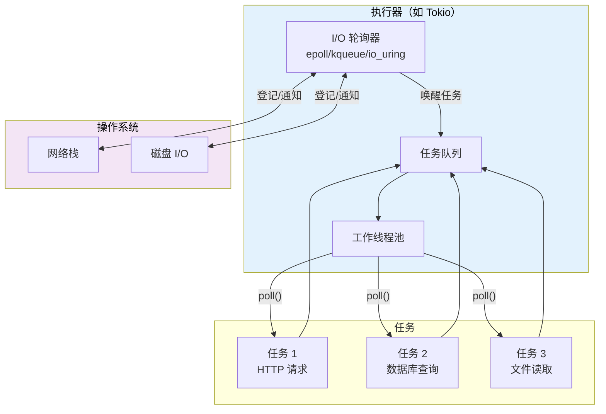
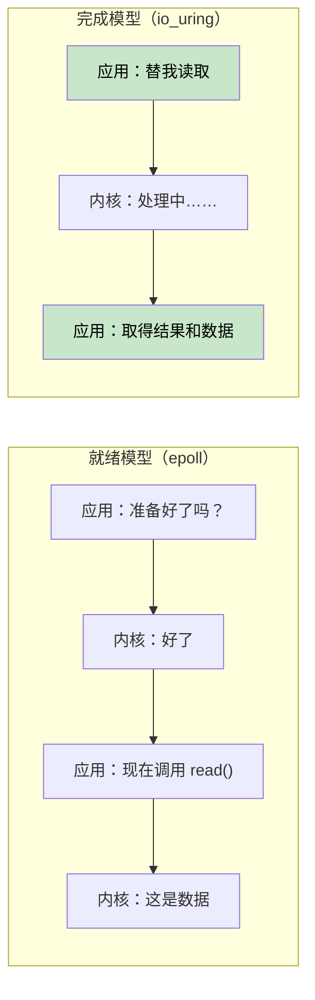
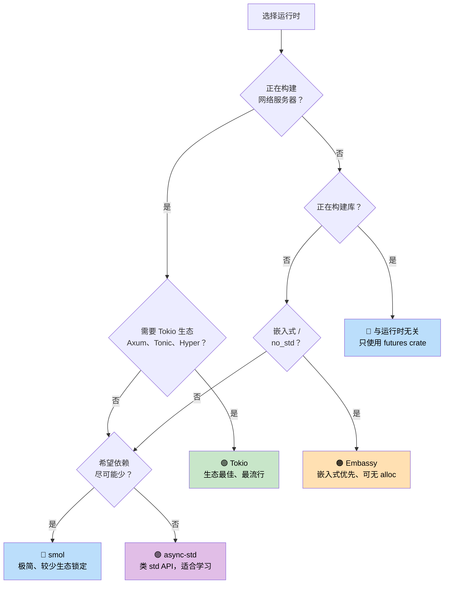

# 第 7 章：执行器与运行时 🟡

> **你将学到什么：**
> - 执行器的工作：轮询，并在无事可做时高效休眠
> - 六个主要运行时或底层方案：mio、io_uring、Tokio、async-std、smol、Embassy
> - 选择正确运行时的决策树
> - 为什么与运行时无关的库设计很重要

## 执行器做什么

执行器有两项职责：

1. Future 可以继续推进时，**轮询 Future**
2. 没有 Future 就绪时，借助操作系统 I/O 通知 API **高效休眠**



### mio：基础层

[mio](https://github.com/tokio-rs/mio)（Metal I/O）并不是执行器，而是最低层的跨平台 I/O 通知库。它包装了 Linux 的 `epoll`、macOS/BSD 的 `kqueue` 和 Windows 的 IOCP。

```rust
// Conceptual mio usage (simplified):
use mio::{Events, Interest, Poll, Token};
use mio::net::TcpListener;

let mut poll = Poll::new()?;
let mut events = Events::with_capacity(128);

let mut server = TcpListener::bind("0.0.0.0:8080")?;
poll.registry().register(&mut server, Token(0), Interest::READABLE)?;

// Event loop — blocks until something happens
loop {
    poll.poll(&mut events, None)?; // Sleeps until I/O event
    for event in events.iter() {
        match event.token() {
            Token(0) => { /* server has a new connection */ }
            _ => { /* other I/O ready */ }
        }
    }
}
```

大多数开发者不会直接使用 mio；Tokio 和 smol 等运行时建立在它或同类抽象之上。

### io_uring：面向完成通知的未来

Linux 的 `io_uring`（内核 5.1 及以上）与 mio/epoll 采用的“就绪通知”模型有根本差异：

```text
就绪模型（epoll / mio / Tokio）：
  1. 询问：“这个 socket 可读了吗？”       → epoll_wait()
  2. 内核：“是的，已经就绪。”              → EPOLLIN 事件
  3. 应用：read(fd, buf)                    → 仍有可能短暂阻塞！

完成模型（io_uring）：
  1. 提交：“把这个 socket 的数据读进缓冲区” → SQE
  2. 内核异步完成读取
  3. 应用取得已经完成的结果和数据            → CQE
```



**所有权挑战**：io_uring 要求内核在操作完成前拥有缓冲区，而标准 `AsyncRead` trait 只是借用缓冲区，两者存在冲突。因此 `tokio-uring` 使用了不同的 I/O trait：

```rust
// Standard tokio (readiness-based) — borrows the buffer:
let n = stream.read(&mut buf).await?;  // buf is borrowed

// tokio-uring (completion-based) — takes ownership of the buffer:
let (result, buf) = stream.read(buf).await;  // buf is moved in, returned back
let n = result?;
```

```rust
// Cargo.toml: tokio-uring = "0.5"
// NOTE: Linux-only, requires kernel 5.1+

fn main() {
    tokio_uring::start(async {
        let file = tokio_uring::fs::File::open("data.bin").await.unwrap();
        let buf = vec![0u8; 4096];
        let (result, buf) = file.read_at(buf, 0).await;
        let bytes_read = result.unwrap();
        println!("Read {} bytes: {:?}", bytes_read, &buf[..bytes_read]);
    });
}
```

| 方面 | epoll（Tokio） | io_uring（tokio-uring） |
|------|---------------|-------------------------|
| **模型** | 就绪通知 | 完成通知 |
| **系统调用** | epoll_wait + read/write | 批处理 SQE/CQE 环形队列 |
| **缓冲区所有权** | 应用保留（`&mut buf`） | 转移所有权（移动 `buf`） |
| **平台** | Linux、macOS（kqueue）、Windows（IOCP） | 仅 Linux 5.1+ |
| **零拷贝** | 否（用户空间复制） | 支持（已登记缓冲区） |
| **成熟度** | 生产就绪 | 仍在发展 |

> **何时使用 io_uring**：高吞吐文件 I/O 或网络场景，而且系统调用开销已成为瓶颈，例如数据库、存储引擎、承载十万以上连接的代理。对大多数应用，使用 epoll 的标准 Tokio 仍是正确选择。

### Tokio：功能齐全的运行时

Tokio 是 Rust 生态中占主导地位的异步运行时。Axum、Hyper、Tonic 和多数生产 Rust 服务器都在使用它。

```rust
// Cargo.toml:
// [dependencies]
// tokio = { version = "1", features = ["full"] }

#[tokio::main]
async fn main() {
    // Spawns a multi-threaded runtime with work-stealing scheduler
    let handle = tokio::spawn(async {
        tokio::time::sleep(std::time::Duration::from_secs(1)).await;
        "done"
    });

    let result = handle.await.unwrap();
    println!("{result}");
}
```

**Tokio 功能**：计时器、I/O、TCP/UDP、Unix socket、信号处理、同步原语（Mutex、RwLock、Semaphore、各种通道）、文件系统、进程和 tracing 集成。

### async-std：标准库的异步镜像

async-std 为 `std` API 提供相似的异步版本。它不如 Tokio 流行，但对初学者较直观。

```rust
// Cargo.toml:
// [dependencies]
// async-std = { version = "1", features = ["attributes"] }

#[async_std::main]
async fn main() {
    use async_std::fs;
    let content = fs::read_to_string("hello.txt").await.unwrap();
    println!("{content}");
}
```

### smol：极简运行时

smol 是小巧的异步运行时，适合希望使用异步而不引入整套 Tokio 的程序和库。

```rust
// Cargo.toml:
// [dependencies]
// smol = "2"

fn main() {
    smol::block_on(async {
        let result = smol::unblock(|| {
            // Runs blocking code on a thread pool
            std::fs::read_to_string("hello.txt")
        }).await.unwrap();
        println!("{result}");
    });
}
```

### Embassy：嵌入式异步（no_std）

Embassy 是面向嵌入式系统的异步运行时，无需堆分配，也不依赖 `std`。

```rust
// Runs on microcontrollers (e.g., STM32, nRF52, RP2040)
#[embassy_executor::main]
async fn main(spawner: embassy_executor::Spawner) {
    // Blink an LED with async/await — no RTOS needed!
    let mut led = Output::new(p.PA5, Level::Low, Speed::Low);
    loop {
        led.set_high();
        Timer::after(Duration::from_millis(500)).await;
        led.set_low();
        Timer::after(Duration::from_millis(500)).await;
    }
}
```

### 运行时决策树



### 运行时比较

| 功能 | Tokio | async-std | smol | Embassy |
|------|-------|-----------|------|---------|
| **生态** | 占主导地位 | 较小 | 极简 | 嵌入式 |
| **多线程** | ✅ 工作窃取 | ✅ | ✅ | ❌（单核） |
| **no_std** | ❌ | ❌ | ❌ | ✅ |
| **计时器** | ✅ 内置 | ✅ 内置 | 通过 `async-io` | ✅ 基于 HAL |
| **I/O** | ✅ 自有抽象 | ✅ 类 std API | ✅ 通过 `async-io` | ✅ HAL 驱动 |
| **通道** | ✅ 类型丰富 | ✅ | 通过 `async-channel` | ✅ |
| **学习曲线** | 中等 | 较低 | 较低 | 较高（硬件知识） |
| **二进制体积** | 较大 | 中等 | 较小 | 极小 |

<details>
<summary><strong>🏋️ 练习：比较运行时</strong>（点击展开）</summary>

**挑战**：分别使用 Tokio、smol 和 async-std 编写同一个程序。程序应当：

1. 获取 URL（用一次 sleep 模拟）
2. 读取文件（用一次 sleep 模拟）
3. 打印两个结果

这个练习说明 `async/await` 业务代码基本相同，变化的只是运行时初始化方式。

<details>
<summary>🔑 答案</summary>

```rust
// ----- tokio version -----
// Cargo.toml: tokio = { version = "1", features = ["full"] }
#[tokio::main]
async fn main() {
    let (url_result, file_result) = tokio::join!(
        async {
            tokio::time::sleep(std::time::Duration::from_millis(100)).await;
            "Response from URL"
        },
        async {
            tokio::time::sleep(std::time::Duration::from_millis(50)).await;
            "Contents of file"
        },
    );
    println!("URL: {url_result}, File: {file_result}");
}

// ----- smol version -----
// Cargo.toml: smol = "2", futures-lite = "2"
fn main() {
    smol::block_on(async {
        let (url_result, file_result) = futures_lite::future::zip(
            async {
                smol::Timer::after(std::time::Duration::from_millis(100)).await;
                "Response from URL"
            },
            async {
                smol::Timer::after(std::time::Duration::from_millis(50)).await;
                "Contents of file"
            },
        ).await;
        println!("URL: {url_result}, File: {file_result}");
    });
}

// ----- async-std version -----
// Cargo.toml: async-std = { version = "1", features = ["attributes"] }
#[async_std::main]
async fn main() {
    let (url_result, file_result) = futures::future::join(
        async {
            async_std::task::sleep(std::time::Duration::from_millis(100)).await;
            "Response from URL"
        },
        async {
            async_std::task::sleep(std::time::Duration::from_millis(50)).await;
            "Contents of file"
        },
    ).await;
    println!("URL: {url_result}, File: {file_result}");
}
```

**关键点**：不同运行时中的异步业务逻辑完全一致，只有入口点以及计时器/I/O API 不同。这正是编写与运行时无关的库（只依赖 `std::future::Future`）很有价值的原因。

</details>
</details>

> **深入理解：执行器不等于完整运行时**
>
> 执行器负责调度任务；完整运行时通常还包含 Reactor、计时器、异步 I/O 类型、阻塞线程池和同步原语。`Future` 是语言与标准库约定，Tokio 则是一套实现这些基础设施的库。也因此，在 Tokio 外创建的通用 Future 通常仍可被 Tokio 执行，但若它内部直接调用 Tokio 计时器或 I/O，就需要处在 Tokio 运行时上下文中。

> **要点回顾——执行器与运行时**
> - 执行器的职责：在被唤醒时轮询 Future，并使用操作系统 I/O API 高效休眠
> - **Tokio** 是服务器默认选择；**smol** 适合较小体积；**Embassy** 面向嵌入式
> - 业务逻辑应尽量依赖 `std::future::Future`，而不是特定运行时
> - io_uring 是 Linux 高性能 I/O 的重要方向，但是否采用应依据平台、生态成熟度和实际性能测量

> **另请参阅：** [第 8 章——深入 Tokio](ch08-tokio-deep-dive.md) 讲解 Tokio 细节；[第 9 章——Tokio 并非最佳选择的场景](ch09-when-tokio-isnt-the-right-fit.md) 讨论替代方案。

***
