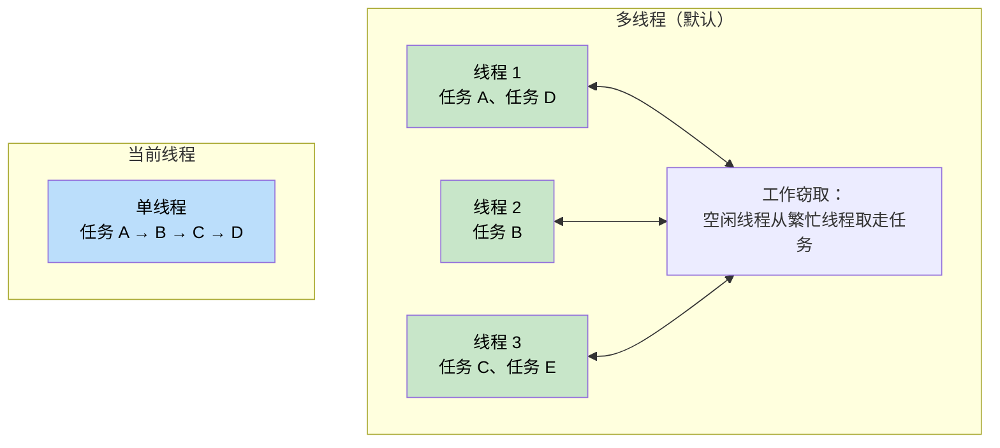
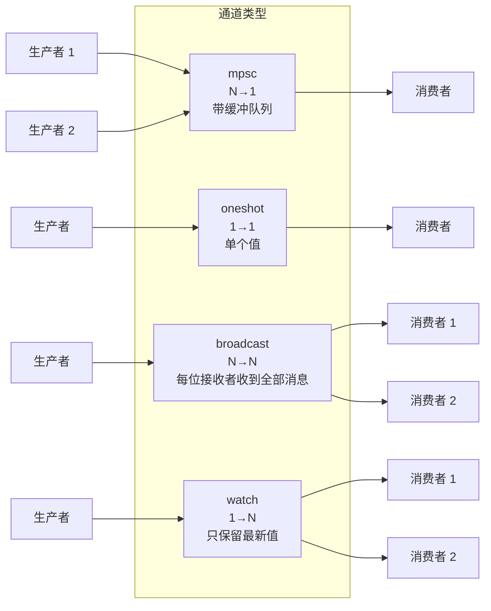
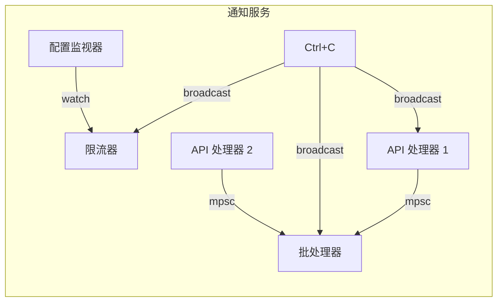

# 第 8 章：深入 Tokio 🟡

> **你将学到什么：**
> - 多线程与当前线程两种运行时，以及各自的适用场景
> - `tokio::spawn`、`'static` 要求和 `JoinHandle`
> - 任务取消语义
> - 同步原语：Mutex、RwLock、Semaphore 和四种通道

## 运行时类型：多线程与当前线程

Tokio 提供两种运行时配置：

```rust
// Multi-threaded (default with #[tokio::main])
// Uses a work-stealing thread pool — tasks can move between threads
#[tokio::main]
async fn main() {
    // N worker threads (default = number of CPU cores)
    // Tasks are Send + 'static
}

// Current-thread — everything runs on one thread
#[tokio::main(flavor = "current_thread")]
async fn main() {
    // Single-threaded — tasks don't need to be Send
    // Lighter weight, good for simple tools or WASM
}

// Manual runtime construction:
let rt = tokio::runtime::Builder::new_multi_thread()
    .worker_threads(4)
    .enable_all()
    .build()
    .unwrap();

rt.block_on(async {
    println!("Running on custom runtime");
});
```



### tokio::spawn 与 'static 要求

`tokio::spawn` 把 Future 放入运行时的任务队列。由于它可能在*任意时间*由*任意工作线程*运行，Future 必须满足 `Send + 'static`：

```rust
use tokio::task;

async fn example() {
    let data = String::from("hello");

    // ✅ Works: move ownership into the task
    let handle = task::spawn(async move {
        println!("{data}");
        data.len()
    });

    let len = handle.await.unwrap();
    println!("Length: {len}");
}

async fn problem() {
    let data = String::from("hello");

    // ❌ FAILS: data is borrowed, not 'static
    // task::spawn(async {
    //     println!("{data}"); // borrows `data` — not 'static
    // });

    // ❌ FAILS: Rc is not Send
    // let rc = std::rc::Rc::new(42);
    // task::spawn(async move {
    //     println!("{rc}"); // Rc is !Send — can't cross thread boundary
    // });
}
```

**为什么要求 `'static`？** 被派生的任务会独立运行，可能比创建它的作用域活得更久。编译器无法证明其中的引用一直有效，因此要求任务拥有数据。

**为什么要求 `Send`？** 任务恢复时可能位于与暂停时不同的线程。所有跨 `.await` 保存的数据都必须能够安全地在线程间发送。

```rust
// Common pattern: clone shared data into the task
let shared = Arc::new(config);

for i in 0..10 {
    let shared = Arc::clone(&shared); // Clone the Arc, not the data
    tokio::spawn(async move {
        process_item(i, &shared).await;
    });
}
```

### JoinHandle 与任务取消

```rust
use tokio::task::JoinHandle;
use tokio::time::{sleep, Duration};

async fn cancellation_example() {
    let handle: JoinHandle<String> = tokio::spawn(async {
        sleep(Duration::from_secs(10)).await;
        "completed".to_string()
    });

    // Cancel the task by dropping the handle? NO — task keeps running!
    // drop(handle); // Task continues in the background

    // To actually cancel, call abort():
    handle.abort();

    // Awaiting an aborted task returns JoinError
    match handle.await {
        Ok(val) => println!("Got: {val}"),
        Err(e) if e.is_cancelled() => println!("Task was cancelled"),
        Err(e) => println!("Task panicked: {e}"),
    }
}
```

> **重要**：在 Tokio 中，丢弃 `JoinHandle` **不会**取消任务，只会让任务脱离管理并继续运行。必须显式调用 `.abort()`。这与直接丢弃 Future 不同；后者会丢弃并取消底层计算。

### Tokio 同步原语

Tokio 提供适配异步环境的同步原语。关键原则是：**不要跨 `.await` 持有 `std::sync::Mutex` 的锁。**

```rust
use tokio::sync::{Mutex, RwLock, Semaphore, mpsc, oneshot, broadcast, watch};

// --- Mutex ---
// Async mutex: the lock() method is async and won't block the thread
let data = Arc::new(Mutex::new(vec![1, 2, 3]));
{
    let mut guard = data.lock().await; // Non-blocking lock
    guard.push(4);
} // Guard dropped here — lock released

// --- Channels ---
// mpsc: Multiple producer, single consumer
let (tx, mut rx) = mpsc::channel::<String>(100); // Bounded buffer

tokio::spawn(async move {
    tx.send("hello".into()).await.unwrap();
});

let msg = rx.recv().await.unwrap();

// oneshot: Single value, single consumer
let (tx, rx) = oneshot::channel::<i32>();
tx.send(42).unwrap(); // No await needed — either sends or fails
let val = rx.await.unwrap();

// broadcast: Multiple producers, multiple consumers (all get every message)
let (tx, _) = broadcast::channel::<String>(100);
let mut rx1 = tx.subscribe();
let mut rx2 = tx.subscribe();

// watch: Single value, multiple consumers (only latest value)
let (tx, rx) = watch::channel(0u64);
tx.send(42).unwrap();
println!("Latest: {}", *rx.borrow());
```

> **注意**：通道示例中的 `.unwrap()` 只是为了简洁。生产代码应妥善处理收发错误：发送失败表示接收端已被丢弃；接收失败表示通道已关闭。



## 案例：为通知服务选择正确的通道

假设你正在构建通知服务：多个 API 处理器产生事件；一个后台任务批量发送事件；配置监视器会在运行时更新限流规则；关闭信号必须到达所有组件。应当这样选择：

| 需求 | 通道 | 原因 |
|------|------|------|
| API 处理器 → 批处理器 | 有界 `mpsc` | N 个生产者、1 个消费者；有界队列提供背压，批处理落后时让 API 放慢，而不是耗尽内存 |
| 配置监视器 → 限流器 | `watch` | 只关心最新配置；多个工作线程都能看到当前值 |
| 关闭信号 → 所有组件 | `broadcast` | 每个组件都必须独立收到关闭通知 |
| 单次健康检查响应 | `oneshot` | 一次请求/响应，只传一个值 |



<details>
<summary><strong>🏋️ 练习：构建任务池</strong>（点击展开）</summary>

**挑战**：实现 `run_with_limit`，接收一组异步闭包和并发上限，任何时刻最多执行 N 个任务。使用 `tokio::sync::Semaphore`。

<details>
<summary>🔑 答案</summary>

```rust
use std::future::Future;
use std::sync::Arc;
use tokio::sync::Semaphore;

async fn run_with_limit<F, Fut, T>(tasks: Vec<F>, limit: usize) -> Vec<T>
where
    F: FnOnce() -> Fut + Send + 'static,
    Fut: Future<Output = T> + Send + 'static,
    T: Send + 'static,
{
    let semaphore = Arc::new(Semaphore::new(limit));
    let mut handles = Vec::new();

    for task in tasks {
        let permit = Arc::clone(&semaphore);
        let handle = tokio::spawn(async move {
            let _permit = permit.acquire().await.unwrap();
            // Permit is held while task runs, then dropped
            task().await
        });
        handles.push(handle);
    }

    let mut results = Vec::new();
    for handle in handles {
        results.push(handle.await.unwrap());
    }
    results
}

// Usage:
// let tasks: Vec<_> = urls.into_iter().map(|url| {
//     move || async move { fetch(url).await }
// }).collect();
// let results = run_with_limit(tasks, 10).await; // Max 10 concurrent
```

**关键点**：`Semaphore` 是 Tokio 中限制并发量的标准方式。每个任务开始工作前获取许可；许可用尽时，新任务会异步等待，不阻塞线程，直到有空位释放。

</details>
</details>

> **深入理解：并发上限和任务数上限不同**
>
> 示例先为所有输入创建并派生任务，只用 Semaphore 限制同时进入关键区的数量。如果输入可能无限增长，等待许可的任务本身仍会占用内存。生产系统通常还要使用有界 `mpsc` 控制排队总量，形成从入口到工作池的完整背压链路。

> **要点回顾——深入 Tokio**
> - 服务器通常使用默认 `multi_thread`；CLI、测试或 `!Send` 类型可考虑 `current_thread`
> - `tokio::spawn` 要求 `'static` Future；共享数据可使用 `Arc` 或通道
> - 丢弃 `JoinHandle` **不会**取消任务，需显式调用 `.abort()`
> - 按需求选择原语：共享状态用 `Mutex`，限并发用 `Semaphore`，通信使用 `mpsc`、`oneshot`、`broadcast` 或 `watch`

> **另请参阅：** [第 9 章——Tokio 并非最佳选择的场景](ch09-when-tokio-isnt-the-right-fit.md)；[第 12 章——常见陷阱](ch12-common-pitfalls.md) 中跨 await 持有 MutexGuard 的问题。

***
