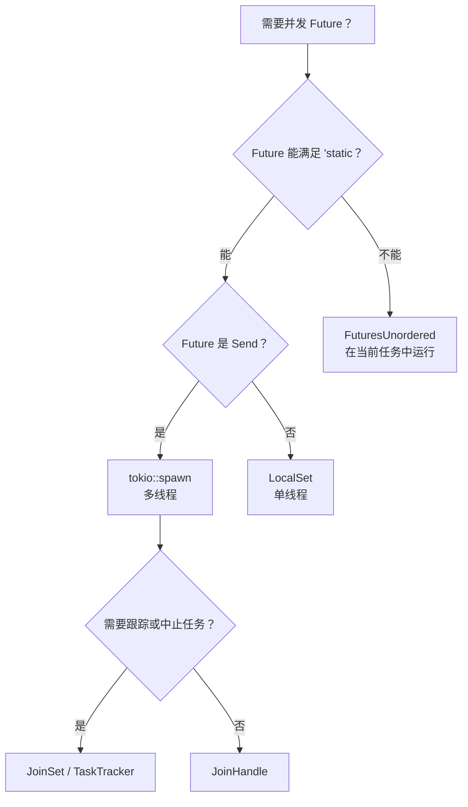

# 第 9 章：Tokio 并非最佳选择的场景 🟡

> **你将学到什么：**
> - `'static` 问题：`tokio::spawn` 何时迫使代码到处使用 `Arc`
> - 用 `LocalSet` 运行 `!Send` Future
> - 用 `FuturesUnordered` 实现借用友好的并发，无需 spawn
> - 用 `JoinSet` 管理任务组
> - 编写与运行时无关的库



## 'static Future 问题

Tokio 的 `spawn` 要求 `'static` Future，因此派生任务无法直接借用局部数据：

```rust
async fn process_items(items: &[String]) {
    // ❌ Can't do this — items is borrowed, not 'static
    // for item in items {
    //     tokio::spawn(async {
    //         process(item).await;
    //     });
    // }

    // 😐 Workaround 1: Clone everything
    for item in items {
        let item = item.clone();
        tokio::spawn(async move {
            process(&item).await;
        });
    }

    // 😐 Workaround 2: Use Arc
    let items = Arc::new(items.to_vec());
    for i in 0..items.len() {
        let items = Arc::clone(&items);
        tokio::spawn(async move {
            process(&items[i]).await;
        });
    }
}
```

这确实令人烦恼。Go 可以简单地用闭包 `go func() { use(item) }`，而 Rust 的所有权系统迫使你明确谁拥有数据，以及数据要存活多久。

### `tokio::spawn` 的替代方案

并非每个问题都需要 `spawn`。以下三个工具分别解决*不同*约束：

```rust
// 1. FuturesUnordered — avoids 'static entirely (no spawn!)
use futures::stream::{FuturesUnordered, StreamExt};

async fn process_items(items: &[String]) {
    let futures: FuturesUnordered<_> = items
        .iter()
        .map(|item| async move {
            // ✅ Can borrow item — no spawn, no 'static needed!
            process(item).await
        })
        .collect();

    // Drive all futures to completion
    futures.for_each(|result| async move {
        println!("Result: {result:?}");
    }).await;
}

// 2. tokio::task::LocalSet — run !Send futures on current thread
//    ⚠️  Still requires 'static — solves Send, not 'static
use tokio::task::LocalSet;

let local_set = LocalSet::new();
local_set.run_until(async {
    tokio::task::spawn_local(async {
        // Can use Rc, Cell, and other !Send types here
        let rc = std::rc::Rc::new(42);
        println!("{rc}");
    }).await.unwrap();
}).await;

// 3. tokio JoinSet (tokio 1.21+) — managed set of spawned tasks
//    ⚠️  Still requires 'static + Send — solves task *management*,
//    not the 'static problem. Useful for tracking, aborting, and
//    joining a dynamic group of tasks.
use tokio::task::JoinSet;

async fn with_joinset() {
    let mut set = JoinSet::new();

    for i in 0..10 {
        // i is Copy and moved into the closure — already 'static.
        // You'd still need Arc or clone for borrowed data.
        set.spawn(async move {
            tokio::time::sleep(Duration::from_millis(100)).await;
            i * 2
        });
    }

    while let Some(result) = set.join_next().await {
        println!("Task completed: {:?}", result.unwrap());
    }
}
```

> **各工具解决什么？**
>
> | 遇到的约束 | 工具 | 避开 `'static`？ | 避开 `Send`？ |
> |---|---|---|---|
> | Future 无法成为 `'static` | `FuturesUnordered` | ✅ | ✅ |
> | Future 是 `'static`，但为 `!Send` | `LocalSet` | ❌ | ✅ |
> | 需要跟踪或中止派生任务 | `JoinSet` | ❌ | ❌ |

### 面向库的轻量运行时设计

编写库时，不要强迫用户采用 Tokio：

```rust
// ❌ BAD: Library forces tokio on users
pub async fn my_lib_function() {
    tokio::time::sleep(Duration::from_secs(1)).await;
    // Now your users MUST use tokio
}

// ✅ GOOD: Library is runtime-agnostic
pub async fn my_lib_function() {
    // Use only types from std::future and futures crate
    do_computation().await;
}

// ✅ GOOD: Accept a generic future for I/O operations
pub async fn fetch_with_retry<F, Fut, T, E>(
    operation: F,
    max_retries: usize,
) -> Result<T, E>
where
    F: Fn() -> Fut,
    Fut: Future<Output = Result<T, E>>,
{
    for attempt in 0..max_retries {
        match operation().await {
            Ok(val) => return Ok(val),
            Err(e) if attempt == max_retries - 1 => return Err(e),
            Err(_) => continue,
        }
    }
    unreachable!()
}
```

> **经验法则**：在确有价值时，让核心逻辑保持与运行时无关。如果库的 API 有意暴露 Tokio 特有的 I/O、定时器、同步原语或生态集成，那么依赖 Tokio 也完全合理。关键是把运行时依赖作为明确的 API 设计，而不是因为随手写了一个 `sleep` 就意外绑定运行时。

<details>
<summary><strong>🏋️ 练习：FuturesUnordered 与 Spawn</strong>（点击展开）</summary>

**挑战**：用两种方法实现同一函数：一种使用 `tokio::spawn`（要求 `'static`），另一种使用 `FuturesUnordered`（借用数据）。函数接收 `&[String]`，模拟异步查询后返回每个字符串的长度。

比较：哪种方式需要 `.clone()`？哪种方式可以直接借用输入切片？

<details>
<summary>🔑 答案</summary>

```rust
use futures::stream::{FuturesUnordered, StreamExt};
use tokio::time::{sleep, Duration};

// Version 1: tokio::spawn — requires 'static, must clone
async fn lengths_with_spawn(items: &[String]) -> Vec<usize> {
    let mut handles = Vec::new();
    for item in items {
        let owned = item.clone(); // Must clone — spawn requires 'static
        handles.push(tokio::spawn(async move {
            sleep(Duration::from_millis(10)).await;
            owned.len()
        }));
    }

    let mut results = Vec::new();
    for handle in handles {
        results.push(handle.await.unwrap());
    }
    results
}

// Version 2: FuturesUnordered — borrows data, no clone needed
async fn lengths_without_spawn(items: &[String]) -> Vec<usize> {
    let futures: FuturesUnordered<_> = items
        .iter()
        .map(|item| async move {
            sleep(Duration::from_millis(10)).await;
            item.len() // ✅ Borrows item — no clone!
        })
        .collect();

    futures.collect().await
}

#[tokio::test]
async fn test_both_versions() {
    let items = vec!["hello".into(), "world".into(), "rust".into()];

    let v1 = lengths_with_spawn(&items).await;
    // Note: v1 preserves insertion order (sequential join)

    let mut v2 = lengths_without_spawn(&items).await;
    v2.sort(); // FuturesUnordered returns in completion order

    assert_eq!(v1, vec![5, 5, 4]);
    assert_eq!(v2, vec![4, 5, 5]);
}
```

**关键点**：`FuturesUnordered` 可以保存借用局部数据的 Future，是因为这些子 Future 仍由外层 Future 持有并在其中被轮询，而不是成为拥有独立生命周期的派生任务。这才是它不要求 `'static` 的原因；线程迁移对应的是另一个独立的 `Send` 问题。所有子 Future 共享同一个任务，因此任一子 Future 执行阻塞代码，整个集合都会停滞。CPU 密集型或阻塞型工作应交给 `spawn_blocking` 或专用 CPU 线程池，而不是普通 `tokio::spawn`。

</details>
</details>

> **深入理解：spawn 是并发的所有权边界**
>
> `spawn` 不只是“让代码同时运行”的语法，它会创建一个生命周期独立、可在线程间迁移、需要单独管理结果和取消的任务。若多个 Future 只是同一操作内部的子步骤，优先使用 `join!`、`FuturesUnordered` 或结构化任务组，往往能保留借用关系并防止任务失联。

> **要点回顾——Tokio 并非最佳选择的场景**
> - `FuturesUnordered` 在当前任务上并发运行 Future，无需 `'static`
> - `LocalSet` 配合 `spawn_local` 可以独立派生 `!Send` Future，但不会消除 `'static` 约束
> - `JoinSet` 提供可管理、可清理的任务组
> - 编写库时，在有利于复用的核心 API 中保持运行时无关；如果 Tokio 特有行为本就是接口契约，则应有意识地暴露 Tokio 依赖

> **另请参阅：** [第 8 章——深入 Tokio](ch08-tokio-deep-dive.md)；[第 11 章——Stream](ch11-streams-and-asynciterator.md) 中的 `buffer_unordered()`。

***
