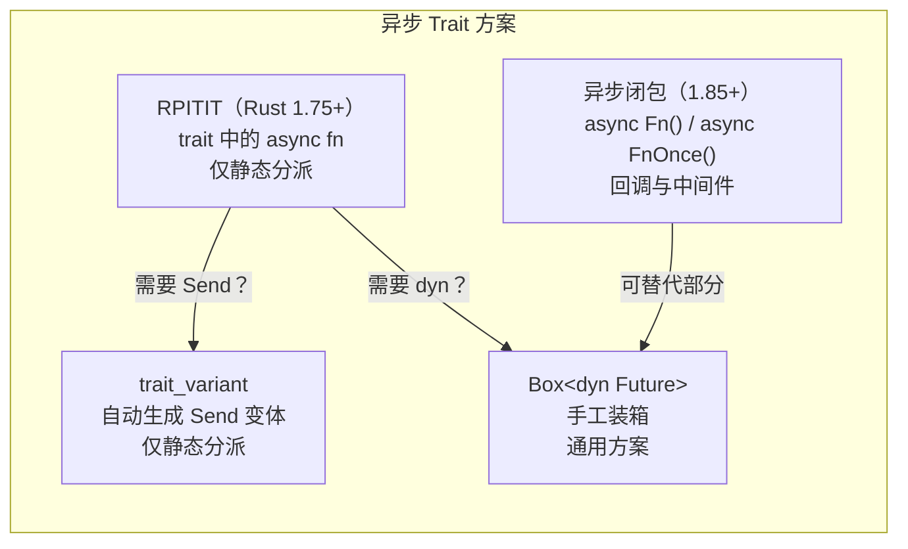

# 第 10 章：异步 Trait 🟡

> **你将学到什么：**
> - trait 中的异步方法为什么历经多年才稳定
> - RPITIT：原生异步 trait 方法（Rust 1.75+）
> - 动态分派难题，以及通过 `trait_variant` 添加 `Send` 约束
> - 异步闭包（Rust 1.85+）：`async Fn()` 与 `async FnOnce()`



## 历史：为什么花了这么久

trait 中的异步方法多年位居 Rust 最受期待功能之列。问题在于：

```rust
// This didn't compile until Rust 1.75 (Dec 2023):
trait DataStore {
    async fn get(&self, key: &str) -> Option<String>;
}
// Why? Because async fn returns `impl Future<Output = T>`,
// and `impl Trait` in trait return position wasn't supported.
```

根本困难是：trait 方法返回 `impl Future` 时，每个实现者都会返回*不同的具体类型*。编译器必须知道返回类型的大小，而 trait 还可能涉及动态分派。

### RPITIT：Trait 返回位置的 Impl Trait

从 Rust 1.75 起，静态分派可以直接这样写：

```rust
trait DataStore {
    async fn get(&self, key: &str) -> Option<String>;
    // Desugars to:
    // fn get(&self, key: &str) -> impl Future<Output = Option<String>>;
}

struct InMemoryStore {
    data: std::collections::HashMap<String, String>,
}

impl DataStore for InMemoryStore {
    async fn get(&self, key: &str) -> Option<String> {
        self.data.get(key).cloned()
    }
}

// ✅ Works with generics (static dispatch):
async fn lookup<S: DataStore>(store: &S, key: &str) {
    if let Some(val) = store.get(key).await {
        println!("{key} = {val}");
    }
}
```

### dyn 分派与 Send 约束

限制在于无法直接使用 `dyn DataStore`，因为编译器不知道返回 Future 的大小：

```rust
// ❌ Doesn't work:
// async fn lookup_dyn(store: &dyn DataStore, key: &str) { ... }
// Error: the trait `DataStore` is not dyn-compatible because method `get`
//        is `async`

// ✅ Workaround: Return a boxed future
trait DynDataStore {
    fn get(&self, key: &str) -> Pin<Box<dyn Future<Output = Option<String>> + Send + '_>>;
}
```

**Send 问题**：多线程运行时中的派生任务必须为 `Send`，但异步 trait 方法不会自动为返回 Future 加上 `Send` 约束：

```rust
trait Worker {
    async fn run(self); // Future might or might not be Send
}

struct MyWorker;

impl Worker for MyWorker {
    async fn run(self) {
        // If this uses !Send types, the future is !Send
        let rc = std::rc::Rc::new(42);
        some_work().await;
        println!("{rc}");
    }
}

// ❌ This fails because the future is !Send (Rc is !Send):
// tokio::spawn(worker.run()); // Requires Send + 'static
//
// Note: We use `self` (owned) here because tokio::spawn also
// requires 'static — a future borrowing &self can't be 'static.
// Even without Rc, `async fn run(&self)` wouldn't be spawnable.
```

### trait_variant Crate

Rust 异步工作组的 `trait_variant` crate 能自动生成 `Send` 变体：

```rust
// Cargo.toml: trait-variant = "0.1"

#[trait_variant::make(SendDataStore: Send)]
trait DataStore {
    async fn get(&self, key: &str) -> Option<String>;
    async fn set(&self, key: &str, value: String);
}

// Now you have two traits:
// - DataStore: no Send bound on the futures
// - SendDataStore: all futures are Send
// 两个 trait 具有相同方法。需要更强约束时应实现生成的 SendDataStore；
// trait_variant 会提供对应的本地 DataStore 实现。若只实现 DataStore，
// 之后无法自动证明它满足更强的 SendDataStore 契约。

// Use SendDataStore when you need to spawn tasks:
async fn spawn_lookup<S: SendDataStore + 'static>(store: Arc<S>) {
    tokio::spawn(async move {
        store.get("key").await;
    });
}

// ⚠️ Note: trait_variant does NOT enable dyn dispatch.
// The generated trait still uses `impl Future`, so `dyn SendDataStore`
// is not object-safe. For dyn dispatch, you still need manual boxing
// (see the Box::pin approach above) or the `async-trait` crate.
```

### 异步 Trait 快速参考

| 方案 | 静态分派 | 动态分派 | Send | 语法开销 |
|------|:---:|:---:|:---:|---|
| trait 中原生 `async fn` | ✅ | ❌ | 由 trait/API 约束决定 | 无 |
| `trait_variant` | ✅ | ❌ | 显式变体 | `#[trait_variant::make]` |
| 手工 `Box::pin` | ✅ | ✅ | 显式 | 高 |
| `async-trait` crate | ✅ | ✅ | `#[async_trait]` | 中等（过程宏） |

> **建议**：新代码（Rust 1.75+）优先使用原生异步 trait；派生任务需要 `Send` 时加入 `trait_variant`；需要 `dyn` 分派时使用手工 `Box::pin` 或 `async-trait`。静态分派的原生方案无需装箱开销。

### 异步闭包（Rust 1.85+）

从 Rust 1.85 起，`async closures`（异步闭包）已经稳定。它们可以捕获环境并返回 `Future`：

```rust
// Before 1.85: awkward workaround
let urls = vec!["https://a.com", "https://b.com"];
let fetchers: Vec<_> = urls.iter().map(|url| {
    let url = url.to_string();
    // Returns a non-async closure that returns an async block
    move || async move { reqwest::get(&url).await }
}).collect();

// After 1.85: async closures just work
let fetchers: Vec<_> = urls.iter().map(|url| {
    async move || { reqwest::get(url).await }
    // ↑ This is an async closure — captures url, returns a Future
}).collect();
```

异步闭包实现新的 `AsyncFn`、`AsyncFnMut`、`AsyncFnOnce` trait，分别对应 `Fn`、`FnMut`、`FnOnce`：

```rust
// Generic function accepting an async closure
async fn retry<F>(max: usize, f: F) -> Result<String, Error>
where
    F: AsyncFn() -> Result<String, Error>,
{
    for _ in 0..max {
        if let Ok(val) = f().await {
            return Ok(val);
        }
    }
    f().await
}
```

> **迁移提示**：若现有代码使用 `Fn() -> impl Future<Output = T>`，可以考虑改成更简洁的 `AsyncFn() -> T`。

<details>
<summary><strong>🏋️ 练习：设计异步服务 Trait</strong>（点击展开）</summary>

**挑战**：设计带异步 `get`、`set` 方法的 `Cache` trait。分别用内存 `HashMap` 和模拟 Redis 后端实现；后者通过 `tokio::time::sleep` 模拟网络延迟。再编写一个适用于两者的泛型函数。

<details>
<summary>🔑 答案</summary>

```rust
use std::collections::HashMap;
use std::sync::Arc;
use tokio::sync::Mutex;
use tokio::time::{sleep, Duration};

trait Cache {
    async fn get(&self, key: &str) -> Option<String>;
    async fn set(&self, key: &str, value: String);
}

// --- In-memory implementation ---
struct MemoryCache {
    store: Mutex<HashMap<String, String>>,
}

impl MemoryCache {
    fn new() -> Self {
        MemoryCache {
            store: Mutex::new(HashMap::new()),
        }
    }
}

impl Cache for MemoryCache {
    async fn get(&self, key: &str) -> Option<String> {
        self.store.lock().await.get(key).cloned()
    }

    async fn set(&self, key: &str, value: String) {
        self.store.lock().await.insert(key.to_string(), value);
    }
}

// --- Simulated Redis implementation ---
struct RedisCache {
    store: Mutex<HashMap<String, String>>,
    latency: Duration,
}

impl RedisCache {
    fn new(latency_ms: u64) -> Self {
        RedisCache {
            store: Mutex::new(HashMap::new()),
            latency: Duration::from_millis(latency_ms),
        }
    }
}

impl Cache for RedisCache {
    async fn get(&self, key: &str) -> Option<String> {
        sleep(self.latency).await; // Simulate network round-trip
        self.store.lock().await.get(key).cloned()
    }

    async fn set(&self, key: &str, value: String) {
        sleep(self.latency).await;
        self.store.lock().await.insert(key.to_string(), value);
    }
}

// --- Generic function working with any Cache ---
async fn cache_demo<C: Cache>(cache: &C, label: &str) {
    cache.set("greeting", "Hello, async!".into()).await;
    let val = cache.get("greeting").await;
    println!("[{label}] greeting = {val:?}");
}

#[tokio::main]
async fn main() {
    let mem = MemoryCache::new();
    cache_demo(&mem, "memory").await;

    let redis = RedisCache::new(50);
    cache_demo(&redis, "redis").await;
}
```

**关键点**：同一个泛型函数通过静态分派适用于两种实现，不需要装箱，也没有分配开销。多线程运行时中若要派生这些 Future，可用 `trait_variant::make(SendCache: Send)` 添加 `Send` 约束；动态分派则使用手工 `Box::pin` 或 `async-trait`。

</details>
</details>

> **深入理解：静态分派与动态分派的真正取舍**
>
> 静态分派让编译器看到每个实现返回的具体状态机，便于内联且无需堆分配，但会生成更多单态化代码。动态分派统一返回类型，便于异构集合和插件式架构，却通常需要 `Pin<Box<dyn Future>>` 的分配与虚调用。应根据扩展边界选择，不要只因语法短就默认装箱。

> **要点回顾——异步 Trait**
> - Rust 1.75 起可以直接在 trait 中写 `async fn`，无需 `#[async_trait]`
> - `trait_variant::make` 可生成适合派生任务的 `Send` 变体，但仍是静态分派
> - 异步闭包（`async Fn()`）在 Rust 1.85 稳定，适合回调与中间件
> - 性能敏感代码优先使用静态分派（`<S: Service>`），需要异构运行时多态时再用 `dyn`

> **另请参阅：** [第 13 章——生产实践模式](ch13-production-patterns.md) 中 Tower 的 `Service` trait；[第 6 章——手工构建 Future](ch06-building-futures-by-hand.md)。

***
