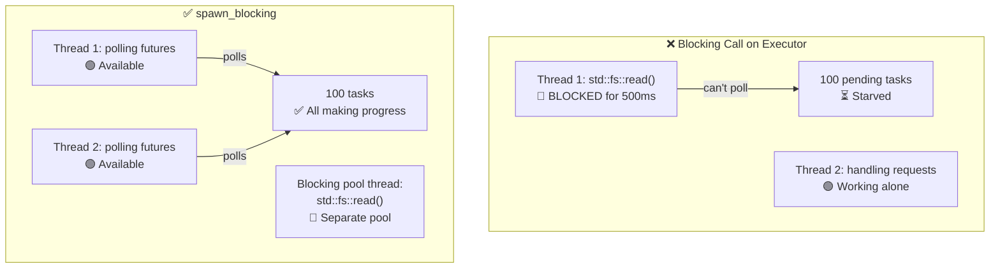

# 第 12 章：常见陷阱 🔴

> **你将学到什么：**
> - 9 类常见 Async Rust 缺陷及其修复方法
> - 为什么阻塞执行器是头号错误，以及 `spawn_blocking` 如何修复它
> - 取消风险：Future 在 await 途中被丢弃时会发生什么
> - 调试工具：`tokio-console`、`tracing`、`#[instrument]`
> - 测试方法：`#[tokio::test]`、`time::pause()`、基于 trait 的 mock

## 阻塞执行器

Async Rust 中最常见的错误，就是在异步执行器线程上运行阻塞代码。这会让其他任务得不到运行机会。

```rust
// ❌ WRONG: Blocks the entire executor thread
async fn bad_handler() -> String {
    let data = std::fs::read_to_string("big_file.txt").unwrap(); // BLOCKS!
    process(&data)
}

// ✅ CORRECT: Offload blocking work to a dedicated thread pool
async fn good_handler() -> String {
    let data = tokio::task::spawn_blocking(|| {
        std::fs::read_to_string("big_file.txt").unwrap()
    }).await.unwrap();
    process(&data)
}

// ✅ ALSO CORRECT: Use tokio's async fs
async fn also_good_handler() -> String {
    let data = tokio::fs::read_to_string("big_file.txt").await.unwrap();
    process(&data)
}
```



### std::thread::sleep 与 tokio::time::sleep

```rust
// ❌ WRONG: Blocks the executor thread for 5 seconds
async fn bad_delay() {
    std::thread::sleep(Duration::from_secs(5)); // Thread can't poll anything else!
}

// ✅ CORRECT: Yields to the executor, other tasks can run
async fn good_delay() {
    tokio::time::sleep(Duration::from_secs(5)).await; // Non-blocking!
}
```

### 跨越 .await 持有 MutexGuard

```rust
use std::sync::Mutex; // std Mutex — NOT async-aware

// ⚠️ RISKY: MutexGuard held across .await
async fn bad_mutex(data: &Mutex<Vec<String>>) {
    let mut guard = data.lock().unwrap();
    guard.push("item".into());
    some_io().await; // Guard is held here — blocks other threads from locking!
    guard.push("another".into());
}
// NOTE: This compiles! std::sync::MutexGuard is !Send, but the compiler only
// enforces Send on the Future when you pass it to something that requires it
// (e.g., tokio::spawn). Calling bad_mutex(...).await directly compiles fine.
// However, tokio::spawn(bad_mutex(data)) will fail with a Send bound error.
```

**为什么这通常有问题——但并非绝对：**

跨 `.await` 持有 `std::sync::Mutex`，会在整个 I/O 等待期间阻塞**操作系统线程**，使执行器无法在该线程上轮询其他任务。短临界区这样做很浪费，长时间 I/O 更会成为严重的性能陷阱。

**不过**，确实存在必须跨 `.await` 持锁的情况，就像数据库事务会在读取与提交之间保持锁。释放后重新加锁会引入 **TOCTOU（检查时刻到使用时刻）竞态**：另一个任务可能在两段临界区之间修改数据。正确方案取决于实际语义：

```rust
// OPTION 1: Scope the guard — works when operations are independent
async fn scoped_mutex(data: &Mutex<Vec<String>>) {
    {
        let mut guard = data.lock().unwrap();
        guard.push("item".into());
    } // Guard dropped here
    some_io().await; // Lock is released — other tasks can proceed
    {
        let mut guard = data.lock().unwrap();
        guard.push("another".into());
    }
}
// ⚠️ Careful: another task can lock + modify the Vec between the two sections.
//    This is fine if the two pushes are independent, but wrong if "another"
//    depends on state set by "item".

// OPTION 2: Use tokio::sync::Mutex — holds lock across .await without
//           blocking the OS thread. Best when you need transactional
//           read-modify-write across an await point.
use tokio::sync::Mutex as AsyncMutex;

async fn async_mutex(data: &AsyncMutex<Vec<String>>) {
    let mut guard = data.lock().await; // Async lock — doesn't block the thread
    guard.push("item".into());
    some_io().await; // OK — tokio Mutex guard is Send
    guard.push("another".into());
    // Guard held the whole time — no TOCTOU race, no thread blocked.
}
```

> **如何选择 Mutex**：
> - `std::sync::Mutex`：内部没有 `.await` 的短临界区
> - `tokio::sync::Mutex`：必须跨 `.await` 持锁时（事务语义、避免 TOCTOU）
> - `parking_lot::Mutex`：更快更小的 `std` 替代品，但仍不应跨 `.await`
>
> **经验法则**：不要盲目地以 `.await` 为界拆开临界区。先判断两半是否真正独立；若后半段依赖前半段建立的状态，应使用 `tokio::sync::Mutex` 或重新设计数据流。

### 取消风险

丢弃 Future 会取消它，但可能让系统停留在不一致状态：

```rust
// ❌ DANGEROUS: Resource leak on cancellation
async fn transfer(from: &Account, to: &Account, amount: u64) {
    from.debit(amount).await;  // If cancelled HERE...
    to.credit(amount).await;   // ...money vanishes!
}

// ✅ SAFE: Make operations atomic or use compensation
async fn safe_transfer(from: &Account, to: &Account, amount: u64) -> Result<(), Error> {
    // Use a database transaction (all-or-nothing)
    let tx = db.begin_transaction().await?;
    tx.debit(from, amount).await?;
    tx.credit(to, amount).await?;
    tx.commit().await?; // Only commits if everything succeeded
    Ok(())
}

// ✅ ALSO SAFE: Use tokio::select! with cancellation awareness
tokio::select! {
    result = transfer(from, to, amount) => {
        // Transfer completed
    }
    _ = shutdown_signal() => {
        // Don't cancel mid-transfer — let it finish
        // Or: roll back explicitly
    }
}
```

### 没有异步 Drop

Rust 的 `Drop` trait 是同步的，**不能**在 `drop()` 中 `.await`。这经常令人困惑：

```rust
struct DbConnection { /* ... */ }

impl Drop for DbConnection {
    fn drop(&mut self) {
        // ❌ Can't do this — drop() is sync!
        // self.connection.shutdown().await;

        // ✅ Workaround 1: Spawn a cleanup task (fire-and-forget)
        let conn = self.connection.take();
        tokio::spawn(async move {
            let _ = conn.shutdown().await;
        });

        // ✅ Workaround 2: Use a synchronous close
        // self.connection.blocking_close();
    }
}
```

**最佳实践**：提供显式的 `async fn close(self)`，并要求调用者使用它。`Drop` 只应作为安全兜底，而不是主要清理路径。

### select! 的公平性与饥饿

```rust
use tokio::sync::mpsc;

// ❌ UNFAIR: busy_stream always wins, slow_stream starves
async fn unfair(mut fast: mpsc::Receiver<i32>, mut slow: mpsc::Receiver<i32>) {
    loop {
        tokio::select! {
            Some(v) = fast.recv() => println!("fast: {v}"),
            Some(v) = slow.recv() => println!("slow: {v}"),
            // If both are ready, tokio randomly picks one.
            // But if `fast` is ALWAYS ready, `slow` rarely gets polled.
        }
    }
}

// ✅ FAIR: Use biased select or drain in batches
async fn fair(mut fast: mpsc::Receiver<i32>, mut slow: mpsc::Receiver<i32>) {
    loop {
        tokio::select! {
            biased; // Always check in order — explicit priority

            Some(v) = slow.recv() => println!("slow: {v}"),  // Priority!
            Some(v) = fast.recv() => println!("fast: {v}"),
        }
    }
}
```

### 意外的顺序执行

```rust
// ❌ SEQUENTIAL: Takes 2 seconds total
async fn slow() {
    let a = fetch("url_a").await; // 1 second
    let b = fetch("url_b").await; // 1 second (waits for a to finish first!)
}

// ✅ CONCURRENT: Takes 1 second total
async fn fast() {
    let (a, b) = tokio::join!(
        fetch("url_a"), // Both start immediately
        fetch("url_b"),
    );
}

// ✅ ALSO CONCURRENT: Using let + join
async fn also_fast() {
    let fut_a = fetch("url_a"); // Create future (lazy — not started yet)
    let fut_b = fetch("url_b"); // Create future
    let (a, b) = tokio::join!(fut_a, fut_b); // NOW both run concurrently
}
```

> **陷阱**：`let a = fetch(url).await; let b = fetch(url).await;` 是顺序执行！第一次完成后才会开始第二次。需要并发时使用 `join!` 或 `spawn`。

## 案例：调试挂起的生产服务

真实场景：服务正常处理请求 10 分钟后停止响应，日志没有错误，CPU 为 0%。

**诊断步骤：**

1. **连接 `tokio-console`**——发现 200 多个任务卡在 `Pending`
2. **检查任务详情**——全部在等待同一个 `Mutex::lock().await`
3. **根因**——某个任务跨 `.await` 持有 `std::sync::MutexGuard`，随后 panic 并毒化互斥锁；其他任务在 `lock().unwrap()` 处继续失败

**修复方法：**

| 修复前 | 修复后 |
|-----------------|---------------|
| `std::sync::Mutex` | `tokio::sync::Mutex` |
| 跨 `.await` 持有 `.lock().unwrap()` | 在 `.await` 前限制并释放锁 |
| 获取锁没有超时 | `tokio::time::timeout(dur, mutex.lock())` |
| 互斥锁毒化后无法恢复 | `tokio::sync::Mutex` 不使用毒化语义 |

**预防清单：**
- [ ] Guard 跨越任何 `.await` 时使用 `tokio::sync::Mutex`
- [ ] 为异步函数添加 `#[tracing::instrument]`，跟踪 span
- [ ] 在预发布环境运行 `tokio-console`，尽早发现挂起任务
- [ ] 增加能够验证任务响应性的健康检查端点

<details>
<summary><strong>🏋️ 练习：找出缺陷</strong>（点击展开）</summary>

**挑战**：找出以下代码中的所有异步陷阱并修复。

```rust
use std::sync::Mutex;

async fn process_requests(urls: Vec<String>) -> Vec<String> {
    let results = Mutex::new(Vec::new());
    
    for url in &urls {
        let response = reqwest::get(url).await.unwrap().text().await.unwrap();
        std::thread::sleep(std::time::Duration::from_millis(100)); // Rate limit
        let mut guard = results.lock().unwrap();
        guard.push(response);
        expensive_parse(&guard).await; // Parse all results so far
    }
    
    results.into_inner().unwrap()
}
```

<details>
<summary>🔑 答案</summary>

**发现的问题：**

1. **顺序请求**——URL 逐个获取，没有并发
2. **`std::thread::sleep`**——阻塞执行器线程
3. **跨 `.await` 持有 MutexGuard**——等待 `expensive_parse` 时 `guard` 仍存活
4. **完全没有并发**——应使用 `join!` 或 `FuturesUnordered`

```rust
use tokio::sync::Mutex;
use std::sync::Arc;
use futures::stream::{self, StreamExt};

async fn process_requests(urls: Vec<String>) -> Vec<String> {
    // Fix 4: Process URLs concurrently with buffer_unordered
    let results: Vec<String> = stream::iter(urls)
        .map(|url| async move {
            let response = reqwest::get(&url).await.unwrap().text().await.unwrap();
            // Fix 2: Use tokio::time::sleep instead of std::thread::sleep
            tokio::time::sleep(std::time::Duration::from_millis(100)).await;
            response
        })
        .buffer_unordered(10) // Up to 10 concurrent requests
        .collect()
        .await;

    // Fix 3: Parse after collecting — no mutex needed at all!
    for result in &results {
        expensive_parse(result).await;
    }

    results
}
```

**关键点**：很多时候可以重构数据流，彻底消除互斥锁。先通过 Stream 或 join 收集结果，再处理；代码更简单、更快，也没有死锁风险。

</details>
</details>

---

### 调试异步代码

异步调用栈出了名地难懂：它往往显示执行器的 poll 循环，而不是业务逻辑调用链。以下工具至关重要。

#### tokio-console：实时任务检查器

[tokio-console](https://github.com/tokio-rs/console) 以类似 `htop` 的界面显示每个派生任务的状态、轮询耗时、Waker 活动和资源使用情况。

```toml
# Cargo.toml
[dependencies]
console-subscriber = "0.4"
tokio = { version = "1", features = ["full", "tracing"] }
```

```rust
#[tokio::main]
async fn main() {
    console_subscriber::init(); // Replaces the default tracing subscriber
    // ... rest of your application
}
```

然后在另一个终端运行：

```bash
$ RUSTFLAGS="--cfg tokio_unstable" cargo run   # Required compile-time flag
$ tokio-console                                # Connects to 127.0.0.1:6669
```

#### tracing + #[instrument]：异步结构化日志

[`tracing`](https://docs.rs/tracing) 理解 Future 的生命周期。Span 会跨 `.await` 保持打开，因此即使任务换了操作系统线程，也能保留逻辑调用链：

```rust
use tracing::{info, instrument};

#[instrument(skip(db_pool), fields(user_id = %user_id))]
async fn handle_request(user_id: u64, db_pool: &Pool) -> Result<Response> {
    info!("looking up user");
    let user = db_pool.get_user(user_id).await?;  // span stays open across .await
    info!(email = %user.email, "found user");
    let orders = fetch_orders(user_id).await?;     // still the same span
    Ok(build_response(user, orders))
}
```

使用 `tracing_subscriber::fmt::json()` 时的输出：

```json
{"timestamp":"...","level":"INFO","span":{"name":"handle_request","user_id":"42"},"message":"looking up user"}
{"timestamp":"...","level":"INFO","span":{"name":"handle_request","user_id":"42"},"fields":{"email":"a@b.com"},"message":"found user"}
```

#### 调试清单

| 症状 | 可能原因 | 工具 |
|---------|-------------|------|
| 任务永久挂起 | 缺少 `.await` 或 Mutex 死锁 | `tokio-console` 任务视图 |
| 吞吐量低 | 异步线程上有阻塞调用 | poll 时间直方图 |
| `Future is not Send` | 跨 `.await` 保存了非 Send 类型 | 编译器错误 + `#[instrument]` 定位 |
| 莫名取消 | 上层 `select!` 丢弃了分支 | `tracing` span 生命周期事件 |

> **提示**：设置 `RUSTFLAGS="--cfg tokio_unstable"` 才能在 tokio-console 中取得任务级指标。这是编译期标志，不是运行时标志。

### 测试异步代码

异步代码带来特殊测试挑战：需要运行时、可控时间，以及验证并发行为的策略。

使用 `#[tokio::test]` 的**基础异步测试**：

```rust
// Cargo.toml
// [dev-dependencies]
// tokio = { version = "1", features = ["full", "test-util"] }

#[tokio::test]
async fn test_basic_async() {
    let result = fetch_data().await;
    assert_eq!(result, "expected");
}

// Single-threaded test (useful for !Send types):
#[tokio::test(flavor = "current_thread")]
async fn test_single_threaded() {
    let rc = std::rc::Rc::new(42);
    let val = async { *rc }.await;
    assert_eq!(val, 42);
}

// Multi-threaded with explicit worker count:
#[tokio::test(flavor = "multi_thread", worker_threads = 2)]
async fn test_concurrent_behavior() {
    // Tests race conditions with real concurrency
    let counter = std::sync::Arc::new(std::sync::atomic::AtomicU32::new(0));
    let c1 = counter.clone();
    let c2 = counter.clone();
    let (a, b) = tokio::join!(
        tokio::spawn(async move { c1.fetch_add(1, std::sync::atomic::Ordering::SeqCst) }),
        tokio::spawn(async move { c2.fetch_add(1, std::sync::atomic::Ordering::SeqCst) }),
    );
    a.unwrap();
    b.unwrap();
    assert_eq!(counter.load(std::sync::atomic::Ordering::SeqCst), 2);
}
```

**操纵时间**——无需真实等待即可测试超时：

```rust
use tokio::time::{self, Duration, Instant};

#[tokio::test]
async fn test_timeout_behavior() {
    // Pause time — sleep() advances instantly, no real wall-clock delay
    time::pause();

    let start = Instant::now();
    time::sleep(Duration::from_secs(3600)).await; // "waits" 1 hour — takes 0ms
    assert!(start.elapsed() >= Duration::from_secs(3600));
    // Test ran in milliseconds, not an hour!
}

#[tokio::test]
async fn test_retry_timing() {
    time::pause();

    // Test that our retry logic waits the expected durations
    let start = Instant::now();
    let result = retry_with_backoff(|| async {
        Err::<(), _>("simulated failure")
    }, 3, Duration::from_secs(1))
    .await;

    assert!(result.is_err());
    // 1s + 2s + 4s = 7s of backoff (exponential)
    assert!(start.elapsed() >= Duration::from_secs(7));
}

#[tokio::test]
async fn test_deadline_exceeded() {
    time::pause();

    let result = tokio::time::timeout(
        Duration::from_secs(5),
        async {
            // Simulate slow operation
            time::sleep(Duration::from_secs(10)).await;
            "done"
        }
    ).await;

    assert!(result.is_err()); // Timed out
}
```

**Mock 异步依赖**——使用 trait 与泛型：

```rust
// Define a trait for the dependency:
trait Storage {
    async fn get(&self, key: &str) -> Option<String>;
    async fn set(&self, key: &str, value: String);
}

// Production implementation:
struct RedisStorage { /* ... */ }
impl Storage for RedisStorage {
    async fn get(&self, key: &str) -> Option<String> {
        // Real Redis call
        todo!()
    }
    async fn set(&self, key: &str, value: String) {
        todo!()
    }
}

// Test mock:
struct MockStorage {
    data: std::sync::Mutex<std::collections::HashMap<String, String>>,
}

impl MockStorage {
    fn new() -> Self {
        MockStorage { data: std::sync::Mutex::new(std::collections::HashMap::new()) }
    }
}

impl Storage for MockStorage {
    async fn get(&self, key: &str) -> Option<String> {
        self.data.lock().unwrap().get(key).cloned()
    }
    async fn set(&self, key: &str, value: String) {
        self.data.lock().unwrap().insert(key.to_string(), value);
    }
}

// Tested function is generic over Storage:
async fn cache_lookup<S: Storage>(store: &S, key: &str) -> String {
    match store.get(key).await {
        Some(val) => val,
        None => {
            let val = "computed".to_string();
            store.set(key, val.clone()).await;
            val
        }
    }
}

#[tokio::test]
async fn test_cache_miss_then_hit() {
    let mock = MockStorage::new();

    // First call: miss → computes and stores
    let val = cache_lookup(&mock, "key1").await;
    assert_eq!(val, "computed");

    // Second call: hit → returns stored value
    let val = cache_lookup(&mock, "key1").await;
    assert_eq!(val, "computed");
    assert!(mock.data.lock().unwrap().contains_key("key1"));
}
```

**测试通道与任务通信**：

```rust
#[tokio::test]
async fn test_producer_consumer() {
    let (tx, mut rx) = tokio::sync::mpsc::channel(10);

    tokio::spawn(async move {
        for i in 0..5 {
            tx.send(i).await.unwrap();
        }
        // tx dropped here — channel closes
    });

    let mut received = Vec::new();
    while let Some(val) = rx.recv().await {
        received.push(val);
    }

    assert_eq!(received, vec![0, 1, 2, 3, 4]);
}
```

| 测试模式 | 使用场景 | 关键工具 |
|-------------|-------------|----------|
| `#[tokio::test]` | 所有异步测试 | `tokio = { features = ["macros", "rt"] }` |
| `time::pause()` | 测试超时、重试和周期任务 | `tokio::time::pause()` |
| Trait mock | 在无真实 I/O 时测试业务逻辑 | 泛型 `<S: Storage>` |
| `current_thread` | 测试 `!Send` 类型或确定性调度 | `#[tokio::test(flavor = "current_thread")]` |
| `multi_thread` | 测试竞态条件 | `#[tokio::test(flavor = "multi_thread")]` |

> **要点回顾——常见陷阱**
> - 绝不要阻塞执行器；CPU 或同步阻塞工作交给 `spawn_blocking`
> - 通常不要跨 `.await` 持有 `MutexGuard`；缩小锁范围，确需事务语义时使用异步 Mutex
> - 取消会立即丢弃 Future；部分完成可能破坏一致性的操作必须采用取消安全模式
> - 使用 `tokio-console` 和 `#[tracing::instrument]` 调试异步代码
> - 使用 `#[tokio::test]` 与 `time::pause()` 做确定性的时间测试

> **另请参阅：** [第 8 章——深入 Tokio](ch08-tokio-deep-dive.md) 的同步原语；[第 13 章——生产实践模式](ch13-production-patterns.md) 的优雅关闭与结构化并发。

***
