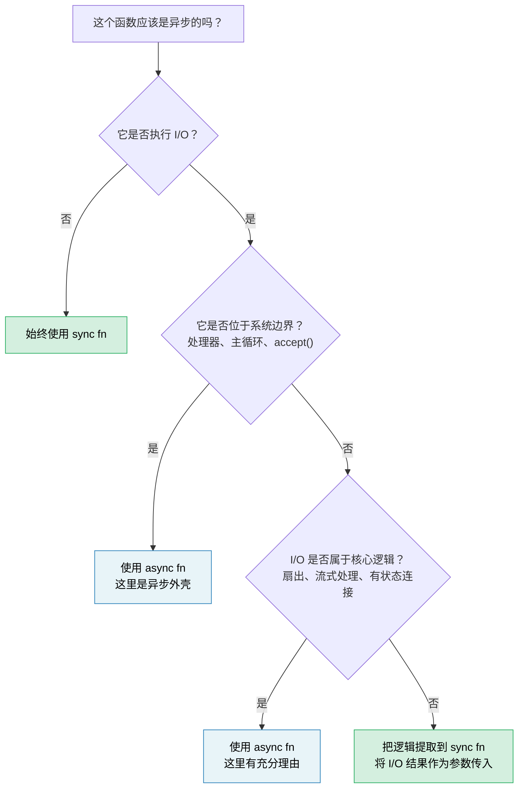

# 第 14 章：异步是一种优化，而非架构 🔴

> **你将学到什么：**
> - 异步为什么容易“污染”整个代码库，以及为何这是一项设计代价
> - “同步核心、异步外壳”模式，如何让多数代码易测、易调试
> - 如何处理业务逻辑中间确实需要 I/O 的困难情况
> - `spawn_blocking` 何时是修复，何时只是症状
> - 异步何时真正属于核心逻辑
> - 为什么同步优先的库比异步优先的库更易组合

学完 13 章 Async Rust 后，现在要强调本书最重要的一句话：**大多数代码都不应该是异步的。**

## 函数“染色”问题

Bob Nystrom 的[《你的函数是什么颜色？》](https://journal.stuffwithstuff.com/2015/02/01/what-color-is-your-function/)指出了核心问题：异步函数可以调用同步函数，同步函数却不能直接调用异步函数。一旦某个函数变成异步，调用链上方往往都必须跟随。

在 Rust 中，这比 C# 或 JavaScript 更明显，因为异步不仅影响函数签名，还会影响类型：

| 同步代码 | 异步对应物 | 差异 |
|---|---|---|
| `fn process(&self)` | `async fn process(&self)` | 调用者也必须异步 |
| `&mut T` | `Arc<Mutex<T>>` | 派生任务要求 `'static + Send` |
| `std::sync::Mutex` | `tokio::sync::Mutex` | 跨 `.await` 持锁时类型不同 |
| 返回 `impl Trait` | `impl Future<Output = T> + Send` | RPITIT 已简化语法，但仍被染色 |
| `#[test]` | `#[tokio::test]` | 测试需要运行时 |
| 5 层同步栈 | 25 层异步栈 | 其中大量是运行时内部帧 |

表中每一行都是开发者必须正确作出并长期维护的决定，却都不是业务逻辑。Java Loom 虚拟线程和 Go goroutine 让开发者编写同步外观的代码，再由运行时低成本复用；Rust 为零成本控制选择了显式异步，但这种控制伴随复杂度，应有意识地承担，而不是默认扩散。

## “可是线程很昂贵”

常见反驳是“线程昂贵，所以必须异步”。这在某些负载下确实成立，但没有工作负载数据时，它不足以单独支撑架构决策。

- **栈内存：** 预留大小、保护页与实际提交内存会随操作系统、libc、语言运行时和配置变化。每线程栈可能成为真实容量成本，但用一个固定数字概括会误导。
- **上下文切换：** 成本受硬件、调度器状态、缓存局部性、安全缓解措施和争用影响。应在部署目标上测量尾延迟与吞吐量。
- **创建成本：** 线程池能摊薄创建成本，适合许多工作负载，但仍需考虑排队、阻塞行为和池大小。

不存在一个可移植的连接数阈值，超过它异步就必然胜出。决策取决于连接生命周期、空闲占比、内存预算、阻塞依赖、尾延迟目标以及团队经验。应使用代表性负载比较“有界线程池”和“异步”两种设计，选择能够达到实测容量与延迟要求的更简单方案。

## 困难案例：逻辑中间也需要 I/O

像 `fn add(a: i32, b: i32) -> i32` 这样的简单纯函数显然不需要异步，但这并不是一个有启发性的结论。真正棘手的情况是，业务逻辑*看起来*必须在执行途中完成 I/O：校验时查询库存、定价时获取汇率，或者订单流水线中需要查找客户。

以订单处理服务为例，到处异步的版本看起来很自然：

### 版本 A：异步贯穿核心

```rust
// orders.rs — async all the way down

pub async fn process_order(order: Order) -> Result<Receipt, OrderError> {
    // Step 1: Validate — pure business rules, no I/O
    validate_items(&order)?;
    validate_quantities(&order)?;

    // Step 2: Check inventory — needs a database call
    let stock = inventory_client.check(&order.items).await?;
    if !stock.all_available() {
        return Err(OrderError::OutOfStock(stock.missing()));
    }

    // Step 3: Calculate pricing — pure math, but async because we're already here
    let pricing = calculate_pricing(&order, &stock);

    // Step 4: Apply discount — needs an external service call
    let discount = discount_service.lookup(order.customer_id).await?;
    let final_price = pricing.apply_discount(discount);

    // Step 5: Format receipt — pure
    Ok(Receipt::new(order, final_price))
}
```

这是一段*合理*的异步代码：没有滥用 `Arc<Mutex>`，只有几个顺序执行的 `.await`。大多数开发者都会这样写完后继续前进。但仔细看发生了什么：`validate_items`、`validate_quantities`、`calculate_pricing` 和 `Receipt::new` 都是纯函数，却因为第 2、4 步需要 I/O 而被包进异步编排中。于是整个 `process_order` 必须是异步函数，它的整体测试需要运行时，调用链上方的每个调用者也都被“染色”。

### 版本 B：同步核心、异步外壳

替代方案是把“如何获取”与“如何决策”分开：

```rust
// core.rs — pure business logic, zero async, zero tokio dependency

pub fn validate_order(order: &Order) -> Result<ValidatedOrder, OrderError> {
    validate_items(order)?;
    validate_quantities(order)?;
    Ok(ValidatedOrder::from(order))
}

pub fn check_stock(
    order: &ValidatedOrder,
    stock: &StockResult,
) -> Result<StockedOrder, OrderError> {
    if !stock.all_available() {
        return Err(OrderError::OutOfStock(stock.missing()));
    }
    Ok(StockedOrder::from(order, stock))
}

pub fn finalize(
    order: &StockedOrder,
    discount: Discount,
) -> Receipt {
    let pricing = calculate_pricing(order);
    let final_price = pricing.apply_discount(discount);
    Receipt::new(order, final_price)
}
```

```rust
// shell.rs — thin async orchestrator
//
// Note: the `?` on network calls requires `impl From<reqwest::Error> for OrderError`
// (or a unified error enum). See ch12 for async error handling patterns.

use crate::core;

pub async fn process_order(order: Order) -> Result<Receipt, OrderError> {
    // Sync: validate
    let validated = core::validate_order(&order)?;

    // Async: fetch inventory (this is the shell's job)
    let stock = inventory_client.check(&validated.items).await?;

    // Sync: apply business rule to fetched data
    let stocked = core::check_stock(&validated, &stock)?;

    // Async: fetch discount
    let discount = discount_service.lookup(order.customer_id).await?;

    // Sync: finalize
    Ok(core::finalize(&stocked, discount))
}
```

异步外壳成为一条 **获取 → 决策 → 获取 → 决策** 的流水线。每个“决策”步骤都是同步函数，把 I/O 结果当作参数，而不是亲自访问外部系统。

### 测试上的差异

同步核心无需运行时或 I/O mock 就能测试每条业务规则：

```rust
#[test]
fn out_of_stock_rejects_order() {
    let order = validated_order(vec![item("widget", 10)]);
    let stock = stock_result(vec![("widget", 3)]); // only 3 available

    let result = core::check_stock(&order, &stock);
    assert_eq!(result.unwrap_err(), OrderError::OutOfStock(vec!["widget"]));
}

#[test]
fn discount_applied_correctly() {
    let order = stocked_order(100_00); // price in cents
    let receipt = core::finalize(&order, Discount::Percent(15));
    assert_eq!(receipt.final_price, 85_00);
}
```

异步外壳只需较薄的*集成测试*，验证编排接线，而非重复测试逻辑：

```rust
#[tokio::test]
async fn process_order_integration() {
    let mock_inventory = mock_service(/* returns stock */);
    let mock_discounts = mock_service(/* returns 10% */);
    let receipt = process_order(sample_order()).await.unwrap();
    assert!(receipt.final_price > 0);
    // Logic correctness is already proven by core tests above
}
```

### 为什么重要

| 关注点 | 异步贯穿核心 | 同步核心 + 异步外壳 |
|---|---|---|
| 无运行时也能测试业务规则 | 否 | **是** |
| 需要 `#[tokio::test]` 的单元测试 | 全部 | **只有集成测试** |
| I/O 错误与逻辑错误纠缠 | 是，共用一类 `Result` | **否**，核心返回逻辑错误，外壳处理 I/O |
| `validate_order` 可复用于 CLI/WASM/批处理 | 否，传递依赖 Tokio | **是**，纯 `fn` |
| 业务逻辑调用栈 | 混入运行时帧 | **干净** |
| 将 HTTP 客户端换成 gRPC | 需要修改核心 | **只修改外壳** |

核心认识是：**I/O 调用不一定要位于业务逻辑内部；I/O 结果可以只是业务逻辑的输入。** 同步核心接收 `StockResult`、`Discount`，这些值来自 HTTP、gRPC、测试夹具还是缓存，应由外壳负责。

## `spawn_blocking` 的坏味道

第 12 章把 `spawn_blocking` 用作执行器误阻塞的修复。对于 `std::fs::read`、压缩库、旧 FFI 等一次性阻塞调用，这是正确办法。

但如果开始用 `spawn_blocking` 包装大片代码：

```rust
async fn handler(req: Request) -> Response {
    // If this is your codebase, the boundary is in the wrong place
    tokio::task::spawn_blocking(move || {
        let validated = validate(&req);       // sync
        let enriched = enrich(validated);      // sync
        let result = process(enriched);        // sync
        let output = format_response(result);  // sync
        output
    }).await.unwrap()
}
```

这说明应重新检查边界。如果工作短小且不阻塞，可以提取为由异步处理器直接调用的同步模块；如果它属于 CPU 密集型工作或调用阻塞 API，仍然必须通过 `spawn_blocking`、Rayon 或专用线程池隔离：

```rust
async fn handler(req: Request) -> Response {
    // validate → enrich → process → format are all sync.
    // No spawn_blocking needed — they're fast and CPU-light.
    let response = my_core::handle(req);
    response
}
```

使用 `spawn_blocking` 隔离阻塞 API，以及会长时间占用执行器线程的有界 CPU 工作。`spawn_blocking` 闭包一旦开始执行，通常无法中止，因此还要限制准入量、在可行处加入协作式取消检查，并定义明确的关闭策略。短小且不阻塞的业务逻辑可直接同步调用；边界应通过测量确认，而不是依赖固定的微秒阈值。

## 库设计：同步优先，异步包装可选

对库作者而言，边界选择影响更大。同步库既能被同步调用者使用，也能被异步调用者使用：

```rust
// A sync library — usable everywhere
let report = my_lib::analyze(&data);

// Caller A: sync CLI
fn main() {
    let report = my_lib::analyze(&data);
    println!("{report}");
}

// Caller B: async handler, works fine
async fn handler() -> Json<Report> {
    let report = my_lib::analyze(&data); // sync call in async context — fine
    Json(report)
}

// Caller C: heavy analysis — caller decides to offload
async fn handler_heavy() -> Json<Report> {
    let data = data.clone();
    let report = tokio::task::spawn_blocking(move || {
        my_lib::analyze(&data) // caller controls the async boundary
    }).await.unwrap();
    Json(report)
}
```

异步库则会迫使*所有*调用者进入某种运行时：

```rust
// An async library — only usable from async contexts
let report = my_lib::analyze(&data).await; // caller MUST be async

// Sync caller? Now you need block_on — and hope there's no nested runtime
let report = tokio::runtime::Runtime::new().unwrap().block_on(
    my_lib::analyze(&data)
); // fragile, panic-prone if already inside a runtime
```

**默认提供同步 API。** 纯计算、数据转换或解析没有理由异步。如果库执行 I/O，可考虑提供同步核心，并在 feature flag 后提供可选异步便利层，让调用者决定边界。

## 异步何时属于核心

并非一切都能干净拆分。以下情况中异步确实属于核心逻辑：

- **扇出/汇聚本身就是逻辑。** 若规则是“并发查询 5 个价格服务并返回最低价”，并发就是业务语义，而非管道细节。

- **流处理本身就是逻辑。** 带背压地处理持续事件流，流管理已是非平凡业务逻辑。

- **长生命周期有状态连接。** WebSocket 处理器、gRPC 双向流和协议状态机，其状态转换天然与 I/O 事件绑定。第 17 章综合项目中的异步聊天服务器正是这种情况：并发连接、基于房间的消息扇出以及优雅关闭，本质上都是异步工作，而不是可以简单剥离到外壳的一次性 I/O。

**判断方法：** 若从函数中移除 `async` 后必须用线程、通道或手工轮询替代，异步确实在发挥作用；若移除 `async` 只是删掉关键字即可，它从来就不需要异步。

## 决策规则



> **经验法则：** 从同步开始，只在最外层 I/O 边界引入异步。只有能够明确说出“哪些并发 I/O 值得支付复杂度成本”时，才向内扩展。

---

<details>
<summary><strong>🏋️ 练习：提取同步核心</strong>（点击展开）</summary>

下面的 Axum 处理器混合了业务逻辑与 I/O。请重构为同步核心模块和轻量异步外壳。

```rust
use axum::{Json, extract::Path};

async fn get_device_report(Path(device_id): Path<String>) -> Result<Json<Report>, AppError> {
    // Fetch raw telemetry from the device over HTTP
    let raw = reqwest::get(format!("http://bmc-{device_id}/telemetry"))
        .await?
        .json::<RawTelemetry>()
        .await?;

    // Business logic: convert raw sensor readings to calibrated values
    let mut readings = Vec::new();
    for sensor in &raw.sensors {
        let calibrated = (sensor.raw_value as f64) * sensor.scale + sensor.offset;
        if calibrated < sensor.min_valid || calibrated > sensor.max_valid {
            return Err(AppError::SensorOutOfRange {
                name: sensor.name.clone(),
                value: calibrated,
            });
        }
        readings.push(CalibratedReading {
            name: sensor.name.clone(),
            value: calibrated,
            unit: sensor.unit.clone(),
        });
    }

    // Business logic: classify device health
    let critical_count = readings.iter()
        .filter(|r| r.value > 90.0)
        .count();
    let health = if critical_count > 2 { Health::Critical }
                 else if critical_count > 0 { Health::Warning }
                 else { Health::Ok };

    // Fetch device metadata from inventory service
    let meta = reqwest::get(format!("http://inventory/devices/{device_id}"))
        .await?
        .json::<DeviceMetadata>()
        .await?;

    Ok(Json(Report {
        device_id,
        device_name: meta.name,
        health,
        readings,
        timestamp: chrono::Utc::now(),
    }))
}
```

**目标：**

1. 创建 `core.rs`，包含同步函数 `calibrate_sensors`、`classify_health`、`build_report`
2. 创建 `shell.rs`，使用轻量异步处理器获取数据后调用同步核心
3. 使用 `#[test]` 而不是 `#[tokio::test]` 测试传感器越界、健康阈值和正常报告

**提示：**
- 同步核心应接收 `RawTelemetry` 和 `DeviceMetadata`，绝不感知它们来自 HTTP。
- 还需要定义若干小型测试辅助函数，例如 `raw_telemetry()`、`sensor()`、`reading()`、`device_meta()`，用来构造测试夹具。它们的签名应当能够从调用方式直接看懂，不要让夹具构造细节掩盖测试要验证的业务规则。

<details>
<summary>🔑 答案</summary>

```rust
// core.rs — zero async dependency

pub fn calibrate_sensors(raw: &RawTelemetry) -> Result<Vec<CalibratedReading>, AppError> {
    raw.sensors.iter().map(|sensor| {
        let calibrated = (sensor.raw_value as f64) * sensor.scale + sensor.offset;
        if calibrated < sensor.min_valid || calibrated > sensor.max_valid {
            return Err(AppError::SensorOutOfRange {
                name: sensor.name.clone(),
                value: calibrated,
            });
        }
        Ok(CalibratedReading {
            name: sensor.name.clone(),
            value: calibrated,
            unit: sensor.unit.clone(),
        })
    }).collect()
}

pub fn classify_health(readings: &[CalibratedReading]) -> Health {
    let critical_count = readings.iter()
        .filter(|r| r.value > 90.0)
        .count();
    if critical_count > 2 { Health::Critical }
    else if critical_count > 0 { Health::Warning }
    else { Health::Ok }
}

pub fn build_report(
    device_id: String,
    readings: Vec<CalibratedReading>,
    meta: &DeviceMetadata,
) -> Report {
    Report {
        device_id,
        device_name: meta.name.clone(),
        health: classify_health(&readings),
        readings,
        timestamp: chrono::Utc::now(),
    }
}
```

```rust
// shell.rs — async boundary only

pub async fn get_device_report(
    Path(device_id): Path<String>,
) -> Result<Json<Report>, AppError> {
    let raw = reqwest::get(format!("http://bmc-{device_id}/telemetry"))
        .await?
        .json::<RawTelemetry>()
        .await?;

    let readings = core::calibrate_sensors(&raw)?;

    let meta = reqwest::get(format!("http://inventory/devices/{device_id}"))
        .await?
        .json::<DeviceMetadata>()
        .await?;

    Ok(Json(core::build_report(device_id, readings, &meta)))
}
```

```rust
// core_tests.rs — no runtime needed

// Test fixture helpers — construct data without any I/O
fn sensor(name: &str, raw_value: f64, valid_range: std::ops::Range<f64>) -> RawSensor {
    RawSensor {
        name: name.into(),
        raw_value,
        scale: 1.0,
        offset: 0.0,
        min_valid: valid_range.start,
        max_valid: valid_range.end,
        unit: "unit".into(),
    }
}

fn raw_telemetry(sensors: Vec<RawSensor>) -> RawTelemetry {
    RawTelemetry { sensors }
}

fn reading(name: &str, value: f64) -> CalibratedReading {
    CalibratedReading { name: name.into(), value, unit: "unit".into() }
}

fn device_meta(name: &str) -> DeviceMetadata {
    DeviceMetadata { name: name.into() }
}

#[test]
fn sensor_out_of_range_rejected() {
    let raw = raw_telemetry(vec![sensor("gpu_temp", 105.0, 0.0..100.0)]);
    let result = core::calibrate_sensors(&raw);
    assert!(matches!(result, Err(AppError::SensorOutOfRange { .. })));
}

#[test]
fn health_classification() {
    let readings = vec![
        reading("a", 50.0),  // ok
        reading("b", 95.0),  // critical
        reading("c", 91.0),  // critical
        reading("d", 92.0),  // critical
    ];
    assert_eq!(core::classify_health(&readings), Health::Critical);
}

#[test]
fn normal_report() {
    let raw = raw_telemetry(vec![sensor("fan_rpm", 3000.0, 0.0..10000.0)]);
    let readings = core::calibrate_sensors(&raw).unwrap();
    let meta = device_meta("gpu-node-42");
    let report = core::build_report("dev-1".into(), readings, &meta);
    assert_eq!(report.health, Health::Ok);
    assert_eq!(report.readings.len(), 1);
}
```

**变化：** 异步处理器从 30 行混合逻辑和 I/O，缩减为 8 行纯编排。校准、范围验证和健康阈值等业务规则现在用 `#[test]` 在毫秒内测试，完全不依赖 Tokio、Reqwest 或 HTTP mock 服务器。

</details>
</details>

---

> **要点回顾：**
>
> 1. 异步是 **I/O 多路复用优化**，不是应用架构；大多数业务逻辑应为同步。
> 2. **同步核心、异步外壳：** 纯同步函数接收 I/O 结果，异步外壳负责获取和编排。
> 3. 若大段使用 `spawn_blocking`，往往说明**边界放错了**，应提取同步模块。
> 4. **库应默认同步 API。** 同步库让调用者拥有异步边界的决定权。
> 5. **扇出/汇聚、流处理和有状态连接**中，并发本身就是业务逻辑，异步因此物有所值。
>
> **另请参阅：** [第 12 章](ch12-common-pitfalls.md) 的 `spawn_blocking`；[第 13 章](ch13-production-patterns.md) 的背压与结构化并发；[第 17 章](ch17-capstone-project.md) 的异步聊天服务器。
