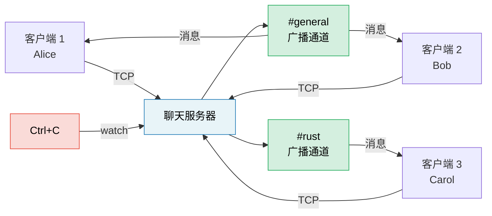

# 综合项目：异步聊天服务器

本项目把全书模式整合进一个接近生产风格的应用。你将使用 Tokio、通道、Stream、优雅关闭和正确错误处理，构建一个**多房间异步聊天服务器**。

**预计用时**：4–6 小时｜**难度**：★★★

> **你将练习：**
> - `tokio::spawn` 与 `'static` 要求（第 8 章）
> - 通道：消息使用 `mpsc`，房间使用 `broadcast`，关闭使用 `watch`（第 8 章）
> - Stream：逐行读取 TCP 连接（第 11 章）
> - 常见陷阱：取消安全性、跨 `.await` 持有 MutexGuard（第 12 章）
> - 生产模式：优雅关闭、背压（第 13 章）
> - 用异步 trait 支持可插拔后端（第 10 章）

## 问题定义

构建一个 TCP 聊天服务器：

1. **客户端**通过 TCP 连接并加入命名房间
2. **消息**扇出给同房间客户端；基础 `broadcast` 方案明确采用尽力而为语义，慢客户端可能丢消息
3. **命令**：`/join <room>`、`/nick <name>`、`/rooms`、`/quit`
4. Ctrl+C 时优雅关闭：停止接收新连接、通知客户端，并在期限内等待所有已跟踪的连接任务



## 第 1 步：基础 TCP 接收循环

先实现一个接受连接并逐行回显的服务器：

```rust
use tokio::io::{AsyncBufReadExt, AsyncWriteExt, BufReader};
use tokio::net::TcpListener;

#[tokio::main]
async fn main() -> anyhow::Result<()> {
    let listener = TcpListener::bind("127.0.0.1:8080").await?;
    println!("Chat server listening on :8080");

    loop {
        let (socket, addr) = listener.accept().await?;
        println!("[{addr}] Connected");

        tokio::spawn(async move {
            let (reader, mut writer) = socket.into_split();
            let mut reader = BufReader::new(reader);
            let mut line = String::new();

            loop {
                line.clear();
                match reader.read_line(&mut line).await {
                    Ok(0) | Err(_) => break,
                    Ok(_) => {
                        let _ = writer.write_all(line.as_bytes()).await;
                    }
                }
            }
            println!("[{addr}] Disconnected");
        });
    }
}
```

**你的任务**：确认代码可编译，并使用 `telnet localhost 8080` 验证。

## 第 2 步：使用 Broadcast 通道管理房间状态

每个房间对应一个 `broadcast::Sender`，活跃客户端通过订阅接收新消息。这是一种有界、尽力而为的扇出：接收者跟不上时可能丢失旧值，并收到 `RecvError::Lagged`。如果产品要求可靠投递或真正对发送者施加背压，应为每个客户端建立有界 `mpsc` 写队列，并明确慢客户端处理策略。

```rust
use std::collections::HashMap;
use std::sync::Arc;
use tokio::sync::{broadcast, RwLock};

type RoomMap = Arc<RwLock<HashMap<String, broadcast::Sender<String>>>>;

fn get_or_create_room(rooms: &mut HashMap<String, broadcast::Sender<String>>, name: &str) -> broadcast::Sender<String> {
    rooms.entry(name.to_string())
        .or_insert_with(|| {
            let (tx, _) = broadcast::channel(100); // 100-message buffer
            tx
        })
        .clone()
}
```

**你的任务**：实现房间状态：
- 客户端最初进入 `#general`
- `/join <room>` 切换房间，取消旧订阅并订阅新房间
- 消息广播给发送者当前房间中的所有客户端

<details>
<summary>💡 提示——客户端任务结构</summary>

每个客户端任务需要同时推进两个事件源：
1. **从 TCP 读取**→解析命令或广播到房间
2. **从 broadcast 接收端读取**→写回 TCP

使用 `tokio::select!` 同时推进两者。这里应优先使用 `lines().next_line()`，因为它在 `select!` 中具有取消安全性；`read_line(&mut String)` 不具有取消安全性：

```rust
let mut lines = BufReader::new(reader).lines();

loop {
    tokio::select! {
        // Client sent us a line
        result = lines.next_line() => {
            match result {
                Ok(None) | Err(_) => break,
                Ok(Some(line)) => {
                    // Parse command or broadcast message
                }
            }
        }
        // Room broadcast received
        result = room_rx.recv() => {
            match result {
                Ok(msg) => {
                    let _ = writer.write_all(msg.as_bytes()).await;
                }
                Err(_) => break,
            }
        }
    }
}
```

</details>

## 第 3 步：命令

实现命令协议：

| 命令 | 行为 |
|---------|--------|
| `/join <room>` | 离开当前房间、加入新房间，并在两边公告 |
| `/nick <name>` | 更改显示名称 |
| `/rooms` | 列出所有活跃房间及成员数 |
| `/quit` | 优雅断开 |
| 其他内容 | 作为聊天消息广播 |

**你的任务**：解析输入行中的命令。处理 `/rooms` 时读取 `RoomMap`，使用 `RwLock::read()`，避免不必要地阻塞其他客户端。

## 第 4 步：优雅关闭

加入 Ctrl+C 处理，使服务器：
1. 停止接受新连接
2. 向所有房间发送“服务器正在关闭……”
3. 把每个客户端的 `JoinHandle` 保存在 `JoinSet`（或 `TaskTracker`）中
4. 在明确的关闭期限内等待连接任务刷新自己的写入缓冲并结束；超过期限后中止剩余任务

```rust
use tokio::sync::watch;

let (shutdown_tx, shutdown_rx) = watch::channel(false);

// In the accept loop:
loop {
    tokio::select! {
        result = listener.accept() => {
            let (socket, addr) = result?;
            // spawn client task with shutdown_rx.clone()
        }
        _ = tokio::signal::ctrl_c() => {
            println!("Shutdown signal received");
            shutdown_tx.send(true)?;
            break;
        }
    }
}
```

**你的任务**：在每个客户端的 `select!` 中加入 `shutdown_rx.changed()`，把所有客户端任务保存在 `JoinSet` 中，并在服务器返回前等待整个集合。仅发送信号后丢弃各个 `JoinHandle` 会让任务脱离管理，并不属于优雅关闭。

## 第 5 步：错误处理与边界情况

增强服务器的生产健壮性：

1. **落后的接收者**：慢客户端错过消息时，`broadcast::recv()` 返回 `RecvError::Lagged(n)`；记录日志并继续，不要崩溃。
2. **昵称验证**：拒绝空昵称和过长昵称。
3. **慢客户端策略**：有界 `broadcast` 缓冲区只限制保留的历史消息数量，**不会**对发送者施加背压。应把 `Lagged` 视为数据丢失；需要真正背压时，改用每客户端一个有界 `mpsc` 队列。
4. **空闲期限**：客户端超过五分钟没有发送输入就断开。应保留一个 `Sleep` Future，并且只在收到客户端输入后重置；不能因为无关的广播分支就绪，就不断重新获得完整超时时间。

```rust
use tokio::time::{sleep, Duration, Instant};

let idle = sleep(Duration::from_secs(300));
tokio::pin!(idle);

loop {
    tokio::select! {
        result = lines.next_line() => {
            match result {
                Ok(Some(line)) => {
                    idle.as_mut().reset(Instant::now() + Duration::from_secs(300));
                    // 处理客户端输入。
                }
                Ok(None) | Err(_) => break,
            }
        }
        result = room_rx.recv() => {
            // 处理消息或 Lagged；房间流量不重置客户端输入空闲期限。
        }
        _ = &mut idle => break,
    }
}
```

## 第 6 步：集成测试

编写测试：启动服务器、连接两个客户端并验证消息投递。

```rust
#[tokio::test]
async fn two_clients_can_chat() {
    let listener = TcpListener::bind("127.0.0.1:0").await.unwrap();
    let addr = listener.local_addr().unwrap();
    let (shutdown_tx, shutdown_rx) = watch::channel(false);

    // 先完成绑定再派生服务器，这样测试能拿到真实地址，也不存在启动竞态。
    let server = tokio::spawn(run_server(listener, shutdown_rx));

    // Connect two clients
    let mut client1 = TcpStream::connect(addr).await.unwrap();
    let mut client2 = TcpStream::connect(addr).await.unwrap();

    // Client 1 sends a message
    client1.write_all(b"Hello from client 1\n").await.unwrap();

    // Client 2 should receive it
    let mut buf = vec![0u8; 1024];
    let n = tokio::time::timeout(Duration::from_secs(1), client2.read(&mut buf))
        .await
        .expect("message delivery timed out")
        .unwrap();
    let msg = String::from_utf8_lossy(&buf[..n]);
    assert!(msg.contains("Hello from client 1"));

    shutdown_tx.send(true).unwrap();
    tokio::time::timeout(Duration::from_secs(1), server)
        .await
        .expect("server did not shut down")
        .unwrap()
        .unwrap();
}
```

## 评价标准

| 标准 | 目标 |
|-----------|--------|
| 并发 | 多房间、多客户端，无阻塞调用 |
| 正确性 | 消息只到达同房间客户端 |
| 优雅关闭 | 停止接收新连接、等待已跟踪客户端，并执行关闭期限 |
| 错误处理 | 处理落后接收者、断开和超时 |
| 代码组织 | 接收循环、客户端任务和房间状态清晰分离 |
| 测试 | 至少 2 个集成测试 |

## 扩展思路

基础聊天服务器完成后，可以尝试：

1. **持久历史**：每个房间保存最近 N 条消息，新成员加入时重放
2. **WebSocket**：使用 `tokio-tungstenite` 同时支持 TCP 与 WebSocket
3. **限流**：使用 `tokio::time::Interval` 限制每位客户端每秒消息数
4. **指标**：通过 `prometheus` 跟踪连接数、每秒消息数和房间数
5. **TLS**：使用 `tokio-rustls` 加密连接

***
