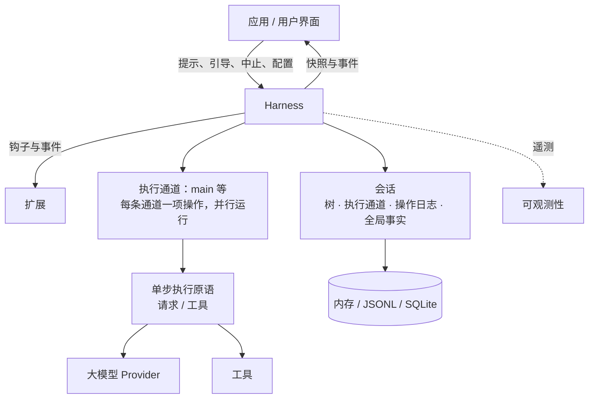
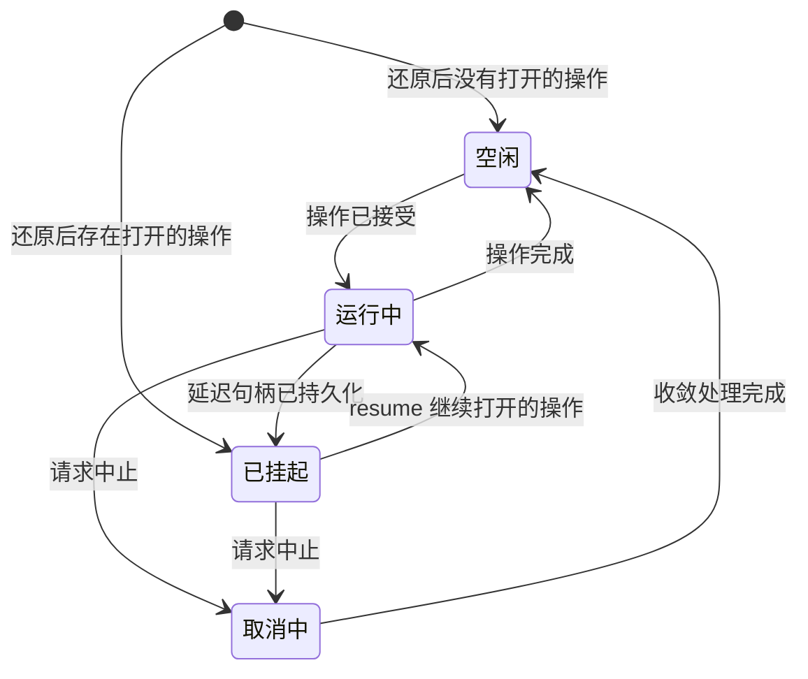

# 可持久恢复的 AgentHarness 设计

> **兼容性策略。** 旧版 coding-agent v3 JSONL 会话必须能够打开，并还原为空闲状态。这是唯一的向后兼容要求。`packages/agent/src/harness` 与 `packages/session-backends/sqlite-node` 中的其他格式和 API（以及各自的测试）都允许发生破坏性变更。除此之外，我们不为任何内容编写迁移、schema 版本管理或格式转换路径。



Harness 针对一个会话执行 run。会话保存四类状态（第 2 节）。多个 lane 在同一个 Harness 内并行执行（第 3 节）。存储后端负责对会话进行编码（第三部分）。

# 第一部分——概念

## 1. 目标

- **可持久恢复的 run。** 一个已经被接受的 prompt 是一项持久化操作。进程崩溃后，新进程会还原会话，并从上一个安全边界恢复执行该 run。崩溃可能产生的每一种状态都必须能够恢复。
- **Lane。** 一个会话包含一个或多个 lane。lane 是对话树中一个有名字的位置。每个 lane 同一时间至多运行一项操作，不同 lane 可以并行运行。某个 run 及其排队消息归接受它的 lane 所有。例如，一个 Slack 频道可视为一个会话，其中每个 thread 是一个 lane。交互式 Pi 只使用一个 lane，因此 UI 不会显式展示这个概念。扩展可以使用完整的 Harness API，包括 lane。例如，subagent 工具可在其父 Agent 会话的第二个 lane 上运行。
- **不存在半成品结果。** 在任何操作——run、压缩或导航——内部发生崩溃后，只允许留下两种状态之一：该操作尚未发生，或者恢复流程能够将它完成。外部不能观察到介于两者之间的状态。
- **Harness API。** 事件（event）只能观察执行过程，不能改变执行；钩子（hook）会拦截执行并可以修改上下文、请求、工具和 run 边界。扩展建立在事件与钩子之上。
- **确定性单步执行。** 每一种副作用——持久化写入、Provider 请求、工具执行、钩子、定时器——都必须经过一个注入的边界。在 `drive: "manual"` 模式下，Harness 会在每个副作用前停驻，由测试逐次调用来推动它：可以停在任意边界、注入输入，或关闭并重新打开以模拟崩溃。生产环境与测试执行的是同一套过程；drive 模式只控制这些边界（第 15 节）。
- **可观测性。** 所有执行过程都可被日志和 tracing 检测，粒度可深入到 Provider 请求与响应的内部。该通道与钩子系统相互独立。
- **UI 模型。** 客户端先获得一份原子快照，随后接收实时事件流。事件不会重放；重新连接意味着获取一份新快照。
- **单写者。** 同一时间只有一个 Harness 写入某个会话，由服务层强制保证。一个会话的所有 lane 都位于这一个 Harness 中。还原时，如果遇到单写者模型不可能产生的状态，就将其视为数据损坏。
- **能够加载 v3 会话。** 旧版 coding-agent v3 JSONL 文件无需改动即可打开，并还原为空闲状态。

## 非目标

- **钩子副作用的恰好一次语义。** 当消费某个钩子结果的记录或条目提交时，该结果才成为持久状态。如果在提交之前崩溃，钩子可能再次运行（见第 11 节的重放表）。钩子自行产生的副作用——例如 HTTP 调用和文件写入——对 Harness 不可见。如果钩子需要外部副作用具备崩溃安全性，就必须实现幂等，例如使用操作 ID 作为幂等键。
- **恢复 Provider 流。** 部分流式响应从不持久化。被中断的流式请求只会重试或放弃。延迟请求不同，它属于设计范围：Provider 立即返回一个 handle，稍后再提供结果（例如 Responses API 的 `background: true` 或批处理 API）。pi-ai 会返回一条停止原因为 `deferred`、并携带该 handle 的 assistant 消息；它和普通 assistant 消息一样被持久化。兑现该 handle 时，会追加一条普通 assistant 消息。恢复流程发现尚未兑现的 handle 后会去获取结果，而不是付费发起一个全新的请求。
- **多写者。** 两个进程同时操作同一会话不在范围内。服务层会把某个会话的全部流量路由到持有其 Harness 的进程。lane 可以承载那些看起来像多写者的工作负载：在共享历史之上的多个并行 thread。
- **复制。** 一个会话只存在于一个位置。无需协调地同步已经产生分歧的副本属于另一套设计；本设计也没有阻止未来增加它。
- **迁移 coding-agent。** 将 coding-agent 迁移到 `AgentHarness` 不在范围内。这里的兼容仅表示新的 JSONL repository 可以读取受支持的 coding-agent v3 文件。

## 2. 会话是什么

会话是一组由四部分构成的持久状态：

1. **树（tree）**——对话本身。条目通过 `parentId` 相连，包括消息、模型/思考级别/工具激活状态的变化、压缩摘要、分支摘要以及自定义条目。树是共享且被动的，不归任何 lane 独占。它只会增长；条目从不修改或删除。
2. **Lane**——工作发生的位置。一个 lane 由名称和叶节点组成，叶节点是后续工作将继续扩展的条目。每个会话都有 `main` lane。应用可以使用外部身份标识（例如 Slack thread ID、邮件 thread ID）作为键创建更多 lane。
3. **Lane 操作日志**——记录已经发生和必须继续发生的事情。每个 lane 都有一条扁平、按时间排序的记录序列，例如：操作已开始、已尝试 step、工具已启动、消息已入队、操作已完成。持久恢复能力在这里实现：这些记录使新进程能在崩溃后继续 lane 的工作。正常执行时不需要读取它们。
4. **全局事实（global facts）**——会话范围内“最新写入获胜”的值，例如会话名称和条目标签。它们不属于对话树，按只追加历史保存，读取者看到最新值。

这四部分的所有写入共享同一个单调递增序列号。该序列既用于排列全局事实的历史，也让 lane 操作日志能够引用树中的位置。

```text
tree (shared, append-only)          lanes
a ── b ── c ── d                    main            → d   (op log: …)
      └── e ── f                    slack:171943…   → f   (op log: …)

global facts: name = "Refactor auth", label(b) = "checkpoint-1"
```

### 主动与被动

树和全局事实是被动数据：它们由各方共享，任何组件都可以读取。

lane 是主动的。它拥有自己的叶节点、操作日志（至多一项打开的操作）、队列以及待处理写入。两个 lane 绝不共享这些内容。lane 的每个动作，要么生成链接到其叶节点的新条目，要么在自己的操作日志中生成记录。

### 不变量

- 树只包含对话。lane 状态、编排状态和指针都不能放进树中。
- 条目的父链永不改变。不同分支共享前缀，不复制内容。
- lane 的叶节点只有两种移动方式：lane 追加条目（该条目成为新叶节点），或者 lane 执行导航（叶节点跳到已有条目）。
- 操作日志记录绝不影响树。即使删除全部操作日志，剩下的仍是一段完整、有效的对话。
- 每个 lane 至多打开一项操作。如果同一 lane 同时存在两项打开的操作，说明数据已损坏。
- 条目可以共享，记录不能共享。两个 lane 的路径上可以出现同一条目；一条记录只属于一个 lane。

记录不是树条目，因为记录描述的是执行过程，而不是对话。它绝不能进入模型上下文、transcript、分支查询或 fork；而且在一个 lane 内，记录的先后顺序本身就表达了含义，增加父链接没有价值。

## 3. Lane

lane 是树中一个有名字的位置，加上在该位置串行执行的工作。最接近的现有概念，是在独立 worktree 中 checkout 的 Git 分支：名称附着于某个位置；新工作会使它前进；它可以移动到任意条目而不改写历史；同一个 lane 也不会被同时 checkout 两次。与 Git 直觉不同的一点是，导航可以把 lane 移到任意条目，并非只能向前移动。

每个会话都有 `main` lane。应用可以用一个名称和锚点条目创建其他 lane。lane 名称是永久性的应用键，例如 Slack thread ID 或邮件 thread ID。UI 不会抽象地列出所有 lane；平台自己的 UI（例如 thread 列表）就承担了这一角色。

一个 lane 拥有：

- **自己的叶节点。** 新条目链接到它，并推动它前进；导航则让它跳转。
- **自己的操作日志。** 至多有一项打开的操作。向繁忙 lane 提交第二项操作会被拒绝，不影响其他 lane。
- **自己的队列。** steering、follow-up 和 next-run 消息都以一个 lane 为目标。
- **自己的配置视图。** 模型、思考级别和已激活工具，都由 lane 叶节点之前路径上的条目决定。两个 lane 可以使用不同模型，彼此无需感知。工具实现、资源和流选项属于整个 Harness；只有工具是否激活是每个 lane 独立的。

规则如下：

- 不同 lane 并行运行操作。Harness 仍是唯一写者；各 lane 的记录和条目会交错进入共享序列。
- 创建 lane 不会复制任何内容。lane 不会被删除或重命名。
- 一个 lane 上依赖状态的变更，会在该 lane 的 mutation line（变更串行线）上线性化：校验、至多一次持久化写入以及内存状态更新，必须全部完成后才能开始下一个变更（第 15 节）。Provider、工具、钩子和重试工作绝不占用 mutation line。
- 位于同一叶节点的两个 lane，会在下一次追加时分叉。树天然处理这种情况，不需要任何协调。
- 如果某个 lane 有未完成操作，它会独立于其他 lane 被还原为 suspended（已挂起）状态。挂起原因可能是崩溃，也可能是延迟 Provider 请求（第 1 节）。

## 4. 工作如何执行

### 操作

操作是 lane 上可持久恢复的工作单元，共有三种：

- **Run**——从一个已接受的 prompt 开始，包括全部自动后续过程：工具调用、steering、follow-up 和自动压缩。在没有任何待处理工作时结束。
- **压缩（compaction）**——用一个摘要条目替换旧上下文。
- **导航（navigation）**——把 lane 的叶节点移到已有条目，并可选择生成分支摘要。

操作在真正执行之前先被接受。接受本身是持久化的：发生崩溃后，已经接受的操作要么由恢复流程完成，要么被明确关闭。每个已接受的 run 最终都以 `completed`、`failed` 或 `aborted`（被 abort 停止）结束。压缩和导航还可能以 `declined` 结束：它们的决策钩子在产生副作用之前否决了这项已接受的结构性操作。

### Run、turn 与 step

一个 run 是一系列 turn。一个 turn 由一次 assistant step，以及该 assistant 消息请求的完整工具批次组成。

step 是操作内部可重试的工作单元，例如生成 assistant 消息、压缩摘要或分支摘要。一次 step 可以发起零个、一个或多个 Provider 请求。一次 attempt 失败后会重试同一个 step；attempt 次数会持久化，并跨进程重启保留。延迟 Provider 请求会结束当前 assistant step：handle 位于一条已持久化的 assistant 消息中，该消息闭合此 step；操作随后挂起，稍后兑现 handle 时再追加真正结果（第 1 节）。

每个真正启动副作用的工具调用同样是一个 step。`tool_started` 将它打开，工具结果条目将它闭合。并行批次可以同时持有多个打开的工具 step；这些副作用并发执行，但按照它们在原消息中的顺序完成持久化（第 14 节）。

### 队列与延迟写入

有两种机制可以向正在运行的 lane 传入输入，它们在 abort 时的行为不同：

- **队列**承载对话意图：`steer` 修正当前工作，`followUp` 添加模型原本准备停止后再做的工作，`nextRun` 为 lane 的下一次 run 提供初始消息。abort 会丢弃 steering 与 follow-up，并把它们的 payload 返回调用者；next-run 消息会保留下来。
- **延迟写入**承载事实：某个 step 执行期间请求写入的条目或配置变更。它们能跨越 abort 存活，即使处于取消流程中也会应用。

两者在接受时都立即成为持久状态：接受调用先把包含完整 payload 的记录写入 lane 操作日志，然后才 resolve。对应树条目会等到项目被应用或消费时再写入——也就是模型第一次能看到它的位置。如果进程在接受和树写入之间崩溃，恢复流程会读取记录并完成追加。已经接受的输入绝不会丢失。

### 检查点

每两个 turn 之间，lane 会经过一个检查点：

1. 应用待处理的延迟写入。
2. 消费队列中的 steering 消息。
3. 如果下一个请求放不进上下文，则执行压缩。

压缩也有一个被动触发条件：Provider 响应表明请求实际没有放入上下文，例如 overflow 形式的错误，或在低于预期输出上限时以 `length` 停止。该响应会被丢弃，run 随后压缩并重试一次（第 6 节“assistant step 的上下文溢出”）。

带有工具调用的 turn 会强制再运行一个 turn，使模型看到工具结果。唯一例外是：如果一个批次中每个最终工具结果都持久化了 `terminate: true`，则抑制自动工具续跑；但 steering 或 follow-up 输入仍可开启新的 turn。只有工具续跑和 steering 都已处理完，才消费 follow-up 消息。当检查点发现没有待处理内容时，run 结束。

### 只在尾部追加的上下文

> 在一个 lane 的连续请求之间，Provider 上下文只能从尾部增长。如果在上次请求尾部之前插入内容，Provider 的 KV cache 会从插入点起失效，从而成倍增加 token 成本。

这项不变量解释了为何 turn 中途发生的写入要延迟到检查点：检查点总是在尾部追加。压缩是唯一有意设计的例外；它用一次完整的缓存失效换取更短的上下文。

### Lane 生命周期



- 状态以 lane 为单位。唯一例外是存储写入失败会使整个 Harness 进入 faulted 状态。处于 faulted 状态的 Harness 会停止所有副作用并拒绝所有调用；问题修复后，重新打开会从记录中还原每个 lane。
- **Suspended（已挂起）**表示一项操作仍然打开，但当前没有任何执行。它可能来自崩溃后的还原，也可能是在延迟 handle 持久化后主动进入。`resume()` 继续该操作；`abort()` 不执行后续正常工作，直接将它关闭。
- **Abort（中止）**先把取消请求持久化、通知正在运行的副作用，然后返回。随后执行收敛处理：尚未解决的工具调用获得合成结果，transcript 得到一条结束用的 assistant 消息。自动 drive 在后台运行收敛流程；手动 drive 则让它停驻在下一个动作之前。

### 恢复执行

Resume 会继续一项已打开的操作，绝不会启动新操作。具体入口由记录结束的位置决定：重试未完成的 step、兑现延迟 handle、收敛处理完成了一半的工具批次，或从下一个检查点继续。崩溃之前已经接受的队列消息和延迟写入仍处于待处理状态，并会按正常规则应用。

# 第二部分——如何记录执行过程

第二部分与具体后端无关。它定义 lane 写入哪些记录、何时写入，以及恢复流程如何读回这些记录。第三部分再把这些规则映射到 API 和存储实现。

## 5. 记录

### 持久化规则

> 在产生副作用之前：先写一条意图记录，说明将发生什么，以及它会产生哪些 ID。副作用完成后：使用完全相同的 ID，把结果追加为一个条目。

这里没有跨多条记录的原子性，也不需要。每条记录和每个条目都能独立持久化。若在意图与结果之间崩溃，意图会处于未履行状态；恢复流程根据意图类型决定补完、重试，还是用合成结果将其关闭。当且仅当带有预分配 ID 的条目存在时，意图才算履行。条目本身还可以指向下一种持久状态：例如 `stopReason: "deferred"` 的 assistant 条目履行本次 attempt 预分配的追加并闭合 step；此时尚未结束的是操作，已持久化的 handle 等待兑现（第 6 节）。如果预分配 ID 已存在，但内容不同，则属于数据损坏。

### 预分配 ID

意图记录会携带尚不存在的条目 ID：

```ts
/** An entry payload with its id pre-allocated. parentId, seq, and timestamp
    are assigned by storage when the entry is appended: it chains to the
    lane's then-current leaf. */
type ProvisionedEntry<T extends Entry = Entry> =
  T extends Entry ? Omit<T, "parentId" | "seq" | "timestamp"> : never;
```

### 记录目录

每条记录都属于某个 lane 的操作日志。属于操作的记录携带 `runId`，它等于该操作 `operation_started` 记录的 ID。next-run 队列记录（`queue_enqueued` 及相应的 `queue_cancelled`）和独立的 `adjustment` 用量记录不带 `runId`。

```ts
interface RecordBase {
  id: string;
  seq: number;            // shared sequence, section 2
  lane: string;
  timestamp: number;      // Unix ms
}

interface OperationStartedRecord extends RecordBase {
  type: "operation_started";
  sourceLeafId: string | null;
  intent:
    | {
        kind: "run";
        originalPrompt: AgentMessage[];
        initialMessages: ProvisionedEntry[];
        systemPromptOverride?: string;
        resumeData?: Record<string, JsonValue>;
      }
    | {
        kind: "compaction";
        customInstructions?: string;
        resultEntryId: string;
      }
    | {
        kind: "navigation";
        targetId: string | null;
        summarize: boolean;
        customInstructions?: string;
        label?: string;
        summaryEntryId?: string;
      };
}

interface AbortRequestedRecord extends RecordBase {
  type: "abort_requested";
  runId: string;
}

interface OperationFinishedRecord extends RecordBase {
  type: "operation_finished";
  runId: string;
  outcome: "completed" | "aborted" | "failed" | "declined";
  error?: { code: string; message: string };
}

interface StepAttemptRecord extends RecordBase {
  type: "step_attempt";
  runId: string;
  step: "assistant" | "compaction" | "branch_summary";
  attempt: number;
  resultEntryId: string;
  compactionReason?: "manual" | "threshold" | "overflow";
}

interface ToolStartedRecord extends RecordBase {
  type: "tool_started";
  runId: string;
  assistantEntryId: string;
  toolIndex: number;
  toolCallId: string;
  toolName: string;
  effectiveArgs: Record<string, unknown>;
  resultEntryId: string;
  replay: "never" | "safe";
}

interface QueueEnqueuedRecord extends RecordBase {
  type: "queue_enqueued";
  queue: "steer" | "followUp" | "nextRun";
  runId?: string;
  target: ProvisionedEntry;
}

interface QueueCancelledRecord extends RecordBase {
  type: "queue_cancelled";
  runId?: string;
  entryId: string;
}

interface WriteDeferredRecord extends RecordBase {
  type: "write_deferred";
  runId: string;
  target: ProvisionedEntry;
}

type UsageRecord = RecordBase & { type: "usage"; usage: Usage } & (
  | { cause: "assistant" | "compaction" | "branch_summary" | "deferred_fetch";
      runId: string; entryId: string; attempt: number; stopReason: TerminalStopReason }
  | { cause: "tool"; runId: string; entryId: string; toolCallId: string }
  | { cause: "hook"; runId: string; entryId: string }
  | { cause: "adjustment"; runId?: string; entryId?: string; details?: JsonValue }
);

type LaneRecord = OperationStartedRecord | AbortRequestedRecord | OperationFinishedRecord
  | StepAttemptRecord | ToolStartedRecord | QueueEnqueuedRecord | QueueCancelledRecord
  | WriteDeferredRecord | UsageRecord;

type NewRecord<T extends LaneRecord = LaneRecord> =
  T extends LaneRecord ? Omit<T, "seq" | "timestamp"> : never;
```

上面代码的关键含义如下：

- `operation_started` 是接受操作的持久化边界，其 ID 同时就是整个操作的 `runId`。接受前已经确定的 prompt、next-run 消息、系统提示词覆盖、恢复数据或结构操作目标都存入其中。
- `abort_requested` 是取消请求标记，不是终态；之后仍需执行收敛处理，并用结果为 `aborted` 的 `operation_finished` 关闭操作。
- 每次可重试 step 开始前都写 `step_attempt`。持久化的次数阻止“崩溃—重启”循环把重试计数清零。assistant 的每次 attempt 使用新结果 ID；同一个结构性 step 的所有 attempt 复用一个结果 ID。
- `tool_started` 在 `before_tool` 与参数校验通过后、真正执行工具前写入。`assistantEntryId + toolIndex` 是稳定调用身份。只有记录中的 replay 策略与当前工具声明都为 `safe`，恢复流程才会重新执行未完成调用。
- `queue_enqueued` 保存完整 payload；真正的树条目等到消费点才出现。`queue_cancelled` 让尚未消费的项目持久化撤回，否则崩溃会使它“复活”。
- `write_deferred` 接受 step 执行期间请求的条目或配置变更，并在下一个检查点应用。
- `usage` 是纯成本账本。无论响应最后成功、失败、重试或被丢弃，只要报告或调整了用量就写入。reduction、恢复和有效性检查都不读取它，因此它不会增加恢复状态。

被拦截或无效的工具调用不写 `tool_started`。因为副作用没有启动，不需要意图记录；拦截结果直接以 `isError: true` 的工具结果条目持久化，正文包含拦截原因。如果在写该条目前崩溃，只会丢失本次决策；恢复后，对既无 `tool_started` 也无结果的调用重新运行 `before_tool`。

工具 step 不需要单独的 outcome 记录。工具结果条目就是完整的持久化结果，其中也包含批次控制决定 `terminate`（第 12 节）。如果工具已执行、但结果条目前崩溃，就遵循第 6 节的重放策略；重新完成结果时会再次运行 `after_tool`，这正是第 1 节非目标允许的行为。

成本是唯一需要结果记录的关注点：**成本是否持久化，不能取决于结果是否持久化。** 可重试 step 本来就可能产生永远不会成为条目的响应，例如失败 attempt、耗尽的重试序列、被丢弃的溢出响应；它们产生的费用不能随之消失。因此每个 Provider 请求一旦 settle，必须在分类、决定重试或丢弃之前先写 `usage`。工具与钩子报告的用量也在相邻位置记录；应用可用 `adjustment` 补充 Harness 无法观察的费用。

Harness 写入的 `usage` 总把 `entryId` 绑定到对应结果的预分配 ID；该条目最终是否存在是另一回事。三层含义严格分开：条目的 `usage` 字段是创建它的响应所带的**不可变快照**，只在追加时写一次；**条目的有效成本**是读取时把所有 lane 中绑定该 ID 的基础记录和调整记录求和；**会话成本**则是全部 `usage` 记录之和。恢复可以诚实地计费两次：重试 step 或安全重放工具时，每次真实执行各写一条记录。

### 有效性

遇到以下情况，恢复流程必须认定 lane 日志已损坏：

- 同时打开了多于一项操作；
- 记录引用不存在的操作，或出现在该操作结束之后；
- 同一 step 内 attempt 编号不连续；
- 压缩 attempt 缺少 `compactionReason`，或其他 step 类型错误地携带它；
- 某个 run 的 steer/follow-up `queue_enqueued` 出现在其 `abort_requested` 之后；
- `queue_cancelled` 指向没有对应 `queue_enqueued` 的 ID，或指向条目已存在的项目；
- 同一结构性 step 的 attempt 对 `resultEntryId` 或 `compactionReason` 意见不一致；
- `tool_started.toolIndex` 无法在原始 assistant 条目中定位保存的 `toolCallId` 和 `toolName`；
- 两条 `tool_started` 记录使用同一调用身份；
- 预分配 ID 已存在，但内容不同。

## 6. 每种动作会写入什么

以下是存储层级的执行轨迹，均只展示一个 lane。图例：

```text
E   追加到树的条目（链接到 lane 叶节点）
R   追加到 lane 操作日志的记录
L   lane 指针移动
G   写入全局事实
H   被 await 的钩子
X   可能的崩溃点
```

### 包含一次工具调用的 run

```text
    prompt("fix the bug")
H   before_run
R   operation_started
E   user message
R   step_attempt
E   assistant message [tool call]
H   before_tool
R   tool_started
H   after_tool
E   tool result
R   step_attempt
E   assistant message "done"
H   before_run_end
R   operation_finished
```

任意两行之间发生崩溃都能恢复。一般规则是：没有结果条目的意图，由恢复流程补完、重试或用合成结果关闭；不存在“有结果条目、却没有相应已消费意图”的状态。

### 重试

```text
R   step_attempt                      attempt 1
    request fails
R   usage                             失败 attempt 的成本不会丢失
R   step_attempt                      attempt 2，次数已持久化
R   usage
E   assistant message
```

每个 Provider 请求 settle 后都写 `usage`；其他轨迹为简洁省略了它。每请求钩子 `transform_context`、`before_request`、`after_response` 在每次请求内部执行，Tier B 测试会记录它们（第 19 节）。

在 backoff 期间崩溃时，还原会读到已经使用两次 attempt，恢复执行从第三次开始，计数永不清零。上限内的可重试错误不会追加为条目。重试耗尽或遇到不可重试终止错误时，先追加包含错误的 assistant 消息，再以 failed 写 `operation_finished`。错误条目是终止失败标记；恢复流程发现它后，会排空已接受写入和队列输入。除非消费 steering 或 follow-up 启动了新工作，否则以 failed 关闭 run。最新自有消息是 step 产生错误的 run，恢复流程绝不能把它判为 completed。

### Assistant step 的上下文溢出

`length` 具有歧义：生成可能达到预期输出上限，此时压缩无济于事；也可能撞到更小的上下文或 Provider 限制，此时压缩能够解决。判断方法是把实际输出用量（包含 reasoning token）与**预期输出上限**比较：

```ts
function isRecoverableLength(message: AssistantMessage, desiredMaxOutput: number): boolean {
  if (message.stopReason !== "length") return false;
  if (desiredMaxOutput > 0 && message.usage.output >= desiredMaxOutput) return false;
  return true;
}
```

若调用者设置了 `maxTokens`，`desiredMaxOutput` 就取它，否则取 `model.maxTokens`；关键是使用上下文 clamp **之前**的意图值。不能拿实际发送值作参照：有些 Provider 直接拒绝显式输出上限（OpenAI Codex 后端对 `max_output_tokens` 返回 HTTP 400），Pi 也会把其他 Provider 的值 clamp 到剩余上下文。这个规则无需上下文百分比启发式，就能覆盖：128k 意图下因上下文 clamp 只生成 16 个 reasoning token（可恢复）、小米/Qwen 风格零输出 `length`（可恢复）、显式 1024 上限全部用尽（真实停止）。匹配溢出模式的 Provider 拒绝，以及 prompt 已超窗口却静默成功的情况，也走同一分类和路径。

可恢复响应会被**丢弃**，和可重试错误一样从不成为条目。因此无论实时重试还是崩溃后重试，都无需从上下文中清除它。其预分配结果 ID 保持未履行，而成本已由 settle 时写入的 `usage` 持久化。

每份对话输入最多触发一次溢出恢复：只有当前 run 最新已消费的 prompt、steering 或 follow-up 之后，没有更新的 overflow 压缩 attempt 时，才能开始一次 overflow 压缩。同一窗口内第二次出现可恢复响应，会写放弃错误条目并通过 drain 路径让 run 失败。`length` 本身不会重置防护，只有新消费的对话输入会。`before_compaction` 拒绝，或 overflow 原因的压缩准备为空，同样属于终止失败。钩子直接提供的 overflow 摘要也要先写压缩 `step_attempt`，以便防护规则把它计入。

| 崩溃发生在 | 持久状态 | 恢复行为 |
|---|---|---|
| assistant 的 `step_attempt` 后 | 未完成的 assistant step | 重试；新的可恢复响应仍实时分类 |
| overflow 压缩的 `step_attempt` 后 | 未完成的压缩 step | 使用已记录原因恢复该 step |
| 压缩条目后 | 条目已闭合 step | 从检查点路径继续，创建新的 assistant step |

真正达到预期上限的 `length` 响应会正常追加。若包含工具调用，则不执行工具并让整个截断批次失败；否则 run 进入正常结束流程。面向用户的文案应保持中性：“响应在完成前被截断”，而不是断言触及了配置上限。

### 工具执行期间的 steering

steer 在调用者看到 `queue_enqueued` 持久化后才算接受。若此前崩溃，steer 从未发生且 promise 不会 resolve；若此后崩溃，恢复流程会发现尚无条目的队列记录，并在检查点原本应消费的位置追加。`cancelQueued` 通过 `queue_cancelled` 持久撤回未消费项目。取消与消费都在 lane mutation line 上，因此只有 `[cancel, consume]` 或 `[consume, cancel]` 两种历史。

### 结束边界上的输入

同一 lane 的决定统一由 mutation line 排序。最后一次待办检查与终止记录追加构成同一个 `tryFinishRun` 变更，因此并发 steer 只有两种历史：要么先入队、run 继续；要么 run 先完成，steer 返回 `NoActiveRun`。

延迟写入与 abort 使用同一排序。结束前接受的延迟写入必须先应用，run 才能关闭；结束后接受时看到的是空闲 lane，直接追加。结束前的 `abort_requested` 选择中止收敛；结束后的 abort 返回 `NoActiveOperation`。不存在第三种历史。

### Turn 中途的延迟写入

请求进行时调用 `session.appendMessage(M)` 会先写 `write_deferred`。Provider 随后返回 A，形成缓存上下文 `[.., U, A]`；检查点再把 M 追加到尾部。若直接插入 M，会得到 `[.., U, M, A]`：不仅让 KV cache 从 M 起失效，还会让 transcript 错误声称 A 看过 M。检查点同时避免了这两个问题。

### 工具执行期间 abort

`abort()` resolve 时 `abort_requested` 已持久化，steer/follow-up 队列被清空并把 payload 返回调用者。工具结果可能是真实完成结果，也可能是合成的 `interrupted`；随后追加停止原因为 aborted 的结束 assistant 消息，最后写 `operation_finished`。即使在 `abort_requested` 后崩溃，恢复流程也会完成同一收敛。待处理延迟写入仍会应用，steer/follow-up 不会。

### 工具执行的崩溃点

| 崩溃点 | 持久状态 | 恢复行为 |
|---|---|---|
| X1、X2：`before_tool` 前或决策后尚未写入 | 无记录、无结果 | 走完整正常路径，`before_tool` 可能再次运行 |
| X3、X4：工具执行或 `after_tool` 中断 | 有 `tool_started`、无结果 | 记录与当前声明都为 `safe` 时，用持久化参数重执行并对新结果运行 `after_tool`；否则写合成 `interrupted` 结果且不运行钩子 |
| X5：结果已持久化 | 结果条目存在 | 跳过该调用，处理下一调用 |

收敛流程按原始顺序分别判断批次中的每个调用，之后 step 正常结束。

### 检查点自动压缩

工具结果结束 step 后，如果下一请求放不下，运行 `before_compaction`；它可拒绝或直接提供摘要。非钩子摘要写压缩 `step_attempt`，随后追加压缩条目，再启动新的 assistant step。自动压缩没有 `operation_started`，因为它属于当前 run；手动 `compact()` 才是一项独立操作。

### 导航

导航先在意图中保存目标、可选摘要 ID 与标签；钩子或模型在内存中生成摘要；然后先持久化移动 lane，再在目标分支追加摘要、写标签并完成操作。先提交移动，确保之后每次写入都有持久状态可链接。系统不需要多对象原子写。

接受阶段拒绝 `target === sourceLeafId`，因此“移动是否已经发生”始终可以判断：当且仅当 lane 叶节点等于 `intent.targetId` 时，移动已提交。

| 崩溃发生在 | 恢复看到 | 动作 |
|---|---|---|
| `operation_started` 后 | 叶节点仍为 `sourceLeafId` | 重跑钩子或摘要 step，再移动 |
| 摘要已生成但仅在内存 | 没有持久化文本 | 在相同 attempt 上限内重新生成 |
| lane 移动后 | 叶节点为 `intent.targetId` | 若缺少 `summaryEntryId` 则追加摘要 |
| 摘要条目后 | 条目存在 | 设置标签并完成 |
| 标签后 | 事实已幂等设置 | 完成 |

在移动与 `operation_finished` 之间，读取者会看到 lane 已位于目标，但导航仍打开。这是可恢复状态，不是无效状态；每个 lane 一次只能有一项操作，已保证期间不会运行其他工作。

### 延迟 Provider 请求

延迟请求先写 assistant step attempt，再把停止原因为 `deferred` 且携带 handle 的 assistant 消息持久化，lane 随即挂起。数小时后，甚至换一个进程，`resume()` 发现 lane 路径最新条目是没有后继的 deferred assistant 消息，于是使用条目中的模型与 handle 调用 `fetchDeferred`，再追加真正结果。

存储中，主动挂起的 lane 与崩溃 lane 没有区别：都是一项打开的操作，其最新条目是没有后继的 deferred assistant 消息。还原将它列为 suspended。兑现不写意图记录，因为它不启动新的模型工作；已经提交的后继条目足以阻止重复 fetch。

每次 `resume()` 只 fetch 一次，结果有三种：

- **pending**：Provider 再次返回 `deferred`。除可能的 `usage` 外不写任何内容，lane 重新挂起；轮询频率由应用决定。
- **ready**：得到普通 assistant 消息，追加为后继并正常继续 run。
- **terminal**：Provider 返回 `error`（过期、未知、已消费），或 fetch 自身拒绝。Harness 把拒绝转成同样的错误消息形式，追加消息并让 run 失败。兑现失败绝不自动启动替代请求；本 run 已接受的 steering/follow-up 仍可能开启后续 turn。

对 suspended lane 调用 `abort()` 时，先写 `abort_requested`，尽力让 Provider 取消 handle，然后正常收敛并以 aborted 完成。deferred 条目保留在 transcript 中。它只携带 handle 而没有正文，因此投影到 Provider 上下文时不产生任何内容。

## 7. 恢复

### 还原

打开会话时，每个 lane 独立还原。还原只读取，不追加，也不启动副作用。

恢复从索引发现开始，而不是扫描完整日志：

1. `findOpenOperations(lane, { limit: 2 })` 以最新优先返回未完成的 `operation_started`。零条表示 idle，一条表示 suspended，两条表示数据损坏。后端必须根据重放或索引后的操作状态回答，调用方不能只查看最新 start 来推断。
2. 对 idle lane，一次索引查询找到最新 run 类型的 `operation_started`，再查询其后的 `queue_enqueued` / `queue_cancelled` 来重建待处理 `nextRun`。若从未有 run，则同样的类型过滤查询只读取 run 前队列状态，不扫描无关用量调整。
3. 对 suspended lane，打开的操作限定两段有界读取：从该 `operation_started` 起的本 lane 记录，以及从 lane 叶节点回到操作锚点 `sourceLeafId` 的本 lane 自有条目。后者正好就是该操作追加的条目。

reduction 还可对预分配条目 ID 做点查询，并在操作锚点进行有界分支查询，以确定有效模型、思考级别和已激活工具。这些都是索引查找，不是额外历史扫描。任何扫描都受当前打开操作或仍相关的 idle 队列限制，不随总会话历史或其他 lane 流量增长。

idle lane 唯一剩余状态是待处理 next-run 队列。next-run 可随时入队，但只有接受 run 才消费；压缩和导航会略过它。待处理项目是最新 run 类型 `operation_started` 之后、预分配条目尚不存在且没有被 `queue_cancelled` 撤回的 `queue_enqueued`。某次 run 已捕获的项目会列在意图 `initialMessages` 中；若捕获后尚未追加，由该 run 的恢复补完，绝不会再交给下一次 run。

### Reduction（状态归约）

根据上述两段读取，可以归约出 lane 状态：

- **正在 abort**：存在 `abort_requested`。
- **已用 attempt**：最新 `step_attempt` 的 `resultEntryId` 若无对应条目，就是未完成 step；`attempt` 是持久次数，step 类型和 `compactionReason` 决定恢复路径。闭合通过点查询判断，而不是相邻关系推断。
- **已使用溢出恢复**：原因是 overflow 的压缩 attempt，比本 run 最新已消费对话消息更新。
- **工具批次**：将最新带工具调用的 assistant 条目逐项匹配 `tool_started` 与结果条目。保留 assistant 停止原因；`length` 批次属于截断，恢复时绝不执行。结果条目中的 `terminate` 决定完成批次后是否强制再开 turn。
- **延迟 handle**：最新自有条目是没有后继的 deferred assistant 消息。
- **最新自有条目**：供 `needsAssistant()`、终止失败和 abort 闭合等纯谓词读取。
- **待处理队列项目**：预分配条目不存在、未取消，且未被本 run 的 abort 杀死的记录。
- **待处理写入**：预分配条目不存在的 `write_deferred`。
- **缺失初始消息**：run 意图中尚无条目的预分配 ID。
- **结构性目标**：判断压缩或导航的预分配结果条目是否存在。

实时执行使用完全相同的规则：Harness 每次写入后更新内存状态，还原则从存储重新归约。状态由记录的 reduction 定义，因此两者不可能产生不同结论。`usage` 在这里不可见，因为它只负责记账，不参与编排。

### 恢复执行

`resume()` 根据 reduction 继续已打开操作：

- 缺失初始消息：追加它们，即使已经进入 abort，也不能丢失已接受输入。
- 正在 abort：补合成工具结果、结束 assistant 消息，并以 aborted 写 `operation_finished`。
- 未解决工具批次：逐调用跳过、重执行或合成。
- 延迟 handle：兑现它。
- 终止失败：若最新自有消息是 step 产生的 assistant 错误，先应用已接受写入并消费队列对话输入；若没有新工作启动，则以 failed 完成。恢复绝不把这种 run 变成 completed。
- 未完成 step：先继续同一个 step，再消费新的检查点输入；未到上限则开始下一 attempt，否则让操作失败。压缩 step 使用已记录的 `compactionReason`。
- 其他状态：进入下一个检查点，正常应用待处理写入和队列项目。

恢复追加与普通追加相同，唯一额外规则是跳过已经存在的预分配 ID。因此恢复期间再次崩溃，只会留下更少的待恢复内容，重复运行始终安全。未知副作用只有在策略允许时才重复：可重试 step 开始新的持久 attempt；工具只有在记录与当前声明都为 `safe` 时重放。被中断的钩子遵循第 11 节重放表。

旧 v3 会话没有记录，因此所有 lane 查询都回答 idle。第 12 节的 normalization 会让 `main` 指向最终保留的逻辑条目；被丢弃的事实类条目通过最近保留祖先重新解析。

# 第三部分——API 与实现

## 8. 公共 API

### Lane 接口

`AgentLane` 是单个 lane 的操作接口。`AgentHarness` 自身为 `main` 实现它，因此 `harness.prompt(...)` 就是 main lane 的 prompt。除 `name` 和监听器注册（`hooks.on`、`events.on`）外，每个方法都是异步的，即便进程内实现可以直接从内存返回 getter。原因是同一接口必须能由远程代理实现，不能在签名层承诺只有本地实现才具备的同步性。服务器会通过自身传输桥接事件，而不是桥接监听器注册动作。

Lane API 包含以下能力：

- 操作：`prompt`、`skill`、`promptFromTemplate`、`compact`、`navigateTree`、`resume`、`abort`。它们返回显式结果，预期拒绝不通过 throw 表达；同一 lane 至多一项操作。
- 队列：`steer`、`followUp`、`nextRun`、`cancelQueued`。resolve 时队列记录已持久化，返回的 `entryId` 在消费前唯一标识项目。steer/follow-up 要求有活动 run；next-run 与取消可以随时调用。
- 配置：模型、思考级别和已激活工具的读写，以及 `recordUsage`。写入遵守 lane view 的延迟写入规则。
- 生命周期：`waitForIdle`、`runWhenIdle`、快照监听，以及手动 drive 的 `peekAction`、`executeAction`、`runToCompletion`。

所有 prompt 重载最终标准化为 `AgentMessage[]`。文本加图片变成一条 user 消息；消息数组校验后保持顺序。skill 与模板先展开，再保存标准化结果。该数组写入 `OperationStartedRecord.intent.originalPrompt`，不包含被捕获的 `nextRun` 项目和钩子注入。

### Harness

Harness 管理会话范围资源与 lane：获取/创建 lane、列出 lane、观察全会话状态、访问钩子和事件、获取 suspended 操作、等待全部 idle，以及关闭。`main` lane 的方法直接暴露在 Harness 自身。不同名称多次取得的 facade 在语义上等价，但每个 facade 仍绑定同一个 lane 状态。

### 选项

创建 Harness 时注入会话、模型 dispatch、系统提示词、工具、skill/template、重试与压缩配置、stream 选项、entry projector、钩子/事件、telemetry context 和 drive 模式。动态回调在规定边界重新求值；某次 run 若被 `before_run` 覆盖系统提示词，则该覆盖在整个 run 内固定。工具实现与资源是 Harness 级共享，工具激活状态由每个 lane 路径决定。

### 结果与带标签错误

公共 API 内置 `better-result` v3 模式的一个很小子集，`packages/agent` 不增加对 `better-result` 的运行时依赖。只包含：可序列化 `Result.ok()` / `Result.err()`、对应类型守卫、具有字面量 `_tag` 和只读 payload 的 `TaggedError`，以及穷尽式 `matchError()`。不加入映射组合子、generator 组合、Promise 包装器、重试/集合 helper 或 `Panic` 类；Promise 仍是异步边界，真正缺陷用原生 throw/reject 的 `HarnessFault` 表达。

每种预期拒绝各有一个类，tag 为字符串字面量，字段携带调用者需要的数据：

| 类 | `message` 之外的 payload |
|---|---|
| `Busy` | `lane`、`operation` |
| `NoActiveRun` | `lane` |
| `NoActiveOperation` | `lane` |
| `NothingToResume` | `lane` |
| `InvalidMessage` | `lane`、`reason` |
| `UnknownSkill` | `name` |
| `UnknownTemplate` | `name` |
| `UnknownTarget` | `targetId` |
| `UnknownQueueItem` | `lane`、`entryId` |
| `LaneExists` | `lane` |
| `InvalidLane` | `lane`、`reason` |
| `NothingToCompact` | `lane` |
| `Closed` | 无 |

传输层把错误序列化成 `{ _tag, message, ...payload }`，并在代理边界重建类。增加拒绝类会改变对应错误 union，使穷尽式 `matchError` 在调用者处理新 tag 前无法通过类型检查。

`Err` 表示调用没有创建或接受所请求的工作。只要 Harness 仍打开且可写，每项已接受操作都 resolve 为 `Ok`，包括业务 outcome 为 `aborted`、`failed` 和 `suspended` 的情况。这种区分很重要：`failed` 是已被持久接纳的操作结果，不是 API 调用失败。

`cancelQueued` 的 outcome 对应 mutation line 的历史：`cancelled` 表示条目永不会追加；`already_consumed` 表示条目已存在，模型已经或即将看到；`already_cleared` 表示 abort 已排空，或更早的取消已获胜。

存储写入失败不是 `Err`。它会使 Harness faulted，并用 `HarnessFault` reject promise。会话重新打开前，后续调用都 reject 同一个 fault 实例。`close()` 用 `HarnessClosed` reject 已接受操作在本进程中的 promise，但其持久操作仍保持打开，可由新 Harness 恢复。close 后的 Result 型调用返回 `Err(Closed)`，其他调用 reject。违反不变量也 reject。因此 Promise rejection 只表示程序缺陷或 Harness 已失效，而不是预期业务 outcome，这些异常不属于公共 Result union。

`finalMessage` 是该 run 最新能投影为 assistant 消息的条目，`finalEntryId` 是其 ID；`leafId` 是操作结束时 lane 的叶节点，是执行分支查询时无竞态的锚点。如果最终 assistant 消息之后又应用了延迟写入，两者会不同。完整 transcript 不复制进结果，因为它已经存在会话中并通过事件交付。

**类型来源：** 对话与工具核心类型来自 `packages/agent/src/types.ts`；Provider、用量、重试和延迟 handle 类型来自 `packages/ai`；通用 telemetry contract/schema 来自 `packages/telemetry`，AI 请求和 Harness span schema 位于 `packages/agent/src/harness/telemetry.ts`；会话、Harness、钩子、事件、结果、快照、导航和持久记录类型定义在 `packages/agent/src/harness/` 下。第 15 节伪代码中未定义的小写 helper 和 request bag 只是构造性实现细节，不是契约。

### Suspended 操作

`getSuspendedOperations()` 返回每个打开操作的 lane、run ID、类型、原始 prompt、来源叶节点、当前叶节点、挂起原因、attempt 信息与延迟 handle 元数据。它只描述可恢复状态，不启动恢复。应用可据此展示“恢复/中止”选择，或按自己的策略自动恢复。

### 示例

典型流程是创建 Session 与 AgentHarness，注册工具/钩子，调用 main 或命名 lane 的 `prompt()`；如果返回 suspended，则稍后对同一 lane 调用 `resume()`。Slack 一类应用会把频道映射为 session，把每个 thread ID 映射为 lane；subagent 则可选择同会话第二 lane 或独立 fork。

## 9. 快照与订阅

UI 需要“当前状态 + 之后的每次变化”，两者之间不能有缺口。这也包括传输间隙：代理 Harness 的服务器必须先把快照交给客户端，任何事件才可上线路。`watch()` 在消费者启用交付前先缓冲事件。

`watch()` 在一个步骤中捕获快照并开始缓冲；`start(listener)` 按顺序冲刷缓冲区并切换到实时交付。每个事件按序且恰好交付一次，无需序列号，也没有注册竞态。`unsubscribe()` 丢弃订阅和缓冲；若 watcher 永远不调用 `start()`，缓冲会无限增长。

`watch()` 以 lane 为范围，只含该 lane 的 transcript、操作状态、队列、待处理写入及事件。Slack thread renderer 只能看到自己的 thread。`watchSession()` 是会话级观察器：提供 lane 清单、不含 transcript，并接收未过滤事件。Dashboard 可组合两者：用 `watchSession()` 展示总览，对每个打开 thread 使用 `lane.watch()`。

规则如下：

- 配置不放入快照。getter 返回当前值，`config_update` 事件通知 UI 重新读取，保持单一事实来源。
- `streamingMessage` 和 `runningTools` 让中途连接的客户端无需重放事件即可立即渲染。
- 重连就是新建 `watch()`。对仍存活的 Harness，新快照含实时进度；只有进程死亡会丢失流状态。还原后的 Harness 不报告部分流，快照改为显示 suspended 操作；持久 transcript 仍完整。跨传输断线续接由服务层负责。
- lane watcher 接收按 lane 过滤的第 10 节事件，以及 `fault`、`usage` 等 Harness 全局事件。`watchSession()` 与 `events.on` 接收全部事件；后者只有实时流，没有快照或缓冲。
- watcher 相互独立，各自拥有缓冲区与 `start()` 闸门。

## 10. 事件

事件形成一条扁平流。`events.on(type, listener)` 接收全部匹配事件，lane watcher 只接收自己的事件。

保证如下：

- **被动。** listener 抛错会被捕获，报告为 `handler_error` 事件并写 telemetry，绝不影响执行。处理 `handler_error` 的 listener 若再抛错，只送 telemetry，防止递归。
- **有序。** 交付遵循进程顺序，watcher 与 `events.on` 一致。并发 lane 的被动交付不承诺按 `seq` 排序；持久消费者使用 `getLog()`。
- **不持久化、不重放。** 重连获取新 `watch()`。
- 报告持久事实的事件只在事实提交后发出，因此事件宣布的内容已经可查询。
- 事件只报告钩子转换后的最终值。
- payload 可 JSON 序列化且不含秘密，服务器可原样代理。模型、工具等活对象只按名称引用，绝不嵌入。
- lane 事件携带 `lane`；Harness 全局事件通常不带，例外是全局交付的 `usage`，其 payload 携带记录所属 lane。操作事件带 `runId`，turn 事件带 `turnId`，恢复工作带 `recovery: true`。

### 事件目录

目录覆盖 Harness fault/close、lane 创建和移动、配置变化、run 开始/恢复/挂起/中止/结束、turn 与 assistant stream、重试、工具各阶段、队列、待处理写入、压缩、导航、用量及 `handler_error`。事件 payload 使用最终持久 ID 与 outcome，以便 UI 与日志查询相互关联。

### 嵌套关系

UI 的 busy 指示器覆盖 `run_start` 到 `run_end`，以及独立操作的 `compaction_start`/`navigation_start` 区间。恢复结构操作时重新发 start 事件并带 `recovery: true`，确保括号总能配对。

失败 attempt 依次发 `retry_scheduled`、`retry_start`，重试无论结果如何 settle 时再发 `retry_end`。`run_suspend` 结束该挂起 lane 当前事件流，下一次 `run_resume` 继续。

## 11. 钩子

钩子是会被 await 的拦截点。注册方式与事件类似，并可带稳定注册 ID。

全部钩子遵循以下统一语义：

- 注册范围是整个 Harness。每次钩子事件都带 lane，handler 自行限制作用范围。
- `before_run` 与 `before_resume` 必须使用稳定 `id`；同一 hook 名称下 ID 唯一，重复注册同步拒绝。同一扩展跨重启对两个钩子使用相同 ID。runner 将各 `before_run` 的 `resumeData` 按 ID 保存，只把相同 ID 下的值交给对应 `before_resume`。
- `before_run` 在接受操作之前、mutation line 之外，对标准化调用 prompt 运行。它看不到随后由接受变更捕获的 next-run 项目。若 lane 已忙导致接受失败，其输出丢弃。
- handler 按注册顺序串行运行。每个转换 handler 看到前一个的输出；返回的 `messages` 追加，返回的 `systemPrompt` 替换当前值。
- handler 抛错不会让 run 失败：跳过它，报告 `handler_error`，继续后续 handler。唯一例外是 `before_tool` 必须 fail closed；抛错就阻止工具，避免被跳过的策略钩子放行原本可能拒绝的调用。
- 进入持久状态的钩子结果必须在继续执行前提交：`before_run` 输出进入 `operation_started`，`before_tool` 的有效参数进入 `tool_started`，`after_tool` 的最终结果和 `terminate` 进入工具结果条目。钩子 return 本身不持久，提交前崩溃可能使它重跑。
- 事件报告钩子之后的值，观察者看不到转换前状态。

### 钩子目录

目录包括 `before_run`、`before_resume`、`transform_context`、`before_request`、Provider 级 `before_payload`、`after_response`、`before_tool`、`after_tool`、`before_compaction`、`before_navigation` 和 `before_run_end`。每种钩子的返回类型只允许修改明确授权的边界；观察型需求应使用事件而非钩子。

### 重试与恢复时的重放

钩子只在其对应工作本身重跑时重跑，已经持久化的输出绝不重新计算：

| 钩子 | 新执行 | 重试 | 恢复执行 |
|---|---|---|---|
| `before_run` | 一次 | 否 | 否，使用持久输出 |
| `before_resume` | 否 | 否 | 是，必须幂等 |
| `transform_context`、`before_request`、`before_payload` | 每个请求 | 是 | 是 |
| `after_response` | 每个响应 | 每个响应 | 每个响应 |
| `before_tool` | 每次调用 | — | 已有 `tool_started` 时不运行 |
| `after_tool` | 每个已执行结果 | — | 仅安全重放时运行 |
| `before_compaction`、`before_navigation` | 每项操作 | 否 | 该工作已有结果条目或任意 `step_attempt` 时不运行 |
| `before_run_end` | 每个正常结束边界 | — | 恢复到该边界时运行，可能重复；abort、终止失败或自动压缩耗尽时不运行 |

## 12. Session 与 SessionTree

### 条目

条目构成对话树内容，除此之外不存在其他条目类型；指针和全局事实不是条目。类型包括 message、模型/思考/工具配置、compaction、branch summary 与 custom entry。

Harness 写入的 assistant `MessageEntry` 必须包含已经 settle 的 `SettledAssistantMessage`；任何 `pending` 在持久写入前拒绝。v4 工具结果条目在 `message` 旁持久化最终批次控制决定 `terminate?: true`。这是 reduction 使用的编排状态，不进入模型上下文；投影为 Provider 消息时忽略。工具 API 层 `AgentToolResult` 有 `terminate`，但 `ToolResultMessage` 本身没有，所以条目字段是其持久形式。

对压缩与分支摘要，`fromHook: true` 表示由相应 before hook 提供，`false` 表示 Harness 生成；每个 v4 条目都必须带此字段。这也是 `details` 的所有权边界：Harness 生成的摘要可使用后续摘要准备能解释的内部结构；hook 提供的 details 是不透明数据，Harness 永远不能解读。

每个 v4 压缩——无论生成还是 hook 提供——都保存完整 `retainedTail`，空尾部写 `[]`，不能省略。压缩条目是自包含检查点，构建上下文不再读取它之前的内容。条目 `usage` 是生成该条目的响应的不可变展示快照；压缩或分支摘要只含成功 attempt 的请求，不含失败 attempt。真正持久账本仍是 `usage` 记录，带调整的有效成本按 `entryId` 在读取时查询。

v3 文件还包含 `custom_message`、`label`、`session_info` 和使用 `firstKeptEntryId` 的旧压缩。加载时先归一化为 v4 逻辑树：

- `custom_message` 变为 custom agent message；
- `label` 和 `session_info` 变为全局事实，并从逻辑树消失；标签指向最近保留父节点；
- 被丢弃条目的每个保留子节点，重新挂到其最近保留祖先；
- `main` 叶节点是最后一个物理条目经丢弃条目解析后的最近保留祖先；
- 旧压缩在自身分支解析 `firstKeptEntryId`，把对应区间实体化为 `retainedTail`，v4 不再暴露或保存旧字段；
- 既有 details、usage 与 fromHook 来源保持不变，缺失的 v3 `fromHook` 归一化为 false；
- v3 ISO 时间戳转换为 Unix 毫秒。

只读打开不修改物理 v3 文件，第一次 v4 写入才持久化归一化结果。

### SessionTree

这是面向树的契约。每个 lane 通过 `lane.session` 暴露一个 view，`Session` 自身为 main 实现它。读取始终直接通过；经 lane view 写入时进入该 lane 的 mutation line：run 打开时（包括 suspended/cancelling）变成持久延迟写入；压缩或导航期间等待操作结束后重试；idle 时直接追加。未连接 Harness 的独立 Session 写入立即生效。

分支查询先取得从 `start` 到根的路径，按 `order` 遍历，在 `stopAt` 匹配后停止且包含该项，然后过滤，最后应用 `limit` 和 `cursor`。`newestFirst + stopAtType: "compaction"` 得到当前上下文窗口。上下文构建就是这种分支扫描，经 `entryProjectors` 和 `toProviderMessages` 投影后，内容依次为压缩摘要、实体化 `retainedTail`、压缩后的条目；绝不读取压缩之前。`SessionTree` 不提供导航，移动 lane 必须调用 lane 上的 `navigateTree()`。

finder 与 `getEntry` 只返回已提交条目。延迟写入应用前不在树中，因此 handler 追加后立即查询看不到自己的写入；快照会以预分配 ID 显示待处理写入。

### Session

`Session` 在树接口之外增加 lane 管理和记录日志，不依赖 Harness 也能独立使用。生产中由 Harness 写记录；恢复 fixture 与 Tier A 测试通过同一 API 预填记录。lane、条目和事实都属于 Session 级。

Session 不暴露 `getStorage()` 逃生口；所有写入必须流经 Session，以保持存储契约假设的单写者。应用把 Session 传给 `AgentHarness.create()` 后，在 `close()` resolve 前只能经 Harness 和其 lane view 修改它。继续通过原独立引用并发写入属于调用方误用，Harness 不为此增加协调机制。

## 13. 存储

### 契约

每个 storage 实例对应一个会话。storage 只负责持久化和查询；Session 负责校验与 view 绑定。storage 从不执行操作、队列或恢复。除索引列和必要的打开操作恢复 projection 外，记录 payload 对它是不透明的。

全部后端遵守：

- 条目、记录、事实和 lane move 共用一个单调 `seq`。
- storage 将会话所有 lane 的并发写线性化，并在每次写的原子提交内部分配 `seq`；调用者不读取、预留或递增它。promise 按提交顺序 resolve。mutation line 串行化决策，storage 串行化底层写入，两者缺一不可。
- promise resolve 时写入即持久化，之后才发事件。
- Session/Harness 使用 `session.idGenerator` 预分配 ID，storage 在追加时强制会话内唯一。
- 所有持久 payload 必须可 JSON 序列化。Session 在 dispatch 前校验，使 Memory、JSONL、SQLite 接受相同值；Memory 不能保留 JSONL 会拒绝的值。
- 读取返回不可变数据。
- `findOpenOperations` 是强制恢复 projection。它以最新优先返回未完成 start；若重放/导入发现多个打开操作，必须暴露第二项供恢复判损坏。具备条件 current-state projection 的后端可在正常 API 写第二个 start 时直接拒绝。
- 不提供通用条件写。单写者加 mutation line 使普通追加、指针和事实更新无需 compare-and-set。唯一狭窄例外是 lane 打开操作 projection：开始操作时把它从 null 条件设置为 run ID，失败表示 lane 已忙。
- 单写者按会话而非后端计算。服务层负责，SQLite 还会自行拒绝第二写者；一个数据库可容纳多个各有单写者的会话。
- 任何写失败使 Harness faulted，存储仍保留有效前缀。
- 全局事实和 lane move 历史只追加、不改写，最新 `seq` 获胜。插入比更新更便宜，lane move 历史也天然形成 reflog。
- format-4 的 `getStats()` token/成本来自所有 lane 的 `usage` 记录之和，不从条目计费，结构上避免重复。`messageCount` 统计树中所有消息条目，包括 fork 复制项。后端维护运行 projection，使统计与 usage 总计为 O(1)。format-3 无记录，继续从条目统计；首次转 v4 时写一条汇总 v3 用量的 `adjustment`。账本无法覆盖 settle 到写入间崩溃、流中未报告费用、未报告就死亡的工具和扩展私有 LLM 调用，但应用可事后用 adjustment 补齐。

### Memory

参考实现使用普通结构：entry map、record list、lane map、fact list、一个 seq 计数器和一个会话级写队列。追加会校验、克隆，在队首分配 seq 并提交；读取也克隆输出。后端一致性测试首先针对它运行。

### JSONL

具体 repository 为 `JsonlSessionRepo`。目录布局与 coding-agent v3 一致，每个会话一个文件：header 行后按 `seq` 每行一个 JSON 对象，每个逻辑变更恰好一行，行就是原子单位。

v3 `parentSession` 路径在父文件可用时解析为父 header ID；不可用时保留 `legacyParentSessionPath`，首次写转换仍保留该可选字段，不能静默丢失关系。v4 使用 `parentSessionId`。`modifiedAt` 来自文件系统，不是带序列的会话变更。

打开时把整个文件读入内存，所有查询针对该状态。会话级 append 队列串行化各 lane 写入并分配 seq。Repository 不持有已创建/打开 storage；它定位并加载后，把 storage 与写队列交给返回的 Session。重新打开产生新实例，服务层单写者规则阻止同时写。Repository 操作本身不串行，需要调用者 await 有顺序依赖的操作。

entry 行可选 `lane` 只是 envelope 元数据，decode 后消失。存在时，该行原子追加条目并推进 lane，重放要求 `parentId` 等于当前叶节点；不存在时，用于导入 fork 条目且不移动 lane。条目公开 seq 但不公开 lane。

若最后一行损坏，视为追加中途死亡，打开时截断；该写从未被确认，因此没有已确认数据丢失。其他位置损坏则属于 corruption，打开失败。持久化保证只到进程崩溃级别，即 append resolve；不承诺 fsync，若未来需要断电持久性，应成为显式 capability。

v3 文件只有条目、没有 kind tag。打开时构建第 12 节归一化逻辑树，全部条目属于 main。首次 v4 追加前，用临时文件加 rename 原子重写为 v4 header；这是兼容策略允许的唯一转换，只读打开绝不重写。

### SQLite

SQLite 使用全新 schema，每个 lane 持久化一个叶节点。`writer_leases` 通过带过期时间与 fencing 的 claim 强制会话单写者；每次写事务和空闲期间续租，清理只释放匹配 owner 与 fence 的 claim。`open()` 获取写 claim，`list()` 仅从 session catalog 读取，不获取或续租；它把最新名称事实投影为顶层 metadata name，不改应用自有 metadata。

`branch_entries` 与 `branch_tips` 是私有读取缓存，不暴露接口，其他后端也不需要。只能通过显式修复从 parent pointer 重建，绝不能在运行时静默 fallback。

两个不变量支撑设计：每个条目至少属于一个分支；每个分支 tip 唯一。条目父链唯一，所以包含同一条目的分支在其下方路径一致；扩展与复制都只让新建条目成为 tip，因此两个分支不会共享 tip。

分支读取先反向索引 `start` 到任意包含它的分支，再按 `entry_seq <= start.seq` 范围扫描并 join 条目、应用 filter/stop。追加在一个事务内：读取 lane leaf、从 session sequence 分配 seq、插入以 leaf 为 parent 的条目；若某分支 tip 正是 leaf，就扩展该分支并更新 tip，否则复制任意包含 leaf 的前缀建立新分支；最后更新 lane leaf、事实/统计 projection，提交后发事件。

不再被任何 lane 指向的 stale branch 仍保留。每个恢复查询都是索引 seek 加有界扫描，不触碰其他 lane 流量。后续工作包括完成 search backend、增加 limit/cursor、尽量让全局 finder 走索引，以及在修改后重新审计 query plan。

## 14. Agent loop 构建块

`agent-loop.ts` 暴露不拥有持久状态、也不知道 session、record 或 lane 的基础构建块。Harness 负责组合它们，并在各阶段之间插入持久化写入。

### 流式生成一次 assistant 响应

`streamAssistant(messages, config, emit)` 只代表一次 Provider 请求。配置提供模型、系统提示词、工具、上下文转换、Provider 消息转换、带认证的 `Models` dispatch、stream options、显式 telemetry parent 与取消 signal。函数向 sink 发 `message_start` / `message_update` / `message_end`，最后返回 `SettledAssistantMessage`。Provider 的 error、aborted、deferred 都作为 stop reason 留在返回值内，不通过异常传递；函数不修改输入，持久化由调用方负责。

### 工具执行

工具用 `replay?: "never" | "safe"` 声明恢复安全性，省略等于 `never`。每个调用拆为三阶段，因为 Harness 要在阶段之间写入，而恢复流程可能只需要后两阶段：

1. `prepareToolCall`：查找工具、准备参数、schema 校验、运行可替换参数或拦截的 `beforeToolCall`、再次校验和检查 abort。此阶段不启动副作用；未知工具、无效参数、被拦截或已 abort 都立即生成错误 outcome。
2. `executeToolCall`：真正执行副作用并发送 `tool_execution_update`，resolve 前排空待发更新。它不抛出业务错误，失败转成 error result。
3. `finalizeToolCall`：逐字段应用 `afterToolCall` patch；callback 抛错转为错误结果。

`onToolStart` 位于阶段 1 与 2 之间，是写 `tool_started` 的持久化点；两种 drive 模式都按源顺序调用，因为准备阶段始终串行。`onToolResult` 位于阶段 3 后、发出结果消息前，按源顺序追加条目并保存 `terminate`。

批次规则：`stopReason: "length"` 的所有调用都失败且绝不执行，因为流式参数即使能 salvage-parse 和通过校验，也可能已静默截断；配置要求串行或任一工具声明串行时使用 sequential，否则 parallel。并行模式仍按源顺序完成阶段 1 与 `onToolStart`，阶段 2 才并发；全部 settle 后按源顺序运行阶段 3、持久结果并发消息。abort 后不再准备新调用，已经执行的调用允许 settle。只有每个最终结果都设置 terminate，批次的 `terminate` 才为 true。

### 兼容包装器

现有 `agent-loop.ts` 公共接口不破坏：`agentLoop`、`agentLoopContinue`、`runAgentLoop`、`runAgentLoopContinue`、`AgentEventSink` 以及它们的配置和事件顺序全部保持。它们使用 no-op `TelemetryContext` 组合 `streamAssistant` 与 `executeToolBatch`，不增加持久化或新语义；既有 agent-loop 与 agent 测试应原样通过。

## 15. Harness 内部实现

本节伪代码是由第 14 节构建块组合出的行为规范。实时调用和恢复执行使用同一过程：`prompt()` 在接受后运行 `runProcedure()`，`resume()` 则在操作已有记录时运行它。所有状态以 lane 为范围；不同 lane 的 procedure 并发运行，只在 storage append 路径相遇。

第三部分不增加第二部分之外的持久化语义，只增加两个实现机制：让每个崩溃点都能单步控制的 **effects boundary**，以及关闭运行 procedure 与公共 lane API 之间 check-then-act 竞态的 **lane mutation line**。

### Effects 边界

procedure 的每个副作用都必须经过注入的 `Effects` handle `fx`。automatic drive 直接转发到 session、Models、工具和 hook runner；manual drive 用 gate 包裹同一 handle。其完整方法表就是完整崩溃点目录：在任意调用前后停止，恰好对应第 6 节某个 X 状态。

Effects 方法分为：无条件持久写（append entry/record、move lane、set fact）、把判断与写合成一个 mutation job 的条件提交、Provider/工具/延迟请求等外部副作用、钩子和 sleep。每个调用显式接收当前 `TelemetryContext`。

规则：

- `getEntry`、分支查询、上下文构建和 ID 分配只是读取，不属于副作用，也不 gate。
- **构造规则：** procedure 只能拿到 `fx` 与当前 telemetry context，绝不能直接拿 session、models、tools 或 hook runner。工具对象也要包装，使 `execute` 经 `fx.executeTool`；callbacks 经 `fx.runHook`、`fx.appendRecord`、`fx.appendEntry`。manual 模式测试强制验证 parked 时零存储写入、零 Provider/工具调用。
- `fx.streamAssistant` 通过 Models 做认证 dispatch，并在内部经 `fx.runHook` 运行上下文、payload 和响应钩子。摘要 step 强制 `deferred: false`，结构性结果若延迟属于缺陷。
- `fx.fetchDeferred` 的 rejected promise 被转成 `stopReason: "error"`，让预期 Provider 错误保持 in-band；持久写入的意外 rejection 则 fault Harness。

### Lane mutation line

本设计中所有竞态都有同一种形状：根据 lane 状态作出判断，越过一次 `await`，再用已经过时的判断提交持久写。结构性解决方案是每个 lane 拥有一个进程内 FIFO promise chain，所有依赖状态的决定都在其单个 job 内提交。

job 只能做三件事：根据实时 `LaneState` 校验 → 至多一次持久写 → 更新 `LaneState`。Provider 请求、工具、钩子和 backoff 都不在 job 内，而在 job 之间运行，所以每次提交都必须在自己的 job 内重新校验。job 逐个执行，使两个并发动作只有 `[A, B]` 或 `[B, A]` 两种已定义历史，不存在交错的第三种。

Lane surface 直接入队、不受 manual gate 控制：接受操作时检查 idle、捕获 next-run、写 start 并设置 operation；队列接受检查活动且未 abort 的 run；取消根据记录/条目/待处理集合返回 unknown、consumed、cleared 或写 cancel；lane view 写入在 run 中延迟、结构操作中等待、idle 时直接追加；abort 写 marker、设置状态、排空 steer/follow-up 并 signal 当前 effect；resume 只预留唯一执行槽，不写入。

procedure 侧经 `fx` 执行条件提交：`tryFinishRun` 在 abort 或仍有待办时返回 continue，否则写 finish 并 idle；队列消费和待处理写入只有仍有效时追加；`commitRunEndFollowUp` 只在活动且未 abort 时提交；`finishOperation` 会尊重已经抢先提交的 abort，aborted 结束前也必须等待所有延迟事实应用；普通写仍经同一 line 串行。

### 竞态目录

| # | 竞态 | 两种合法历史 | 保证机制 |
|---:|---|---|---|
| 1 | 两个 `prompt()` | 一个接受；另一个 busy 且不写 | acceptance job |
| 2 | steer/follow-up 与 run 结束 | 检查点消费；或 `NoActiveRun` | queue acceptance + `tryFinishRun` |
| 3 | 延迟写与 run 结束 | 关闭前应用；或 idle 直接追加 | write acceptance + `tryFinishRun` |
| 4 | abort 与 run 结束 | 收敛并 aborted；或 `NoActiveOperation` | abort job + `tryFinishRun` |
| 5 | abort 与队列消费 | 条目先追加、不在 abort payload；或由 abort 返回并跳过 | consume + abort drain |
| 6 | abort 与 `before_run_end` follow-up | 先提交再被 abort 排空；或直接 dropped | conditional follow-up commit |
| 7 | `nextRun` 与接受 run | 本 run 捕获；或归下一 run | acceptance 内捕获 |
| 8 | 延迟写与 abort 关闭 | 收敛中应用；或关闭前应用 | aborted finish 循环 |
| 9 | config/tree 写与接受快照 | 首请求前提交；或变成延迟写 | 两者都是 line job |
| 10 | abort 与进行中的 Provider/工具 | effect settle；或 effect 被中断 | 无法消除，signal 取消，由 procedure 唯一提交结果 |
| 11 | 跨 lane 写 | 任意交错 | storage `seq` 线性化；lane 不共享状态 |
| 12 | `cancelQueued` 与消费 | 先消费返回 already_consumed；或先取消让消费跳过 | cancel job + consume job |

第 10 项是唯一无法靠排序消除的竞态：外部副作用可能已经发生，但结果没有返回。解决方案仍是第 5 节意图记录与重放策略，和处理崩溃完全相同。

### Drive 模式

`drive: "automatic"` 直接转发 `fx`，没有额外开销。`drive: "manual"` 用 gate 包装操作的 `fx`；每个方法执行前停驻，并暴露 JSON-safe 的 `ActionInfo`，描述将进行的 append、move、fact、条件结束、队列、stream、tool、deferred、hook 或 sleep。

公共控制：`peekAction()` 无副作用地返回下一个 parked 调用，连续调用结果相同；`executeAction()` 只释放该一个调用，等它 settle、操作 settle 或内部又 park 子动作后，返回下一动作；`runToCompletion()` 持续释放直到操作结束。并发 driver 或在 automatic 模式调用这些控制属于程序缺陷。

保证确定性测试的语义：

- gate 可重入。一个已释放 action 内调用新的 `fx` 时，子调用独立 park；driver 必须先观察并释放它，外层才继续。因此每个 hook 都是独立崩溃边界，manual drive 不死锁。
- gate 串行化。并行工具的阶段 2 会按源顺序 park 为独立 `execute_tool`，manual 模式逐个运行。并行只是生产优化，源顺序最终化已固定语义，所以 automatic/manual 产生相同持久日志。
- lane surface 不受 gate。procedure parked 时，测试仍可立即调用 steer、abort、appendMessage 等 mutation job，通过选择在 `executeAction()` 前后调用，构造竞态表每行的两种历史。
- parked 时 `close()` 会让所有 parked 调用和本地 operation promise 以 `HarnessClosed` reject，不再提交任何内容。持久状态恰好是已释放副作用的前缀，也就是崩溃点定义。重新打开后使用普通恢复。automatic close 会 signal 当前 effect、等待正在进行的 append、释放 writer claim；两种模式下打开操作都可恢复。

### 实时 lane 状态

`LaneState` 是第 7 节 reduction 的内存形式，包含 leaf、活动操作、attempt、工具批次、队列、待处理写入、模型/思考/工具配置和实时 stream/tool 展示状态。每次持久写后同步更新。procedure 内部用四种异常式控制信号，但它们不会逃到调用者：`RunFailed` 进入 drain-and-finish；`Park` 在持久 deferred handle 后挂起；`Aborted` 转入 abort path；`Overflow` 把已丢弃可恢复响应送入压缩重试。其他 rejection 都 fault Harness。

### Dispatch

`resume()` 先运行 `before_resume`，再根据归约状态分派到：补初始消息、abort path、结构操作、工具批次收敛、延迟兑现、未完成 step 或正常 driver loop。实时 prompt 与恢复最终共享相同 procedure。每当 resume 完成、park 或关闭操作，Harness 从存储重新执行第 7 节 reduction，并与实时 `LaneState` 比较；不一致就是 corruption 并 fault。这项 fixed-point 自检只需还原使用的两段有界读取，生产中也执行，以便立即发现 writer/reducer 漂移，而不是等下一次崩溃。

### 主循环

driver loop 每轮是一个新检查点：先应用待处理写入，再消费本检查点 steer；若 abort 转 abort path；上下文超限则自动压缩并重新检查；若需要 assistant 则执行一个 turn；工具续跑和 steer 都耗尽后才消费 follow-up。结束边界运行 `before_run_end`，其 follow-up 通过条件 job 提交。确认再无待办后调用 `tryFinishRun`；若并发输入或 abort 抢先，返回 continue 并继续循环。

`needsAssistant()` 在最新自有消息为 user、steering、follow-up 或工具结果时为真；例外是一个已完成且每个结果都保存 `terminate: true` 的工具批次，它自身不强制再开 turn。`hasPendingWork()` 是待处理写入、队列项目或 needsAssistant 的并集。

### Step

失败 attempt 不追加任何对话条目。除成功响应外，只有 deferred handle、终止消息或最终放弃错误会进入树。assistant step 每轮先持久化递增 attempt 与新结果 ID，再发请求，并在任何分支判断前写 usage。可恢复溢出抛 `Overflow` 且保持 ID 未履行；deferred 先追加条目再 park；可重试 error backoff 后继续；其他响应追加条目，终止 error 进入 `RunFailed`。

溢出判断先于可重试错误判断，因此 overflow 形式错误会压缩，而不是原样重试过大的请求。摘要 step 形状相同：每 attempt 先写记录，执行一或两个强制非延迟请求并分别记账，在持久上限内重试。hook 摘要不发请求，条目标记 `fromHook: true`；hook 自报 usage 时写相邻 hook usage。overflow 的 hook 摘要也写 attempt，让每输入一次的防护计数。

### 兑现延迟结果

每次 resume 只 fetch 一次。若仍 pending，除实际报告的 usage 外不写，并重新 park。ready 或 terminal 都追加 assistant 条目；terminal 无论 Provider 返回还是 rejected fetch 转换而来，都通过普通失败 drain 结束，同时尊重失败前已接受输入。

### 工具

实时路径使用第 14 节 `executeToolBatch`，持久 callback 全经 `fx`，因此 gate 与轨迹能依序观察每次写。阶段 1 后分配结果 ID 并写 `tool_started`；阶段 3 后先记工具 usage，再 append-if-missing 结果与 terminate。被拦截/无效调用没有 start 或预分配 ID，其错误条目使用新 ID。

恢复按原序号逐调用处理：截断批次绝不执行，缺失结果全部合成 truncated；结果已存在则跳过；已有 start 但结果未知时，只有持久与当前声明都 safe 才用已保存参数执行阶段 2/3，否则写 interrupted；没有 start 则从完整路径重走。

### Abort

`abort()` 自身只是 lane surface job：写 marker、排空队列、signal、resolve。收敛是 procedure 工作。如果 suspended 操作当前没有 procedure，abort 会从 abort path 启动一个；manual 模式停在首个 action。abort path 尽力取消 deferred，补齐未完成工具的 interrupted/aborted 结果，应用所有待处理事实，追加结束 assistant 消息，再条件完成 aborted；若此间又接受延迟写，则继续循环先应用再关闭。

### 结构性操作

手动压缩先运行 decision hook；它可拒绝或提供摘要。否则执行持久 summary step，追加带完整 retainedTail 与 fromHook 的结果，再完成。run 内自动压缩使用同一 hook、attempt 和上限，但没有嵌套 operation。threshold 下无内容或被拒绝可直接继续；overflow 下无法压缩则是 `RunFailed`。

导航在移动前只运行一次 decision hook并准备摘要；移动是 commit point。移动后追加摘要到目标分支、幂等设置标签并完成。如果移动后摘要前崩溃，内存摘要丢失，恢复在同一 attempt 上限内重新生成；hook 提供的摘要也重新生成而不是再次询问钩子，因为钩子的否决权限在 move 时已经结束。

钩子插入点：上下文转换位于 `fx.streamAssistant` 内；request hook 在 stream 前修补选项；payload/response 位于 Provider 层；tool hooks 位于准备与最终化阶段；`before_run_end` 位于 driver finish boundary；`before_resume` 位于 resume dispatch 前；工具 start/result callbacks 承担记录和条目写入。

实现注意：自动压缩使用 run 自有记录，不建嵌套操作；代码中没有独立的“step 中途崩溃”状态，只有无结果条目的 attempt；并行批次先按源顺序写 start，所以中途崩溃留下记录前缀；aborted assistant 跳过工具，合成结果由 abort path 负责。

## 16. pi-ai：延迟请求

所有能力按单请求定义；批处理 API 可通过自定义 Provider 实现同样形状。`SimpleStreamOptions.deferred` 请求延迟执行，可带 15 分钟、1 小时或 24 小时窗口。Provider 快速返回 `stopReason: "deferred"` 与 `DeferredHandle`，后者包含 provider、modelId、API、Provider token、可选过期时间、轮询建议与转换数据。它与普通 assistant 消息一起持久化，是恢复所需事实。

`pending` 只允许出现在可变实时流消息内部。请求 wrapper 返回 `SettledAssistantMessage`；Harness 条目、持久 usage 和已 settle 的 `pi.ai.request` span 都不能含 pending。telemetry 把终止 `toolUse` 归一化为 `tool_use`。

`ProviderRequestOptions.telemetryContext` 被 stream、simple stream、fetch/cancel deferred 和 image options 继承；Provider、Models、ImagesModels 与直接 dispatch 原样保留。built-in `streamSimple()` 转换 Provider options 时也必须保留。

Harness 使用带认证的 `Models` dispatch 而不直接调用 Provider。`Models.fetchDeferred` / `cancelDeferred` 正常执行模型解析与认证，包括 credential store、过期 token 与 header merge；选项继续携带 HTTP 设置、生命周期 callback 和模型转换，fetch 还带 long-poll 时长。返回 deferred 的 Provider 必须实现 fetch，cancel 始终是 best effort。

终止 fetch 是该 run 的最终答案：Harness 追加错误消息并让操作失败，不自动发替代请求。rejected fetch 也转为 `stopReason: "error"`，使预期 Provider/认证错误保持 in-band。若返回仍 deferred，完整 handle 必须与持久 handle 相同；Provider 不能在无写入时替换持久数据，失配属于缺陷。

deferred assistant 消息只携带 handle，不带正文，session 上下文投影会省略它。停止原因归一化由 adapter 负责，Harness 只看归一值。OpenAI Responses 的 `incomplete_details.reason === "max_output_tokens"` 映射为 length；`content_filter` 映射为不可重试 error。原始原因可保存在 `rawStopReason` 供诊断，核心逻辑不读取。

## 17. Fork 与 subagent

Repository 只提供一个 copy primitive：branch scope 复制从根到指定 fork point 的一条路径，tree scope 复制全部条目与分支。

- 只复制条目。JSONL 复制时不带 lane，最后另写 lane 指针。不复制记录或队列，所以 fork 从 idle 开始；没有账本意味着 token/成本统计从零开始，费用归实际发生它的源会话，但条目 usage 快照仍可展示。messageCount 从全部已复制消息初始化。
- branch scope 只有位于 fork point 的 main lane；tree scope 复制所有 lane 名称与叶指针。两者都不复制操作日志/队列，因此每个 lane idle。
- tree scope 复制全部事实；branch scope 总复制名称，只复制目标条目也被复制的标签。
- fork point 可为任意消息条目。即使停在工具批次中途仍可 prompt，因为 pi-ai 构建请求时会为孤立工具调用插入合成空结果。
- 源会话不变；运行期间复制只读取已提交前缀。
- `parentSessionId` 建立父子关系，可由 fork 设置，也可在 create 时设置，用于 subagent 追踪与导出 bundle。
- subagent 工具由调用确定性导出 child session ID：`f(parentSessionId, toolCallId)`。安全重放会重新连接同一 child，不会生成孪生；即使崩溃吞掉工具结果，child 仍可从 parent 发现。
- 共享频道历史的平台 thread 应建 lane；fork 用于隔离，例如 subagent、导出和 clone。不需要隔离时，subagent 也可使用父会话中的另一 lane。

## 18. Telemetry

Telemetry 使用显式 context 传播。核心不依赖 `AsyncLocalStorage`、全局 current span 或运行时特定 context API，因为 Pi 同时运行于 Node、Bun、浏览器和 worker。adapter 内部可以使用 ambient context，例如 OTel adapter 激活原生 child context 以接入 HTTP 自动埋点；但 Pi 始终显式传入 parent。

Pi 不内置 exporter，也不要求后端特定实现。它提供确定性、后端中立的 `InMemoryTelemetryContext` 参考实现；应用可进程内捕获，或提供桥接 OTel、Sentry、日志等系统的 adapter。adapter 负责后端 ID 与原生 context，核心不携带 trace-id plumbing。

### 包所有权

通用 contract、schema 定义机制、共享 no-op 与内存参考实现位于 `packages/telemetry/src/`，从 `@earendil-works/pi-telemetry` 导出；runner 无关的一致性 case 从 testing 子包导出。pi-ai 只为 request option 导入 `TelemetryContext`，不拥有 span schema/helper，也不自行发 telemetry。agent 的 harness telemetry 模块拥有 AI 与 Harness 两套 schema、typed starter 以及只读组合 tuple；agent 根包重导出这些内容及通用 telemetry surface。系统只有一份通用 contract 和一个领域 schema owner。

Harness 未提供 context 时默认 no-op。span 使用 `pi.ai.*`、`pi.harness.*`、`pi.session.*`，属性使用 Pi 自有 `pi.*` vocabulary，不采用外部 semantic convention namespace。adapter 可按需翻译，但 Pi 发出的 vocabulary 不受后端约定变化影响。

### Context 契约

`startSpan()` 同步且恰好一次创建 child 并调用 callback，然后才返回 Promise；span 保持打开直到 callback 值或 promise settle：正常 return/resolve 默认 ok 并自动结束；同步 throw 与异步 reject 都先自动记录 error/end，再用同一值 reject；以返回值表达的预期失败由 callback 主动 setStatus(error)；多次状态设置最后一次获胜，自动完成不覆盖显式状态；attributes 合并，后定义值覆盖，undefined 忽略；settled span 上的方法无操作且不抛错。

adapter 必须原样保留 callback 的结果与错误。记录方法同步、被动且不得抛错；异步 exporter 自行缓冲与刷新。若原生 span 创建或记录失败，adapter 抑制该失败、原子忽略该记录、退化为 no-op，但仍恰好执行一次业务 callback。不符合契约是应用缺陷。no-op 使用一个共享 inert span，不按 span 分配对象，不查看或保存 attributes。关闭时 flush 真 adapter 由应用负责。

runtime 把 context 作为普通参数传给每个副作用实现边界，核心不查找 current context。`TelemetrySpan` 自身也是显式 child context，把 callback span 传给下层自然形成调用图嵌套。typed API 给 callback 一个绑定到 live span 的 child starter；并行工具各自使用独立 child span 与 parent context。

### Typed schema

低层 adapter 接受开放的 `SpanAttributes`，但 Pi 埋点绝不直接构造无类型 span 名或属性 bag。agent 导出两份普通、可序列化领域 schema 与 typed helper。`defineTelemetrySchema()` 只是 typed identity，返回普通数据而不是运行时 validator；名称、属性类型、required key 和字面量集合都从值推断，生成的 telemetry schema 文档是其参考。

`createTypedSpanStarter(context, schemas)` 把显式 parent 绑定到非空只读 schema tuple 的联合 vocabulary；schema 仍保持各自对象、所有权、文档和版本，tuple 不是第三份 merged schema。tuple 内 span 名必须唯一，重复字面量在编译期失败。runtime 不检查或保留 schema 值。

返回的 starter 只接受已声明字面量名及该 span 精确 start attributes。union 名称必须先收窄，防止运行时名称配错属性。callback 得到 schema-scoped span，以及绑定到当前 span、覆盖相同 tuple 的 child starter；无需 ambient context 或手工 rebinding 就能正确嵌套，并发 callback 互不共享 starter。原始 span 仍保留通用 `startSpan()`，允许集成有意跨 schema vocabulary。typed starter 本身不新增 runtime span、schema 校验、parent rule enforcement 或持久状态。

#### AI 请求 schema

`AI_TELEMETRY_SCHEMA` 只有一个 `pi.ai.request` span，不定义 Pi 自写 span event，允许 root 或任意 caller parent。throw/reject 或返回 stop reason error 时为 error；aborted 与 deferred 是正常 outcome。start attributes 记录 operation（stream/fetch/cancel/image）、Provider、模型、API、step 类型、attempt、deferred 等；end attributes 记录归一 stop reason、raw reason、usage、延迟 handle 与 outcome。prompt、响应正文、工具参数和 secrets 不进入默认属性。

#### Harness schema

Harness schema 定义 session open、operation、checkpoint、turn、step、tool、hook、effect、passive handler 等 span，并通过 allowed-parent rule 固定树形关系。每个 span 的 start attributes 包含稳定 ID、lane、操作/step/工具类型、attempt 和 recovery 等低敏元数据；end attributes 只做可选 outcome、耗时、用量或错误补充。预期 in-band failure 必须显式设置 error status；abort、suspend、decline 等设计内 outcome 按表中规则处理。

### Effects 与嵌套

操作 span 包住完整 procedure 生命周期；checkpoint、turn 与 step span 在其真实过程范围打开；Provider 逻辑请求用 AI schema 作为 step child；工具批次中每个工具拥有独立 child，即便并行也保持正确 parent；hook/effect span 包住各自被 await 的边界；被动 event handler 不影响业务 parent。resume 使用原 run ID 和 recovery 属性关联新进程 span，而不是假装跨进程持有活 span。

### Span 生命周期

span 必须围绕拥有该语义的 procedure 范围，而不是仅围绕某个异步调用。每个 callback 恰好 settle 一次，正常值、同步 throw、异步 rejection 都保持原行为。延迟挂起会正常结束当前 operation span，并在 resume 时创建关联的新 span；不会让内存 span 跨小时保持打开。retry 每次 Provider 请求各有 child；compaction 的 split-turn 请求也分别记 span。

### 安全与测试

默认埋点只允许 schema 声明属性，禁止内容、prompt、响应、工具参数、认证信息和其他 secrets。schema metadata 标注敏感度与 cardinality。类型检查保证名称/属性；生成文档必须保持最新；内存参考 adapter 用于断言完整 span 树、状态、嵌套和 settle 次数；通用 adapter 一致性测试验证 callback 保真、错误隔离、no-op 传播和 settled 后惰性。

## 19. 测试策略

测试分三层，每层验证不同主张，互相不能替代。

### Tier A——Reduction 与恢复执行

通过公共 Session API 预填第 6 节某一崩溃状态的记录与条目，打开 Harness、调用 `resume()`，断言最终持久结果。覆盖范围包括：工具 X1–X5、safe/never/声明变化、批次各源顺序位置、length 截断批次绝不执行、每个持久点前后 abort、带或不带后续输入的终止失败、缺失初始消息、pending/cancelled/被 abort 杀死的队列项目、延迟写入、延迟 handle 的全部结果与失配、未完成 step 在消费新检查点输入前恢复、跨重启 attempt 上限、自动压缩耗尽、全部 overflow 崩溃点、move 后导航状态、有效性拒绝，以及把同一前缀恢复两次来证明半完成恢复安全。

Memory 是参考后端，同一套 setup 也在 Memory、JSONL、SQLite 上运行。另有 case 并发写两个 lane，断言 `seq` 唯一递增且 `getLog()` 顺序一致；所有后端还必须拒绝同一批不可 JSON payload。

### Tier B——Writer 一致性

Tier A 假设实时执行写出了正确前缀，Tier B 专门验证这一点。公共 Harness 连接 instrumented Session，记录每个 E、R、L、G、H，并与第 6 节轨迹逐项精确比对：单工具 run、重试、终止失败、工具期间 steering、取消队列、结束边界两种顺序、turn 中延迟写、工具期间 abort、自动/手动压缩、overflow 的丢弃/防护/hook 摘要、move-first 导航、deferred 挂起和每种 fetch outcome。它主要防止“副作用在意图记录之前启动”这一关键回归。

Tier B 还把只在尾部追加的上下文变成可执行断言：同一 run 内，每次 faux Provider 请求的消息列表必须以前一次为精确前缀；唯一允许例外是压缩条目边界。任何写路径在尾部之前插入内容都会让测试失败。

### Tier C——确定性交错

对真实 AgentHarness、faux Provider 与真实后端使用 manual drive，gate 是唯一测试钩子。测试推进到指定 action，在前后调用不受 gate 的 steer/abort/append，再完成操作。崩溃模拟是在选定边界 `close()`，重新打开同一后端并恢复。

崩溃点不是手选：manual 执行每条第 6 节轨迹，在**每一次** `executeAction()` 后快照后端，重新打开每个快照并 `resume()`，每个快照再恢复两次。轨迹新增副作用就自动新增崩溃覆盖。还要覆盖竞态表每行的两种顺序、任意 action 间注入输入、可取消 effect parked/运行时 abort，以及相同脚本下 automatic/manual 日志与 outcome 完全一致。

Gate 不变量：每个 resume 后 reduction 与 live state 相等；peek 无副作用且稳定；execute 只释放 peek 的 action；action 前停止只留下此前持久前缀；parked 时零存储/Provider/工具调用；除 suspended 外每个已接受操作恰好一个 finish；失败 append 留下有效前缀并 fault 整个 Harness。

### 其他测试套件

- telemetry 参考/第三方 adapter 运行通用 callback、状态、属性、事件、parent、settled 和不可读 payload 一致性 case；runtime 测试断言 schema 合规 span 树，并以“敏感内容不存在”而非“已脱敏”为标准。
- 既有 agent-loop 与 agent 测试原样通过；事件顺序包含 commit 后才发 `message_end`。
- hook 测试覆盖稳定 ID 的 resumeData、重复 ID、聚合顺序、fail-closed 工具、`fromHook` 来源，以及 Harness 不解释 hook 自有 details。
- 账本测试保证每个物理 Provider 请求恰好一条 usage（split-turn 每 attempt 两条；无用量 pending fetch 不写），失败压缩和丢弃 overflow 不丢成本；条目快照匹配最新非 adjustment 记录；重放工具记录两次执行；adjustment 不改条目；stats 与 usage event 总计一致；fork 成本从零、消息数含复制项；v3 转换以汇总 adjustment 保持总计。
- overflow 分类覆盖已报告 Provider 形状、reasoning-only、cache-write-heavy、Codex 拒绝 `max_output_tokens`、真实 1024 token 上限和 `length → length` 每输入只恢复一次。
- v3 fixture 覆盖链中/尾部 label 与 session info、旧 `firstKeptEntryId` 压缩和 fromHook 来源，全部打开为一个归一化 idle main lane。

## 20. 实现状态与工作包

工作范围只限 `packages/agent`、`packages/session-backends/sqlite-node`、`packages/telemetry` 和 `packages/ai` 的 telemetry request-option 接口。其他源码不可修改；尤其不迁移 `packages/coding-agent`，唯一例外是 I0 已完成的依赖接线。v3 兼容仅表示新 JSONL repository 能读取受支持会话。

### 认领与完成工作包

只有 checkbox 为空、全部依赖已完成、且没有活跃 reservation 占用包或重叠文件时才能认领。先同步 main，在条目前单独提交 `Reserved: <package-id> by @<username>`；该 commit 到 main 后才算认领，冲突 reservation 先到则撤回。实现必须限于 primary files，为每项 acceptance 与所拥有不变量编写完整可执行测试；仅 smoke/happy path 不够。设计不成立时停止并与维护者确认，先更新设计再继续。最后运行 `npm run check`，实现提交移除 reservation 并勾选；放弃时只移除 reservation。

### Track F——脚手架真实性与公共所有权

- **F0（已完成）**：盘点所有公共方法，只保留无需 operation runtime 就确实正确的行为；其余 placeholder 必须 reject `HarnessNotImplemented`，不能假装返回空快照、idle 或成功。R3 前 create 只允许无记录 session。表驱动测试证明没有未实现方法报告貌似成功。

公共方法按工作包唯一归属：F0 管安全基础与 runtime settings；R3 管 create restore/suspended inventory；H0 管 lane facade；H1 prompt/skill/template；H2 run resume/retry/terminal failure；H3 queues；H4 持久配置/lane view 写/usage；H5 abort/wait/close；H6 实时工具；H7 工具恢复；H8 deferred；C1–C3 compaction；N1 navigation；I5/H0 manual controls；I1/I2/H0 hooks/events；O1 watch/snapshot。未拥有完整语义与测试前不得移除该方法的 `HarnessNotImplemented`。

### Track QA——旧测试筛选

- **QA1（已完成）**：盘点 promotion 中删除的测试，逐项标记已覆盖、不适用或等待新包。
- **QA2（已完成）**：迁移仍有价值且 replacement API 已存在的有界查询、corruption、fork、immutable read、lane、记录与恢复查询 case；不恢复旧实现细节。
- **QA3（待完成，依赖 QA2/J6/O2）**：runtime 完整后审阅所有未覆盖项，只针对新公共 API 移植仍有效不变量，不修改生产代码；最终不得留下 blocked/uncovered。

### Track R——恢复查询、Reducer 与还原

严格按 R0 → R1 → R2 → R3 合并，R1/R2 使用独立 reducer 模块，不膨胀 agent-harness；R3 才接管 agent-harness。

- **R0（已完成）**：实现 operationKind 查询与 `findOpenOperations`，Memory/SQLite 行为一致，无需全历史扫描。
- **R1（已完成）**：纯函数校验第 5 节 corruption 规则，每条规则一个拒绝测试，并接受每个崩溃前缀。
- **R2（已完成）**：把有界输入纯归约为 LaneReductionResult，包括队列、写入、attempt、工具、deferred、结构目标、idle next-run、有效配置和终止失败来源；确定、零写入。
- **R3（待完成，依赖 F0/R2）**：create 使用索引发现、有界扫描、预分配 ID 点查和有界配置查，准确返回 suspended 清单且不启动副作用；多打开操作判损坏，lane 不能扫描其他 lane。

### Track J——JSONL 存储

严格 J0 → J1 → J2 → J3 → J4 → J5 → J6；J0–J3 已完成 format-4 metadata/codec、单会话存储、repository 生命周期/fork、崩溃与 corruption。J4 待完成只读 v3 normalization；J5 待完成首次写临时文件安全转换并增加汇总 usage adjustment；J6 待完成共享 TypeBox 持久 payload schema 与自定义 AgentMessage variant 注册。

### Track I——基础原语

- **I0（已完成）**：telemetry contract、typed schema/no-op/内存参考 adapter、pi-ai option 传播、agent 两套 schema/helper 和生成文档。
- **I1**：typed hook registry/runner、稳定 ID、顺序聚合、错误隔离、fail-closed before_tool、按 ID resumeData。
- **I2（已预留）**：被动事件与 watch buffer，保证 snapshot/event 无缺口、一次有序 flush、watcher 独立及 handler_error 递归安全。
- **I3 → I4 → I5**：依次实现 lane FIFO、自动 Effects、manual gate；I4 还依赖 I0/I1/L3。

### Track L——Agent loop 构建块

严格 L1 → L2 → L3：L1（已预留）抽出 `streamAssistant`；L2 抽出工具准备/执行/最终化/replay/持久 callback；L3 组合 sequential/parallel 批次、source order、截断、abort、terminate，并使旧接口成为 no-op telemetry 薄封装。每步保持旧测试不变。

### Track H——Harness 集成与 run 执行

H0 汇合还原与原语，随后严格 H0 → H1 → H2 → H3 → H4 → H5 → H6 → H7 → H8；每包同时增加相应 Tier A/B/C 测试。它们依次负责 lane facade 与 manual control、无工具成功 run、重试/resume/terminal failure、队列/checkpoint、延迟配置写与 usage、abort/wait/close、实时工具、工具恢复、deferred handle 恢复与取消。

### Track C/N——结构操作

H8 后严格 C1 → C2 → C3 → N1：C1 实现手动压缩与全部崩溃边界；C2 在 run 检查点内实现无嵌套操作的 threshold 自动压缩；C3 分类并丢弃 overflow/length，记账后每输入最多压缩重试一次；N1 实现 move-first 导航、摘要、标签与全部 move 前后恢复。

### Track O——可观测性与核心收尾

N1 后严格 O1 → O2 → QA3 → O3 → O4，且不得修改 coding-agent：O1 完成 live 快照与全部事件点；O2 注入并验证 runtime telemetry；O3 机械审计每个 action prefix 与竞态顺序；O4 跨 Memory/JSONL/SQLite 跑完整矩阵、清理死声明、验证导出并更新文档，要求非 e2e 测试和 `npm run check` 全过、worktree clean。

### 依赖、优先级与合并顺序

存储链：**R0 → J0 → J1 → J2 → J3 → J4 → J5 → J6**。Reducer 链：**R0 → R1 → R2 → R3**。loop 链：**I0 → L1 → L2 → L3**。effects 链：**R2 → I3 → I4 → I5**，其中 I4 还依赖 I0/I1/L3。H0 前汇合门是 **F0 + R3 + I2 + I5**。

runtime 严格按 **H0 → H1 → H2 → H3 → H4 → H5 → H6 → H7 → H8 → C1 → C2 → C3 → N1 → O1 → O2 → QA3 → O3 → O4** 合并；J6 可在 QA3 前独立落地。该顺序避免并发重写 agent-harness，为每个公共方法分配唯一 owner，并保证 live path 只在 reducer、telemetry、拦截点和 effect boundary 到位后落地。

## 21. 必读材料

新实现会话按以下顺序阅读；本文档优先于旧 Harness 设计：

1. `packages/agent/docs/harness-v2.md`——本文档。
2. `packages/agent/src/harness/session/types.ts`——v4 条目、记录、存储和 repository 契约。
3. `packages/agent/src/harness/session/session.ts`——会话校验和 lane-bound view。
4. `packages/agent/src/harness/session/memory.ts`——参考后端。
5. `packages/session-backends/sqlite-node/src/sqlite/repo.ts`——v4 SQLite repository、lease 与 fork。
6. `packages/session-backends/sqlite-node/src/sqlite/storage/branch-entries.ts`——分支缓存查询。
7. `packages/agent/src/harness/agent-harness.ts`——公共 Harness API 与 runtime。
8. `packages/telemetry/src/index.ts`——规范 telemetry contract、schema、typed starter 与导出。
9. `packages/telemetry/src/noop.ts`、`memory.ts`、`testing/`——no-op/参考 context 与通用一致性 case。
10. `packages/agent/src/harness/telemetry.ts`——AI 请求/Harness schema、组合 tuple 与 typed helper。
11. `packages/agent/src/agent-loop.ts`——agent loop 与第 14 节构建块。
12. `packages/agent/src/agent.ts`——应保留其精神的队列、续跑、abort 与 settle 行为。
13. `packages/agent/src/harness/messages.ts`——消息转换，默认 `toProviderMessages`。
14. `packages/agent/src/harness/compaction/compaction.ts`——压缩准备与 split-turn 摘要。
15. `packages/ai/src/utils/transform-messages.ts`——孤立工具调用修复。
16. `packages/coding-agent/src/core/agent-session.ts`——只读行为参考，不得修改。
17. `packages/coding-agent/src/core/extensions/runner.ts`——只读错误隔离参考，不得修改。
18. `packages/coding-agent/docs/session-format.md`——只读 v3 JSONL 格式参考。
