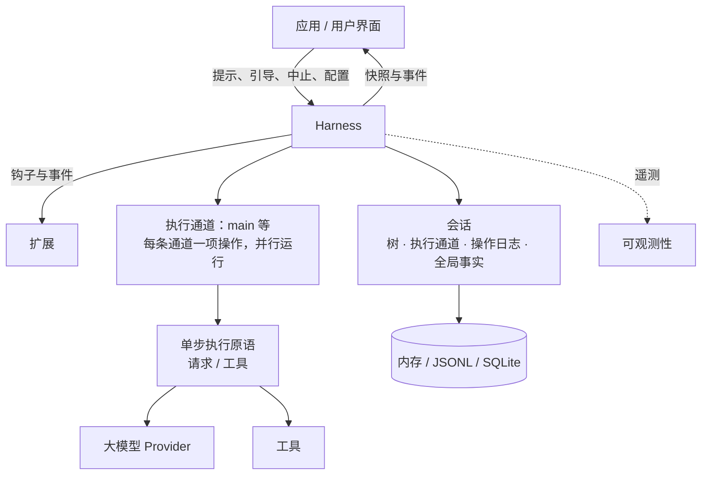
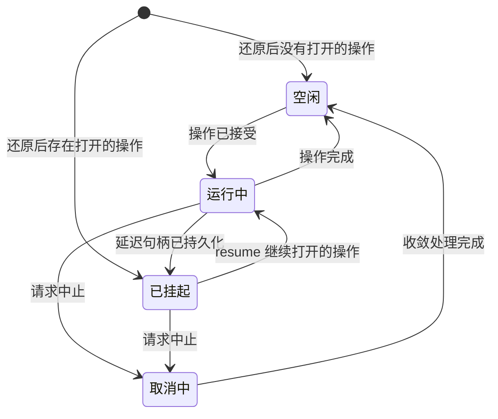

# 可持久恢复的 AgentHarness 设计

> **兼容性策略。** 旧版 coding-agent v3 JSONL 会话必须能够直接打开，并恢复为空闲状态。这是唯一的向后兼容要求。`packages/agent/src/harness` 和 `packages/session-backends/sqlite-node` 中的其他格式与 API（以及各自的测试）均允许发生破坏性变更。除此以外，不为任何内容编写迁移、schema 版本管理或格式转换流程。



Harness 每次针对一个会话执行 run。会话保存四类状态（第 2 节）；同一个 Harness 内的多个 lane 可以并行执行（第 3 节）；存储后端负责对会话进行编码（第三部分）。

# 第一部分——概念

## 1. 目标

- **可持久恢复的 run。** 一个已经被接受的 prompt 是一项持久化操作。进程崩溃后，新进程会还原会话，并从上一个安全边界恢复执行该 run。崩溃可能产生的每一种状态都必须能够恢复。

- **Lane。** 一个会话包含一个或多个 lane。lane 是对话树中一个有名字的位置。每个 lane 同一时间至多运行一项操作，不同 lane 可以并行运行。某个 run 及其排队消息归接受它的 lane 所有。例如，一个 Slack 频道可视为一个会话，其中每个 thread 是一个 lane。交互式 Pi 只使用一个 lane，因此 UI 不会显式展示这个概念。扩展可以使用完整的 Harness API，包括 lane。例如，subagent 工具可在其父 Agent 会话的第二个 lane 上运行。

- **不存在半成品结果。** 在任何操作——run、压缩或导航——内部发生崩溃后，只允许留下两种状态之一：该操作尚未发生，或者恢复流程能够将它完成。外部不能观察到介于两者之间的状态。

- **Harness API。** 事件（event）只能观察执行过程，不能改变执行；钩子（hook）会拦截执行并可以修改上下文、请求、工具和 run 边界。扩展建立在事件与钩子之上。

- **确定性单步执行。** 每一种副作用——持久化写入、Provider 请求、工具执行、钩子、定时器——都必须经过一个注入的边界。在 `drive: "manual"` 模式下，Harness 会在每个副作用前停驻，由测试逐次调用来推动它：可以停在任意边界、注入输入，或关闭并重新打开以模拟崩溃。生产环境与测试执行的是同一套过程；drive 模式只控制这些边界（第 15 节）。

- **可观测性。** 所有执行过程都可被日志和 tracing 检测，粒度可深入到 Provider 请求与响应的内部。该通道与钩子系统相互独立。

- **UI 模型。** 客户端先获得一份原子快照，随后接收实时事件流。事件不会重放；重新连接意味着获取一份新快照。

- **单写者。** 同一时间只有一个 Harness 写入某个会话，由服务层强制保证。一个会话的所有 lane 都位于这一个 Harness 中。还原时，如果遇到单写者模型不可能产生的状态，就将其视为数据损坏。

- **能够加载 v3 会话。** 旧版 coding-agent v3 JSONL 文件无需改动即可打开，并还原为空闲状态。

## 非目标

- **钩子副作用的恰好一次语义。** 当消费某个钩子结果的记录或条目提交时，该结果才成为持久状态。如果在提交之前崩溃，钩子可能再次运行（见第 11 节的重放表）。钩子自行产生的副作用——例如 HTTP 调用和文件写入——对 Harness 不可见。如果钩子需要外部副作用具备崩溃安全性，就必须实现幂等，例如使用操作 ID 作为幂等键。

- **恢复 Provider 流。** 部分流式响应从不持久化。被中断的流式请求只会重试或放弃。延迟请求不同，它属于设计范围：Provider 立即返回一个 handle，稍后再提供结果（例如 Responses API 的 `background: true` 或批处理 API）。pi-ai 会返回一条停止原因为 `deferred`、并携带该 handle 的 assistant 消息；它和普通 assistant 消息一样被持久化。兑现该 handle 时，会追加一条普通 assistant 消息。恢复流程发现尚未兑现的 handle 后会去获取结果，而不是付费发起一个全新的请求。

- **多写者。** 两个进程同时操作同一会话不在范围内。服务层会把某个会话的全部流量路由到持有其 Harness 的进程。lane 可以承载那些看起来像多写者的工作负载：在共享历史之上的多个并行 thread。

- **复制。** 一个会话只存在于一个位置。无需协调地同步已经产生分歧的副本属于另一套设计；本设计也没有阻止未来增加它。

- **迁移 coding-agent。** 将 coding-agent 迁移到 `AgentHarness` 不在范围内。这里的兼容仅表示新的 JSONL repository 可以读取受支持的 coding-agent v3 文件。

## 2. 会话是什么

会话是一组由四部分构成的持久状态：

1. **树（tree）**——对话本身。条目通过 `parentId` 相连，包括消息、模型/思考级别/工具激活状态的变化、压缩摘要、分支摘要以及自定义条目。树是共享且被动的，不归任何 lane 独占。它只会增长；条目从不修改或删除。

2. **Lane**——工作发生的位置。一个 lane 由名称和叶节点组成，叶节点是后续工作将继续扩展的条目。每个会话都有 `main` lane。应用可以使用外部身份标识（例如 Slack thread ID、邮件 thread ID）作为键创建更多 lane。

3. **Lane 操作日志**——记录已经发生和必须继续发生的事情。每个 lane 都有一条扁平、按时间排序的记录序列，例如：操作已开始、已尝试 step、工具已启动、消息已入队、操作已完成。持久恢复能力在这里实现：这些记录使新进程能在崩溃后继续 lane 的工作。正常执行时不需要读取它们。

4. **全局事实（global facts）**——会话范围内“最新写入获胜”的值，例如会话名称和条目标签。它们不属于对话树，按只追加历史保存，读取者看到最新值。

这四部分的所有写入共享同一个单调递增序列号。该序列既用于排列全局事实的历史，也让 lane 操作日志能够引用树中的位置。

```text
tree (shared, append-only)          lanes
a ── b ── c ── d                    main            → d   (op log: …)
      └── e ── f                    slack:171943…   → f   (op log: …)

global facts: name = "Refactor auth", label(b) = "checkpoint-1"
```

### 主动与被动

树和全局事实是被动数据：它们由各方共享，任何组件都可以读取。

lane 是主动的。它拥有自己的叶节点、操作日志（至多一项打开的操作）、队列以及待处理写入。两个 lane 绝不共享这些内容。lane 的每个动作，要么生成链接到其叶节点的新条目，要么在自己的操作日志中生成记录。

### 不变量

- 树只包含对话。lane 状态、编排状态和指针都不能放进树中。

- 条目的父链永不改变。不同分支共享前缀，不复制内容。

- lane 的叶节点只有两种移动方式：lane 追加条目（该条目成为新叶节点），或者 lane 执行导航（叶节点跳到已有条目）。

- 操作日志记录绝不影响树。即使删除全部操作日志，剩下的仍是一段完整、有效的对话。

- 每个 lane 至多打开一项操作。如果同一 lane 同时存在两项打开的操作，说明数据已损坏。

- 条目可以共享，记录不能共享。两个 lane 的路径上可以出现同一条目；一条记录只属于一个 lane。

记录不是树条目，因为记录描述的是执行过程，而不是对话。它绝不能进入模型上下文、transcript、分支查询或 fork；而且在一个 lane 内，记录的先后顺序本身就表达了含义，增加父链接没有价值。

## 3. Lane

lane 是树中一个有名字的位置，加上在该位置串行执行的工作。最接近的现有概念，是在独立 worktree 中 checkout 的 Git 分支：名称附着于某个位置；新工作会使它前进；它可以移动到任意条目而不改写历史；同一个 lane 也不会被同时 checkout 两次。与 Git 直觉不同的一点是，导航可以把 lane 移到任意条目，并非只能向前移动。

每个会话都有 `main` lane。应用可以用一个名称和锚点条目创建其他 lane。lane 名称是永久性的应用键，例如 Slack thread ID 或邮件 thread ID。UI 不会抽象地列出所有 lane；平台自己的 UI（例如 thread 列表）就承担了这一角色。

一个 lane 拥有：

- **自己的叶节点。** 新条目链接到它，并推动它前进；导航则让它跳转。

- **自己的操作日志。** 至多有一项打开的操作。向繁忙 lane 提交第二项操作会被拒绝，不影响其他 lane。

- **自己的队列。** steering、follow-up 和 next-run 消息都以一个 lane 为目标。

- **自己的配置视图。** 模型、思考级别和已激活工具，都由 lane 叶节点之前路径上的条目决定。两个 lane 可以使用不同模型，彼此无需感知。工具实现、资源和流选项属于整个 Harness；只有工具是否激活是每个 lane 独立的。

规则如下：

- 不同 lane 并行运行操作。Harness 仍是唯一写者；各 lane 的记录和条目会交错进入共享序列。

- 创建 lane 不会复制任何内容。lane 不会被删除或重命名。

- 一个 lane 上依赖状态的变更，会在该 lane 的 mutation line（变更串行线）上线性化：校验、至多一次持久化写入以及内存状态更新，必须全部完成后才能开始下一个变更（第 15 节）。Provider、工具、钩子和重试工作绝不占用 mutation line。

- 位于同一叶节点的两个 lane，会在下一次追加时分叉。树天然处理这种情况，不需要任何协调。

- 如果某个 lane 有未完成操作，它会独立于其他 lane 被还原为 suspended（已挂起）状态。挂起原因可能是崩溃，也可能是延迟 Provider 请求（第 1 节）。

## 4. 工作如何执行

### 操作

操作是 lane 上可持久恢复的工作单元，共有三种：

- **Run**——从一个已接受的 prompt 开始，包括全部自动后续过程：工具调用、steering、follow-up 和自动压缩。在没有任何待处理工作时结束。

- **压缩（compaction）**——用一个摘要条目替换旧上下文。

- **导航（navigation）**——把 lane 的叶节点移到已有条目，并可选择生成分支摘要。

操作在真正执行之前先被接受。接受本身是持久化的：发生崩溃后，已经接受的操作要么由恢复流程完成，要么被明确关闭。每个已接受的 run 最终都以 `completed`、`failed` 或 `aborted`（被 abort 停止）结束。压缩和导航还可能以 `declined` 结束：它们的决策钩子在产生副作用之前否决了这项已接受的结构性操作。

### Run、turn 与 step

一个 run 是一系列 turn。一个 turn 由一次 assistant step，以及该 assistant 消息请求的完整工具批次组成。

step 是操作内部可重试的工作单元，例如生成 assistant 消息、压缩摘要或分支摘要。一次 step 可以发起零个、一个或多个 Provider 请求。一次 attempt 失败后会重试同一个 step；attempt 次数会持久化，并跨进程重启保留。延迟 Provider 请求会结束当前 assistant step：handle 位于一条已持久化的 assistant 消息中，该消息闭合此 step；操作随后挂起，稍后兑现 handle 时再追加真正结果（第 1 节）。

每个真正启动副作用的工具调用同样是一个 step。`tool_started` 将它打开，工具结果条目将它闭合。并行批次可以同时持有多个打开的工具 step；这些副作用并发执行，但按照它们在原消息中的顺序完成持久化（第 14 节）。

### 队列与延迟写入

有两种机制可以向正在运行的 lane 传入输入，它们在 abort 时的行为不同：

- **队列**承载对话意图：`steer` 修正当前工作，`followUp` 添加模型原本准备停止后再做的工作，`nextRun` 为 lane 的下一次 run 提供初始消息。abort 会丢弃 steering 与 follow-up，并把它们的 payload 返回调用者；next-run 消息会保留下来。

- **延迟写入**承载事实：某个 step 执行期间请求写入的条目或配置变更。它们能跨越 abort 存活，即使处于取消流程中也会应用。

两者在接受时都立即成为持久状态：接受调用先把包含完整 payload 的记录写入 lane 操作日志，然后才 resolve。对应树条目会等到项目被应用或消费时再写入——也就是模型第一次能看到它的位置。如果进程在接受和树写入之间崩溃，恢复流程会读取记录并完成追加。已经接受的输入绝不会丢失。

### 检查点

每两个 turn 之间，lane 会经过一个检查点：

1. 应用待处理的延迟写入。

2. 消费队列中的 steering 消息。

3. 如果下一个请求放不进上下文，则执行压缩。

压缩也有一个被动触发条件：Provider 响应表明请求实际没有放入上下文，例如 overflow 形式的错误，或在低于预期输出上限时以 `length` 停止。该响应会被丢弃，run 随后压缩并重试一次（第 6 节“assistant step 的上下文溢出”）。

带有工具调用的 turn 会强制再运行一个 turn，使模型看到工具结果。唯一例外是：如果一个批次中每个最终工具结果都持久化了 `terminate: true`，则抑制自动工具续跑；但 steering 或 follow-up 输入仍可开启新的 turn。只有工具续跑和 steering 都已处理完，才消费 follow-up 消息。当检查点发现没有待处理内容时，run 结束。

### 只在尾部追加的上下文

> 在一个 lane 的连续请求之间，Provider 上下文只能从尾部增长。如果在上次请求尾部之前插入内容，Provider 的 KV cache 会从插入点起失效，从而成倍增加 token 成本。

这项不变量解释了为何 turn 中途发生的写入要延迟到检查点：检查点总是在尾部追加。压缩是唯一有意设计的例外；它用一次完整的缓存失效换取更短的上下文。

### Lane 生命周期



- 状态以 lane 为单位。唯一例外是存储写入失败会使整个 Harness 进入 faulted 状态。处于 faulted 状态的 Harness 会停止所有副作用并拒绝所有调用；问题修复后，重新打开会从记录中还原每个 lane。

- **Suspended（已挂起）**表示一项操作仍然打开，但当前没有任何执行。它可能来自崩溃后的还原，也可能是在延迟 handle 持久化后主动进入。`resume()` 继续该操作；`abort()` 不执行后续正常工作，直接将它关闭。

- **Abort（中止）**先把取消请求持久化、通知正在运行的副作用，然后返回。随后执行收敛处理：尚未解决的工具调用获得合成结果，transcript 得到一条结束用的 assistant 消息。自动 drive 在后台运行收敛流程；手动 drive 则让它停驻在下一个动作之前。

### 恢复执行

Resume 会继续一项已打开的操作，绝不会启动新操作。具体入口由记录结束的位置决定：重试未完成的 step、兑现延迟 handle、收敛处理完成了一半的工具批次，或从下一个检查点继续。崩溃之前已经接受的队列消息和延迟写入仍处于待处理状态，并会按正常规则应用。

# 第二部分——如何记录执行过程

第二部分与具体后端无关。它定义 lane 写入哪些记录、何时写入，以及恢复流程如何读回这些记录。第三部分再把这些规则映射到 API 和存储实现。

## 5. 记录

### 持久化规则

> 在产生副作用之前：先写一条意图记录，说明将发生什么，以及它会产生哪些 ID。副作用完成后：使用完全相同的 ID，把结果追加为一个条目。

这里没有跨多条记录的原子性，也不需要。每条记录和每个条目都能独立持久化。若在意图与结果之间崩溃，意图会处于未履行状态；恢复流程根据意图类型决定补完、重试，还是用合成结果将其关闭。当且仅当带有预分配 ID 的条目存在时，意图才算履行。条目本身还可以指向下一种持久状态：例如 `stopReason: "deferred"` 的 assistant 条目履行本次 attempt 预分配的追加并闭合 step；此时尚未结束的是操作，已持久化的 handle 等待兑现（第 6 节）。如果预分配 ID 已存在，但内容不同，则属于数据损坏。

### 预分配 ID

意图记录会携带尚不存在的条目 ID：

```ts
/** An entry payload with its id pre-allocated. parentId, seq, and timestamp
    are assigned by storage when the entry is appended: it chains to the
    lane's then-current leaf. */
type ProvisionedEntry<T extends Entry = Entry> =
  T extends Entry ? Omit<T, "parentId" | "seq" | "timestamp"> : never;
```

### 记录目录

每条记录都属于某个 lane 的操作日志。属于某项操作的记录带有 `runId`，其值就是该操作的 `operation_started` 记录 ID。next-run 队列记录（`queue_enqueued` 及其对应的 `queue_cancelled`）和独立的 `adjustment` 用量记录不带 `runId`。

```ts
interface RecordBase {
  id: string;
  seq: number;            // shared sequence, section 2
  lane: string;
  timestamp: number;      // Unix ms
}

// Acceptance boundary of an operation. Everything decided before acceptance
// is persisted here. This record's own id IS the runId that all other
// records of the operation carry.
interface OperationStartedRecord extends RecordBase {
  type: "operation_started";
  sourceLeafId: string | null;        // the lane's leaf at acceptance
  intent:
    | {
        kind: "run";
        /** Normalized caller input after skill/template expansion, before
            before_run. Kept for SuspendedOperation and before_resume. */
        originalPrompt: AgentMessage[];
        /** Captured nextRun items, then the prompt, then before_run
            injections. Full payloads, provisioned ids. Capture happens in
            the acceptance mutation (section 15): items present when it runs
            belong to this run; later items belong to the next. */
        initialMessages: ProvisionedEntry[];
        /** Present only when a hook overrode the system prompt; fixed for the
            whole run. Absent: the systemPrompt callback runs per request. */
        systemPromptOverride?: string;
        /** Opaque state keyed by stable hook registration id. Each
            before_resume handler receives only the value under its id. */
        resumeData?: Record<string, JsonValue>;
      }
    | {
        kind: "compaction";
        customInstructions?: string;
        resultEntryId: string;          // provisioned compaction entry
      }
    | {
        kind: "navigation";
        targetId: string | null;        // destination entry; null = root
        summarize: boolean;
        customInstructions?: string;
        label?: string;                 // global fact, written at completion
        summaryEntryId?: string;        // provisioned branch-summary entry
      };
}

// Written when abort() resolves. A request marker, not a terminal state:
// reconciliation follows, then operation_finished with outcome "aborted".
// Kills this operation's steer/follow-up queue items; next-run items survive.
interface AbortRequestedRecord extends RecordBase {
  type: "abort_requested";
  runId: string;
}

// Closes the operation. failed = orderly durable failure (for example,
// retries exhausted). aborted = closed by abort. declined = vetoed by a
// hook before any effect.
interface OperationFinishedRecord extends RecordBase {
  type: "operation_finished";
  runId: string;
  outcome: "completed" | "aborted" | "failed" | "declined";
  error?: { code: string; message: string };
}

// Written before each attempt at a retryable step. Marks: we are about to
// do this, for the n-th time. Steps are logged because they are
// retryable: the durable count caps retries across restarts — a
// crash-restart loop cannot reset it. One record per attempt; one attempt
// may make zero or several provider requests (split-turn compaction
// makes two). Deferred results need no extra
// record: the handle lives in the persisted assistant entry (section 1).
interface StepAttemptRecord extends RecordBase {
  type: "step_attempt";
  runId: string;
  step: "assistant" | "compaction" | "branch_summary";
  attempt: number;                     // 1-based within this step
  /** The entry this attempt produces if it succeeds. Assistant attempts
      provision a fresh id each; all attempts of one structural step reuse
      one id (manual: the intent's; auto: the first attempt's). The give-up
      error entry fulfills the last attempt's id. */
  resultEntryId: string;
  /** Required exactly for compaction steps. Persists why the summary is
      being generated so resume re-enters the same structural work without
      re-deriving context pressure. */
  compactionReason?: "manual" | "threshold" | "overflow";
}
// The model of a resumed request is not read from records: the lane's
// effective model is derived from its path, and a deferred handle's model
// is in the persisted assistant entry.

// Written after before_tool and validation pass, before the tool executes.
// assistantEntryId + toolIndex is the durable invocation identity.
interface ToolStartedRecord extends RecordBase {
  type: "tool_started";
  runId: string;
  assistantEntryId: string;
  toolIndex: number;
  toolCallId: string;
  toolName: string;
  effectiveArgs: Record<string, unknown>;   // after before_tool
  resultEntryId: string;                    // provisioned
  /** The tool's declared replay safety, snapshotted at execution time.
      Recovery re-executes an unfinished call only when this field AND the
      current tool declaration both say "safe"; otherwise it writes a
      synthetic "interrupted" result. */
  replay: "never" | "safe";
}

// Queue acceptance. The payload travels here; the entry appears at the
// consumption point.
interface QueueEnqueuedRecord extends RecordBase {
  type: "queue_enqueued";
  queue: "steer" | "followUp" | "nextRun";
  runId?: string;                      // absent for nextRun
  target: ProvisionedEntry;
}

// Durable retraction of a pending queue item, before consumption. Without
// this record a crash would resurrect the item: recovery treats a
// queue_enqueued without its entry as pending.
interface QueueCancelledRecord extends RecordBase {
  type: "queue_cancelled";
  runId?: string;                      // matches the queue_enqueued it kills
  entryId: string;                     // the enqueued target's provisioned id
}

// Deferred-write acceptance: an entry or configuration change requested
// while a step was in flight. Applied at the next checkpoint.
interface WriteDeferredRecord extends RecordBase {
  type: "write_deferred";
  runId: string;
  target: ProvisionedEntry;
}

// The cost ledger. Written whenever usage is reported or adjusted,
// whatever happens to the response. Pure accounting: the reduction,
// recovery, and validity checks never read it, so it adds no recovery
// states and no crash-matrix rows. It records reported usage; a transport
// death mid-stream can bill tokens no one reported, and a crash between
// settle and this write loses that one item — the irreducible window.
type UsageRecord = RecordBase & { type: "usage"; usage: Usage } & (
  // A provider request settled, whatever the outcome. Written before any
  // classification, retry decision, or discard. Split-turn compaction
  // writes two records sharing one attempt. A pending deferred fetch that
  // reports no usage writes no record.
  | { cause: "assistant" | "compaction" | "branch_summary" | "deferred_fetch";
      runId: string; entryId: string; attempt: number; stopReason: TerminalStopReason }
  // A finalized tool result reported nested LLM work; skipped when it
  // reports none. A safe replay writes a second record for the second
  // execution: both were billed.
  | { cause: "tool"; runId: string; entryId: string; toolCallId: string }
  // A hook-supplied summary carried usage the hook measured itself.
  | { cause: "hook"; runId: string; entryId: string }
  // Application-supplied, anytime (lane.recordUsage): reconciliation,
  // estimates, corrections. Negative values are legal.
  | { cause: "adjustment"; runId?: string; entryId?: string; details?: JsonValue }
);

type LaneRecord = OperationStartedRecord | AbortRequestedRecord | OperationFinishedRecord
  | StepAttemptRecord | ToolStartedRecord | QueueEnqueuedRecord | QueueCancelledRecord
  | WriteDeferredRecord | UsageRecord;

type NewRecord<T extends LaneRecord = LaneRecord> =
  T extends LaneRecord ? Omit<T, "seq" | "timestamp"> : never;
```

被拦截或无效的工具调用不会写入 `tool_started`。因为副作用尚未开始，所以不需要意图记录；拦截结果会直接以 `isError: true` 的工具结果条目持久化，正文中包含拦截原因。若在写入该条目前崩溃，丢失的只有这次拦截决定；恢复时，对于既没有 `tool_started`、也没有结果条目的调用，会再次运行 `before_tool`。

工具 step 不需要单独的 outcome 记录。工具结果条目本身就是完整的持久化结果，其中还包含批次控制决定：工具结果条目会持久化 `terminate`（第 12 节）。如果工具已经执行、但进程在写入结果条目前崩溃，就按第 6 节的重放策略处理；重新完成结果时会再次运行 `after_tool`，而第 1 节的非目标明确允许这种行为。

成本是唯一必须另写结果记录的事项：**成本能否持久保存，不能取决于结果是否成功持久化。** 可重试 step 本来就可能产生永远不会成为条目的响应，例如失败的 attempt、耗尽重试次数的序列，以及被丢弃的上下文溢出响应；这些请求产生的费用不能随响应一起消失。因此，每个 Provider 请求 settle 后，都必须在分类、决定重试或丢弃之前先写一条 `usage` 记录。工具和钩子报告的用量也会在相应条目附近写入记录；对于 Harness 无法观察到的费用，应用可以追加 `adjustment` 记录。

Harness 写入的 `usage` 记录总会把 `entryId` 绑定到该笔计量所属条目的预分配 ID；该条目最终是否存在是另一回事——失败 attempt 或被丢弃响应的 ID 永远不会实体化，这正是设计目的。这里严格区分三层含义：条目的 `usage` 字段是生成该条目的响应所携带的**不可变快照**，只在追加时写入一次，此后绝不修改；**条目的有效成本**在读取时计算，即把所有 lane 中绑定到该 ID 的基础 `usage` 与调整记录相加；**会话成本**则是全部 `usage` 记录之和。恢复过程可以如实记录两次费用：重试 step 或重放工具时，每次实际执行都会写一条记录；而条目快照等于该 ID 最新的非调整记录（对于压缩摘要和分支摘要，则是成功 attempt 对应的记录）。

### 有效性

遇到以下情况，恢复流程必须认定 lane 日志已损坏：

- 同时打开了多于一项操作；

- 记录引用不存在的操作，或出现在该操作结束之后；

- 同一 step 内 attempt 编号不连续；

- 压缩 attempt 缺少 `compactionReason`，或其他 step 类型错误地携带它；

- 某个 run 的 steer/follow-up `queue_enqueued` 出现在其 `abort_requested` 之后；

- `queue_cancelled` 指向没有对应 `queue_enqueued` 的 ID，或指向条目已存在的项目；

- 同一结构性 step 的 attempt 对 `resultEntryId` 或 `compactionReason` 意见不一致；

- `tool_started.toolIndex` 无法在原始 assistant 条目中定位保存的 `toolCallId` 和 `toolName`；

- 两条 `tool_started` 记录使用同一调用身份；

- 预分配 ID 已存在，但内容不同。

## 6. 每种动作会写入什么

以下是存储层级的执行轨迹，均只展示一个 lane。图例：

```text
E   entry appended to the tree (chained to the lane's leaf)
R   record appended to the lane's operation log
L   lane pointer move
G   global fact written
H   hook (awaited; hooks are Part I concepts, their API is Part III)
X   crash site
```

### 包含一次工具调用的 run

```text
    prompt("fix the bug")
H   before_run                        may inject entries, override system prompt
R   operation_started                 kind run; initial messages with provisioned ids
E   user message                      the provisioned id from the intent
R   step_attempt                      step assistant, attempt 1
E   assistant message [tool call]
H   before_tool                       may change args or block
R   tool_started                      effective args, provisioned result id, replay
H   after_tool                        may patch result and terminate
E   tool result                       the provisioned result id; persists the terminate decision
R   step_attempt                      next turn's assistant step, attempt 1
E   assistant message "done"
H   before_run_end                    nothing pending, returns nothing
R   operation_finished                completed
```

任意两行之间发生崩溃都能恢复。一般规则是：没有结果条目的意图，由恢复流程补完、重试或用合成结果关闭；不存在“有结果条目、却没有相应已消费意图”的状态。

### 重试

```text
R   step_attempt                      attempt 1
    request fails
R   usage                             the failed attempt's cost — never lost
R   step_attempt                      attempt 2 — durable count
R   usage
E   assistant message
```

每个 Provider 请求 settle 后都会写入一条 `usage` 记录（第 5 节）；其他执行轨迹为简洁起见省略了这些记录。每请求钩子（`transform_context`、`before_request`、`after_response`）会在每次请求内部运行，本文其他位置也都省略了它们；Tier B 测试会把它们记录下来（第 19 节）。

如果在退避等待期间崩溃，还原流程会读到已经使用了两次 attempt，恢复执行将从第三次开始，计数绝不会归零。尚未达到上限的可重试错误不会追加为条目。重试次数耗尽，或遇到不可重试的终止错误时，会先追加一条包含错误的 assistant 消息，再以 `failed` 结果写入 `operation_finished`：

```text
E   assistant message                 stop reason error; the failure is durable
X   crash                             operation still open
R   operation_finished                recovery writes failed — never completed
```

这条错误条目就是终止失败的标记。恢复流程发现它后，会先排空已经接受的写入和队列输入；除非消费 steering 或 follow-up 后启动了新工作，否则会以 `failed` 关闭 run（第 7 节）。如果某个 run 最新的自有消息是 step 生成的错误，恢复流程绝不能把该 run 判定为 `completed`。

### Assistant step 的上下文溢出

`length` 具有歧义：生成过程在某个输出边界停止了，但这个边界可能是预期的输出上限——此时压缩无济于事；也可能是更小的上下文限制或 Provider 限制——此时压缩能够解决问题。分类时，要把实际输出用量（包括 reasoning token）与**预期输出上限**进行比较：

```ts
function isRecoverableLength(message: AssistantMessage, desiredMaxOutput: number): boolean {
  if (message.stopReason !== "length") return false;
  // Reaching the caller's or model's intended cap is a genuine output-limit stop.
  if (desiredMaxOutput > 0 && message.usage.output >= desiredMaxOutput) return false;
  // Stopped below the intended cap: context pressure or provider-side truncation.
  return true;
}
```

如果调用方设置了 `maxTokens`，`desiredMaxOutput` 就取该值，否则取 `model.maxTokens`；关键在于使用进行任何上下文 clamp **之前**的预期上限。实际发送给 Provider 的值绝不能作为参照：有些 Provider 会直接拒绝显式的输出上限（OpenAI Codex 后端会对 `max_output_tokens` 返回 HTTP 400），Pi 也会把其他 Provider 的值 clamp 到剩余上下文。该规则无需依赖“上下文使用百分比”启发式，就能覆盖这些情况：原本预期 128k、却因上下文 clamp 只返回 16 个 reasoning token（可恢复）；小米/Qwen 风格的零输出 `length`（可恢复）；显式设置 1,024 且完全用尽（真正的输出上限停止）。与溢出模式匹配的 Provider 拒绝，以及 prompt 已经超过窗口却静默返回成功的情况，也按同样方式分类，并进入同一处理路径。

可恢复响应会被**丢弃**：它和可重试错误一样，永远不会成为条目，因此无论实时重试还是崩溃后重试，都不需要从上下文中清除它。该响应对应的预分配结果 ID 保持未履行；请求 settle 时写入的 `usage` 记录已经把它的成本持久化（第 5 节）。

```text
R   step_attempt                      step assistant, attempt 1
    response: recoverable             length below the intended cap, or overflow-form error
R   usage                             the discarded response's cost — never lost
    nothing else appended             the response itself is discarded
H   before_compaction                 reason overflow
R   step_attempt                      step compaction, attempt 1
E   compaction entry
R   step_attempt                      step assistant, attempt 1 — new step
E   assistant message
```

**每份对话输入只允许执行一次溢出恢复。** 只有在当前 run 最新消费的对话消息（prompt、steering 或 follow-up）之后，不存在更新的、原因为 overflow 的压缩 `step_attempt` 时，才能启动 overflow 压缩。同一窗口内再次出现可恢复响应时，会追加最终放弃错误条目，并通过排空路径让 run 失败；`length` 响应本身不会重置这个防护，只有新消费的对话输入才会重置。这样就把“压缩并重试”的循环限制为每次用户动作最多一次。`before_compaction` 拒绝，或原因为 `overflow` 的压缩准备为空，同样属于终止错误：不进行压缩，请求就无法放入上下文。若钩子直接提供 overflow 压缩摘要，也要在写入条目前先写对应的压缩 `step_attempt`，使防护逻辑能把它计入——这是唯一会写 attempt 记录的钩子摘要。

各崩溃点的处理如下：

| 崩溃发生在 | 持久状态 | 恢复行为 |
|---|---|---|
| assistant 的 `step_attempt` 之后 | 未完成的 assistant step | 恢复时重试；新的可恢复响应仍在实时路径中重新分类 |
| overflow 压缩的 `step_attempt` 之后 | 未完成的压缩 step | 使用已经记录的原因恢复该压缩 step |
| 压缩条目之后 | 条目已经闭合该 step | 回到检查点路径，随后创建新的 assistant step |

真正达到预期输出上限的 `length` 响应会正常追加，并沿用原有处理：如果其中包含工具调用，则不执行工具，并让整个被截断批次中的调用全部失败；否则 run 进入正常结束流程。所有面向用户的截断提示都应保持中性，例如“响应在完成前被截断”，而不能武断地声称已经达到配置的输出上限。

### 工具运行期间收到 steering

```text
E   assistant message [tool call]
R   tool_started
    steer("focus on the tests")       caller resolves here
R   queue_enqueued                    steer, full payload, provisioned id
E   tool result
E   user message                      checkpoint consumes the queue item; provisioned id
R   step_attempt                      next request sees the steering message
```

如果在 `queue_enqueued` 之前崩溃，这次 steer 就从未发生，调用者的 Promise 也不会 resolve；如果在其后崩溃，恢复流程会找到一条尚无对应条目的队列记录，并在检查点原本应当消费它的位置完成追加。

队列项目可以在消费前被持久撤回：

```text
R   queue_enqueued                    steer, full payload, provisioned id
    cancelQueued(entryId)             caller resolves here
R   queue_cancelled                   the entry will never be appended
```

如果在这两条记录之间崩溃，该项目仍处于待处理状态，取消操作的 Promise 也没有 resolve。取消和消费都作为任务进入 lane mutation line，因此历史只可能是 `[cancel, consume]` 或 `[consume, cancel]` 两种（第 15 节）。

### 结束边界上的输入

同一 lane 的决定统一由 mutation line 排序。最后一次待办检查与终止记录追加构成同一个 `tryFinishRun` 变更，因此并发 steer 只有两种历史：要么先入队、run 继续；要么 run 先完成，steer 返回 `NoActiveRun`。

```text
steer first                         finish first
R   queue_enqueued                  R   operation_finished
    tryFinishRun → continue             steer() → NoActiveRun
E   user message
... run continues
R   operation_finished
```

延迟写入与 abort 使用同一排序。结束前接受的延迟写入必须先应用，run 才能关闭；结束后接受时看到的是空闲 lane，直接追加。结束前的 `abort_requested` 选择中止收敛；结束后的 abort 返回 `NoActiveOperation`。不存在第三种历史。

### Turn 中途的延迟写入

```text
R   step_attempt                      request in flight, context ends at user message U
    session.appendMessage(M)          caller resolves here
R   write_deferred                    full payload, provisioned id
E   assistant message A               provider cached [.., U, A]
E   message M                         checkpoint applies the write; tail append
```

请求进行时调用 `session.appendMessage(M)` 会先写 `write_deferred`。Provider 随后返回 A，形成缓存上下文 `[.., U, A]`；检查点再把 M 追加到尾部。若直接插入 M，会得到 `[.., U, M, A]`：不仅让 KV cache 从 M 起失效，还会让 transcript 错误声称 A 看过 M。检查点同时避免了这两个问题。

### 工具执行期间 abort

```text
E   assistant message [tool call]
R   tool_started
    abort()                           caller resolves here
R   abort_requested                   steer/follow-up queues die; payloads returned
E   tool result                       synthetic "interrupted", or real if it finished
E   assistant message                 closing message, stop reason aborted
R   operation_finished                aborted
```

`abort()` resolve 时 `abort_requested` 已持久化，steer/follow-up 队列被清空并把 payload 返回调用者。工具结果可能是真实完成结果，也可能是合成的 `interrupted`；随后追加停止原因为 aborted 的结束 assistant 消息，最后写 `operation_finished`。即使在 `abort_requested` 后崩溃，恢复流程也会完成同一收敛。待处理延迟写入仍会应用，steer/follow-up 不会。

### 工具执行的崩溃点

```text
E   assistant message, calls c1, c2
X1  before before_tool                nothing durable for c1
H   before_tool(c1)
X2  decision made, nothing written    same as X1
R   tool_started(c1)
X3  tool executing
H   after_tool(c1)
X4  hook interrupted                  same durable state as X3
E   tool result c1
X5  result durable                    c1 finished
```

| 崩溃点 | 持久状态 | 恢复行为 |

|---|---|---|

| X1、X2：`before_tool` 前或决策后尚未写入 | 无记录、无结果 | 走完整正常路径，`before_tool` 可能再次运行 |

| X3、X4：工具执行或 `after_tool` 中断 | 有 `tool_started`、无结果 | 记录与当前声明都为 `safe` 时，用持久化参数重执行并对新结果运行 `after_tool`；否则写合成 `interrupted` 结果且不运行钩子 |

| X5：结果已持久化 | 结果条目存在 | 跳过该调用，处理下一调用 |

收敛流程按原始顺序分别判断批次中的每个调用，之后 step 正常结束。

### 检查点自动压缩

```text
E   tool result                       step ends
    checkpoint: next request would not fit
H   before_compaction                 may decline or supply the summary
R   step_attempt                      step compaction — skipped if hook supplied
E   compaction entry
R   step_attempt                      step assistant; run continues on compacted context
```

自动压缩不会写入 `operation_started`；它属于当前 run。手动 `compact()` 则是独立 operation，其顺序为：`operation_started`（kind 为 compaction，并携带预分配结果 ID）→ hook → attempt → compaction entry → `operation_finished`。

### 导航

```text
    navigateTree(target, { summarize: true, label: "before-refactor" })
R   operation_started                 kind navigation; target, provisioned summary id, label
H   before_navigation                 may decline or supply the summary
R   step_attempt                      step branch_summary — skipped if hook supplied
    summary text generated            in memory only
L   lane move → target                one storage write; the commit point
E   branch summary entry              appends chain to the lane's leaf — now the target,
                                      so the summary lands on the target branch
G   label                             from the intent; latest-wins, idempotent
R   operation_finished                completed
```

lane 移动会先提交；之后的每次写入都从已经持久化的状态继续链接。整个设计中不存在跨多个对象的原子写。接受阶段会拒绝 `target === sourceLeafId`，所以“移动是否已经发生”始终可以判断：当且仅当 lane 的叶节点等于 `intent.targetId` 时，移动已经提交。各崩溃点的处理如下：

| 崩溃发生在 | 恢复时看到的状态 | 处理动作 |
|---|---|---|
| `operation_started` 之后 | 叶节点仍为 `sourceLeafId` | 重新运行钩子或摘要 step，然后移动 |
| 摘要已经生成 | 摘要正文尚未持久化 | 在相同 attempt 上限内重新生成 |
| lane 移动之后 | 叶节点为 `intent.targetId` | 如果缺少 `summaryEntryId`，则追加摘要 |
| 摘要条目之后 | 条目已经存在 | 设置标签并结束操作 |
| 标签之后 | 事实已幂等写入 | 结束操作 |

在 lane 移动与写入 `operation_finished` 之间，读取者会看到 lane 已经位于目标位置，但导航操作仍处于打开状态。这是可恢复状态，并非无效状态；在此期间该 lane 不会运行其他工作，因为“每个 lane 同时至多一项操作”已经提供了保证。

### 延迟 Provider 请求

```text
R   step_attempt                      stream options request deferred execution
E   assistant message                 stop reason deferred, carries the handle
    lane suspends; prompt() resolves with outcome "suspended"
    ... hours pass, maybe a different process ...
    resume()                          newest entry on the lane's path is a deferred
                                      assistant message with no successor
                                      → the handle is unredeemed, redeem it
    fetchDeferred(model, handle)      model and handle from that entry
E   assistant message                 the real result
    run continues normally
```

从存储角度看，主动挂起的 lane 与发生崩溃的 lane 没有区别：两者都有一项打开的操作，而且最新条目是一条没有后继的 deferred assistant 消息。还原时，它会被列为 suspended；调用 `resume()` 后则检查其中的 handle。取回延迟结果不写意图记录，因为它不会启动新的模型工作；一旦后继条目提交，就足以阻止再次 fetch。

每次调用 `resume()` 只执行一次 fetch，结果分为三种：

- **pending**——Provider 再次返回停止原因 `deferred`。除可能写入一条 `usage` 记录外，不持久化任何内容（第 15 节）；lane 再次挂起。轮询频率由应用策略决定。
- **ready**——得到一条普通 assistant 消息。将其作为后继追加，然后正常继续 run。
- **terminal**——Provider 返回停止原因 `error`（例如 handle 已过期、未知或已消费），或者 fetch 本身 reject。Harness 会把 rejection 转换成同样的错误消息形式。追加该消息后，run 以失败结束。取回延迟结果失败时绝不会自动发起替代请求；但本次 run 中已经接受的 steering 或 follow-up 仍可启动后续 turn。

对 suspended lane 调用 `abort()` 时，会依次写入 `abort_requested`、尽力要求 Provider 取消该 handle、执行正常的收敛处理，最后以 `aborted` 写入 `operation_finished`。deferred 条目仍保留在 transcript 中。

deferred assistant 消息只携带 handle，不包含正文，因此投影到 Provider 上下文时不会产生任何内容。

## 7. 恢复

### 还原

打开会话时，每个 lane 独立还原。还原过程只读取数据，不追加任何内容，也不启动任何副作用。

恢复从索引查询开始，而不是扫描完整日志：

1. `findOpenOperations(lane, { limit: 2 })` 按最新优先顺序返回尚未结束的 `operation_started`。零条表示 idle，一条表示 suspended，两条表示数据损坏。后端必须根据重放结果或已建立索引的操作状态回答，调用方不能仅查看最新的 start 记录来推断。
2. 对 idle lane，先通过一次索引查询找到最新的 run 类型 `operation_started`，再查询它之后的 `queue_enqueued` / `queue_cancelled`，以重建待处理 `nextRun`。如果从未运行过 run，同样的类型过滤查询只读取 run 之前的队列状态，不扫描无关的用量调整。
3. 对 suspended lane，打开的操作把读取范围限制为两段有界数据：
   - **该 lane 的记录**：从这个 `operation_started` 开始读取。前一项操作结束之前的所有内容都属于无关历史。
   - **该 lane 自己追加的条目**：从当前叶节点沿路径回溯到操作锚点 `sourceLeafId`。这些恰好就是本次操作追加的条目。

reduction 还可以按预分配条目 ID 做点查询，并在操作锚点上执行有界分支查询，以确定有效模型、思考级别和已激活工具。这些都是索引查找，并非额外的历史扫描。所有扫描都受当前打开操作或仍然相关的 idle 队列约束，不会随着会话总历史或其他 lane 的流量增长。

idle lane 唯一可能保留的状态，是待处理的 next-run 队列。next-run 可以随时入队，但只有接受 run 时才会被消费；压缩和导航会忽略它。待处理项目是指：位于最新 run 类型 `operation_started` 之后、预分配条目尚不存在、并且没有被 `queue_cancelled` 撤回的 `queue_enqueued`。某次 run 已捕获的项目会列在意图的 `initialMessages` 中；如果捕获后还未追加，则由该 run 的恢复流程补完，绝不会再次交给下一次 run。

### Reduction（状态归约）

根据上述两段读取，可以归约出 lane 状态：

- **正在 abort**：存在 `abort_requested`。

- **已使用的 attempt**——最新一条 `step_attempt` 的 `resultEntryId` 若没有对应 entry，这条记录就代表尚未完成的 step；其中的 `attempt` 字段是持久化次数，step kind 与 `compactionReason` 决定 resume 路径。判断 step 是否闭合要通过点查询，不能根据记录是否相邻来推断：当且仅当最新 attempt 的预分配结果已经存在时，step 才算闭合。更早 attempt 中未履行的 ID 属于已经结束的工作，无需检查。

- **已经使用 overflow 恢复**——存在一条原因是 `overflow` 的 compaction `step_attempt`，而且它比当前 run 最新消费的对话消息更新（见第 6 节的 overflow guard）。

- **工具批次**——取最新一条包含工具调用的 assistant entry，把每个调用分别与 `tool_started` record 和结果 entry 匹配（见第 6 节的崩溃点表格）。Assistant 的 stop reason 必须保留：`length` 批次已经被截断，恢复时绝不能执行。结果 entry 中持久化的 `terminate` 值决定这个已完成批次是否会强制开启另一个 turn。

- **延迟 handle**：最新自有条目是没有后继的 deferred assistant 消息。

- **最新的本 lane 自有 entry**——也就是第二次读取返回的最后一条 entry；`needsAssistant()`、终止失败与 abort closure 等纯谓词都读取它。

- **待处理 queue item**——其预分配 entry 尚不存在的 `queue_enqueued` record，但要排除已经被 `queue_cancelled` 撤回的项目，以及被当前 run 的 `abort_requested` 清除的 steer/follow-up 项目。

- **待处理写入**：预分配条目不存在的 `write_deferred`。

- **缺失初始消息**：run 意图中尚无条目的预分配 ID。

- **结构性目标**：判断压缩或导航的预分配结果条目是否存在。

实时执行使用完全相同的规则：Harness 每次写入后更新内存状态，还原则从存储重新归约。状态由记录的 reduction 定义，因此两者不可能产生不同结论。`usage` 在这里不可见，因为它只负责记账，不参与编排。

### 恢复执行

`resume()` 根据 reduction 继续已打开操作：

- 缺失初始消息：追加它们，即使已经进入 abort，也不能丢失已接受输入。

- 正在 abort：补合成工具结果、结束 assistant 消息，并以 aborted 写 `operation_finished`。

- 未解决工具批次：逐调用跳过、重执行或合成。

- 延迟 handle：兑现它。

- 终止失败——最新的本 lane 自有消息是 step 产生的 assistant 错误（放弃 entry、不可重试的请求错误或兑现失败；绝不能是任意一条 deferred-write 消息）→ 应用已接受的写入并消费已排队的对话输入；若消费输入后没有启动新工作，则追加 outcome 为 failed 的 `operation_finished`。恢复流程绝不能把这样的 run 判为完成。

- 未完成 step：先继续同一个 step，再消费新的检查点输入；未到上限则开始下一 attempt，否则让操作失败。压缩 step 使用已记录的 `compactionReason`。

- 其他情况 → 从下一个 checkpoint 继续；待处理写入和 queue item 会在那里按正常规则应用。

恢复追加与普通追加相同，唯一额外规则是跳过已经存在的预分配 ID。因此恢复期间再次崩溃，只会留下更少的待恢复内容，重复运行始终安全。未知副作用只有在策略允许时才重复：可重试 step 开始新的持久 attempt；工具只有在记录与当前声明都为 `safe` 时重放。被中断的钩子遵循第 11 节重放表。

旧 v3 会话没有记录，因此所有 lane 查询都回答 idle。第 12 节的 normalization 会让 `main` 指向最终保留的逻辑条目；被丢弃的事实类条目通过最近保留祖先重新解析。

# 第三部分——API 与实现

## 8. 公共 API

### Lane 接口

`AgentLane` 是单个 lane 的操作接口。`AgentHarness` 自身为 `main` 实现了该接口，因此 `harness.prompt(...)` 就是在 main lane 上调用 prompt。除了 `name` 和监听器注册（`hooks.on`、`events.on`）以外，所有方法都是异步的——即使进程内实现能够直接从内存返回某些 getter，也必须如此。因为同一接口还要能由远程代理实现，任何方法签名都不能承诺一种只有本地实现才做得到的同步性。服务器会通过自己的传输层桥接事件，而不是桥接监听器注册动作。

```ts
interface AgentLane {
  readonly name: string;                 // "main" on the harness itself
  getLeafId(): Promise<string | null>;

  // Operations. Never throw; every call resolves with a result (see below).
  // At most one operation per lane; other lanes are unaffected.
  prompt(text: string, images?: ImageContent[]): Promise<RunResult>;
  prompt(message: AgentMessage | AgentMessage[]): Promise<RunResult>;
  skill(name: string, additionalInstructions?: string): Promise<RunResult>;
  promptFromTemplate(name: string, args?: string[]): Promise<RunResult>;
  compact(options?: { customInstructions?: string }): Promise<CompactionResult>;
  navigateTree(targetId: string | null, options?: NavigateOptions): Promise<NavigationResult>;
  resume(): Promise<ResumeResult>;       // continue this lane's open operation
  abort(): Promise<AbortResult>;         // durable on resolve; reconciliation runs in background

  // Queues. Durable on resolve (queue_enqueued record); the returned
  // entryId identifies the item until consumption. steer/followUp require
  // an active run; nextRun and cancelQueued work anytime.
  steer(text: string, images?: ImageContent[]): Promise<QueueResult>;
  steer(message: AgentMessage): Promise<QueueResult>;
  followUp(text: string, images?: ImageContent[]): Promise<QueueResult>;
  followUp(message: AgentMessage): Promise<QueueResult>;
  nextRun(text: string, images?: ImageContent[]): Promise<QueueResult>;
  nextRun(message: AgentMessage): Promise<QueueResult>;
  /** Durably retract a pending queue item (queue_cancelled record). */
  cancelQueued(entryId: string): Promise<CancelQueuedResult>;
  /** Append an adjustment usage record (section 5): reconciliation,
      estimates, corrections. Allowed anytime; records are not context. */
  recordUsage(usage: Usage, options?: { entryId?: string; details?: JsonValue }):
    Promise<RecordUsageResult>;

  waitForIdle(): Promise<void>;
  runWhenIdle(callback: () => void | Promise<void>): Promise<void>;   // runtime-only

  // Manual drive controls. Section 15 defines their exact behavior; they
  // are usable only with AgentHarnessOptions.drive === "manual".
  peekAction(): Promise<ActionInfo | undefined>;
  executeAction(): Promise<ActionInfo | undefined>;
  runToCompletion(): Promise<void>;

  // Persisted configuration — entries on the path behind this lane's leaf,
  // resolved by point queries. Setters resolve on durable acceptance;
  // while a run is open they become deferred writes on this lane.
  getModel(): Promise<Model>;                 setModel(model: Model): Promise<void>;
  getThinkingLevel(): Promise<ThinkingLevel>; setThinkingLevel(level: ThinkingLevel): Promise<void>;
  getActiveTools(): Promise<string[]>;        setActiveTools(names: string[]): Promise<void>;

  /** This lane's view of the tree: reads default to this lane's leaf;
      appends defer while a run is open and otherwise chain to the leaf
      (section 12). */
  session: SessionTree;

  /** Scoped: this lane's transcript, state, queues, and events (section 9). */
  watch(): Promise<{ snapshot: LaneSnapshot; start: (listener) => void; unsubscribe: () => void }>;
}
```

所有 prompt 重载最终都会标准化为 `AgentMessage[]`。文本加图片会形成一条 user 消息；消息数组通过校验后保持原有顺序。skill 和模板先展开，再保存标准化结果。该数组写入 `OperationStartedRecord.intent.originalPrompt`，其中不包含被捕获的 `nextRun` 项目，也不包含钩子注入的消息。

### Harness

```ts
class AgentHarness implements AgentLane {
  /** Opens the session, restores every lane, starts no effects.
      One suspended entry per lane with an open operation. */
  static create(options: AgentHarnessOptions): Promise<{
    harness: AgentHarness;
    suspended: SuspendedOperation[];
  }>;

  // Lane management. Names are permanent application keys
  // ("slack:1719432.0021"). Handles are stateless facades bound to the
  // name: any number may exist, all equivalent; identity is the name,
  // never the object. Lanes are not deleted or renamed.
  lane(name: string): Promise<AgentLane | undefined>;    // lookup, never creates
  createLane(name: string, at: string | null): Promise<CreateLaneResult>;
  /** Inventory. Always includes "main". */
  lanes(): Promise<LaneInfo[]>;

  // Harness-global configuration: registries and runtime capabilities.
  // Tool implementations are code and cannot persist; the active set
  // (names) persists per lane.
  getTools(): Promise<AgentTool[]>;      setTools(tools: AgentTool[], activeNames?: string[]): Promise<void>;
  getResources(): Promise<Resources>;    setResources(r: Resources): Promise<void>;
  getStreamOptions(): Promise<StreamOptions>;  setStreamOptions(o: StreamOptions): Promise<void>;
  getRetryPolicy(): Promise<RetryPolicy>;      setRetryPolicy(p: RetryPolicy): Promise<void>;
  getCompactionSettings(): Promise<CompactionSettings>; setCompactionSettings(s): Promise<void>;
  getSteeringMode(): Promise<QueueMode>;       setSteeringMode(m: QueueMode): Promise<void>;
  getFollowUpMode(): Promise<QueueMode>;       setFollowUpMode(m: QueueMode): Promise<void>;

  /** Session-wide observer: lane inventory snapshot plus the unfiltered
      event stream. No transcripts; compose with lane.watch(). */
  watchSession(): Promise<{ snapshot: SessionSnapshot; start; unsubscribe }>;

  // Harness-global. Every hook and event payload carries `lane`.
  hooks: Hooks;
  events: Events;

  /** Detach cleanly. Signals in-flight effects, waits for the append in
      progress, releases the writer claim. Open operations stay resumable;
      no shutdown record is needed. */
  close(): Promise<void>;
}

interface LaneInfo {
  name: string;
  leafId: string | null;
  operation: null | { id: string; kind: "run" | "compaction" | "navigation";
                      status: "running" | "suspended" | "aborting" };
}

```

### 选项

```ts
interface AgentHarnessOptions {
  // Identity and providers
  session: Session;
  models: Models;                        // provider collection for all requests

  // Initial lane configuration — used when a lane's path has no persisted
  // config entries; persisted config wins otherwise.
  model: Model;
  thinkingLevel?: ThinkingLevel;
  activeToolNames?: string[];

  // Runtime capabilities — harness-global, reconstructed at create()
  tools?: AgentTool[];
  toolContext?: TContext | (() => TContext | Promise<TContext>);
  systemPrompt?: string | ((ctx) => string | Promise<string>);   // evaluated per request
  resources?: Resources;                 // skills, prompt templates

  // Execution policy
  streamOptions?: StreamOptions;         // transport, headers, timeouts, deferred
  retry?: RetryPolicy;                   // step attempt cap; the durable count
  compaction?: CompactionSettings;
  steeringMode?: QueueMode;
  followUpMode?: QueueMode;
  /** Batch default; a called tool declaring executionMode "sequential"
      forces sequential regardless (section 14). */
  toolExecution?: "sequential" | "parallel";   // default parallel
  /** automatic: operation methods drive their procedures to completion.
      manual: the operation's effects park at the gate; peekAction() /
      executeAction() / runToCompletion() drive them. Deterministic tests
      and debuggers. Section 15. */
  drive?: "automatic" | "manual";       // default automatic

  // Projection
  /** AgentMessage → provider messages, before each request. Default handles
      bash executions, custom messages, summaries; validates at acceptance
      that queued/prompted messages convert to user messages. */
  toProviderMessages?: (messages: AgentMessage[]) => Message[] | Promise<Message[]>;
  /** Custom entry → context messages, at context build. Entries without a
      projector never enter provider context. */
  entryProjectors?: Record<string, EntryProjector>;

  // Telemetry. The default context is a no-op. Section 18.
  telemetryContext?: TelemetryContext;
}
```

### 结果与带标签错误

公共 API 使用内置的一小部分 `better-result` v3 模式。`packages/agent` 不会因此增加对 `better-result` 的运行时依赖。

这个子集只包含：

- 可序列化的 `Result.ok()` 与 `Result.err()` 值；
- `Result.isOk()` 与 `Result.isErr()` 类型守卫；
- `TaggedError`：具有字面量 `_tag`、只读 payload、普通 `Error` 行为、`.toJSON()` 和类级别的 `.is()`；
- 穷尽式 `matchError()`。

```ts
export type Result<T, E> =
  | { ok: true; value: T }
  | { ok: false; error: E };

export const Result = {
  ok<T>(value: T): Result<T, never> {
    return { ok: true, value };
  },
  err<E>(error: E): Result<never, E> {
    return { ok: false, error };
  },
  isOk<T, E>(result: Result<T, E>): result is { ok: true; value: T } {
    return result.ok;
  },
  isErr<T, E>(result: Result<T, E>): result is { ok: false; error: E } {
    return !result.ok;
  },
};

export interface TaggedErrorValue<Tag extends string> extends Error {
  readonly _tag: Tag;
  toJSON(): { _tag: Tag; message: string } & Record<string, unknown>;
}

export interface TaggedErrorFactory<Tag extends string> {
  new <Props extends { message: string }>(
    props: Props,
  ): TaggedErrorValue<Tag> & Readonly<Props>;
  is(value: unknown): value is TaggedErrorValue<Tag>;
}

export declare function TaggedError<Tag extends string>(tag: Tag): TaggedErrorFactory<Tag>;

export type ErrorMatchers<E extends TaggedErrorValue<string>, R> = {
  [Tag in E["_tag"]]: (error: Extract<E, { _tag: Tag }>) => R;
};

export declare function matchError<E extends TaggedErrorValue<string>, R>(
  error: E,
  matchers: ErrorMatchers<E, R>,
): R;
```

实现代码（不含测试）预计控制在大约 80 行以内。它不包含映射组合子、generator 组合、Promise 包装器、重试 helper、集合 helper 或 `Panic` 类。Promise 仍然是异步边界；`HarnessFault` 使用原生 throw 和 Promise rejection 表达程序缺陷。

每种可预期的拒绝都对应一个类，其 tag 是字符串字面量，字段携带调用方需要的数据。应使用下面展示的 v3 class 写法；属性类型之后不要再加一个结尾的 `()`：

```ts
class LaneBusy extends TaggedError("LaneBusy")<{
  lane: string;
  operationId: string;
  operationKind: "run" | "compaction" | "navigation";
  message: string;
}> {}

class MissingIdentities extends TaggedError("MissingIdentities")<{
  lane: string;
  tools: string[];
  models: string[];
  message: string;
}> {}
```

其余类使用相同的基类：

| 类 | `message` 之外的 payload |
|---|---|
| `NoActiveRun` | `lane` |
| `NoActiveOperation` | `lane` |
| `NothingToResume` | `lane` |
| `InvalidMessage` | `lane`、`reason` |
| `UnknownSkill` | `name` |
| `UnknownTemplate` | `name` |
| `UnknownTarget` | `targetId` |
| `UnknownQueueItem` | `lane`、`entryId` |
| `LaneExists` | `lane` |
| `InvalidLane` | `lane`、`reason` |
| `NothingToCompact` | `lane` |
| `Closed` | 无 |

传输层把错误序列化为 `{ _tag, message, ...payload }`，并在代理边界重新构造对应的类。新增一种拒绝类会改变相应的错误 union；在调用方处理这个新 tag 之前，穷尽式 `matchError` 调用将无法通过类型检查。

`Err` 表示本次调用没有创建或接受所请求的工作。只要 Harness 仍处于打开且可写状态，每项已经接受的操作都会 resolve 为 `Ok`，其中也包括 outcome 为 `aborted`、`failed` 或 `suspended` 的操作：

```ts
interface OperationError {
  code: string;
  message: string;
}

type RunOutcome =
  | { kind: "completed"; leafId: string; finalEntryId: string; finalMessage: AssistantMessage }
  | { kind: "aborted";   leafId: string; finalEntryId: string; finalMessage: AssistantMessage }
  | { kind: "failed";    leafId: string; error: OperationError;
                          finalEntryId?: string; finalMessage?: AssistantMessage }
  | { kind: "suspended"; leafId: string; finalEntryId: string; deferred: DeferredHandle };

type CompactionOutcome =
  | { kind: "completed"; leafId: string; entry: CompactionEntry }
  | { kind: "declined";  leafId: string }
  | { kind: "aborted";   leafId: string }
  | { kind: "failed";    leafId: string; error: OperationError };

type NavigationOutcome =
  | { kind: "completed"; newLeafId: string | null; summaryEntry?: BranchSummaryEntry }
  | { kind: "declined";  leafId: string | null }
  | { kind: "aborted";   leafId: string | null }
  | { kind: "failed";    leafId: string | null; error: OperationError };

type RunRejected = LaneBusy | InvalidMessage | UnknownSkill | UnknownTemplate | Closed;
type CompactionRejected = LaneBusy | NothingToCompact | Closed;
type NavigationRejected = LaneBusy | UnknownTarget | Closed;
type ResumeRejected = LaneBusy | NothingToResume | MissingIdentities | Closed;
type QueueRejected = NoActiveRun | InvalidMessage | Closed;
type CancelQueuedRejected = UnknownQueueItem | Closed;
type AbortRejected = NoActiveOperation | Closed;

type RunResult = Result<{ runId: string } & RunOutcome, RunRejected>;
type CompactionResult = Result<{ runId: string } & CompactionOutcome, CompactionRejected>;
type NavigationResult = Result<{ runId: string } & NavigationOutcome, NavigationRejected>;
type QueueResult = Result<{ entryId: string }, QueueRejected>;
type CancelQueuedResult = Result<{
  outcome: "cancelled" | "already_consumed" | "already_cleared";
}, CancelQueuedRejected>;
type RecordUsageResult = Result<void, Closed>;
type AbortResult = Result<{
  runId: string;
  steer: AgentMessage[];
  followUp: AgentMessage[];
}, AbortRejected>;

type ResumeOutcome =
  | ({ operation: "run"; runId: string } & RunOutcome)
  | ({ operation: "compaction"; runId: string } & CompactionOutcome)
  | ({ operation: "navigation"; runId: string } & NavigationOutcome);

type ResumeResult = Result<ResumeOutcome, ResumeRejected>;

type CreateLaneResult = Result<AgentLane, LaneExists | InvalidLane | UnknownTarget | Closed>;
```

`cancelQueued` 的 outcome 与 mutation line 上可能出现的历史相对应：`cancelled` 表示该条目永远不会被追加；`already_consumed` 表示条目已经存在，即模型已经看到或即将看到它；`already_cleared` 表示 abort 已经排空该项目，或者更早的取消操作获胜。

存储写入失败不属于 `Err`。它会使 Harness 进入 faulted 状态，并以 `HarnessFault` reject Promise：

```ts
class HarnessFault extends Error {
  readonly cause: unknown;

  constructor(message: string, cause: unknown) {
    super(message);
    this.name = "HarnessFault";
    this.cause = cause;
  }
}

class HarnessClosed extends Error {
  constructor() {
    super("AgentHarness was closed while the operation was active");
    this.name = "HarnessClosed";
  }
}
```

在重新打开会话之前，对 faulted Harness 的后续调用都会以同一个 `HarnessFault` 实例 reject。`close()` 会以 `HarnessClosed` reject 本进程中已经接受的操作所对应的 Promise，但这些操作的持久状态仍保持打开，可由新的 Harness 恢复。调用 `close()` 之后，返回 Result 的方法会得到 `Err(new Closed(...))`，其他调用则以 `HarnessClosed` reject。违反不变量同样会导致 rejection。因此，Promise rejection 表示程序缺陷或 Harness 已失效，而不是可预期的操作 outcome；这些错误不属于公共 `Result` 错误 union。

`finalMessage` 是该 run 中最新一条能够投影为 assistant 消息的条目，`finalEntryId` 是该条目的 ID。`leafId` 是操作结束时 lane 的叶节点，也是执行分支查询（`findEntriesOnBranch({ start: leafId })`）时无竞态的锚点。如果最终 assistant 消息之后又应用了延迟写入，这两者就会不同。完整 transcript 不会复制到结果中；它已经保存在会话里，也已通过事件交付。

**类型来源。** 核心对话与工具类型（`AgentMessage`、`AgentTool`、`AgentToolResult`、`QueueMode`、`ThinkingLevel`）来自 `packages/agent/src/types.ts`。Provider 类型（`Model`、`Models`、`Usage`、`RetryPolicy`、stream 选项、deferred handle）来自 `packages/ai`。通用 telemetry 契约和 schema 机制来自 `packages/telemetry`；AI 请求与 Harness span schema 来自 `packages/agent/src/harness/telemetry.ts`。Session、Harness、钩子、事件、结果、快照、导航和持久记录类型定义在 `packages/agent/src/harness/` 下。第 15 节伪代码中没有定义的小写 helper（如 `preparation`、`runToolBatchForSingleCall`）以及 `AssistantRequest`、`FactWrite` 这类请求/选项包，只是用于说明实现构造的细节，并非契约。

### Suspended 操作

```ts
interface SuspendedOperation {
  lane: string;
  kind: "run" | "compaction" | "navigation";
  id: string;
  startedAt: number;                             // Unix ms, from the operation_started record
  reason: "crash" | "deferred";
  prompt?: AgentMessage[];                       // runs: normalized original prompt
  deferred?: DeferredHandle;                     // reason "deferred"
  aborting?: { steer: AgentMessage[]; followUp: AgentMessage[] };  // abort accepted pre-crash;
                                                 // cleared payloads, offered for requeue
  missing: { tools: string[]; models: string[] };  // non-empty: resume() returns Err
}
```

### 示例

```ts
// Interactive pi. suspended has 0 or 1 entries, always "main".
const { harness, suspended } = await AgentHarness.create({ session, models, model });
for (const s of suspended) await (await harness.lane(s.lane))!.resume();
await harness.prompt("fix the bug");
await harness.steer("focus on the tests");
await harness.setModel(opus);

// Slack bot. Channel = session + main; thread = lane, keyed by thread id.
const key = `slack:${threadTs}`;
let thread = await harness.lane(key);
if (!thread) {
  const created = await harness.createLane(key, pingedEntryId);
  if (!created.ok) return handleLaneError(created.error);
  thread = created.value;
}
await thread.prompt("summarize this thread");   // parallel to main and other threads
await thread.setModel(haiku);                   // this thread only
await thread.session.appendMessage(msg);        // this thread's branch

// Thread renderer: this lane only.
const { snapshot, start } = await thread.watch();
render(snapshot.transcript);
start((event) => update(event));

// Deferred run (batch pricing). prompt() parks; a webhook or timer resumes.
const result = await thread.prompt("analyze this mailbox");
if (result.ok && result.value.kind === "suspended") schedulePoll(thread);
// later: await thread.resume();

// Dashboard: inventory + firehose, no transcripts.
const s = await harness.watchSession();
for (const lane of s.snapshot.lanes) {
  if (lane.operation?.status === "suspended") await (await harness.lane(lane.name))!.resume();
}
```

## 9. 快照与订阅

UI 需要“当前状态 + 之后的每次变化”，两者之间不能有缺口。这也包括传输间隙：代理 Harness 的服务器必须先把快照交给客户端，任何事件才可上线路。`watch()` 在消费者启用交付前先缓冲事件。

```ts
const { snapshot, start, unsubscribe } = await lane.watch();   // harness.watch() = main's

await send(client, { kind: "snapshot", snapshot });   // snapshot is on the wire
start((event) => send(client, event));                // flush buffer in order, then live
```

`watch()` 在一个步骤中捕获快照并开始缓冲；`start(listener)` 按顺序冲刷缓冲区并切换到实时交付。每个事件按序且恰好交付一次，无需序列号，也没有注册竞态。`unsubscribe()` 丢弃订阅和缓冲；若 watcher 永远不调用 `start()`，缓冲会无限增长。

`watch()` 以 lane 为范围，只含该 lane 的 transcript、操作状态、队列、待处理写入及事件。Slack thread renderer 只能看到自己的 thread。`watchSession()` 是会话级观察器：提供 lane 清单、不含 transcript，并接收未过滤事件。Dashboard 可组合两者：用 `watchSession()` 展示总览，对每个打开 thread 使用 `lane.watch()`。

```ts
interface QueuedItem {
  entryId: string;                     // correlates with QueueResult and cancelQueued
  message: AgentMessage;
}

interface LaneSnapshot {
  lane: string;
  /** This lane's branch, oldest first: the context window plus its
      compaction entry. Older history is paged via session queries. */
  transcript: Entry[];
  leafId: string | null;

  operation: null | {
    id: string;
    kind: "run" | "compaction" | "navigation";
    status: "running" | "suspended" | "aborting";
    startedAt: number;                   // Unix ms
    /** status "suspended": everything a client needs to offer resume/abort.
        The same data create() returned; a remote UI only sees snapshots. */
    suspended?: SuspendedOperation;
    /** Live progress, when mid-turn. What the watcher would have
        accumulated from streaming events. */
    streamingMessage?: AssistantMessage;
    runningTools: {
      toolCallId: string;
      toolName: string;
      args: unknown;
      partialResult?: AgentToolResult;
    }[];
    retry?: { attempt: number; maxAttempts: number; nextAttemptAt: number };
  };

  queues: { steer: QueuedItem[]; followUp: QueuedItem[]; nextRun: QueuedItem[] };
  pendingWrites: { id: string; entry: ProvisionedEntry }[];

  faulted: boolean;                      // harness-wide, mirrored into every snapshot
}

interface SessionSnapshot {
  lanes: (LaneInfo & { suspended?: SuspendedOperation })[];
  faulted: boolean;
}
```

规则如下：

- 配置不放入快照。getter 返回当前值，`config_update` 事件通知 UI 重新读取，保持单一事实来源。

- `streamingMessage` 和 `runningTools` 让中途连接的客户端无需重放事件即可立即渲染。

- 重连就是新建 `watch()`。对仍存活的 Harness，新快照含实时进度；只有进程死亡会丢失流状态。还原后的 Harness 不报告部分流，快照改为显示 suspended 操作；持久 transcript 仍完整。跨传输断线续接由服务层负责。

- Lane watcher 接收第 10 节的 event 词汇，并按自身 lane 过滤，同时也接收 `fault`、`usage` 等 Harness 全局 event。`watchSession()` 与 `events.on(type, listener)` 接收全部 event；`events.on` 只提供实时交付——没有 snapshot，也没有 buffer。

- watcher 相互独立，各自拥有缓冲区与 `start()` 闸门。

## 10. 事件

事件形成一条扁平流。`events.on(type, listener)` 接收全部匹配事件，lane watcher 只接收自己的事件。

保证如下：

- **被动。** listener 抛错会被捕获，报告为 `handler_error` 事件并写 telemetry，绝不影响执行。处理 `handler_error` 的 listener 若再抛错，只送 telemetry，防止递归。

- **有序。** 交付遵循进程顺序，watcher 与 `events.on` 一致。并发 lane 的被动交付不承诺按 `seq` 排序；持久消费者使用 `getLog()`。

- **不持久化、不重放。** 重连获取新 `watch()`。

- 报告持久化事实的 event 只有在该事实提交后才会发送；event 所公布的内容在发送时已经可以查询。

- 事件只报告钩子转换后的最终值。

- payload 可 JSON 序列化且不含秘密，服务器可原样代理。模型、工具等活对象只按名称引用，绝不嵌入。

- Lane 范围的 event 携带 `lane: string`（下文省略）；Harness 全局 event 不携带它——唯一例外是 `usage`：它按 Harness 全局方式交付，但 payload 中携带该 record 所属的 lane。Operation 范围的 event 携带 `runId`；turn 范围的 event 携带 `turnId`；恢复执行的工作携带 `recovery: true`。

### 事件目录

```ts
// Run lifecycle
{ type: "run_start";   runId }
{ type: "run_resume";  runId }                       // resume() entered (any operation kind)
{ type: "run_suspend"; runId; deferred: DeferredHandle }   // lane parked
{ type: "run_abort";   runId; steer: AgentMessage[]; followUp: AgentMessage[] }  // abort accepted; cleared payloads
{ type: "run_end";     runId; outcome: "completed" | "aborted" | "failed";
                       leafId; finalEntryId?; finalMessage?; error? }
{ type: "fault";       code; message }               // harness-wide
{ type: "handler_error"; error; stack? } & ({ kind: "hook"; hook } | { kind: "event"; event })

// Steps and retries. First-try success emits no retry events.
{ type: "turn_start"; runId; turnId }
{ type: "turn_end";   runId; turnId; message: AssistantMessage; toolResults: ToolResultMessage[] }
{ type: "retry_scheduled"; runId; step; attempt; maxAttempts; delayMs; errorMessage }
{ type: "retry_start";     runId; step; attempt }
{ type: "retry_end";       runId; step; attempt; success: boolean; finalError? }

// Messages. Every message entering the tree fires these, regardless of
// source. message_end means committed; entryId is the tree entry.
{ type: "message_start";  runId?; message: AgentMessage }
{ type: "message_update"; runId; message: AgentMessage; event: AssistantMessageEvent }  // streaming only
{ type: "message_end";    runId?; message: AgentMessage; entryId: string }

// Tools
{ type: "tool_start";  runId; turnId; toolCallId; toolName; args }      // effective args
{ type: "tool_update"; runId; turnId; toolCallId; toolName; partialResult }
{ type: "tool_end";    runId; turnId; toolCallId; toolName; result; isError; terminate }

// Tree, queues, facts
{ type: "entry_added";   entry: Entry }              // non-message entries
{ type: "write_pending"; runId; entryId; entry }     // deferred write accepted; entry_added
                                                     // or message_end follows with the same id
{ type: "queue_update";  steer: QueuedItem[]; followUp: QueuedItem[]; nextRun: QueuedItem[] }
{ type: "fact_update" } & (
  | { fact: "name";  name: string }
  | { fact: "label"; targetId: string; label: string | undefined })

// Configuration. Compact payloads; clients re-read via getters.
{ type: "config_update" } & (
  | { property: "model"; value: { provider; modelId }; previous }
  | { property: "thinkingLevel"; value; previous }
  | { property: "activeTools"; value: string[]; previous: string[] }
  | { property: "tools" | "resources" | "streamOptions" | "retryPolicy"
              | "compactionSettings" | "steeringMode" | "followUpMode" })

// Structural operations. End events mirror operation outcomes.
{ type: "compaction_start"; runId; reason: "manual" | "threshold" | "overflow" }
{ type: "compaction_end";   runId; reason; outcome: "completed" | "declined" | "aborted" | "failed";
                            entry?: CompactionEntry; fromHook: boolean; error? }
{ type: "navigation_start"; runId; targetId }
{ type: "navigation_end";   runId; outcome: "completed" | "declined" | "aborted" | "failed";
                            oldLeafId; newLeafId; summaryEntry?; error? }

// Lanes
{ type: "lane_created"; at: string | null }

// Cost. Harness-global delivery — every watcher receives it — with the
// record's lane in the payload. totals is the session-wide ledger sum as
// of this commit: stateless consumers render it (seed once via getStats());
// provenance consumers read the record. Cross-lane delivery is
// process-ordered, not seq-ordered; a rare inversion self-heals on the
// next event.
{ type: "usage"; lane: string; record: UsageRecord; totals: Usage }
```

### 嵌套关系

```text
run_start
  turn_start
    message_start / message_update* / message_end     assistant committed
    tool_start / tool_update* / tool_end              per call
    message_end                                       tool results, source order
  turn_end
  compaction_start ... compaction_end                 auto, at a checkpoint, when needed
  turn_start ... turn_end                             until nothing is pending
run_end
```

UI 的 busy 指示器覆盖 `run_start` 到 `run_end`，以及独立操作的 `compaction_start`/`navigation_start` 区间。恢复结构操作时重新发 start 事件并带 `recovery: true`，确保括号总能配对。

失败 attempt 依次发 `retry_scheduled`、`retry_start`，重试无论结果如何 settle 时再发 `retry_end`。`run_suspend` 结束该挂起 lane 当前事件流，下一次 `run_resume` 继续。

## 11. 钩子

钩子是会被 await 的拦截点。注册方式与事件类似，并可带稳定注册 ID。

```ts
const off = harness.hooks.on("before_tool", async (event) => {
  if (event.toolName === "bash") return { block: { reason: "not allowed" } };
});

harness.hooks.on("before_run", async () => ({
  resumeData: { version: 1 },
}), { id: "extension.example" });
```

全部钩子遵循以下统一语义：

- 注册范围是整个 Harness。每一个 hook event 都携带 `lane`（下文省略）；handler 据此限制自己的作用范围。

- 注册 `before_run` 和 `before_resume` 时必须提供稳定的 `id`。在同一种 hook 名称下，ID 必须唯一；重复注册会被同步拒绝。同一个扩展在进程重启前后，都应为这两个 hook 使用相同的 ID。Runner 会按 ID 保存每个 `before_run` handler 返回的 `resumeData`；调用各个 `before_resume` handler 时，也只会把同一 ID 名下的值交给它。

- `before_run` 在接受操作之前、mutation line 之外，对标准化调用 prompt 运行。它看不到随后由接受变更捕获的 next-run 项目。若 lane 已忙导致接受失败，其输出丢弃。

- handler 按注册顺序串行运行。每个转换 handler 看到前一个的输出；返回的 `messages` 追加，返回的 `systemPrompt` 替换当前值。

- handler 抛错不会让 run 失败：跳过它，报告 `handler_error`，继续后续 handler。唯一例外是 `before_tool` 必须 fail closed；抛错就阻止工具，避免被跳过的策略钩子放行原本可能拒绝的调用。

- 会影响持久状态的 hook 结果，必须在继续执行前写入存储：`before_run` 的输出写进 `operation_started` record，`before_tool` 处理后的实际参数写进 `tool_started` record，`after_tool` 最终确定的结果和 `terminate` 决策则写进工具结果 entry。只有 hook 的返回值本身并不具备持久性；如果在提交之前崩溃，该 hook 可能再次运行。

- 事件报告钩子之后的值，观察者看不到转换前状态。

### 钩子目录

```ts
// Run boundaries ------------------------------------------------------

// Once per run, before acceptance. Not re-run on retry or resume; its
// output is persisted in the operation_started record.
before_run: {
  event:  { prompt: AgentMessage[]; systemPrompt: string; resources };
  result: {
    messages?: AgentMessage[];       // persisted as entries after the prompt
    systemPrompt?: string;           // persisted override, fixed for the run
    resumeData?: JsonValue;          // stored under this handler's registration id
  } | undefined;
}

// On resume(), before any effect. Rebuilds process-local extension state.
// Must be idempotent: a crash can rerun it. Cannot rewrite the prompt.
before_resume: {
  event:
    | { runId; kind: "run"; prepared: { prompt: AgentMessage[]; systemPromptOverride? };
        resumeData?: JsonValue }
    | { runId; kind: "compaction" | "navigation"; resumeData?: JsonValue };
  result: void;
}

// At a normal finish boundary: no tool continuation, no queued messages.
// Returned follow-ups continue the same run; the runner commits them
// conditionally — an abort that wins while the hook runs drops the
// follow-up (section 15). Does not run for abort, terminal failure, or
// exhausted auto-compaction. May fire again after a crash at the same
// boundary; handlers that must not double-fire keep their own durable
// marker.
before_run_end: {
  event:  { runId; messages: AgentMessage[] };
  result: { followUp?: string } | undefined;
}

// Request pipeline ----------------------------------------------------

// Per request. AgentMessage level, before toProviderMessages. Pruning,
// injection, custom-message handling. Ephemeral: shapes what the provider
// sees, never what the session contains.
transform_context: {
  event:  { messages: AgentMessage[] };
  result: { messages: AgentMessage[] } | undefined;
}

// Per request. Provider-neutral request options.
before_request: {
  event:  { model: Model; step: "assistant" | "compaction" | "branch_summary"; attempt; streamOptions };
  result: { streamOptions?: StreamOptionsPatch } | undefined;
}

// Per request. Provider-specific wire payload. Last stop.
before_payload: {
  event:  { model: Model; payload: unknown };
  result: { payload: unknown } | undefined;
}

// Per response, after the stream finishes, before the assistant message
// is committed. The committed message is what events and the session see.
after_response: {
  event:  { status: number; headers: Record<string, string>; message: AssistantMessage };
  result: { message?: AssistantMessage } | undefined;   // must keep role
}

// Tools ---------------------------------------------------------------

// After validation, before execution. Effective args are persisted in the
// tool_started record. Not re-run for a call whose tool_started exists.
before_tool: {
  event:  { toolCallId; toolName; args: Record<string, unknown> };
  result: { args?: Record<string, unknown>; block?: { reason: string } } | undefined;
}

// After execution, before the result entry is committed. Patch semantics,
// field by field. Runs on safe replay; not on synthetic results.
after_tool: {
  event:  { toolCallId; toolName; args; content; details; isError; usage? };
  result: { content?; details?; isError?; usage?; terminate?: boolean } | undefined;
}

// Structural operations ------------------------------------------------

// Decline, adjust, or supply the summary. Runs after operation_started,
// live and on resume alike. Not re-run when the result entry exists or
// any step_attempt for this work already exists (hook-written or generated
// — records cannot distinguish them, and neither needs the hook again).
before_compaction: {
  event:  { reason: "manual" | "threshold" | "overflow"; preparation: CompactionPreparation; customInstructions? };
  /** A supplied compaction persists as a CompactionEntry with fromHook: true. */
  result: { decline?: boolean; compaction?: CompactResult } | undefined;
}

before_navigation: {
  event:  { targetId; preparation: NavigationPreparation };
  /** A supplied summary persists as a BranchSummaryEntry with fromHook: true. */
  result: { decline?: boolean; summary?: { summary: string; details?; usage? } } | undefined;
}
```

### 重试与恢复时的重放

钩子只在其对应工作本身重跑时重跑，已经持久化的输出绝不重新计算：

| 钩子 | 新执行 | 重试 | 恢复执行 |

|---|---|---|---|

| `before_run` | 一次 | 否 | 否，使用持久输出 |

| `before_resume` | 否 | 否 | 是，必须幂等 |

| `transform_context`、`before_request`、`before_payload` | 每个请求 | 是 | 是 |

| `after_response` | 每个响应 | 每个响应 | 每个响应 |

| `before_tool` | 每次调用 | — | 已有 `tool_started` 时不运行 |

| `after_tool` | 每个已执行结果 | — | 仅安全重放时运行 |

| `before_compaction`、`before_navigation` | 每项操作 | 否 | 该工作已有结果条目或任意 `step_attempt` 时不运行 |

| `before_run_end` | 每个正常结束边界 | — | 恢复到该边界时运行，可能重复；abort、终止失败或自动压缩耗尽时不运行 |

## 12. Session 与 SessionTree

### 条目

条目构成对话树内容，除此之外不存在其他条目类型；指针和全局事实不是条目。类型包括 message、模型/思考/工具配置、compaction、branch summary 与 custom entry。

```ts
interface EntryBase {
  type: string;
  id: string;
  seq: number;                 // shared sequence; read-side, storage-assigned
  parentId: string | null;     // storage-assigned: the appending lane's leaf
  timestamp: number;           // Unix ms, storage-assigned
}

interface MessageEntry           extends EntryBase { type: "message"; message: AgentMessage;
                                                     terminate?: true }
interface ModelChangeEntry       extends EntryBase { type: "model_change"; provider: string; modelId: string }
interface ThinkingLevelEntry     extends EntryBase { type: "thinking_level_change"; thinkingLevel: string }
interface ActiveToolsEntry       extends EntryBase { type: "active_tools_change"; activeToolNames: string[] }
interface CompactionEntry        extends EntryBase { type: "compaction"; summary: string;
                                                     retainedTail: AgentMessage[];
                                                     tokensBefore: number; details?; usage?; fromHook: boolean }
interface BranchSummaryEntry     extends EntryBase { type: "branch_summary"; fromId: string; summary: string;
                                                     details?; usage?; fromHook: boolean }
interface CustomEntry            extends EntryBase { type: "custom"; customType: string; data? }

type Entry = MessageEntry | ModelChangeEntry | ThinkingLevelEntry | ActiveToolsEntry
           | CompactionEntry | BranchSummaryEntry | CustomEntry;
```

Harness 写入的 assistant `MessageEntry` 始终包含 `SettledAssistantMessage`；任何 `pending` 都会在持久化写入之前被拒绝。V4 工具结果 `MessageEntry` 还会在 `message` 旁边，把最终的批次控制决定持久化为 `terminate?: true`。它是第 7 节 reduction 使用的 orchestration 状态，绝不会进入模型上下文；投影为 Provider 消息时会忽略它。`AgentToolResult.terminate` 存在于工具 API 层，但 `ToolResultMessage` 不携带它，因此 entry 字段才是该决定的持久化形式。

对于 compaction entry 与 branch-summary entry，`fromHook: true` 表示摘要由 `before_compaction` 或 `before_navigation` 提供，`false` 表示摘要由 Harness 生成。每个 v4 entry 都必须包含这个字段。这份持久化来源信息同时也是 `details` 的所有权边界：Harness 生成的摘要可以使用一种归 Harness 所有、后续摘要 preparation 能够解释的结构（例如累计文件跟踪）；hook 提供的 details 则属于不透明数据，Harness 绝不能解释它。

每个 v4 compaction——无论由 Harness 生成还是由 hook 提供——都会保存完整的 `retainedTail`；空 tail 必须写成 `[]`，不能省略。Compaction entry 是一个自包含 checkpoint：构建上下文时绝不会越过它向前读取。Assistant message、工具结果、compaction 与 branch summary 上的 entry `usage` 字段，都是生成该 entry 的响应所留下的不可变展示 snapshot：message entry 对应唯一一条生成它的 record；compaction 或 branch-summary entry 只携带成功 attempt 的请求，不包含失败 attempt。持久化 ledger 由 `usage` record 构成；包含后续 adjustment 的有效成本，需要在读取时按 `entryId` 查询 ledger（见第 5、13 节）。

v3 文件还会包含 `custom_message`、`label` 和 `session_info` entry，以及使用 `firstKeptEntryId` 的旧式 compaction entry。加载器会先把这些旧格式归一化，再对外暴露为 v4 逻辑树：

- `custom_message` 变为 custom agent message；

- `label` 与 `session_info` 会转换为全局 fact（按文件位置取最后一个值），并从逻辑树中消失。Label 的 target 是其最近的、被保留的 parent。

- 被丢弃 entry 的每一个保留 child，都要重新挂到该被丢弃 entry 最近的保留祖先上。

- `main` 的 leaf 是最后一个物理 entry；若它位于被丢弃 entry 上，则沿这些被丢弃 entry 向上解析到最近的保留祖先。

- 旧 compaction 会在自身 branch 上解析 `firstKeptEntryId`，并把对应范围实体化为 `retainedTail`。V4 绝不会公开或持久化 `firstKeptEntryId`。

- Compaction entry 与 branch-summary entry 上已有的 `details` 和 `usage` 保持不变。已有的 `fromHook` 来源也保持不变；若 v3 中没有该值，则规范化为 `false`。

- v3 ISO 时间戳转换为 Unix 毫秒。

只读 open 会保持物理 v3 文件不变；第一次 v4 写入才会把规范化后的形式持久化（见第 13 节）。

### SessionTree

这是面向树的契约。每个 lane 通过 `lane.session` 暴露一个 view，`Session` 自身则为 `main` lane 实现该接口。读取始终直接执行；通过 lane view 写入时，则进入该 lane 的 mutation line：如果 run 正处于打开状态（包括 suspended 与 cancelling），写入会变成持久化的延迟写入；如果压缩或导航正在进行，则等待该操作结束后重试；lane idle 时直接追加。未连接 Harness 的独立 `Session` 会立即执行写入。

```ts
interface EntryQuery {
  type?: Entry["type"];
  customType?: string;                     // for type "custom"
  order?: "newestFirst" | "oldestFirst";   // default newestFirst
  limit?: number;
  cursor?: EntryCursor;
}

/** Bounds of a branch scan. Default: the whole path, leaf to root. */
interface BranchBounds {
  start?: string;              // default: the view's lane leaf
  stopAtType?: Entry["type"];  // scan ends after the first match, inclusive
  stopAtId?: string;
}

interface SessionTree {
  getLeafId(): Promise<string | null>;
  getEntry(id: string): Promise<Entry | undefined>;
  getStats(): Promise<SessionStats>;

  // Global facts. Latest wins; not branch-scoped. "set", not "append":
  // append vocabulary is reserved for tree writes.
  getName(): Promise<string | undefined>;
  setName(name: string): Promise<void>;
  getLabel(targetId: string): Promise<string | undefined>;
  setLabel(targetId: string, label: string | undefined): Promise<void>;

  /** Session-wide, all branches, sequence order. */
  findEntries(query?: EntryQuery): Promise<Entry[]>;
  findEntry(query?: EntryQuery): Promise<Entry | undefined>;

  /** Branch-scoped: the path from start toward root. */
  findEntriesOnBranch(query?: EntryQuery & BranchBounds): Promise<Entry[]>;
  findEntryOnBranch(query?: EntryQuery & BranchBounds): Promise<Entry | undefined>;

  // Writes. Resolve on durable acceptance; the returned id is the entry's
  // id (provisioned when the write defers).
  appendMessage(message: AgentMessage): Promise<string>;
  appendCustomEntry(customType: string, data?: unknown): Promise<string>;
}
```

查询语义：分支扫描先取得从 `start` 到根节点的路径，按 `order` 方向遍历，在首次命中 `stopAt` 后停止并包含匹配项，随后过滤结果，最后应用 `limit` 与 `cursor`。

- `newestFirst` 配合 `stopAtType: "compaction"` 会在最新一次 compaction 处结束：这就是当前上下文窗口。

- `type` 与 `customType` 用于过滤结果；`stopAt` entry 只有在通过过滤时才会返回。

- 扩展模式：有效状态 = `findEntryOnBranch({ type: "custom", customType })`；集合 = `findEntriesOnBranch(...)`；全局盘点 = `findEntries(...)`。

- 构建上下文就是执行一次带 `stopAtType: "compaction"` 的分支扫描，再依次经过 `entryProjectors` 与 `toProviderMessages` 投影。投影结果依次为 compaction 摘要、实体化的 `retainedTail`，以及 compaction 之后的 entry；绝不会读取 compaction 之前的内容。

- `SessionTree` 不提供导航能力；移动 lane 必须调用该 lane 上的 `navigateTree()`。

finder 和 `getEntry` 只返回已经提交的条目。延迟写入在真正应用前不属于树，因此 handler 请求追加后，立即查询也看不到自己的写入；快照会使用预分配 ID 展示这些待处理写入。

### Session

`Session` 在树接口之外还增加 lane 接口与 record log。它不依赖 Harness，也可以独立使用。生产环境由 Harness 写入 record；恢复 fixture 与 Tier A 测试则通过同一 API 预填 record。Lane、entry 与 fact 都属于 Session 范围。

```ts
class Session implements SessionTree {          // bound to "main"
  constructor(storage: SessionStorage, options?: { idGenerator?: IdGenerator });
  /** Process-local id provisioning used by Session and harness. Default
      UUIDv7; tests inject a deterministic generator. Sync by design. */
  readonly idGenerator: IdGenerator;

  /** SessionTree bound to a lane: reads default to its leaf, appends chain
      to it and advance it. The only write-binding mechanism; no SessionTree
      method takes a lane parameter. view("main") behaves like the Session. */
  view(lane: string): SessionTree;

  // Lanes — permanent named pointers. Durable via storage (section 13).
  getLanes(): Promise<{ lane: string; leafId: string | null }[]>;
  createLane(lane: string, at: string | null): Promise<void>;   // rejects existing names
  moveLane(lane: string, to: string | null): Promise<void>;

  /** Low-level provisioned append for the harness, recovery, and test
      fixtures. Bypasses the SessionTree deferral policy; a harness caller
      already holds the lane mutation line. */
  appendEntry<T extends Entry>(entry: ProvisionedEntry<T>, lane: string): Promise<T>;

  // Records — harness and recovery write these; applications may append
  // usage adjustment records (section 5) and nothing else.
  appendRecord<T extends LaneRecord>(record: NewRecord<T>): Promise<T>;
  findRecords<K extends LaneRecord["type"]>(
    query: RecordQuery & { type: K },
  ): Promise<Extract<LaneRecord, { type: K }>[]>;
  findRecords(query?: RecordQuery): Promise<LaneRecord[]>;
  /** Unfinished operation starts, newest first. limit: 2 distinguishes the
      valid zero/one states from multiple-open-operation corruption. */
  findOpenOperations(lane: string, options?: { limit?: number }): Promise<OperationStartedRecord[]>;
  /** Full chronological view: entries, records, facts, lane moves,
      merged by seq. Debugging and tests. */
  getLog(options?: { afterSeq?: number; limit?: number }): Promise<LogItem[]>;
}

interface IdGenerator { next(): string; }

interface RecordQuery {
  /** Exact lane match. Omit to query every lane. */
  lane?: string;
  /** Exact record discriminant match. Omit to query every record type. */
  type?: LaneRecord["type"];
  /**
   * Operation identity. Matches OperationStartedRecord.id and the runId
   * property of operation-owned records. Records without an operation
   * identity do not match.
   */
  runId?: string;
  /** Exact operation intent kind. Valid only with type "operation_started". */
  operationKind?: OperationStartedRecord["intent"]["kind"];
  /** Exclusive chronological lower bound: seq > afterSeq, regardless of order. */
  afterSeq?: number;
  /** Sequence order. Default: "newestFirst". */
  order?: "oldestFirst" | "newestFirst";
  /** Positive maximum number of matching records. */
  limit?: number;
}
```

`Session` 不暴露 `getStorage()` 之类的逃生口；所有写入都必须流经 `Session`，它就是存储契约所假定的单一写者。

**所有权规则：** 应用把 `Session` 传给 `AgentHarness.create()` 之后，在 `close()` resolve 以前，只能通过 Harness 及其 lane view 修改该 session。继续使用原来的独立引用并发写入属于调用方不受支持的误用；Harness 不会为此增加协调机制。

## 13. 存储

### 契约

每个 storage 实例对应一个 session。Storage 负责持久化并回答查询；`Session` 负责验证与 view 绑定。Storage 绝不执行 operation、queue 或恢复。除索引列与必需的 open-operation 恢复 projection 外，record payload 对 storage 完全不透明。

```ts
interface SessionStorage {
  getMetadata(): Promise<SessionMetadata>;

  // Lanes
  getLanes(): Promise<{ lane: string; leafId: string | null }[]>;
  createLane(lane: string, at: string | null): Promise<void>;
  moveLane(lane: string, to: string | null): Promise<void>;

  /** Durable on resolve. Input carries no parentId, seq, or timestamp;
      storage assigns all three. parentId is the lane's current leaf; the
      entry becomes the lane's new leaf, in the same transaction. Callers
      cannot pass a stale parent because they never pass one. */
  appendEntry<T extends Entry>(entry: ProvisionedEntry<T>, lane: string): Promise<T>;
  appendRecord<T extends LaneRecord>(record: NewRecord<T>): Promise<T>;

  // Reads
  getEntry(id: string): Promise<Entry | undefined>;
  findEntries(query?: EntryQuery): Promise<Entry[]>;
  /** start is mandatory here; defaulting to a lane's leaf is view sugar. */
  findEntriesOnBranch(query: EntryQuery & BranchBounds & { start: string }): Promise<Entry[]>;
  findRecords<K extends LaneRecord["type"]>(
    query: RecordQuery & { type: K },
  ): Promise<Extract<LaneRecord, { type: K }>[]>;
  findRecords(query?: RecordQuery): Promise<LaneRecord[]>;
  findOpenOperations(lane: string, options?: { limit?: number }): Promise<OperationStartedRecord[]>;
  getLog(options?): Promise<LogItem[]>;

  // Global facts
  getName(): Promise<string | undefined>;      setName(name: string): Promise<void>;
  getLabel(id: string): Promise<string | undefined>;  setLabel(id, label): Promise<void>;
  getStats(): Promise<SessionStats>;
}
```

全部后端遵守：

- 条目、记录、事实和 lane move 共用一个单调 `seq`。

- Storage 会把该 session 所有 lane 的并发写入线性化，并在每次写入的原子提交内部为其分配 `seq`；调用方绝不读取、预留或递增序列号。写入 promise 按提交顺序 resolve。Lane mutation line（第 15 节）负责串行化决策；本规则负责串行化这些决策之下的实际写入——二者都不可缺少，也不能相互替代。

- promise resolve 时写入即持久化，之后才发事件。

- `Session` 与 Harness 使用 `session.idGenerator` 预分配 ID；storage 在 append 时强制保证 ID 在 session 内唯一。

- 每个持久化 payload 都必须能够序列化为 JSON。`Session` 会在 dispatch 前验证，使 Memory、JSONL 与 SQLite 接受完全相同的值；Memory 不能保留任何会被 JSONL 拒绝的值。

- 读取返回不可变数据。

- `findOpenOperations` 是恢复必需的 projection：Memory 随 record 状态一起维护它；JSONL 在 replay 文件时推导它；SQLite 从 lane 当前的 open-operation projection 回答查询。它按 newest-first 返回尚未完成的 start；当 replay/import 后端观察到多个 open operation 时，必须把第二项也暴露出来，让恢复流程能够按 corruption reject。具备条件式 current-state projection 的后端，可以在正常写入 API 追加第二条 `operation_started` 时直接 reject，从而避免通过正常 API 制造这种 corruption。

- 不存在通用的条件写入。单写者加 lane mutation line，已经使普通 append 以及 pointer/fact 更新不需要 compare-and-set。Lane open-operation projection 是唯一的狭窄例外：启动 operation 时，会以条件方式把 lane 的 open operation 从 `null` 设置为 run ID；更新失败就表示 lane 已经 busy。

- 每个 session 只允许一个 writer，由 serving 层强制保证；SQLite 还会自行拒绝第二个 writer。这里按 session 而不是按 backend 计算：同一个 SQLite database 可以容纳多个 session，每个 session 都有自己的唯一 writer。

- 任何写失败使 Harness faulted，存储仍保留有效前缀。

- 全局 fact 与 lane move 的历史都会保留，绝不重写；按 `seq` 取最新值。保存历史也是成本更低的实现方式——只 insert，不 update——而且如果未来有人需要，lane-move 历史天然就是一份 reflog。

- 对 format-4 session，`getStats()` 返回的 token 与成本字段，是所有 lane 上 `usage` record 的总和——只有这一条规则，不根据 entry 推导计费，从结构上避免重复计算。`messageCount` 统计 session tree 中的全部 message entry，包括复制到 fork 的 entry。Fork 会根据已复制 entry 初始化计数，之后每追加一条新的 message entry 就递增。后端把这两项都维护为运行中的 projection，因此读取和 `usage` event 的总计都是 O(1)。Format-3 session 没有 record，所以其 usage 统计继续从 entry 推导。一次性的 v4 转换会写入一条聚合 `adjustment` record（`details: { source: "v3-import" }`），汇总 v3 entry 的 usage，使总计在转换后保持不变。Ledger 的能力范围不包括：响应 settle 到写入之间的崩溃窗口、stream 中途未报告的计费、死亡前没有报告 usage 的工具，以及扩展私有的 LLM 调用（见第 1 节非目标）；不过应用仍可事后用 `adjustment` record 补齐这些成本。

### Memory

使用普通数据结构：entry map、record list、lane map、fact list、一个 `seq` 计数器，以及一条 session 范围的 write queue。Append 会验证并克隆输入，在该 queue 的队首分配 `seq`，然后提交；读取时则克隆输出。它是参考实现：parity test suite 会首先在该实现上运行。

### JSONL

具体仓库实现是 `JsonlSessionRepo`。它的元数据和选项扩展了与后端无关的契约：

```ts
interface JsonlSessionMetadata extends SessionMetadata {
  cwd: string;
  path: string;
  modifiedAt: number;                 // filesystem mtime used for listing order
  sourceFormat: 3 | 4;
  /** Present only when a v3 parent path could not yet be resolved to an id. */
  legacyParentSessionPath?: string;
}
interface JsonlSessionCreateOptions extends SessionCreateOptions {
  cwd: string;
  metadata?: Record<string, JsonValue>;
}
interface JsonlSessionListOptions { cwd?: string; }
```

v3 的 `parentSession` 路径会在对应文件可用时解析为父会话 header 中的 ID。如果父文件不可用，元数据会保留 `legacyParentSessionPath`；首次写入并转换格式时，也必须保留这个可选 header 字段，不能悄悄丢失父子关系。format-4 代码使用 `parentSessionId` 表达仓库关系。`modifiedAt` 从文件系统读取，不属于带序列号的会话变更。

仓库目录布局与 coding-agent v3 保持一致。在 `sessionsRoot` 下，每个解析后的 cwd 对应一个名为 `--${resolvedCwd.replace(/^[/\\]/, "").replace(/[/\\:]/g, "-")}--` 的目录。新文件名为 `${createdAtIso.replace(/[:.]/g, "-")}_${sessionId}.jsonl`。`list({ cwd })` 只扫描该 cwd 的目录，`list()` 扫描所有直接子目录。列出会话时只读取每个文件的 header 和文件系统元数据，不会打开或重放会话；header 缺失或格式错误的文件会被忽略。首次写入时对 v3 文件进行的转换会原地替换原文件，绝不改变目录或文件名。

每个会话对应一个文件：第一行是 header，之后每行一个 JSON 对象，并按 `seq` 排列。每项逻辑变更恰好占一行；一行就是原子单位。

```text
{"kind":"header", "version":4, id, createdAt, cwd, parentSessionId?, legacyParentSessionPath?, metadata?}
{"kind":"entry",  "lane":"main", id, parentId, type, timestamp, ...}  // append; advances main
{"kind":"entry",  id, parentId, type, timestamp, ...}                    // fork import; advances no lane
{"kind":"record", "lane":"main", id, runId?, type, timestamp, ...}
{"kind":"lane",   "lane":"slack:t1", "leafId":"e42"}        // create or move
{"kind":"fact",   "fact":"name",  "name":"Refactor auth"}
{"kind":"fact",   "fact":"label", "targetId":"e17", "label":"checkpoint"}
```

- 打开文件时会把整个文件读入内存，之后所有查询都针对这份内存状态执行。一个会话级追加队列串行化所有 lane 的写入，每次写一行；队列负责分配 `seq`，队列顺序就是文件行顺序。本节中的每项存储变更都只需要一行，整个设计不依赖多行原子写。
- 仓库不会长期保存已经创建或打开的 storage 实例。它只负责定位并加载会话，然后把 storage 及其写队列移交给返回的 `Session`。再次打开会加载新的 storage 实例；服务层通过单写者所有权规则禁止并发写入式打开。仓库操作本身不做串行化，因此调用方必须主动 await 存在顺序依赖的操作。
- 条目行上的可选 `lane` 只是 envelope 元数据，解码后即被丢弃。存在时，该行会原子地追加条目并推进对应 lane；重放时要求 `parentId` 等于该 lane 当前叶节点。不存在时，该行导入一个 fork 条目，但不会移动任何 lane。条目会暴露 `seq`，但不会携带 lane。
- 尾部撕裂：如果最后一行格式错误，说明追加操作在写到一半时进程退出。打开时将它截掉；该写入从未得到确认，因此不算丢失数据。其他位置出现格式错误则属于数据损坏，打开操作必须拒绝。
- 持久性保证只覆盖进程崩溃：追加调用 resolve 后，数据能够跨进程崩溃保存。这里不承诺 `fsync`；如果将来需要抵抗断电，必须把它设计成显式能力。
- v3 文件只有条目，没有 `kind` 标签。打开时会按照第 12 节构建归一化逻辑树；所有条目都属于 `main`，`main` 叶节点是最终物理条目沿被丢弃条目映射后得到的最近保留祖先。在首次追加 v4 内容之前，只转换一次文件：写入临时 format-4 文件后 rename。兼容策略只允许这一种转换。只读打开绝不会重写文件。

### SQLite

SQLite 使用一套全新 schema，每个 lane 持久保存一个叶节点。

```sql
session_sequences (session_id, next_seq)                    -- atomic seq allocator
entries        (session_id, seq, id, parent_id, type, timestamp, payload)
records        (session_id, seq, id, lane, run_id, type, op_kind, timestamp, payload)
lanes          (session_id, lane, leaf_id, open_operation_id) -- current pointer + open op projection
lane_moves     (session_id, seq, lane, leaf_id)     -- history; getLog parity
facts          (session_id, seq, kind, key, value)  -- name, labels; latest by seq
branch_entries (session_id, branch_id, entry_id, entry_seq, entry_type, custom_type)
branch_tips    (session_id, branch_id, tip_id)      -- PRIMARY KEY (session_id, tip_id)
writer_leases (session_id, owner_id, fence, expires_at_ms)  -- writer claim

-- indexes
records:        (session_id, lane, type, seq), (session_id, lane, type, op_kind, seq)
branch_entries: (session_id, branch_id, entry_type, entry_seq)
                (session_id, entry_id)              -- reverse lookup: entry → branches
```

`writer_leases` 使用带过期时间和 fencing token 的 claim，保证每个会话只有一个写者。storage 会在每个写事务中续租，空闲时也会续租；由仓库负责的清理只能释放 owner 和 fence 都与自身匹配的租约。

`open()` 会获取该写者 claim。`list()` 不会获取或续租 writer lease：它直接读取会话目录中所有匹配的会话，并把最新的 name fact 投影到顶层 `SqliteSessionMetadata.name` 字段，供服务端列出会话。应用自有的 `SqliteSessionMetadata.metadata` 保持不变。

`branch_entries` 和 `branch_tips` 是私有读取缓存。接口不会暴露它们，其他后端也不需要实现它们；从 parent pointer 重建这些表是一项显式修复操作，绝不是运行时兜底路径。

整个设计依赖两条不变量：

- **每个条目至少属于一个分支。** 每次追加都把新条目插入一个分支——要么扩展现有分支，要么复制出新分支，具体见下文。一个分支保存从根开始的完整路径；只要两个分支都包含某个条目，它们在该条目以下的路径就必然一致，因为父链是唯一的。
- **分支 tip 唯一。** 一个分支的末尾始终是刚刚创建的新条目：无论扩展还是复制，都会把全新条目放在末尾。因此两个分支不会共享同一个 tip。`branch_tips` 通过一次点查询就能回答“是否有分支结束于 X”，结果只能是 0 行或 1 行。

**读取计划**——`findEntriesOnBranch({ start })` 的 `start` 可以是任意条目，不要求它是 tip：

1. 反向索引：查询 `start` 所在的任意一个分支。
2. 对该分支做范围扫描，条件为 `entry_seq <= start.seq`（父节点先于子节点，因此路径顺序等于 `seq` 顺序），连接 entries，再应用过滤和停止条件。

**追加计划**——`appendEntry(entry, lane)` 在一个事务内完成。storage 实例会先把写入排队，再开启事务；事务递增会话的 sequence 行并使用返回值，因此不同 lane 的并发调用不可能获得相同 `seq`，它们的 Promise 也按这个顺序 resolve。

1. 读取 `leaf = lanes[lane].leaf_id`；从 `session_sequences` 分配 `seq`；以 `parent_id = leaf` 插入条目。
2. 查询 `branch_tips`：是否有分支结束于 `leaf`？
   - 有：向该分支插入一行 `branch_entries`，并把 tip 更新为新条目。
   - 没有：创建新分支。从任意包含 `leaf` 的分支复制 `entry_seq <= leaf.seq` 的行，再插入新条目对应的行和它的 tip。（lane 为空时无需复制，直接创建只有新条目的分支。）
3. 设置 `lanes[lane].leaf_id = entry.id`，更新 fact/stats projection，提交事务，然后发送事件。

下面列出四种情况；`Bn: [...]` 表示一个分支中按 `seq` 排列的行：

```text
Case 1 — plain append. The overwhelmingly common case: one lookup, one row.

  tree: a(1)─b(2)─c(3)      lanes: main→c       cache: B1:[a b c]
  main appends d(4):        a branch ends at c → extend
  tree: a─b─c─d             lanes: main→d       cache: B1:[a b c d]

Case 2 — two lanes, one leaf. First extends, second copies.

  lanes: main→c, t1→c                           cache: B1:[a b c]
  t1 appends u(4):          B1 ends at c → extend        B1:[a b c u]
    (B1 now runs past main's leaf — harmless: main's reads stop at seq ≤ 3)
  main appends d(5):        no branch ends at c → copy   B2:[a b c d]
  tree: a─b─c─u                                 lanes: main→d, t1→u
            └─d

Case 3 — lane parked mid-history. createLane("t2", at=b), then append.

  lanes: main→d, t2→b                           cache: B1:[a b c u], B2:[a b c d]
  t2 reads:                 b found in B1 (or B2), scan seq ≤ 2 — nothing built
  t2 appends x(6):          no branch ends at b → copy   B3:[a b x]

Case 4 — a branch still ends at an entry that has children.

  From case 2: B1:[a b c u], B2:[a b c d]; t1 navigates away, main navigates to c.
  main appends e(7):        c has children (u, d) — but the tip test asks the
                            right question: does a branch END at c? No → copy.
  If instead a branch DID end there (its continuation had gone to another
  branch's copy), the tip test extends it — one row instead of a path copy.
  The has-children test would copy needlessly; the tip test never does.
```

没有 lane 能通过其路径到达的旧分支仍会保留。

每个恢复查询都是一次索引 seek 加一次有界扫描：通过 `(lane, type, seq)` 查找 lane 的打开操作；通过 `(lane, type, op_kind, seq)` 查找它最近的 run 类型 start；使用相同索引读取该操作之后的记录；按照从叶节点开始的读取计划查询该 lane 自己的条目。任何查询都不会接触其他 lane 的流量。

SQLite 实现还需要完成以下后续工作：

- 完成当前正在进行的搜索后端工作。
- 为搜索结果增加 limit 和 cursor 支持。
- 在可行时，让 `findEntries` 使用索引或搜索后端查询路径，而不是解码并过滤会话的全部条目。
- 完成搜索和 `findEntries` 修改后，重新审计 SQLite 查询计划，判断是否还需要增加索引或调整查询形状。

## 14. Agent loop 构建块

`agent-loop.ts` 暴露不拥有持久状态、也不知道 session、record 或 lane 的基础构建块。Harness 负责组合它们，并在各阶段之间插入持久化写入。

### 流式生成一次 assistant 响应

```ts
export interface StreamAssistantConfig {
  model: Model;
  systemPrompt?: string;
  tools?: AgentTool[];
  /** AgentMessage[] → AgentMessage[]. Pruning, injection. */
  transformContext?: (messages: AgentMessage[], signal?: AbortSignal) => Promise<AgentMessage[]>;
  /** AgentMessage[] → provider messages. */
  toProviderMessages: (messages: AgentMessage[]) => Message[] | Promise<Message[]>;
  /** Dispatch. models.streamSimple resolves auth per request (credential
      store, expiring tokens, header merge, env, baseUrl) — no auth surface
      on this config. streamFn overrides dispatch for tests. */
  models: Models;
  streamFn?: StreamFn;
  /** SimpleStreamOptions carries apiKey/headers/env overrides, transport,
      timeouts, metadata, deferred — and onPayload/onResponse, the mounting
      points for the before_payload and after_response hooks. */
  streamOptions?: SimpleStreamOptions;
  /** Explicit parent for request telemetry. Section 18. */
  telemetryContext: TelemetryContext;
  signal?: AbortSignal;
}

/** One provider request. Emits message_start / message_update / message_end
    to the sink; returns the final assistant message. Provider errors are
    in-band: stopReason "error" | "aborted" | "deferred". Does not mutate
    its inputs — persistence is the caller's job. */
export function streamAssistant(
  messages: AgentMessage[],
  config: StreamAssistantConfig,
  emit: AgentEventSink,
): Promise<SettledAssistantMessage>;
```

### 工具执行

工具需要声明自身是否能安全恢复。省略时默认为 `"never"`：

```ts
interface AgentTool {
  replay?: "never" | "safe";
  // existing fields
}
```

每个调用分为三个阶段。之所以分别公开，是因为 Harness 需要在阶段之间写入，而恢复流程需要跳过阶段 1、直接执行阶段 2 和阶段 3：

```ts
type PreparedToolCall  = { kind: "prepared"; toolCall: AgentToolCall; tool: AgentTool; args: unknown };
type ImmediateOutcome  = { kind: "immediate"; result: AgentToolResult; isError: true };
                         // unknown tool, invalid args, blocked, aborted
type FinalizedToolCall = { toolCall: AgentToolCall; result: AgentToolResult; isError: boolean };

/** Phase 1 — clearance. Tool lookup, prepareArguments, schema validation,
    beforeToolCall (may replace args or block), validation of replacement
    args, abort checks. No effect starts here. */
export function prepareToolCall(
  toolCall: AgentToolCall, tools: AgentTool[], callbacks: ToolCallbacks,
  telemetryContext: TelemetryContext, signal?: AbortSignal,
): Promise<PreparedToolCall | ImmediateOutcome>;

/** Phase 2 — the effect. Streams tool_execution_update via the sink and
    drains pending update events before resolving. Never throws; failures
    become error results. */
export function executeToolCall(
  prepared: PreparedToolCall, emit: AgentEventSink,
  telemetryContext: TelemetryContext, signal?: AbortSignal,
): Promise<{ result: AgentToolResult; isError: boolean }>;

/** Phase 3 — afterToolCall patch, field by field; a throwing callback
    becomes an error result. */
export function finalizeToolCall(
  prepared: PreparedToolCall, executed: { result; isError }, callbacks: ToolCallbacks,
  telemetryContext: TelemetryContext, signal?: AbortSignal,
): Promise<FinalizedToolCall>;

/** content ?? [] normalization, addedToolNames passthrough, timestamp. */
export function createToolResultMessage(finalized: FinalizedToolCall): ToolResultMessage;
export function createErrorToolResult(text: string): AgentToolResult;

export interface ToolCallbacks {
  beforeToolCall?(call, args, signal): Promise<{
    args?: Record<string, unknown>;
    block?: { reason: string };
  } | undefined>;
  afterToolCall?(call, args, result, isError, signal): Promise<ToolResultPatch | undefined>;
  /** Between phases 1 and 2: the durability point. The harness writes its
      tool_started record here. Called in source order in both modes —
      preparation is always sequential. */
  onToolStart?(call: AgentToolCall, effectiveArgs: Record<string, unknown>): Promise<void>;
  /** After phase 3, before the result message is emitted; source order.
      The harness appends the result entry here, persisting the finalized
      terminate decision on it (section 12). */
  onToolResult?(message: ToolResultMessage, terminate: boolean): Promise<void>;
}

/** Batch-driver rules:
    - stopReason "length" fails every call without executing: streamed
      arguments are salvage-parsed and can validate while silently
      truncated; none are safe.
    - Mode: sequential when options.toolExecution === "sequential" or when
      any called tool declares executionMode "sequential"; else parallel.
    - Parallel mode: phase 1 and onToolStart run sequentially in source
      order; phase 2 runs concurrently; phases 3, onToolResult, and message
      emission happen in source order after all executions settle.
    - Abort: no further calls are prepared; already-executing calls settle.
    - terminate: true when every finalized result sets terminate. */
export function executeToolBatch(
  assistant: AssistantMessage, tools: AgentTool[], callbacks: ToolCallbacks,
  options: { toolExecution?: "sequential" | "parallel" }, emit: AgentEventSink,
  telemetryContext: TelemetryContext, signal?: AbortSignal,
): Promise<{ messages: ToolResultMessage[]; terminate: boolean }>;
```

### 兼容包装器

现有 `agent-loop.ts` 公共接口不会破坏。每个 export 都保持原有签名和行为：`agentLoop`、`agentLoopContinue`、`runAgentLoop`、`runAgentLoopContinue`、`AgentEventSink`，以及它们使用的配置接口（包括 `getSteeringMessages`、`getFollowUpMessages`、`prepareNextTurn`、`shouldStopAfterTurn`、`beforeToolCall`、`afterToolCall` 和 event 顺序）。它们使用 no-op `TelemetryContext` 组合 `streamAssistant` 与 `executeToolBatch`——不增加持久化，也不引入新语义。现有 `agent-loop` 和 `agent` 测试套件应当无需修改即可通过。

## 15. Harness 内部实现

本节伪代码是由第 14 节构建块组合出的行为规范。实时调用和恢复执行使用同一过程：`prompt()` 在接受后运行 `runProcedure()`，`resume()` 则在操作已有记录时运行它。所有状态以 lane 为范围；不同 lane 的 procedure 并发运行，只在 storage append 路径相遇。

第三部分不增加第二部分之外的持久化语义，只增加两个实现机制：让每个崩溃点都能单步控制的 **effects boundary**，以及关闭运行 procedure 与公共 lane API 之间 check-then-act 竞态的 **lane mutation line**。

### Effects 边界

procedure 执行的每一种副作用，都必须经过注入的 `Effects` handle `fx`。在 `drive: "automatic"` 模式下，这个 handle 直接把调用传给 session、models、tools 和 hook runner；在 `drive: "manual"` 模式下，同一个 handle 会被下文的 gate 包装。这里的方法列表就是完整的崩溃点目录：在任意一次调用前或调用后停止，恰好对应第 6 节中的某个 X 状态。

```ts
interface Effects {
  // Durable writes. Each validates and commits at the head of the lane's
  // mutation line (below), then updates LaneState.
  appendEntry(entry: ProvisionedEntry, telemetryContext: TelemetryContext): Promise<Entry>;
  appendRecord<T extends LaneRecord>(record: NewRecord<T>, telemetryContext: TelemetryContext): Promise<T>;
  moveLane(to: string | null, telemetryContext: TelemetryContext): Promise<void>;
  setFact(fact: FactWrite, telemetryContext: TelemetryContext): Promise<void>;

  // Conditional commits. Decision and write in one mutation-line job.
  tryFinishRun(runId: string, outcome: "completed" | "failed",
               telemetryContext: TelemetryContext,
               error?: OperationError): Promise<"finished" | "continue">;
  finishOperation(runId: string, outcome: "completed" | "declined" | "failed" | "aborted",
                  telemetryContext: TelemetryContext,
                  error?: OperationError): Promise<"finished" | "continue">;
  commitRunEndFollowUp(runId: string, item: ProvisionedEntry,
                       telemetryContext: TelemetryContext): Promise<"committed" | "dropped">;
  consumeQueueItem(runId: string, queue: "steer" | "followUp", entryId: string,
                   telemetryContext: TelemetryContext): Promise<"consumed" | "skipped">;
  applyPendingWrite(runId: string, entryId: string,
                    telemetryContext: TelemetryContext): Promise<"applied" | "skipped">;

  // External effects.
  streamAssistant(request: AssistantRequest,
                  telemetryContext: TelemetryContext): Promise<SettledAssistantMessage>;
  executeTool(prepared: PreparedToolCall,
              telemetryContext: TelemetryContext): Promise<{ result: AgentToolResult; isError: boolean }>;
  fetchDeferred(model: Model, handle: DeferredHandle,
                telemetryContext: TelemetryContext): Promise<SettledAssistantMessage>;
  cancelDeferred(model: Model, handle: DeferredHandle,
                 telemetryContext: TelemetryContext): Promise<void>;

  // Interception and time.
  runHook<K extends HookName>(name: K, event: HookEvent<K>,
                              telemetryContext: TelemetryContext): Promise<HookResult<K>>;
  sleep(delayMs: number, telemetryContext: TelemetryContext): Promise<"elapsed" | "aborted">;
}
```

规则如下：

- 读取操作（`getEntry`、`findEntriesOnBranch`、上下文构建、ID 分配）不是副作用，永远不会被 gate 拦住。
- **构造规则：** procedure 只能接收 `fx` 和当前 `TelemetryContext`，绝不能直接接收 session、models、tools 或 hook runner。每次 `Effects` 调用都把该 context 作为最后一个非 payload 参数。第 15 节伪代码在重复传递 context 会遮蔽控制流时省略它，在需要说明 parent 关系时则明确写出。交给 `executeToolBatch` 的工具对象会被包装，使每次 `execute` 都经由 `fx.executeTool`；第 14 节 callback 则分别经由 `fx.runHook`、`fx.appendRecord` 和 `fx.appendEntry`，并始终携带当前 scope context。这个约束由构造方式和测试共同保证：manual 模式中的操作停驻时，storage 写入、Provider 调用和工具调用数量都必须是零。
- `fx.streamAssistant` 使用 `Models` 的认证 dispatch 包装第 14 节的 `streamAssistant`；`transform_context`、`before_payload` 和 `after_response` 在其内部通过 `fx.runHook` 执行。摘要 step 强制设置 `deferred: false`；结构性操作得到 deferred 结果属于程序缺陷。
- `fx` 实现会把被 reject 的 `fetchDeferred` 转换成一条 `stopReason: "error"` 的 assistant 消息，使可预期的 Provider 失败继续通过正常返回值表达。持久写入出现意外 rejection 时，则会使整个 Harness faulted（第 4 节）。

### Lane mutation line

本设计中的每种竞态都具有相同形状：先根据 lane 状态作出决定，经历一次 `await`，然后用已经过时的决定提交持久写。解决办法是结构性的。每个 lane 都有一个进程内 FIFO——一条 Promise chain；所有依赖状态的决定，都必须在这条队列的一个 job 内提交：

```ts
let tail: Promise<unknown> = Promise.resolve();

function mutateLane<T>(job: () => Promise<T>): Promise<T> {
  const result = tail.then(job);
  tail = result.then(() => undefined, () => undefined);
  return result;
}
```

一个 job 只执行：根据实时 `LaneState` 校验 → 至多一次持久写 → 更新 `LaneState`。除此以外什么都不做。Provider 请求、工具执行、钩子和退避等待绝不在 job 内运行，而是在 job 之间运行；正因为如此，每次提交都必须在自己的 job 内重新校验。job 一次只运行一个，所以同一 lane 上两个并发操作只可能产生两种历史：`[A, B]` 或 `[B, A]`；两种都有明确定义的结果，不存在第三种交错历史。

下面按调用方列出这些 job：

- **Lane 接口**（不经过 gate，直接入队）：
- *接受操作*——校验 lane idle；把待处理 `nextRun` 项目捕获到 `initialMessages`；写入 `operation_started`；设置 `state.operation`。两个并发接受操作中的后一个会看到前一个，并以 `busy` 拒绝，不产生写入。`before_run` 在该 job 之前、mutation line 之外运行，而且只接收 prompt。
- *接受队列项目*（`steer`、`followUp`）——校验存在活动且未 abort 的 run，然后写入 `queue_enqueued`。`nextRun` 无需校验，始终接受。
- *取消队列项目*（`cancelQueued`）——如果该 ID 没有对应 `queue_enqueued`，返回 `Err(UnknownQueueItem)`；目标条目已存在，返回 `already_consumed`；项目不再待处理（被 abort 排空或已经取消），返回 `already_cleared`；否则写入 `queue_cancelled`，并从待处理集合中移除。
- *接受延迟写入*（lane view 写入、配置 setter）——run 打开时写入 `write_deferred`；结构性操作打开时等待其结束，然后重新进入；idle 时直接追加条目。
- *Abort*——写入 `abort_requested`，设置 `aborting`，排空 `pendingSteer` / `pendingFollowUp`（payload 返回给 abort 调用方，并包含在 `run_abort` 事件中），同时 signal 活动副作用使用的 `AbortController`。
- *允许 resume*——占用该 lane 唯一的执行槽，不产生写入。
- **procedure 通过 `fx` 执行的 job**（manual 模式下经过 gate）：
- `tryFinishRun`——如果正在 abort 或仍有待处理工作，不写任何内容并返回 `"continue"`；否则写入 `operation_finished`，使 lane 进入 idle。
- `consumeQueueItem`——只有项目仍待处理且 run 尚未 abort 时，才追加对应条目并移除项目；否则返回 `"skipped"`。
- `applyPendingWrite`——对延迟写入执行同样的检查与处理；即使正在 abort，延迟写入也必须应用。
- `commitRunEndFollowUp`——仅当 run 仍活动且未 abort 时写入 `queue_enqueued`，否则返回 `"dropped"`。
- `finishOperation`——写入终态记录，但可被 abort 抢占：存在 abort 标记时，非 abort outcome 返回 `"continue"`；当延迟写入仍待处理时，`"aborted"` outcome 也返回 `"continue"`，使收敛流程先应用它们。
- 普通 `appendEntry` / `appendRecord` / `moveLane` / `setFact`——都是无条件的单次写入，但仍通过 mutation line 串行化。

下面是两个例子；每个例子都只允许两种顺序，不可能出现其他历史：

```text
steer vs finish                          abort vs before_run_end follow-up
[steer, finish]:                         [abort, commit]:
  queue_enqueued; pendingSteer=[x]         abort_requested; queues drained
  tryFinishRun → "continue"                commitRunEndFollowUp → "dropped"
  run consumes the steer                   reconciliation; no record after abort
[finish, steer]:                         [commit, abort]:
  operation_finished; lane idle            queue_enqueued committed
  steer → NoActiveRun, no write            abort drains it; payload returned
```

### 竞态目录

下表是完整清单。每一行都给出两种合法历史，以及强制形成这两种历史的 job。Tier C（第 19 节）会测试每一行的两种顺序。

| # | 竞态 | 合法历史 | 保证机制 |
|---|---|---|---|
| 1 | `prompt()` 与 `prompt()` | 一个被接受；另一个返回 `busy`，且不写入 | 接受操作 job |
| 2 | `steer`/`followUp` 与 run 结束 | 在检查点被消费；或返回 `NoActiveRun` | 接受队列项目 + `tryFinishRun` |
| 3 | 延迟写入与 run 结束 | 关闭前应用；或在 idle 状态直接追加 | 接受写入 + `tryFinishRun` |
| 4 | abort 与 run 结束 | 执行收敛且 outcome 为 `aborted`；或返回 `NoActiveOperation` | abort job + `tryFinishRun` |
| 5 | abort 与消费队列项目 | 条目已追加，不出现在 abort payload；或由 abort 返回并跳过消费 | `consumeQueueItem` + abort 排空 |
| 6 | abort 与 `before_run_end` follow-up | 先提交、再被 abort 排空；或丢弃，abort 标记之后无新记录 | `commitRunEndFollowUp` |
| 7 | `nextRun` 与接受操作 | 被当前 run 捕获；或属于下一个 run | 在接受操作 job 中捕获 |
| 8 | 延迟写入与 abort 关闭 | 在收敛期间应用；或在收敛开始前已应用 | `finishOperation("aborted")` 循环 |
| 9 | 配置/树写入与接受操作的快照 | 在 run 首次请求前提交；或成为延迟写入 | 两者都是 mutation-line job；接受后才读取快照 |
| 10 | abort 与执行中的 Provider/工具副作用 | 副作用正常 settle；或副作用被中断 | 无法消除：signal 取消；只有 procedure 可以提交结果，abort path 负责合成结果 |
| 11 | 跨 lane 写入 | 任意交错 | storage 对 `seq` 线性化（第 13 节）；lane 之间不共享状态 |
| 12 | `cancelQueued` 与消费队列项目 | 先消费：`already_consumed`；先取消：消费跳过，模型永远看不到它 | 取消 job + `consumeQueueItem` |

第 10 行是唯一无法通过排序消除的竞态：外部副作用可能已经发生，但结果尚未送达。该设计的回答是第 5 节的意图记录加重放策略——与处理进程崩溃使用的是同一个答案。

### Drive 模式

`drive: "automatic"` 直接透传 `fx`，没有额外开销。`drive: "manual"` 则用 gate 包装当前操作的 `fx`：每次方法调用都会在真正执行前停驻，并暴露一份可 JSON 序列化的描述。

```ts
type ActionInfo =
  | { kind: "append_entry";  entryType: Entry["type"]; entryId: string }
  | { kind: "append_record"; recordType: LaneRecord["type"] }
  | { kind: "move_lane"; to: string | null }
  | { kind: "set_fact"; fact: "name" | "label" }
  | { kind: "try_finish_run"; outcome: "completed" | "failed" }
  | { kind: "finish_operation"; outcome: "completed" | "declined" | "failed" | "aborted" }
  | { kind: "commit_follow_up" }
  | { kind: "consume_queue_item"; queue: "steer" | "followUp"; entryId: string }
  | { kind: "apply_pending_write"; entryId: string }
  | { kind: "stream_assistant"; step: "assistant" | "compaction" | "branch_summary"; attempt: number }
  | { kind: "execute_tool"; toolCallId: string; toolName: string }
  | { kind: "fetch_deferred" | "cancel_deferred"; provider: string; id: string }
  | { kind: "hook"; name: HookName }
  | { kind: "sleep"; delayMs: number };
```

```ts
class GatedEffects implements Effects {
  private readonly queue: { info: ActionInfo; release: () => Promise<void> }[] = [];

  private gate<T>(info: ActionInfo, run: () => Promise<T>): Promise<T> {
    return new Promise((resolve, reject) => {
      this.queue.push({
        info,
        release: async () => { await run().then(resolve, reject); },
      });
      this.arrived();          // wakes a pending driver
    });
  }

  appendRecord(record: NewRecord, telemetryContext: TelemetryContext) {
    return this.gate({ kind: "append_record", recordType: record.type },
                     () => this.inner.appendRecord(record, telemetryContext));
  }
  // ... one wrapper per method
}
```

lane 上的公共控制方法（第 8 节）如下：

- `peekAction()` 返回下一次停驻调用的描述；如果没有操作或操作已经 settle，则返回 `undefined`。它不产生副作用，连续调用两次会返回同一个 action。
- `executeAction()` 只释放 `peekAction()` 所描述的那一次停驻调用。随后等待该调用 settle、整个操作 settle，或该调用内部又停驻一个嵌套 action；最后返回下一个停驻 action，若不存在则返回 `undefined`。一次调用绝不会释放两个 action。
- `runToCompletion()` 持续释放 action，直到操作 settle。
- 同时存在两个 driver 属于程序缺陷；在 automatic 模式下调用这些控制方法同样属于程序缺陷。

为了让测试具有确定性，gate 还遵循以下语义：

- gate 可以重入。被释放的 action 可能再次调用 `fx` 方法，尤其是 `stream_assistant` 内部触发的 `transform_context`、`before_payload` 和 `after_response` 钩子。嵌套调用会作为独立 action 停驻；driver 必须先观察并释放它，外层 action 才能继续。这样每个钩子仍是独立崩溃边界，同时不会让 manual drive 死锁。
- gate 会串行化调用。并行工具批次按源顺序发起 phase 2 调用（phase 1 本来就是串行的，见第 14 节）；gate 把它们分别停驻为 `execute_tool` action，因此 manual 模式会逐个运行。并行只是生产环境的性能优化；按源顺序完成持久化已经固定了语义，所以 automatic 和 manual 模式会产生相同的持久日志。
- lane 接口不经过 gate。当 procedure 停驻时，测试仍可调用 `steer()`、`abort()`、`session.appendMessage()`；这些调用会立即进入 mutation line。只需选择在 `executeAction()` 之前还是之后调用接口方法，就能构造竞态目录中每一行的两种顺序。
- 停驻期间调用 `close()`：所有停驻调用都以 `HarnessClosed` reject，本地操作 Promise 也会 reject，不会再提交任何内容。持久状态恰好是已释放副作用构成的前缀，也就是崩溃点的定义。重新打开后，调用 `resume()` 走普通的第 7 节恢复流程。在 automatic 模式下，`close()` 会 signal 正在执行的副作用，等待当前追加完成，并释放 writer claim；无论哪种模式，打开的操作都保持可恢复。

### 实时 lane 状态

```ts
interface EffectiveLaneConfiguration {
  model: { provider: string; modelId: string };
  thinkingLevel: ThinkingLevel;
  activeToolNames: string[];
}

interface TerminalFailureState {
  entryId: string;
  source: "step" | "deferred_fetch";
  message: AssistantMessage;
}

/** In-memory orchestration state per lane. Always equal to the laneState
    produced by reducing the lane's records and own entries (section 7): live
    commits update it; restore recomputes it. */
interface LaneState {
  lane: string;
  leafId: string | null;
  operation: null | {
    id: string;
    kind: "run" | "compaction" | "navigation";
    intent: OperationStartedRecord["intent"];
    aborting: boolean;
    step: null | {                          // unfinished step: newest attempt's result entry missing
      kind: "assistant" | "compaction" | "branch_summary";
      attempts: number;
      resultEntryId: string;                // the newest attempt's provisioned result
      compactionReason?: "manual" | "threshold" | "overflow";
    };
    toolBatch: null | ToolBatchState;
    missingInitialMessages: ProvisionedEntry[];
    pendingSteer: ProvisionedEntry[];
    pendingFollowUp: ProvisionedEntry[];
    pendingWrites: ProvisionedEntry[];
    deferred: DeferredHandle | null;        // unredeemed handle
    overflowRecoveryUsed: boolean;          // section 6 overflow guard, from the reduction
    /** Newest entry this operation appended; pure predicates read it. */
    newestOwn: null | { entryId: string; type: Entry["type"];
                        role?: AgentMessage["role"]; stopReason?: TerminalStopReason };
    targets: { result?: boolean; summary?: boolean };   // structural ops
  };
  pendingNextRun: ProvisionedEntry[];
}

interface ToolBatchState {
  assistantEntryId: string;
  calls: {                                  // original source order and ordinals
    toolIndex: number;
    toolCall: AgentToolCall;
    started?: ToolStartedRecord;
    resultExists: boolean;
    terminate?: boolean;                    // persisted on the result entry
  }[];
  truncated: boolean;                       // assistant stopReason was "length"
  unresolved: boolean;
}

interface LaneReductionInput extends RecordLogSlice {
  leafId: string | null;
  /** Entries appended by the open operation, oldest first. Empty when idle. */
  ownEntries: readonly Entry[];
  /** Bounded effective-state lookups at the operation anchor or idle leaf,
      oldest first. */
  configurationEntries: readonly Entry[];
  /** Harness option fallbacks used when no persisted value exists. */
  defaults: EffectiveLaneConfiguration;
}

interface LaneReductionResult {
  laneState: LaneState;
  effectiveConfiguration: EffectiveLaneConfiguration;
  /** Non-null only when newestOwn is an error produced by a step or deferred fetch,
      never for an arbitrary error-shaped deferred write. */
  terminalFailure: TerminalFailureState | null;
}

function reduceLaneState(input: LaneReductionInput): LaneReductionResult;
```

`LaneState` 是第 7 节 reduction 的内存形式，包含 leaf、活动操作、attempt、工具批次、队列、待处理写入、模型/思考/工具配置和实时 stream/tool 展示状态。每次持久写后同步更新。procedure 内部用四种异常式控制信号，但它们不会逃到调用者：`RunFailed` 进入 drain-and-finish；`Park` 在持久 deferred handle 后挂起；`Aborted` 转入 abort path；`Overflow` 把已丢弃可恢复响应送入压缩重试。其他 rejection 都 fault Harness。

```ts
class RunFailed { constructor(readonly error: OperationError) {} }
class Park      { constructor(readonly handle: DeferredHandle) {} }
class Aborted   {}
class Overflow  {}   // recoverable response discarded; its cost is already in the ledger

const newId = (): string => session.idGenerator.next();

/** Recovery-safe re-entry everywhere: skip a provisioned id that already
    exists (verify equal content; different content is corruption). */
async function appendIfMissing(target: ProvisionedEntry): Promise<void> {
  if (!(await session.getEntry(target.id))) await fx.appendEntry(target);
}
```

### Dispatch

```ts
async function resume(): Promise<ResumeResult> {
  if (missing.tools.length || missing.models.length) {
    return Result.err(new MissingIdentities({ lane: state.lane, ...missing,
                                              message: "Missing tools or models" }));
  }
  await fx.runHook("before_resume", beforeResumeEvent(state));  // per registration id (section 11)
  emit({ type: "run_resume", runId: op.id, recovery: true });
  // tagResume re-tags an operation Result as a ResumeResult: Ok gains
  // { operation }, Err passes through unchanged.
  switch (op.kind) {
    case "run":        return tagResume("run",        await runProcedure());
    case "compaction": return tagResume("compaction", await compactionProcedure());
    case "navigation": return tagResume("navigation", await navigationProcedure());
  }
}

async function runProcedure(): Promise<RunResult> {
  try {
    for (const m of [...op.missingInitialMessages]) await appendIfMissing(m);  // never dropped
    if (op.aborting) return await abortPath();

    if (op.deferred) {
      const redeemed = await redeemDeferred();               // may throw Park, RunFailed, Aborted
      if (hasToolCalls(redeemed)) await runToolBatch(redeemed);
    }
    if (op.toolBatch?.unresolved) await reconcileToolBatch(op.toolBatch);

    // A crash mid-step resumes that exact step before new checkpoint input
    // is consumed (section 7). Live retry and recovery consume identically.
    if (op.step?.kind === "assistant") {
      const outcome = await runTurn();
      if (outcome) return outcome;
    } else if (op.step?.kind === "compaction") {
      await autoCompact(requireAutoReason(op.step));         // recorded reason
    } else if (op.step) {
      throw new Error("Run has a branch-summary step");      // corruption
    }

    if (newestOwnMessageIsStepError(state)) {                // terminal-failure marker (section 7)
      return await handleRunFailed(existingFailure(state));
    }
    return await driverLoop();
  } catch (e) {
    return await handleRunSignal(e);
  }
}

async function handleRunSignal(e: unknown): Promise<RunResult> {
  if (e instanceof Park)      return suspended(e.handle);    // discard procedure; lane parked
  if (e instanceof Aborted)   return await abortPath();
  if (e instanceof RunFailed) return await handleRunFailed(e.error);
  throw e;                                                   // storage/defect → faulted harness
}
```

**Fixed-point 自检。** 当 `resume()` 完成、park 或关闭其 operation 时，Harness 会从 storage 重新计算第 7 节的 reduction，并把其中的 `laneState` 与 live `LaneState` 比较。不一致属于 corruption，并会使 Harness fault——writer/reducer 漂移会在发生当下被捕获，而不是等到下一次崩溃。该检查成本很低（就是 restore 使用的两次有界读取），并且会在生产环境运行，而不只在测试中运行。

### 主循环

```ts
async function driverLoop(): Promise<RunResult> {
  while (true) {
    // checkpoint — each consumption is a conditional mutation-line job
    for (const w of [...op.pendingWrites])            await fx.applyPendingWrite(op.id, w.id);
    for (const m of steeringForThisCheckpoint(op))    await fx.consumeQueueItem(op.id, "steer", m.id);
    if (op.aborting) return await abortPath();
    if (await contextOverLimit()) {
      await autoCompact(pressureReason());                  // may throw RunFailed
      continue;                                             // fresh checkpoint: input may have arrived during compaction
    }

    if (needsAssistant()) {
      const outcome = await runTurn();
      if (outcome) return outcome;
      continue;                                              // fresh checkpoint
    }

    for (const m of followUpsForThisCheckpoint(op))   await fx.consumeQueueItem(op.id, "followUp", m.id);
    if (needsAssistant() || hasPendingWork()) continue;

    // finish boundary
    const r = await fx.runHook("before_run_end", { runId: op.id, messages: runMessages() });
    if (r?.followUp) {
      await fx.commitRunEndFollowUp(op.id, provisionUserMessage(newId(), r.followUp));
    }
    if (hasPendingWork()) continue;

    const done = await fx.tryFinishRun(op.id, "completed");
    if (done === "finished") return finished("completed");
    // "continue": accepted input or abort won the ordering — loop
  }
}

async function runTurn(): Promise<RunResult | undefined> {
  let assistant: AssistantMessage;
  try {
    assistant = await assistantStep();          // may throw Park, RunFailed, Aborted, Overflow
  } catch (e) {
    if (e instanceof Overflow) return await recoverOverflow();
    throw e;
  }
  if (assistant.stopReason === "aborted" || op.aborting) return await abortPath();
  if (hasToolCalls(assistant)) await runToolBatch(assistant);
  return undefined;
}

async function recoverOverflow(): Promise<RunResult | undefined> {
  if (op.aborting) return await abortPath();
  if (op.overflowRecoveryUsed) {                // once per conversational input (section 6)
    await fx.appendEntry(giveUpAssistantEntry(lastAttemptResultId(op), state, truncationError()));
    return await handleRunFailed(truncationError());
  }
  await autoCompact("overflow");              // declined or nothing to compact → RunFailed
  return undefined;                             // driverLoop loops; needsAssistant is still true
}

async function handleRunFailed(error: OperationError): Promise<RunResult> {
  try {
    // Drain accepted input. No before_run_end, no further model work
    // unless consumed conversational input restarts the loop.
    while (true) {
      for (const w of [...op.pendingWrites]) await fx.applyPendingWrite(op.id, w.id);
      let consumed = 0;
      for (const m of steeringForThisCheckpoint(op)) {
        if (await fx.consumeQueueItem(op.id, "steer", m.id) === "consumed") consumed++;
      }
      if (consumed === 0) {
        for (const m of followUpsForThisCheckpoint(op)) {
          if (await fx.consumeQueueItem(op.id, "followUp", m.id) === "consumed") consumed++;
        }
      }
      if (op.aborting) return await abortPath();
      if (consumed > 0) return await driverLoop();           // input clears the failure
      const done = await fx.tryFinishRun(op.id, "failed", error);
      if (done === "finished") return finished("failed", error);
    }
  } catch (e) {
    return await handleRunSignal(e);
  }
}
```

`needsAssistant()`：最新一条本 lane 自有消息是 user、steering、follow-up 或工具结果消息；但有一个例外——若工具批次已经完成，且每个结果都持久化了 `terminate: true`，该批次本身不会强制开启另一个 turn（见第 4 节）。`hasPendingWork()`：存在待处理写入、待处理队列项，或 `needsAssistant()` 为真。

### Step

一次失败的尝试不会向树中追加任何内容。除成功响应外，只有 deferred handle、终止消息或最终放弃时的错误会进入树中（见第 6 节的重试 trace）。

```ts
async function assistantStep(): Promise<SettledAssistantMessage> {
  while (true) {
    if (op.aborting) throw new Aborted();
    const attempt = (op.step?.kind === "assistant" ? op.step.attempts : 0) + 1;
    if (attempt > retry.maxAttempts) {
      const error = retriesExhausted();
      // The give-up entry fulfills the last attempt's provisioned id.
      await fx.appendEntry(giveUpAssistantEntry(lastAttemptResultId(op), state, error));
      throw new RunFailed(error);
    }

    const options = await fx.runHook("before_request",
      { model: laneModel(state), step: "assistant", attempt, streamOptions });
    const resultEntryId = newId();
    await fx.appendRecord(stepAttempt(op.id, "assistant", attempt, resultEntryId));

    const final = await fx.streamAssistant(assistantRequest(state, options));
    await fx.appendRecord(usageRecord("assistant", op.id, resultEntryId, attempt, final));  // ledger, before any branch

    if (isRecoverableOverflow(final, state)) {
      throw new Overflow();                     // discarded; resultEntryId stays unfulfilled
    }
    if (final.stopReason === "deferred") {
      await fx.appendEntry(assistantEntry(resultEntryId, final));
      emit({ type: "run_suspend", runId: op.id, deferred: final.deferred });
      throw new Park(final.deferred);
    }
    if (final.stopReason === "error" && isRetryable(final)) {
      await fx.sleep(retryDelay(attempt));                   // retry events around this
      continue;                                              // durable count already advanced
    }

    await fx.appendEntry(assistantEntry(resultEntryId, final));
    if (final.stopReason === "error") throw new RunFailed(messageError(final));
    return final;                                            // stop, toolUse, genuine length, aborted
  }
}
```

`isRecoverableOverflow(final, state)` 在两种情况下为真：一是 `isContextOverflow(final)`，即命中上下文溢出错误模式或发生静默溢出；二是第 6 节定义的 `isRecoverableLength(final, desiredMaxOutput(state))`。其中，若调用方设置了 `maxTokens`，`desiredMaxOutput(state)` 就取该值，否则取 lane model 的 `maxTokens`。这项检查先于可重试错误分支执行：若错误表现为溢出，系统会先压缩上下文，而不是用同一个过大的请求重试。

`summaryStep(step, reason, resultEntryId)` 采用相同的结构：每次尝试前写入 `step_attempt`（压缩 step 还会携带 `compactionReason`），并始终携带该 step 唯一的结果 ID；随后执行 `before_request`，再发起一个或两个非 deferred 请求——每个请求之后都写入绑定到该 ID 的 `usage` record——并受持久化次数上限约束。它返回摘要值，由调用方用该 ID 追加结果 entry。若摘要由 hook 提供，则既不会发请求，也不会写请求 record；对应 entry 会持久化 `fromHook: true`。如果该摘要附带由 hook 自行测得的 usage，追加过程还会在 entry 旁写入一条 `hook` usage record。当 `reason` 为 `overflow` 时，追加过程还会写入压缩的 `step_attempt`，使“每次输入至多恢复一次”的 guard 能够把这次恢复计入（见第 6 节）。

### 兑现延迟结果

```ts
async function redeemDeferred(): Promise<SettledAssistantMessage> {
  const final = await fx.fetchDeferred(deferredModel(state), op.deferred!);
  const resultEntryId = newId();
  if (final.stopReason !== "deferred" || hasReportedUsage(final)) {
    await fx.appendRecord(usageRecord("deferred_fetch", op.id, resultEntryId, 1, final));
  }
  if (op.aborting) throw new Aborted();
  if (final.stopReason === "deferred") {
    requireSameHandle(final.deferred, op.deferred!);           // mismatch is a defect (section 16)
    throw new Park(op.deferred!);                              // pending; no other write
  }
  if (final.stopReason === "aborted")  throw new Aborted();

  await fx.appendEntry(assistantEntry(resultEntryId, final));  // ready or terminal
  if (final.stopReason === "error") throw new RunFailed(messageError(final));
  return final;
}
```

每次 `resume()` 只执行一次 fetch。结果仍为 pending 时，不写入任何内容并重新 park。终止答案——无论由 Provider 正常返回，还是由 reject 的 fetch 转换而来——都会作为错误 entry 落盘，并通过正常 drain 路径使 run 失败；该路径仍会遵守在失败前已经接受的输入（见第 6 节）。

### 工具

实时路径使用第 14 节 `executeToolBatch`，持久 callback 全经 `fx`，因此 gate 与轨迹能依序观察每次写。阶段 1 后分配结果 ID 并写 `tool_started`；阶段 3 后先记工具 usage，再 append-if-missing 结果与 terminate。被拦截/无效调用没有 start 或预分配 ID，其错误条目使用新 ID。

```ts
async function runToolBatch(assistant: AssistantMessage, telemetryContext: TelemetryContext): Promise<void> {
  const resultIds = new Map<string, string>();               // toolCallId → provisioned id

  await executeToolBatch(assistant, gatedActiveTools(), {
    beforeToolCall: async (call, args) => {
      return await fx.runHook("before_tool",
        { toolCallId: call.id, toolName: call.name, args });  // may patch args or block
    },
    onToolStart: async (call, effectiveArgs) => {
      const resultEntryId = newId();
      resultIds.set(call.id, resultEntryId);
      await fx.appendRecord(toolStarted(op.id, {
        assistantEntryId: newestAssistantEntryId(state),
        toolIndex: indexOf(assistant, call),
        toolCallId: call.id, toolName: call.name,
        effectiveArgs, resultEntryId,
        replay: declaredReplay(call),
      }));
    },
    afterToolCall: (call, args, result, isError) =>
      fx.runHook("after_tool", { toolCallId: call.id, toolName: call.name, args, ...result, isError }),
    onToolResult: async (message, terminate) => {
      // Blocked/invalid calls have no tool_started and no provisioned id;
      // their error result entry gets a fresh id (section 5).
      const entryId = resultIds.get(message.toolCallId) ?? newId();
      if (message.usage) {
        await fx.appendRecord(toolUsageRecord(op.id, entryId, message.toolCallId, message.usage));
      }
      await appendIfMissing(resultEntry(entryId, message, terminate));
    },
  }, { toolExecution: config.toolExecution }, emitLaneEvents, telemetryContext, abortSignal);
}
```

恢复按原序号逐调用处理：截断批次绝不执行，缺失结果全部合成 truncated；结果已存在则跳过；已有 start 但结果未知时，只有持久与当前声明都 safe 才用已保存参数执行阶段 2/3，否则写 interrupted；没有 start 则从完整路径重走。

```ts
async function reconcileToolBatch(batch: ToolBatchState, telemetryContext: TelemetryContext): Promise<void> {
  if (batch.truncated) {                                     // stopReason "length": never execute
    for (const call of batch.calls) {
      if (!call.resultExists) await appendIfMissing(truncatedToolResult(newId(), call.toolCall));
    }
    return;
  }

  for (const call of batch.calls) {
    if (call.resultExists) continue;

    if (call.started) {                                      // X3: effect outcome unknown
      if (call.started.replay === "safe" && currentDeclaration(call) === "safe") {
        const prepared = { kind: "prepared", toolCall: call.toolCall,
                           tool: toolByName(call.started.toolName),
                           args: call.started.effectiveArgs };   // persisted, not re-derived
        const executed  = await fx.executeTool(prepared);
        const finalized = await finalizeToolCall(prepared, executed,
          { afterToolCall }, telemetryContext, abortSignal); // fx-wired hook callback
        if (finalized.result.usage) {
          await fx.appendRecord(toolUsageRecord(op.id, call.started.resultEntryId,
            call.toolCall.id, finalized.result.usage));   // the replay's own record
        }
        await appendIfMissing(resultEntry(call.started.resultEntryId,
          createToolResultMessage(finalized), finalized.result.terminate === true));
      } else {
        await appendIfMissing(syntheticResult(call.started.resultEntryId, "interrupted"));
      }
    } else {                                                 // X1/X2: full path, original ordinal
      await runToolBatchForSingleCall(call);
    }
  }
}
```

### Abort

`abort()` 自身是一个 lane-surface job（位于上文的 mutation line）：写入 marker、排空 queue、发送 signal、resolve。Reconciliation 属于 procedure 工作。如果 operation 已经 suspended，且当前没有 procedure 正在运行，`abort()` 会从 abort path 启动一个 procedure；manual 模式则让它停驻在第一个 action 前。

```ts
async function abortPath(): Promise<RunResult> {
  if (op.deferred) await fx.cancelDeferred(deferredModel(state), op.deferred);  // best effort:
                                                             // rejection → telemetry, then proceed
  while (true) {
    for (const call of op.toolBatch?.calls ?? []) {
      if (call.resultExists) continue;
      await appendIfMissing(syntheticResult(idFor(call), call.started ? "interrupted" : "aborted"));
    }
    for (const w of [...op.pendingWrites]) await fx.applyPendingWrite(op.id, w.id);  // facts survive abort
    if (!newestOwnMessageIsAborted(state)) await appendIfMissing(abortClosureEntry(newId(), state));

    const done = await fx.finishOperation(op.id, "aborted");
    if (done === "finished") return finished("aborted");
    // "continue": a deferred write arrived meanwhile — apply it before closing
  }
}
```

### 结构性操作

```ts
async function compactionProcedure(): Promise<CompactionResult> {
  try {
    if (op.aborting) return await abortStructural();
    if (!op.targets.result) {
      let result: CompactResult | undefined;
      let fromHook = false;
      if (!op.step) {          // no attempt yet: the decision hook may still run
        const hook = await fx.runHook("before_compaction",
          { reason: "manual", preparation: preparation(state),
            customInstructions: op.intent.customInstructions });
        if (hook?.decline) return await finishStructural("declined");
        result = hook?.compaction;
        fromHook = result !== undefined;
        if (result?.usage) {
          await fx.appendRecord(hookUsageRecord(op.id, op.intent.resultEntryId, result.usage));
        }
      }
      result ??= await summaryStep("compaction", "manual", op.intent.resultEntryId);
      await appendIfMissing(compactionEntry(op.intent.resultEntryId, result, fromHook));
    }
    return await finishStructural("completed");
  } catch (e) { return await handleStructuralSignal(e); }
}

/** Inside a run, at a checkpoint or after an overflow response. Same hook,
    same durable attempts and cap as manual compaction; no nested operation
    records. Exhausted retries throw RunFailed — the enclosing run drains
    and finishes failed, without before_run_end (section 11). For reason
    "overflow", a hook decline or an empty preparation also throws
    RunFailed: without compaction the request cannot fit (section 6). */
async function autoCompact(reason: "threshold" | "overflow"): Promise<void> {
  const resultEntryId = op.step?.kind === "compaction" ? op.step.resultEntryId : newId();
  if (op.step?.kind !== "compaction") {   // no durable compaction decision yet; on the overflow
                                          // path op.step is the abandoned assistant step
    const prep = preparation(state);
    if (nothingToCompact(prep)) {
      if (reason === "overflow") throw new RunFailed(truncationError());
      return;
    }
    const hook = await fx.runHook("before_compaction", { reason, preparation: prep });
    if (hook?.decline) {
      if (reason === "overflow") throw new RunFailed(truncationError());
      return;
    }
    if (hook?.compaction) {
      if (reason === "overflow") {        // the once-per-input guard counts this attempt
        await fx.appendRecord(stepAttempt(op.id, "compaction", 1, resultEntryId, reason));
      }
      if (hook.compaction.usage) {
        await fx.appendRecord(hookUsageRecord(op.id, resultEntryId, hook.compaction.usage));
      }
      await appendIfMissing(compactionEntry(resultEntryId, hook.compaction, true));
      return;
    }
  }
  const result = await summaryStep("compaction", reason, resultEntryId);
  await appendIfMissing(compactionEntry(resultEntryId, result, false));
}

async function navigationProcedure(): Promise<NavigationResult> {
  try {
    if (op.aborting) return await abortStructural();
    const moved = state.leafId === op.intent.targetId;       // acceptance rejected target == source
    let summary: SummaryValue | undefined;
    let fromHook = false;

    if (op.intent.summarize && !op.targets.summary) {
      if (!moved && !op.step) {                              // decision hook: once, pre-move
        const hook = await fx.runHook("before_navigation",
          { targetId: op.intent.targetId,
            preparation: preparation(state) });                // preparation derives from
                                                             // intent.sourceLeafId — valid pre- and post-move
        if (hook?.decline) return await finishStructural("declined");
        summary = hook?.summary;
        fromHook = summary !== undefined;
        if (summary?.usage) {
          await fx.appendRecord(hookUsageRecord(op.id, op.intent.summaryEntryId!, summary.usage));
        }
      }
      summary ??= await summaryStep("branch_summary", undefined,
                                    op.intent.summaryEntryId!);   // regenerates after a post-move crash
    }

    if (!moved) await fx.moveLane(op.intent.targetId);       // the commit point (section 6)
    if (op.intent.summarize && !op.targets.summary) {
      await appendIfMissing(summaryEntry(op.intent.summaryEntryId!, summary!, fromHook));  // chains to the target
    }
    if (op.intent.label !== undefined) {
      await fx.setFact(labelFact(op.intent.targetId, op.intent.label));          // idempotent
    }
    return await finishStructural("completed");
  } catch (e) { return await handleStructuralSignal(e); }
}

async function finishStructural(outcome: "completed" | "declined") {
  const done = await fx.finishOperation(op.id, outcome);
  if (done === "continue") return await abortStructural();   // abort won the ordering
  return structuralOutcome(outcome);
}

async function abortStructural() {
  // Nothing to reconcile: structural operations own no tool batch, and
  // lane-view writes wait for them (section 12).
  await fx.finishOperation(op.id, "aborted");
  return structuralOutcome("aborted");
}

async function handleStructuralSignal(e: unknown) {
  if (e instanceof Aborted)   return await abortStructural();
  if (e instanceof RunFailed) {
    const done = await fx.finishOperation(op.id, "failed", e.error);
    return done === "continue" ? await abortStructural() : structuralOutcome("failed", e.error);
  }
  throw e;
}
```

Harness hook 与代码块插入点的对应关系如下：

| Harness hook | 插入点 |
|---|---|
| `transform_context` | 位于 `fx.streamAssistant` 内部（`StreamAssistantConfig.transformContext`） |
| `before_request` | 位于 `fx.streamAssistant` 之前，用于修改 stream options |
| `before_payload` | 位于 stream 函数内部的 Provider 层 |
| `after_response` | 作用于 stream 结果，发生在追加 entry 之前 |
| `before_tool` | `ToolCallbacks.beforeToolCall`（阶段 1） |
| `after_tool` | `ToolCallbacks.afterToolCall`（阶段 3） |
| `before_run_end` | `driverLoop` 的结束边界；结果通过 `fx.commitRunEndFollowUp` 提交 |
| `before_resume` | `resume()` dispatch，发生在任何 effect 之前 |
| —（record/entry 写入） | 通过 `fx` 执行的 `ToolCallbacks.onToolStart` / `onToolResult` |

注意：

- run 内部的自动压缩使用该 run 自己的 record，不创建嵌套 operation。

- 代码中没有单独的“step 执行到一半时崩溃”状态：一次被中断的尝试，就是一条尚无结果 entry 的 attempt；系统通过次数上限判断应继续重试，还是抛出 `RunFailed`。

- 并行批次与各个崩溃点可以组合处理：阶段 1 的顺序遍历会按源码顺序写入 `tool_started` record，因此批次中途崩溃时会留下一个保持源码顺序的 record 前缀——其中一些调用已有结果，另一些尚无结果（第 6 节的表格逐个调用适用）。

- `stopReason: "aborted"` 的 assistant 消息会跳过工具执行；合成结果由 `abortPath()` 负责写入。

- 若系统在导航 move 与写入摘要 entry 之间崩溃，内存中的摘要文本会丢失；恢复时会在同一 attempt 上限内重新生成摘要。在这个窗口中丢失的 hook 提供摘要同样会重新生成，而不会再次询问 hook：因为 move 完成后，hook 的拒绝权限已经终止。

## 16. pi-ai：deferred 请求

所有能力都按单次请求定义；批处理 API 可以通过自定义 Provider 实现同样的形态。

```ts
// Request. Providers map this to their native mechanism, e.g.
// background: true on a Responses API, or a batch submission.
interface SimpleStreamOptions extends StreamOptions {
  deferred?: boolean | { window?: "15m" | "1h" | "24h" };
  // ... other options
}

// Response. A deferred request resolves quickly with a handle instead of
// content. The message is persisted like any assistant message; the handle
// is the durable fact recovery needs.
type StopReason = "pending" | "stop" | "length" | "toolUse" | "error" | "aborted" | "deferred";
// Agent-side settled-result narrowings.
type TerminalStopReason = Exclude<StopReason, "pending">;
type SettledAssistantMessage = AssistantMessage & { stopReason: TerminalStopReason };

interface DeferredHandle {
  provider: string;
  modelId: string;
  api: string;
  id: string;                    // provider token: response id, batch id + row
  expiresAt?: number;            // Unix ms
  pollAfterMs?: number;          // provider hint
  data?: JsonValue;              // provider conversion data
}

interface AssistantMessage {
  // ... other fields
  stopReason: StopReason;
  deferred?: DeferredHandle;     // present iff stopReason === "deferred"
}

// Authenticated HTTP request plumbing shared by stream, image, and deferred
// provider operations. Generation and streaming-transport controls are not
// part of this interface.
interface ProviderRequestOptions<TModel = Model<Api>> {
  signal?: AbortSignal;
  /** Explicit parent for this logical pi-ai operation. Inherited by stream,
      simple-stream, deferred fetch/cancel, and image options. */
  telemetryContext?: TelemetryContext;
  apiKey?: string;
  fetch?: FetchFunction;
  env?: ProviderEnv;
  onPayload?: (payload: unknown, model: TModel) =>
    unknown | undefined | Promise<unknown | undefined>;
  onResponse?: (response: ProviderResponse, model: TModel) => void | Promise<void>;
  headers?: ProviderHeaders;
  timeoutMs?: number;
  maxRetries?: number;
  maxRetryDelayMs?: number;
}

interface DeferredFetchOptions extends ProviderRequestOptions<Model<Api>> {
  /** Maximum provider long-poll duration. Omitted or zero checks once. */
  wait?: number;
}

type DeferredCancelOptions = ProviderRequestOptions<Model<Api>>;

// Redemption lives on the provider. The two methods are optional: their
// presence is the capability signal. A provider without them never returns
// stopReason "deferred" and ignores the deferred request option.
export interface ProviderStreams {
  stream(model: Model<Api>, context: Context, options?: StreamOptions): AssistantMessageEventStream;
  streamSimple(model: Model<Api>, context: Context, options?: SimpleStreamOptions): AssistantMessageEventStream;

  /** Redeem a handle. Same return type as streamSimple; downstream code is
      identical. Polls or re-attaches until terminal, then emits the normal
      events and final message. Resolution states, all in-band:
      - ready:          normal message (stop | toolUse | length)
      - still pending:  stopReason "deferred" with the same handle (after
                        `wait` expires; wait: 0 checks once)
      - terminal:       stopReason "error" (expired, unknown, consumed)     */
  fetchDeferred?(model: Model<Api>, handle: DeferredHandle,
                 options?: DeferredFetchOptions): AssistantMessageEventStream;

  /** Best effort; providers without cancellation omit it. */
  cancelDeferred?(model: Model<Api>, handle: DeferredHandle,
                  options?: DeferredCancelOptions): Promise<void>;
}
```

`ProviderRequestOptions.telemetryContext` 会由 `StreamOptions`、`SimpleStreamOptions`、`DeferredFetchOptions`、`DeferredCancelOptions` 和 `ImagesOptions` 继承；Provider、`Models`、`ImagesModels` 以及直接的 stream/image dispatch 都会原样保留它。内置 `streamSimple()` 实现把选项转换成 Provider 专用的 stream options 时，`buildBaseOptions()` 也会保留它。

`pending` 只存在于可变的实时 stream 消息内部。请求包装器的返回结果使用 `SettledAssistantMessage`；Harness 写入的 entry、持久化 usage record，以及已经 settle 的 `pi.ai.request` span 都不得包含 `pending`。Telemetry 会把终止状态 `toolUse` 规范化为 `tool_use`。

Harness 使用经过认证的 `Models` dispatch 接口，而不是直接与 Provider 对象通信：

```ts
type ModelsDeferredFetchOptions = DeferredFetchOptions & ModelsRequestTransforms;
type ModelsDeferredCancelOptions = DeferredCancelOptions & ModelsRequestTransforms;

interface Models {
  // other methods
  fetchDeferred(model: Model<Api>, handle: DeferredHandle,
                options?: ModelsDeferredFetchOptions): Promise<AssistantMessage>;
  cancelDeferred(model: Model<Api>, handle: DeferredHandle,
                 options?: ModelsDeferredCancelOptions): Promise<void>;
}
```

`Models.fetchDeferred` 和 `Models.cancelDeferred` 会在正常的模型解析与认证流程下，将调用委托给 Provider 方法；这包括 credential store、即将过期的 token 和 header 合并。它们的 options 会携带通常的 HTTP 请求设置、生命周期 callback 和模型转换；fetch options 还会额外携带 Provider 的 long-poll 时长。任何返回 `stopReason: "deferred"` 的 Provider 都必须实现 fetch；取消则始终是 best effort。

终止态 fetch 的答案就是该 run 的最终答案：Harness 会追加错误消息并让 operation 失败，绝不会自动发起替代请求。若 fetch promise 被 reject，Harness 也会把它转换为同样的 `stopReason: "error"` 消息形式，使预期内的 Provider 错误与认证错误继续留在带内。若返回的消息仍是 deferred，完整 handle 必须与已持久化 handle 相等：Provider 不能在不写入的情况下替换持久化 handle 数据，因此不匹配属于缺陷。

Deferred assistant 消息只携带 handle，不携带正文。Session 的上下文投影会从 Provider 上下文中省略这类消息；持久化的 suspended 状态与后续兑现都使用已经保存的 handle。

停止原因的规范化由 adapter 负责，Harness 只根据规范化后的值进行分支。对于 OpenAI Responses，`incomplete_details.reason === "max_output_tokens"` 映射为 `stopReason: "length"`；`content_filter` 映射为不可重试的 `stopReason: "error"`。Adapter 可以保留 Provider 的原始原因为 `rawStopReason`，用于诊断；核心逻辑绝不会读取它。

## 17. Fork 与 subagent

Repository 只提供一个 copy primitive：branch scope 复制从根到指定 fork point 的一条路径，tree scope 复制全部条目与分支。

```ts
type ForkOptions =
  | { scope?: "branch"; entryId?: string; position?: "before" | "at" }  // one path, root to fork point
  | { scope: "tree" };                                                  // all entries, every branch

repo.fork(source, options & { id?, parentSessionId? }): Promise<Session>;
repo.create({ id?, parentSessionId? }): Promise<Session>;
```

- 只复制 entry。JSONL 复制时不带 `lane`，随后再写入最终 lane pointer。不复制 record，也不复制 queue：fork 从 idle 开始，任何 lane 查询都回答“没有 open operation”。没有 record 也意味着没有 ledger：fork 的 token 与成本统计从零开始——成本属于实际产生它的源 session；entry usage snapshot 仍可展示。Fork 的 `messageCount` 根据所有已复制的 message entry 初始化。

- Lane：`scope: "branch"` → fork 只包含位于 fork point 的 `main`；`scope: "tree"` → 复制每个 lane 名称与 leaf pointer。两种情况都不复制 operation log 或 queue，因此每条 fork 后的 lane 都是 idle。

- Fact：`scope: "tree"` 会复制全部 fact；`scope: "branch"` 始终复制 name，而 label 只有在其 target entry 也被复制时才复制。

- fork point 可为任意消息条目。即使停在工具批次中途仍可 prompt，因为 pi-ai 构建请求时会为孤立工具调用插入合成空结果。

- 源会话不变；运行期间复制只读取已提交前缀。

- 父子链接使用 `parentSessionId`：它由 `fork()` 设置，也可以在 `create()` 时设置，是 subagent 父子跟踪与导出 bundle 的基础。

- subagent 工具由调用确定性导出 child session ID：`f(parentSessionId, toolCallId)`。安全重放会重新连接同一 child，不会生成孪生；即使崩溃吞掉工具结果，child 仍可从 parent 发现。

- 共享频道历史的平台 thread 应建 lane；fork 用于隔离，例如 subagent、导出和 clone。不需要隔离时，subagent 也可使用父会话中的另一 lane。

## 18. Telemetry

Telemetry 使用显式 context 传播。核心不依赖 `AsyncLocalStorage`、全局 current span 或运行时特定 context API，因为 Pi 同时运行于 Node、Bun、浏览器和 worker。adapter 内部可以使用 ambient context，例如 OTel adapter 激活原生 child context 以接入 HTTP 自动埋点；但 Pi 始终显式传入 parent。

Pi 不附带 exporter，也不要求任何后端专用的 telemetry 实现。它会提供 `InMemoryTelemetryContext`，作为确定性且后端无关的参考实现；应用可以用它在进程内捕获数据，也可以提供一个 `TelemetryContext` adapter，把 span 桥接到 OTel、Sentry、日志或其他后端。系统信任 adapter 会遵守下文的 callback 契约。后端 ID 与原生 context 对象归 adapter 所有；核心代码绝不携带 trace-ID plumbing。

### 包归属

通用契约、schema 定义机制、共享的 no-op 实现，以及内存参考实现都位于 `packages/telemetry/src/`，并由 `@earendil-works/pi-telemetry` 导出。与测试 runner 无关的一致性测试用例位于 `packages/telemetry/src/testing/`，并由 `@earendil-works/pi-telemetry/testing` 导出。Pi-ai 只为请求 options 导入 `TelemetryContext`；它不拥有任何 span schema 或辅助函数，自身也不发送 telemetry。`packages/agent/src/harness/telemetry.ts` 同时拥有 `AI_TELEMETRY_SCHEMA` / `startAiSpan()` 与 `HARNESS_TELEMETRY_SCHEMA` / `startHarnessSpan()`，还拥有只读的 `AGENT_TELEMETRY_SCHEMAS` tuple；该 tuple 组合二者的类型化词汇，但不会合并各自的 schema 数据或版本。Agent 包根入口会重新导出这些领域 schema、辅助函数、tuple 和通用 telemetry 接口。整个设计只有一套通用契约，也只有一个领域 schema 的所有者。

`AgentHarnessOptions.telemetryContext` 默认使用 no-op context；Agent 侧的请求包装器通过 Agent 自己拥有的 AI schema 发送 `pi.ai.request`。

两套 schema 都归 pi 所有。Span 名称使用 `pi.ai.*`、`pi.harness.*` 与 `pi.session.*` 这三个族；attribute 也使用 pi 自己的 `pi.*` 词汇，不采用任何外部语义约定的命名空间。Adapter 可以在有需要时进行转换；无论后端约定如何变化，pi 实际发送的词汇都保持稳定。

### Context 契约

```ts
type AttributeValue =
  | string
  | number
  | boolean
  | readonly string[]
  | readonly number[]
  | readonly boolean[];

interface SpanAttributes {
  [name: string]: AttributeValue | undefined;
}

interface SpanOptions {
  name: string;
  attributes?: SpanAttributes;
}

type SpanStatus =
  | { status: "ok" }
  | { status: "error"; error?: { name: string; message: string } };

interface TelemetryContext {
  startSpan<T>(
    options: SpanOptions,
    callback: (span: TelemetrySpan) => T | Promise<T>,
  ): Promise<T>;
}

interface TelemetrySpan extends TelemetryContext {
  addEvent(name: string, attributes?: SpanAttributes): void;
  setAttributes(attributes: SpanAttributes): void;
  setStatus(status: SpanStatus): void;
}
```

Telemetry 包导出共享的 no-op context 与确定性的内存参考 context。应用未提供 context 时，Harness 和兼容包装器都会选择 no-op。按照这份 context 契约，`startSpan()` 会创建 child，并且在返回 promise 之前同步、且只调用一次 callback。Span 会一直保持打开，直到 callback 的返回值或 promise settle：

- 正常 return 或 resolve：使用默认状态 `ok`，然后自动结束；

- 同步 throw：自动设置错误状态并结束 span，随后返回一个以原始抛出值 reject 的 promise；

- 异步 reject：自动设置错误状态并结束 span，随后以同一个值 reject；

- 以返回值表示的预期失败：callback 在返回前调用 `setStatus({ status: "error", ... })`；

- 多次调用 `setStatus()` 时，以最后一次写入为准；自动完成绝不会覆盖显式设置的状态；

- `setAttributes()` 会合并各个 key；后写入的已定义值会覆盖先前值，`undefined` 会被忽略；

- Span settle 之后，对它的调用不再产生任何作用，也绝不会抛错。

Adapter 必须保留 callback 的结果和错误。它的记录方法必须是同步、被动且不抛错的；异步 exporter 应在内部缓冲，并按自己的调度刷新。若创建原生 span 或记录数据失败，adapter 必须抑制该失败，以原子方式忽略本次失败的记录调用，退化为 no-op 行为，同时仍然只调用一次业务 callback。不符合这份契约的 adapter 属于应用缺陷。No-op 实现会用同一个共享的惰性 span 调用 callback，不为每个 span 分配对象，不检查也不保留 attribute，除此以外完整保留 callback 的行为。真实 adapter 在关机时的 flush 由应用负责。

Harness runtime 把 context 作为普通参数传给每一个会产生 effect 的实现边界。核心函数都不会查找所谓的当前 context：

```ts
streamAssistant(messages, configWithTelemetryContext, emit);
prepareToolCall(call, tools, callbacks, telemetryContext, signal);
executeToolCall(prepared, emit, telemetryContext, signal);
finalizeToolCall(prepared, executed, callbacks, telemetryContext, signal);
fx.appendEntry(entry, telemetryContext);
fx.runHook(name, event, telemetryContext);
```

`TelemetrySpan` 本身也是显式的 child `TelemetryContext`。把 callback span 传给更低层工作，就会通过普通调用图形成嵌套。下文的 schema 类型化 API 会为每个 callback 提供一个绑定到其 live span 的 child starter，从而自动完成这种传递；它不依赖 ambient mutable context。每个 `Effects` 方法都会以参数形式接收自己的 parent；并行工具使用彼此独立的 child span，因此也使用彼此独立的 parent context。

### 类型化 schema

底层 adapter 接受开放的 `SpanAttributes` 属性集合。Pi 的 instrumentation 绝不会直接构造无类型约束的 span 名称或 attribute 集合。为此，Agent 包会导出两份普通、可序列化的领域 schema 对象及其类型化辅助函数。

```ts
type TelemetryAttributeType =
  | "string"
  | "number"
  | "boolean"
  | "string[]"
  | "number[]"
  | "boolean[]";

interface TelemetryAttributeMetadata {
  description: string;
  sensitive?: boolean;
  cardinality?: "low" | "high";
}

type TelemetryAttributeDefinition = TelemetryAttributeMetadata & (
  | { type: "string"; values?: readonly string[]; examples?: readonly string[] }
  | { type: "number"; values?: readonly number[]; examples?: readonly number[] }
  | { type: "boolean"; values?: readonly boolean[]; examples?: readonly boolean[] }
  | { type: "string[]"; elementValues?: readonly string[]; examples?: readonly (readonly string[])[] }
  | { type: "number[]"; elementValues?: readonly number[]; examples?: readonly (readonly number[])[] }
  | { type: "boolean[]"; elementValues?: readonly boolean[]; examples?: readonly (readonly boolean[])[] }
);

type TelemetryStartAttributeDefinition = TelemetryAttributeDefinition & { required: boolean };
type TelemetryEventAttributeDefinition = TelemetryAttributeDefinition & { required: boolean };

interface TelemetryEventDefinition {
  description: string;
  attributes: Record<string, TelemetryEventAttributeDefinition>;
}

type TelemetryParentDefinition =
  | { kind: "any" }
  | { kind: "root_or_external" }
  | { kind: "spans"; spans: readonly string[] };

interface TelemetrySpanDefinition {
  description: string;
  /** Exhaustive allowed-parent rule. "external" means a caller-owned span
      outside the pi schemas. */
  parents: TelemetryParentDefinition;
  startAttributes: Record<string, TelemetryStartAttributeDefinition>;
  /** Completion enrichment only. Every end attribute is optional; startSpan()
      owns ending the span regardless of which attributes were set. */
  endAttributes: Record<string, TelemetryAttributeDefinition>;
  events?: Record<string, TelemetryEventDefinition>;
  status: { default: "ok"; errorWhen: string };
}

interface TelemetrySchemaDefinition {
  version: number;
  spans: Record<string, TelemetrySpanDefinition>;
}

declare function defineTelemetrySchema<const T extends TelemetrySchemaDefinition>(schema: T): T;
```

`defineTelemetrySchema()` 是一个带类型约束的恒等辅助函数；它返回的是普通可序列化数据，而不是运行时验证器。Span 名称、attribute 类型、必填 key 和字面量 `values` 都从该返回值中推导。下方表格是领域词汇的规范定义；`packages/agent/docs/telemetry-schema.md` 是由这些定义生成的参考文档。

`createTypedSpanStarter(context, schemas)` 会把一个显式 parent context 绑定到非空只读 schema tuple 所组合出的 span 词汇。各 schema 仍保留独立的对象、所有权、文档和版本；这个 tuple 并不是第三份合并 schema。Tuple 中的 span 名称必须唯一，重复的字面量名称会导致编译失败。除此以外，schema 值只作为类型推导输入，运行时既不检查也不保留它们。

返回的 `TypedSpanStarter` 是一组按名称区分的 overload：它只接受已经声明的字面量名称，以及与该 span 精确匹配的 start attribute。若名称是 union 类型，调用前必须先缩窄，确保运行时名称不会与另一个 span 的 attribute 错配。它的 callback 会同时收到 schema 限定的 span，以及另一个绑定到该 callback span、覆盖同一 schema tuple 的 starter。因此，child starter 无需 ambient context 或手动重新绑定，就能创建嵌套关系正确的 span；并发 callback 则各自获得独立 starter：

```ts
const AGENT_TELEMETRY_SCHEMAS = [
  AI_TELEMETRY_SCHEMA,
  HARNESS_TELEMETRY_SCHEMA,
] as const;

const startSpan = createTypedSpanStarter(
  telemetryContext,
  AGENT_TELEMETRY_SCHEMAS,
);

await startSpan("pi.harness.step", stepAttributes, async (stepSpan, startChildSpan) => {
  stepSpan.setAttributes({ "pi.step.outcome": "succeeded" });
  return startChildSpan("pi.ai.request", requestAttributes, async (requestSpan) => {
    requestSpan.setAttributes({ "pi.ai.response.stop_reason": "stop" });
  });
});
```

Callback span 仍保留开放、通用的 `TelemetryContext.startSpan()` 方法，因此当某个集成有意跨越不同词汇时，可以把它传给另一组 schema tuple 的 starter。`createTypedSpanStarter()` 自身不会额外创建运行时 span，不会执行 schema 验证或 parent 规则检查，也不会创建任何持久化状态。

下列表格是 schema 对象的规范输入。`!` 表示必填的 start attribute，`?` 表示可选的 start attribute。所有 end attribute 都只是可选的补充信息。数组元素的封闭取值集合使用 `elementValues`，其他封闭集合都使用 `values`。除表中列出的显式状态规则外，context 契约中的自动 throw/reject 规则同样适用于每一种 span。

#### AI 请求 schema

`AI_TELEMETRY_SCHEMA` 声明了一个 span，且不声明任何由 pi 写入的 span event。它的 parent 规则为 `{ kind: "any" }`：

| span | 允许的 parent | 状态 |
|---|---|---|
| `pi.ai.request` | 根节点或任意调用方 span | throw/reject，或返回结果的 stop reason 为 `error` 时标记为错误；`aborted` 与 `deferred` 都是正常结果 |

| `pi.ai.request` start attribute | 类型 | 要求 | 取值／含义 |
|---|---|---|---|
| `pi.ai.operation` | string | ! | `stream`、`fetch_deferred`、`cancel_deferred`、`generate_images` |
| `pi.ai.provider` | string | ! | 选定的 Provider ID |
| `pi.ai.model` | string | ! | 请求的模型 ID |
| `pi.ai.api` | string | ! | Provider API ID |
| `pi.ai.streaming` | boolean | ! | 该操作是否返回 stream |
| `pi.ai.deferred` | boolean | ? | 该操作是否请求或参与 deferred 执行 |

| `pi.ai.request` end attribute | 类型 | 取值／含义 |
|---|---|---|
| `pi.ai.response.model` | string | Provider 报告的实际响应模型（如有） |
| `pi.ai.response.id` | string | Provider 响应 ID；高基数 |
| `pi.ai.response.stop_reason` | string | `stop`、`length`、`tool_use`、`error`、`aborted`、`deferred`；终止状态 `toolUse` 会规范化为 `tool_use`，且绝不记录 `pending` |
| `pi.ai.http.status_code` | number | Provider 路径公开的最终 HTTP 状态码 |
| `pi.ai.usage.input_tokens` | number | 报告的输入 token 数 |
| `pi.ai.usage.output_tokens` | number | 报告的输出 token 数 |
| `pi.ai.usage.cache_read_tokens` | number | 报告的缓存读取 token 数 |
| `pi.ai.usage.cache_write_tokens` | number | 报告的缓存写入 token 数 |
| `pi.ai.usage.reasoning_tokens` | number | 报告的输出 token 中用于推理的子集 |
| `pi.ai.usage.total_tokens` | number | 报告的 token 总数 |
| `pi.ai.usage.cost` | number | 报告的总成本 |
| `pi.ai.stream.chunk_count` | number | stream update chunk 的数量，不含 chunk 内容 |
| `pi.ai.stream.time_to_first_chunk_ms` | number | 从开始到收到第一个 update chunk 的毫秒数 |
| `pi.ai.error.type` | string | 低基数的 Provider 或传输错误类别 |

该 schema 不声明逐 chunk 的 telemetry event。Assistant stream 负责传递实时 delta，telemetry 只记录聚合后的 chunk 数量和首个 chunk 延迟。默认 telemetry 绝不包含请求或响应正文。

#### Harness schema

三个 operation span 共享以下 attribute：`pi.session.id`（string、必填、高基数）、`pi.lane.name`（string、必填、高基数）、`pi.operation.id`（string、必填、高基数），以及 `pi.operation.recovery`（boolean、必填）。每个 span 还要求 `pi.operation.kind`，且唯一允许的字面量必须与该 span 对应。Operation 的错误状态可以补充可选 end attribute `pi.error.code` 与 `pi.error.type`，二者都是低基数字符串；自由格式的错误消息属于状态诊断信息，不是 schema attribute。

| span | 允许的 parent | start attribute | 可选 end attribute | 显式错误状态 |
|---|---|---|---|---|
| `pi.harness.run` | 根节点或应用 span | 公共 operation attribute，加上 `pi.operation.kind`: `run` | `pi.operation.outcome`: `completed`、`aborted`、`failed`、`suspended` | outcome 为 `failed` |
| `pi.harness.compaction` | 根节点或应用 span | 公共 operation attribute，加上 `pi.operation.kind`: `compaction` | `pi.operation.outcome`: `completed`、`declined`、`aborted`、`failed` | outcome 为 `failed` |
| `pi.harness.navigation` | 根节点或应用 span | 公共 operation attribute，加上 `pi.operation.kind`: `navigation` | `pi.operation.outcome`: `completed`、`declined`、`aborted`、`failed` | outcome 为 `failed` |
| `pi.harness.checkpoint` | `pi.harness.run` | `pi.lane.name`!、`pi.operation.id`!、`pi.checkpoint.kind`!: `normal`、`failure_drain`、`abort_reconcile` | 无 | 仅 throw/reject |
| `pi.harness.turn` | `pi.harness.run` | `pi.lane.name`!、`pi.operation.id`!、`pi.turn.id`! string，高基数 | 无 | 仅 throw/reject |
| `pi.harness.step` | `pi.harness.turn`、`pi.harness.checkpoint`、`pi.harness.compaction` 或 `pi.harness.navigation` | `pi.lane.name`!、`pi.operation.id`!、`pi.step.kind`!: `assistant`、`compaction`、`branch_summary`；`pi.step.attempt`! number；`pi.compaction.reason`?: `manual`、`threshold`、`overflow` | `pi.step.outcome`: `succeeded`、`retry`、`failed`、`aborted`、`deferred`、`overflow` | outcome 为 `retry` 或 `failed` |
| `pi.harness.tool` | 实时工作时为 `pi.harness.turn`，收敛时为 `pi.harness.run` | `pi.lane.name`!、`pi.operation.id`!、`pi.turn.id`? string 高基数、`pi.tool.name`! string、`pi.tool.call_id`! string 高基数、`pi.tool.replay`!: `never`、`safe`；`pi.tool.recovery`! boolean | 表示原始阶段 2 执行结果的 `pi.tool.is_error` boolean | `pi.tool.is_error: true` |
| `pi.harness.hook` | 根节点或当前 Harness/AI scope | `pi.lane.name`!、`pi.operation.id`? string 高基数、`pi.hook.name`! string，取值来自 `HookName`、`pi.hook.registration_id`? string | `pi.hook.outcome`: `completed`、`skipped`、`blocked`、`failed` | handler 抛错，包括 fail-closed 的 `before_tool` |
| `pi.harness.sleep` | `pi.harness.step` 或 `pi.harness.run` | `pi.operation.id`!、`pi.sleep.delay_ms`! number | `pi.sleep.outcome`: `elapsed`、`aborted` | 仅 throw/reject |
| `pi.harness.event_handler` | 根节点或发送该 event 的 scope | `pi.event.type`! 低基数字符串，取值为第 10 节的 event discriminant；`pi.lane.name`? string 高基数 | 无 | listener 抛错；span reject 后由 event system 捕获 |
| `pi.session.write` | 根节点或当前 Harness scope | `pi.lane.name`!、`pi.operation.id`? string 高基数、`pi.session.mutation`!: `entry`、`record`、`lane`、`fact`；`pi.session.item_type`? string | 若已提交 API 会公开 seq，则为 `pi.session.seq` number | 存储操作 reject |

Parent 列直接映射到 `TelemetryParentDefinition`：“根节点或应用 span”对应 `root_or_external`；“根节点或当前 scope”与“根节点或任意调用方 span”对应 `any`；任何有限的 pi span 列表都使用 `spans`，并精确列出这些名称。`pi.harness.tool` 只包装阶段 2（`executeTool`），并在 `after_tool` 最终化之前 settle：`pi.tool.is_error` 描述原始执行结果，不存在最终 `terminate` attribute；从未执行的 blocked 或 invalid 调用不会发送 tool span。实时执行会提供当前 turn ID，并把 span 的 parent 设为 `pi.harness.turn`；收敛阶段没有持久化 turn ID，因此会省略它，并将 span 直接挂在本次恢复后的 `pi.harness.run` 调用下。`pi.hook.name` 的 `values` 数组精确包含 `before_run`、`before_resume`、`before_run_end`、`transform_context`、`before_request`、`before_payload`、`after_response`、`before_tool`、`after_tool`、`before_compaction` 和 `before_navigation`。`pi.event.type` 的 `values` 数组包含第 10 节目录里的每一个 `type` discriminant，不多也不少。`pi.harness.hook` 描述某个已注册 handler 的一次调用，因此单个 handler 的失败可以拥有独立状态，而不会导致外围 run 失败。`pi.harness.event_handler` 对被动 listener 的失败采用相同设计。Harness schema 初始不声明任何 span event。

动态 ID 和名称始终是 attribute，绝不能成为 span 名称。Schema 定义穷尽了 pi instrumentation 可以发送的全部词汇。

Agent 包会导出两套 schema、`AGENT_TELEMETRY_SCHEMAS`、各自的 span-name union、按名称区分的 start/end/combined attribute 类型、event 类型、discriminated span union，以及类型化的 `startAiSpan()` / `startHarnessSpan()` 辅助函数。Telemetry 包导出 `createTypedSpanStarter()` 与 `TypedSpanStarter`；当同一个 scope 同时需要 AI-request 和 Harness span 时，调用方可以绑定 Agent tuple。每个 typed starter 或领域辅助函数只接受对应 span 的 start attribute；其 callback 接收 live span 的 schema 限定 view，其中 `setAttributes()` 只接受该 span 的可选 end attribute，`addEvent()` 也只接受已经声明的 event 名称和 attribute。单次调用若缺少必填 attribute、组合 schema 中存在重复 span 名称、包含未知 attribute、类型不匹配或使用非法封闭集合值，都会在编译期被拒绝。TypeScript 不会尝试证明某个 end setter 是否一定被调用；`startSpan()` 始终负责自动 settle。这个限定 view 擦除后就是通用 `TelemetrySpan`；生产环境不执行 schema 验证。

Schema 对象同时也是文档源。`packages/agent/scripts/generate-telemetry-docs.ts` 通过包脚本 `generate-telemetry-docs` 与 `check:telemetry-docs` 暴露，用于在 `packages/agent/docs/telemetry-schema.md` 生成合并后的 AI-request 与 Harness 参考文档。该 Markdown 文件是仓库文档，不属于 npm 包文件；发布后的消费者从 Agent 包根入口导入两份可序列化 schema 对象。Schema `version` 从 1 开始；包 changelog 记录兼容性新增，以及会破坏兼容性的重命名、删除、类型变化或语义变化。只有真实消费者确实需要自动转换时，才会加入显式迁移元数据。

### Effect 与嵌套

Telemetry 包装器跟随普通工作的所有权。Procedure 层包装 orchestration scope——operation 调用、checkpoint、turn 和可重试 step——并把每个 callback 的 `TelemetrySpan` 作为 parent 参数传给下层工作。`Effects` 包装自己拥有的原子 effect。Telemetry 不属于 gated action 词汇，也不会形成任何持久化崩溃边界。

```ts
async function assistantAttempt(
  turnContext: TelemetryContext,
  attempt: number,
  resultEntryId: string,
): Promise<SettledAssistantMessage> {
  return startHarnessSpan(
    turnContext,
    "pi.harness.step",
    {
      "pi.lane.name": state.lane,
      "pi.operation.id": op.id,
      "pi.step.kind": "assistant",
      "pi.step.attempt": attempt,
    },
    async (stepContext) => {
      await fx.appendRecord(
        stepAttempt(op.id, "assistant", attempt, resultEntryId),
        stepContext,
      );
      const final = await fx.streamAssistant(assistantRequest(state), stepContext);
      await fx.appendRecord(
        usageRecord("assistant", op.id, resultEntryId, attempt, final),
        stepContext,
      );
      return final;
    },
  );
}
```

第 14 节的 `streamAssistant()` 是逻辑上的模型请求包装器。它通过 `startAiSpan()` 启动 `pi.ai.request`，把 callback span 作为 `ProviderRequestOptions.telemetryContext` 经由 `Models` 向下传递，只记录 schema 已声明的聚合响应字段，并返回同一条 assistant 消息。`Effects.executeTool()` 同样只用 `pi.harness.tool` 包装阶段 2；hook runner 与 event runner 也遵循同样的显式 parent 模式。

| 所有者／方法 | 目标 telemetry |
|---|---|
| operation dispatcher | `pi.harness.run`、`pi.harness.compaction` 或 `pi.harness.navigation` |
| checkpoint / turn / step procedure scope | 对应的 `pi.harness.*` scope span |
| `appendEntry`、`appendRecord`、`moveLane`、`setFact`，以及确实发生写入的条件提交 | `pi.session.write`；条件操作若结果是不写入，则不发送 write span |
| `streamAssistant`、`fetchDeferred`、`cancelDeferred` | `pi.ai.request`，并使用对应的 `pi.ai.operation` |
| `executeTool` | `pi.harness.tool` |
| `runHook` | 每个已注册 handler 各发送一个 `pi.harness.hook` |
| `sleep` | `pi.harness.sleep` |
| 被动 event 投递 | 每个 listener 各发送一个 `pi.harness.event_handler` |

Context 对象和 adapter 原生 span 都是进程本地能力。二者都不会持久化到 record、entry、snapshot、event 或 deferred handle 中。

### Span 生命周期

一个 operation span 包装一次已经准入、且在当前进程中执行的 operation 工作调用。首次调用 `prompt()` / `compact()` / `navigateTree()` 时，只有在 `operation_started` 准入提交完成后才会启动 span；`LaneBusy`、`InvalidMessage`、`NothingToCompact`、`UnknownTarget` 等准入 `Err` 不会发送 operation span。`resume()` 也只有在 lane 预留、身份检查及其他预期拒绝检查全部通过后，才启动包装器。每次成功准入的 resume 都会获得一个新 span，使用同一个持久化 operation ID，并将 recovery 设为 `true`。因此，重复轮询 deferred 会产生多次普通包装 span，并通过 operation ID 关联——不需要增加任何公共生命周期概念或持久化 telemetry 状态。

- 返回 `completed`、`declined`、`aborted` 或 `suspended` 结果时会正常 resolve；instrumentation 可以用匹配的合法 outcome 补充 span；

- 返回 `failed` 结果时会显式设置错误状态，但仍按公共 API 的要求正常 resolve；同时也可以补充 outcome `failed`；

- `close()`、Harness fault 或不变量缺陷会使 callback reject，因此本地 span 会自动以错误状态结束；

- 真实进程退出不会执行清理，所以后端可能丢失未完成 span，也可能保留它；下一个进程只需在 `resume()` 时创建新 span。

若设置了 outcome attribute，run span 绝不会使用 `declined`；该值只存在于 compaction 与 navigation schema 中。Trace context 不具备持久性。若把某个后端专用的 trace token 持久化，就会让恢复数据与单一 telemetry 系统耦合。Serving 层若掌握相关信息，可以自行把恢复后的 span 链接到早先的 trace。

Span tree 遵循执行 scope：

```text
pi.harness.run
├─ pi.harness.checkpoint
│  └─ pi.harness.step          compaction, attempt
├─ pi.harness.turn
│  ├─ pi.harness.step          assistant, attempt
│  │  ├─ pi.ai.request         provider, model, stop reason
│  │  └─ pi.harness.sleep      retry delay
│  └─ pi.harness.tool          tool name, call id, replay
├─ pi.harness.hook
├─ pi.harness.event_handler
└─ pi.session.write            entry/record/lane/fact

pi.harness.compaction          manual operation
pi.harness.navigation
```

Procedure 层拥有 operation、checkpoint、turn 与 step scope。`Effects` 拥有 session 写入、阶段 2 工具执行、hook 与 sleep。围绕 `Models` 的请求 dispatch 包装器拥有 `pi.ai.request`；被动 event 投递拥有 handler span。每个所有者都显式接收自己的 parent context。

### 安全与测试

默认 attribute 只携带 schema 已声明的 ID、名称、计数、时长、停止原因、状态码和 usage。它们绝不能携带 prompt、completion、工具参数、工具输出、文件内容、Provider payload、header 或 credential。未来新增的任何敏感 attribute 或高基数 attribute，都必须由 schema 字段显式标记。

Telemetry 与 event、hook 始终相互独立：

- Event 用于公开的实时观察。

- Hook 可以改变执行过程。

- Telemetry 是被动的进程本地诊断信息。

## 19. 测试策略

测试分三层，每层验证不同主张，互相不能替代。

### Tier A——Reduction 与 resume

通过公共 `Session` API（`appendRecord` 与底层 `appendEntry`），预先向 session 写入第 6 节某个崩溃状态的 record 和 entry；随后打开 Harness、调用 `resume()`，并断言最终的持久化结果。

```ts
await session.appendRecord(opStarted("run", { originalPrompt, initialMessages: [userEntry] }));
await session.appendEntry(userEntry, "main");
await session.appendRecord(stepAttempt("assistant", 1));
await session.appendEntry(assistantWithToolCall, "main");
await session.appendRecord(toolStarted({ replay: "safe", resultEntryId: "result-1" }));
// This durable prefix is X3.

const { harness, suspended } = await AgentHarness.create(options);
expect(suspended).toHaveLength(1);
expect((await harness.resume()).ok).toBe(true);
```

覆盖范围包括：每一种 X1–X5 工具状态；replay 的 safe/never/声明已变更三种情况；批次中每一个源码顺序位置；用以证明“绝不执行”的截断（`length`）批次；每个持久化点之前和之后的 abort；后续输入已消费与未消费两种情况下的终止失败 marker；缺失 initial message；处于 pending、已取消以及被 abort 杀死的队列项；deferred 写入；deferred handle 的 pending、ready、terminal、fetch reject、handle 不匹配和 abort；在消费新的 checkpoint 输入前恢复未完成 step——包括中断重试期间已经接受的 steering；跨重启保留的 attempt 上限，包括自动压缩耗尽；第 6 节表格中的每一个 overflow 崩溃点；第 6 节表格中的 move 后导航状态；第 5 节的有效性拒绝；以及完成一半的恢复（让同一个前缀连续执行两次恢复）。

内存后端是参考实现。Parity suite 会对 memory、JSONL 与 SQLite 运行完全相同的 setup；其中一个用例会在两条 lane 上并发写入，并断言 `seq` 唯一且递增，同时 `getLog()` 顺序完全一致；另一个用例则断言所有后端都会拒绝同样的非 JSON payload。

### Tier B——Writer 一致性

Tier A 假设实时执行会写入正确前缀；Tier B 用来验证这一点。让公共 Harness 运行在经过 instrumentation 的 `Session` 上，记录每个 entry（`E`）、record（`R`）、lane move（`L`）、fact（`G`）与 hook（`H`）。然后对照第 6 节的 trace 断言精确顺序：单工具 run、重试、终止失败、工具执行期间的 steering、queue 取消、结束边界的各种顺序、turn 中途的 deferred 写入、工具执行期间的 abort、自动压缩、context overflow（丢弃、guard、hook 提供摘要）、手动压缩、navigation（move-first）、deferred suspend，以及每一种 fetch outcome。该层测试用来捕获一个关键回归类别：effect 在其 intent record 之前就已经开始。

Tier B 还会以可执行方式断言 append-only-context 不变量（第 4 节）：在同一个 run 内，每个 faux Provider 请求的消息列表都必须以前一次请求的完整消息列表为精确前缀——唯一允许的例外，是跨越 compaction entry 这个经过认可的失效边界。这样一来，只要某条写入路径在原有尾部之前插入内容，KV-cache 纪律就会从文字要求变成一个必然失败的测试。

### Tier C——确定性交错

针对真实 `AgentHarness`、faux Provider 和真实后端使用 `drive: "manual"`。Gate 是唯一的测试 hook，不存在第二套状态机。

```ts
const { harness } = await AgentHarness.create({ session, models, model, tools: [calc], drive: "manual" });
const promptResult = harness.prompt("calculate");

while ((await harness.peekAction())?.kind !== "execute_tool") await harness.executeAction();

// X3: intent durable, effect not started
const started = await session.findRecords({ lane: "main", type: "tool_started" });
expect(await session.getEntry(started[0]!.resultEntryId)).toBeUndefined();

expect((await harness.steer("focus on tests")).ok).toBe(true);   // surface is ungated
await harness.runToCompletion();
expect((await promptResult).ok).toBe(true);
```

崩溃模拟是在选定边界调用 `close()`，随后重新打开同一个后端并恢复。崩溃点以机械方式推导，而非人工挑选：在 manual 模式下驱动第 6 节的每一条 trace，在**每次** `executeAction()` 之后都为后端创建 snapshot，然后重新打开每份 snapshot 并调用 `resume()`——而且每份 snapshot 都执行两次恢复，以证明完成一半的恢复仍然安全。以后向 trace 新增 effect 时，也会自动获得崩溃覆盖。覆盖范围包括：**第 15 节 race catalog 每一行的两种先后顺序**、在任意 action 之间注入输入、在可取消 effect 停驻和执行期间 abort，以及在同一脚本化 Provider 下，automatic drive 与 manual drive 产生完全相同的持久化 log 和 outcome。

Tier C 会断言以下 gate 不变量：

- 每次 `resume()` 得出 outcome 后，重新计算的 reduction 中的 `laneState` 都等于 live `LaneState`（第 15 节的 fixed-point 自检已经触发并通过）。

- `peekAction()` 没有副作用，并且在调用 `executeAction()` 前保持稳定。

- `executeAction()` 只会释放刚刚 peek 到的那个 action，绝不会释放更后的 action。

- 在某个 action 之前停止，只会留下恰好截止到前一个 action 的持久化前缀。

- Parked 期间，存储写入、Provider 调用和工具调用都必须为零（第 15 节的构造规则）。

- 每个已接受的 operation 都恰好得到一条 `operation_finished`，除非它进入 suspended 状态。

- 追加操作发生 fault 时，会留下一个有效前缀，并使整个 Harness 进入 faulted 状态。

### 其他测试套件

- Telemetry 参考 adapter 和每个第三方 adapter 都要运行导出的一致性用例，覆盖同步准入、结果/rejection 身份保持、自动与显式状态、attribute 合并、event 顺序、settle 后行为、parent 关系，以及不可读 payload 的抑制。

- Runtime telemetry 测试使用内存参考实现，在每一种状态路径上断言精确且符合 schema 的 span tree，并分别验证 start/end/event 属性集合。End attribute 仍是可选项。内容与 secret fixture 断言这些数据完全不存在，而不只是经过脱敏。

- 现有 `agent-loop` 与 `agent` 测试套件无需修改即可通过——这是第 14 节的兼容性标准。

- 第 10 节定义的 event 顺序，包括提交后的 `message_end`。

- Hook：registration ID 对应的 `resumeData` 能够往返保持；拒绝重复 ID；聚合顺序正确；`before_tool` fail-closed；持久化摘要保留 `fromHook` 来源；Harness 不解释归 hook 所有的摘要细节。

- Ledger 完整性与匹配不变量：每个 Provider 请求都为每次物理请求留下且只留下一条 `usage` record（split-turn 每次 attempt 两条；未报告 usage 的 pending deferred fetch 不写任何 record）；失败的压缩序列与被丢弃的 overflow 响应都不会丢失已记录成本；每个带 usage 的 entry，其 snapshot 都等于绑定到自身 ID 的最新非 adjustment record；重放工具会记录两次执行；adjustment 绝不修改 entry，并在读取时累加到有效成本；每次提交后，`getStats()` 的 token 与成本字段都等于 ledger 总和，也等于 `usage` event 中的总计；fork 的 token 与成本从零开始，而 `messageCount` 包含全部已复制的消息 entry；v3 转换通过聚合 import adjustment 保持总计不变。

- 根据已报告的 Provider 形态测试 overflow 分类：272,000 窗口中 prompt 占 268,009，以及 84,500 窗口中占 81,217（均可恢复）；仅 reasoning output 非零；cache-write 占比很高的 usage；拒绝 `max_output_tokens` 的 Codex 风格 Provider；确实把 1,024-token 上限用满的情况（不可恢复）；以及 `length → length` 在每次会话输入只恢复一次后停止。

- v3 fixture：位于链中间和文件末尾的 label 与 session info、旧式 `firstKeptEntryId` 压缩，以及 compaction entry 和 branch-summary entry 上保留下来的 `fromHook` 来源——它们都应打开为一个规范化、idle 的 `main` lane。

## 20. 实现状态与工作包

工作范围只限 `packages/agent`、`packages/session-backends/sqlite-node`、`packages/telemetry` 和 `packages/ai` 的 telemetry request-option 接口。其他源码不可修改；尤其不迁移 `packages/coding-agent`，唯一例外是 I0 已完成的依赖接线。v3 兼容仅表示新 JSONL repository 能读取受支持会话。

### 认领与完成工作包

1. 与 `main` 同步。只有同时满足以下条件的包才能认领：checkbox 为空；每个依赖项都已勾选；没有 active reservation 占有该包或与其重叠的 primary file。

2. 在包条目的正上方添加 `**Reserved: <package-id> by @<username>.**`。只提交这一项修改，commit message 使用 `docs(agent): reserve <package-id>`。只有该 commit 进入 `main` 后才算认领成功；如果另一条冲突 reservation 先进入 `main`，请删除自己的 reservation 并另选工作包。

3. 从 reservation commit 开始工作。阅读条目引用的设计文档和 primary file。

4. 按以下循环开展工作：

   1. 在工作包的 primary file 内实现条目描述的行为。尚未完成的公共 operation 必须继续以 `HarnessNotImplemented` reject。

   2. 实现全面且聚焦的测试，把该包的验收标准以及它拥有的每一条设计不变量编码为测试。只有 smoke test 和 happy path 覆盖是不够的；每一条归该包所有的不变量都必须有可执行断言。

   3. 反复迭代实现与测试，直到行为完整，且所有受影响测试全部通过。

   4. 如果设计无法成立，停止实现并在 Discord 上咨询 Mario。达成一致后，先更新设计和工作包描述，再回到第 1 步。

5. 运行 `npm run check`。实现 PR 或 commit 必须删除对应 reservation，并把包的 checkbox 改为已勾选。如果放弃该工作，则删除 reservation，但不要勾选工作包。

### Track F——脚手架真实性与公共所有权

- [x] **F0——加固脚手架。** 依赖：无。

  - Primary file：`packages/agent/src/harness/agent-harness.ts`、`packages/agent/test/harness/agent-harness-scaffold.test.ts`。

  - 盘点每一个公共方法。只保留那些在没有 operation runtime 时也确实正确的行为，例如 Harness 全局不可变配置的副本和直接 leaf 读取。其他所有占位实现都必须以 `HarnessNotImplemented` reject，不能返回空 snapshot、idle 状态或看似成功但实际无操作的 drive/wait 结果。

  - 在 R3 之前，`AgentHarness.create()` 只能打开不含 record 的 session。遇到任何含有 record 的 session 都必须 reject，不能谎报空的 suspended 列表。

  - 验收：表驱动的 scaffold 测试覆盖每个公共方法，并证明所有未完成方法都不会返回貌似合理的成功结果。

### 公共方法归属

下表穷尽所有公共接口。在某个工作包拥有表中列出的语义与测试之前，不得从对应方法中移除 `HarnessNotImplemented`。

| 公共接口 | 所属工作包 |
|---|---|
| scaffold-safe 的 `name`、`getLeafId`、无 record create、runtime settings | F0 |
| `AgentHarness.create()` restore 与 `suspended` 盘点 | R3 |
| `lane`、`createLane`、`lanes`、lane facade、绑定 lane 的 session 读取 | H0 |
| resource、stream/retry/compaction 设置、queue mode | F0 |
| 工具 registry 与持久化的 active-tool 选择 | H4 |
| `prompt`、`skill`、`promptFromTemplate` | H1 |
| run 的 `resume`、重试、终止失败 | H2 |
| `steer`、`followUp`、`nextRun`、`cancelQueued` | H3 |
| 持久化 model/thinking/active-tools、lane-view 写入、`recordUsage` | H4 |
| `abort`、`waitForIdle`、`runWhenIdle`、close settlement | H5 |
| 实时工具与 tool event | H6 |
| 通过 `resume` 恢复工具 | H7 |
| deferred-handle `resume` 与取消 | H8 |
| `compact` 与 compaction resume | C1–C3 |
| `navigateTree` 与 navigation resume | N1 |
| `peekAction`、`executeAction`、`runToCompletion` 原语／集成 | I5/H0 |
| hook/event 注册原语与 Harness 接线 | I1/I2/H0 |
| `watch`、`watchSession`、完整 snapshot | O1 |

### Track QA——旧测试挽救

实现工作包根据本文档推导自己的测试，不使用 promotion test matrix。只有 QA track 拥有 `packages/agent/docs/harness-v2-test-matrix.md`。旧测试只是证据，不是规范：只有当某个用例仍然表达目标设计的不变量，并且当前尚无全面覆盖时，QA 才移植它。

- [x] **QA1——盘点已移除测试。** 依赖：无。

  - 盘点 Harness promotion 时移除的测试，并记录每个用例是已覆盖、不适用，还是被新的实现工作包阻塞。

  - 验收：matrix 中的每个已移除用例都有明确处置结论；不修改生产代码或测试代码。

- [x] **QA2——挽救存储与查询测试。** 依赖：QA1、R0。

  - 移植值得保留、且替代 API 已经存在的 bounded-query、corruption、fork、immutable-read、lane、record-query 与 recovery-query 用例。跳过已经删除的实现细节，以及 backend conformance 已经覆盖的行为。

  - 验收：每个已审查的存储／查询用例，都由引用的现有测试覆盖、被移植为全面的不变量测试、标记为不适用，或明确保留为被 J1–J6 阻塞。

- [ ] **QA3——挽救其余旧测试。** 依赖：QA2、J6、O2。

  - 新存储和 Harness runtime 完成后，重新审查 matrix 中仍被阻塞或尚未覆盖的每个用例。只针对新的公共 API 移植仍然有效的不变量；不要恢复已经删除的 API 或旧实现细节。QA3 可以修改聚焦测试和 matrix，但不能修改生产代码。

  - 验收：matrix 的每一行最终都由引用的现有测试覆盖、由新的全面测试移植，或显式标记为不适用；不能再有 blocked 或 uncovered 行。

### Track R——恢复查询、Reducer 与 restore

这些工作包按 R0 → R1 → R2 → R3 的顺序合并。R1 和 R2 新增独立 reducer 模块，而不是继续膨胀 `agent-harness.ts`。R3 是该 track 中第一个拥有 `agent-harness.ts` 的工作包，因此必须排在 F0 之后。

- [x] **R0——recovery-query 契约。** 依赖：无。

  - Primary file：`packages/agent/src/harness/session/types.ts`、`session.ts`、`memory.ts`、SQLite record 存储／repository 文件、backend conformance，以及聚焦的 recovery-query 测试。

  - 严格按照第 7、12、13 节加入 `RecordQuery.operationKind` 与 `findOpenOperations(lane, { limit })`。Memory 维护该 projection；JSONL 将在 replay 期间推导它；SQLite 则从 lane open-operation projection 回答查询。

  - 证明零个与一个 open operation 可以区分，普通写入无法在 busy lane 上启动第二个 operation，并且最近一次 run-kind start 是索引查询。加入 lane open-operation projection。

  - 验收：Memory 与 SQLite 的查询行为完全相同；非法查询组合会 reject；任何 restore 算法都不需要扫描完整历史。

- [x] **R1——纯 record-log 有效性。** 依赖：R0。

  - Primary file：`packages/agent/src/harness/reducer.ts`、`packages/agent/test/harness/reducer.test.ts`。

  - 根据已发现的 open start、有界 record 和通过 ID 点查得到的 entry，验证第 5 节的 corruption 规则；不执行写入或 effect。

  - 验收：每条有效性规则都有一个聚焦的拒绝测试，并覆盖第 6 节每个崩溃点上的有效前缀。

- [x] **R2——纯 lane-state reduction。** 依赖：R1。

  - Primary file：`packages/agent/src/harness/reducer.ts`、`packages/agent/test/harness/reducer.test.ts`。

  - 实现第 15 节的 `LaneReductionInput` → `LaneReductionResult` 契约。把 pending queue/write、attempt、tool batch、deferred handle、structural target 与 idle next-run 状态推导进 `laneState`；并从同一组第 7 节查询输入中，在旁边推导 effective configuration 与 terminal-failure 来源。

  - `LaneState` 只保留 orchestration 状态。Reduction 独占这三项输出的推导权；后续恢复包消费 `LaneReductionResult`，不得再次 reduction 工具或 operation record。

  - 验收：表驱动测试覆盖 idle 与每一种 suspended 状态、配置 fallback/override 和 terminal-failure 来源；reduction 必须是确定性的，并且不执行写入。

- [ ] **R3——Harness restore 盘点。** 依赖：F0、R2。

  - Primary file：`packages/agent/src/harness/agent-harness.ts`、reducer 集成辅助函数和 restore 测试。

  - 为 `AgentHarness.create()` 接入索引化的 open-operation 发现、有界 idle/open 扫描、显式的预分配 ID 点查，以及有界配置查询。在不启动 effect 的前提下返回准确的 `SuspendedOperation[]`。

  - 验收：idle restore 与 multi-lane restore 不写入任何内容；多个 open operation 会按 corruption reject；suspended 元数据完整；任何 lane 都不会扫描其他 lane 的流量。`resume()` 此时仍可按未实现 reject。

### Track J——JSONL 存储

**正在进行中，且已由 @davidbrai 认领。** 这项工作开始时，本计划尚未拆分为 J0–J6。合并前，该 track 的所有者必须纳入 R0 的 recovery-query 契约或 rebase 到它之上，并说明已经完成哪些 J 工作包。只要这条 ownership marker 仍然存在，其他 Agent 就不得选择任何 J 工作包。

这些工作包拥有 `packages/agent/src/harness/session/jsonl/**`、具体的 `JsonlSessionRepo` 导出，以及 `packages/agent/test/harness/session/jsonl*.test.ts`。它们按 J0 → J1 → J2 → J3 → J4 → J5 → J6 的顺序合并，并可在 R0 之后与 Track L、I 并行推进。

- [x] **J0——JSONL 元数据与 codec 契约。** 依赖：R0。

  - Primary file：JSONL 类型／codec 模块及聚焦的 codec 测试；此时尚不导出公共 repository。

  - 实现第 13 节定义的 `JsonlSessionMetadata`、create/list options、format-4 header、line discriminant、`modifiedAt`、metadata，以及 parent ID / legacy parent path 规则。

  - 验收：类型与 codec 往返测试覆盖每个 header 字段和 line kind；尚无文件系统生命周期。

- [x] **J1——format-4 单 session 存储。** 依赖：J0。

  - 为 entry、record、lane、fact、统计信息、branch query、operation-kind query 和 open-operation projection 实现单 session replay/write 支持。

  - 保持内部使用；不要导出只完成一部分的 repository。

  - 验收：聚焦的往返测试覆盖每一种 mutation、共享 `seq`、查询边界、不可变读取和 JSON 验证。

- [x] **J2——format-4 repository 生命周期与 fork。** 依赖：J1。

  - 加入 create/open/list/delete、每个 session 一条 writer queue、metadata 排序／过滤、branch/tree fork，以及具体的公共 `JsonlSessionRepo` 导出。

  - 验收：完整的 backend-neutral conformance suite 在 JSONL 上通过，包括并发 lane 写入与 fork。

- [x] **J3——format-4 崩溃与 corruption 行为。** 依赖：J2。

  - 加入 torn-tail 截断、malformed-interior 拒绝、missing-reference 拒绝，以及生命周期／并发边缘情况。

  - 验收：已经确认的写入在 reopen 后仍然存在；位于非尾部的 malformed 数据绝不被静默修复。

- [ ] **J4——只读 v3 规范化。** 依赖：J3。

  - 把受支持的 coding-agent v3 文件解码为规范化的 v4 逻辑树：包括自定义消息、label、session info、被丢弃 entry 的重新挂接、旧 compaction、摘要 `fromHook` 来源、timestamp、parent 映射，以及指向最后一个保留逻辑 entry、处于 idle 状态的 `main`。

  - 只读 open 不得修改物理文件。不得修改 coding-agent 源码或测试。

  - 验收：fixture 测试覆盖第 12 节的每条规范化规则，包括 `fromHook` 为 true、false，以及 v3 缺失该值时规范化为 false，还包括 malformed v3 输入。

- [ ] **J5——首次写入时转换 v3。** 依赖：J4。

  - 第一次 mutation 时通过临时 format-4 文件重写，保留 metadata/fact/tree 和已经解析或 legacy 的 parent 链接，并加入聚合的 v3 usage adjustment。

  - 验收：崩溃安全转换测试覆盖 rename 前失败、成功 reopen、统计信息保持、无法解析的 legacy parent path，以及不会执行第二次转换。

- [ ] **J6——基于 schema 的持久化 payload 验证。** 依赖：J5。

  - 为 format-4 JSON 定义共享 TypeBox schema，并从中推导 session 类型；还要支持为应用自定义的 `AgentMessage` variant 注册 runtime schema。

  - 验收：malformed 的持久化 payload 会被一致拒绝，并且 JSONL 解码使用这些共享 schema。

### Track I——原语

I0、I1、I2 可以彼此独立推进。I3 → I4 → I5 必须串行，并且要在 R2 固定 `LaneState` 形态后才开始。这些工作包使用独立模块和聚焦单元测试；I5 仍只实现原语，不修改 `agent-harness.ts`。

- [x] **I0——telemetry 契约、类型化 schema 与 no-op context。** 依赖：无。

  - Primary file：`packages/telemetry/src/index.ts`、`packages/telemetry/src/memory.ts`、`packages/telemetry/src/testing/` 及聚焦测试；pi-ai 请求 option 类型／传递及聚焦测试；`packages/agent/src/harness/telemetry.ts`、`packages/agent/src/index.ts`、聚焦测试、包脚本、`packages/agent/scripts/generate-telemetry-docs.ts`，以及生成的 `packages/agent/docs/telemetry-schema.md`。不要修改 `agent-harness.ts`；其规范 context 类型已经落地，H0 将在汇合后负责 option 重命名、默认值、存储和执行线程传递。

  - 在 telemetry 中，实现第 18 节唯一规范的、基于 callback 的 `TelemetryContext` / `TelemetrySpan` 契约，共享 no-op context，确定性的内存参考 adapter，与 runner 无关的 adapter conformance 用例，可序列化的 `defineTelemetrySchema()` 机制，以及通过 child-bound starter 组合的 `createTypedSpanStarter(context, schemas)`。

  - 在 pi-ai 中，为 `ProviderRequestOptions` 加入可选 `telemetryContext`，使每个 stream、deferred 与 image option 都继承它；Provider、`Models`、`ImagesModels`、直接 dispatch 和 simple-option 转换都必须保留它。Pi-ai 不拥有任何领域 schema 或辅助函数。

  - 在 Agent 中，定义完整、规范的 `AI_TELEMETRY_SCHEMA` 与 `HARNESS_TELEMETRY_SCHEMA`、它们的推导类型、只读的 `AGENT_TELEMETRY_SCHEMAS` 组合 tuple，以及类型化 `startAiSpan()` / `startHarnessSpan()` 辅助函数。导出两套 schema、tuple 和辅助函数，并从 Agent 包根入口重新导出通用 telemetry 接口。不得复制通用契约，也不得采用 OTel 或其他外部语义约定。

  - 使用指定的 Agent 包脚本，根据 runtime schema 值生成只存于仓库的合并 Markdown 参考文档。生产辅助函数不执行 runtime schema 验证；schema 在编译期检查每一次由 pi 写入的 start/end/event 调用，同时仍可作为机器可读数据导入。

  - 在 workspace、local-release、publish、profiling 与 coding-agent binary 构建顺序中，把 telemetry 接在 pi-ai 之前；加入 source-test alias，并更新 workspace/generated dependency lock。

  - 已落地覆盖：聚焦测试覆盖 no-op 同步准入；返回值及同步／异步 rejection 的保持；显式 no-op child 传递；单一共享、冻结、惰性的 span，且不检查 payload；精确的 start/optional-end 类型推导；多 schema 词汇组合；child-starter parent 传递；拒绝重复 span 名称以及缺失、未知、空 schema 和非法封闭集合 attribute；不存在已声明 span event；schema JSON 序列化；内存参考实现通过所有导出的 adapter conformance 用例；option 在 Provider/`Models` stream 与 deferred dispatch、直接 image dispatch、`ImagesModels` image dispatch，以及内置 simple-option 转换中的传递；生成文档保持最新。O2 将使用参考 adapter 和已捕获 span 测试 pi 的 runtime 状态与嵌套行为。

- [ ] **I1——hook registry 与 runner。** 依赖：无。

  - Primary file：`packages/agent/src/harness/hooks.ts`、`packages/agent/test/harness/hooks.test.ts`。

  - 实现类型化注册、稳定 ID 验证、有序聚合、错误隔离、fail-closed `before_tool`，以及按 ID 保存的 resume data。

  - 验收：聚焦测试覆盖第 11 节的每一条聚合与失败规则；此时尚不接入 operation。

**Reserved: I2 by @vegarsti.**

- [ ] **I2——被动 event 与 watch buffering。** 依赖：无。

  - Primary file：`packages/agent/src/harness/events.ts`、`packages/agent/test/harness/events.test.ts`。

  - 实现被动 listener 隔离，以及 lane/session watcher 使用的 snapshot/start/unsubscribe buffer 原语。

  - 验收：snapshot 与 event 之间没有空隙；按顺序只 flush 一次；watcher 相互独立；`handler_error` 递归安全；此时尚不接入 operation。

- [ ] **I3——lane mutation line。** 依赖：R2。

  - Primary file：`packages/agent/src/harness/lane-runtime.ts` 及聚焦的 mutation-line 测试。

  - 实现每条 lane 的 FIFO 与状态更新纪律，并用仅供测试的 job 覆盖第 15 节的每一条条件历史。

  - 验收：job 绝不交错；被 reject 的 job 不会污染 queue；任何外部 effect 都不会在 job 内执行。

- [ ] **I4——自动 `Effects` 实现。** 依赖：I0、I1、I3、L3。

  - Primary file：`packages/agent/src/harness/effects.ts` 及聚焦的 effects 测试。

  - 在完整 `Effects` 接口后实现持久化写入、条件提交、Provider/tool/hook adapter、sleep、fault 传播和 live-state 更新。

  - 验收：每个外部 effect 与持久化写入都经过 `Effects`；写入失败会使整个 Harness fault。

- [ ] **I5——manual gate 原语。** 依赖：I4。

  - Primary file：`packages/agent/src/harness/gated-effects.ts` 及聚焦的 gate 测试。

  - 实现 `GatedEffects` action 描述、稳定 peek、恰好释放一次、可重入嵌套 action、run-through 和 parked reject，但此时尚不接入公共 lane 控制。

  - 验收：parked 期间 effect 为零；嵌套 hook action 能够出现，且不会与已释放 parent 形成死锁；持久化前缀 close 模拟在原语边界通过。

### Track L——Agent loop 构建块

这些工作包都拥有 `packages/agent/src/agent-loop.ts`，因此必须严格按 L1 → L2 → L3 合并。每个工作包完成后，现有 `agent-loop` 与 `agent` 测试都应无需修改即可通过。

**Reserved: L1 by @cristinaponcela.** 只要这条 ownership marker 仍然存在，其他 Agent 就不得选择 L1。

- [ ] **L1——提取 assistant streaming。** 依赖：I0。

  - 加入 `streamAssistant()` 与 `StreamAssistantConfig`，包括显式 telemetry context；让兼容 loop 的请求路径经过它，但不改变 event 或结果。

  - 验收：聚焦 stream 测试覆盖 settled-result narrowing（最终值为 `pending` 属于缺陷），且现有 loop 测试保持不变。

- [ ] **L2——提取工具调用阶段。** 依赖：L1。

  - 加入 `prepareToolCall()`、`executeToolCall()`、`finalizeToolCall()`、结果辅助函数、replay 声明、显式 telemetry context 和 durability callback，但不改变批次行为。

  - 验收：阶段测试覆盖 validation、blocking、abort、callback 失败、update 和 patch。

- [ ] **L3——组合工具批次与兼容包装器。** 依赖：L2。

  - 加入 `executeToolBatch()`，实现 sequential/parallel 源码顺序、截断、abort 与 `terminate` 规则；让每个 legacy loop export 都成为使用 no-op context 的薄组合层。

  - 验收：源码顺序与并行性测试通过，且现有 `agent-loop` 与 `agent` 测试保持不变。

### Track H——Harness 集成与 run 执行

H0 把 restore 与各项原语汇合进 `agent-harness.ts`。随后 H0–H8 必须严格依序合并。每个工作包都要加入自己的 Tier A 恢复用例、Tier B 精确 trace、相关 event/hook 与 Tier C 交错测试，而不是把测试推迟到最后。

- [ ] **H0——lane facade 与原语集成。** 依赖：R3、I2、I5。

  - 接入持久化 lane 查找／创建／盘点、等价的名称绑定 facade、规范 hook/event/telemetry 类型；把 `AgentHarnessOptions.context` 重命名为 `telemetryContext`，设置 no-op 默认值并存储 root context；接入公共 manual-drive 控制，以及 ownership/close plumbing。

  - 验收：重复获取的 facade 等价；lane 保持隔离；公共 drive 控制与 gate action 匹配；不会意外启用任何占位 operation。

- [ ] **H1——一次成功且无工具的 run。** 依赖：H0、L3、I1。

  - 实现 `prompt`、skill/template 展开、run 准入、捕获已经 pending 的 next-run 项、初始追加、一次 assistant step、usage record、消息提交、条件 finish、结果，以及基本 run/turn/message event/hook。

  - H3 后续负责公共 next-run enqueue/cancel/race 行为；H1 负责把现有项目捕获进 `operation_started.initialMessages`。

  - 验收：automatic/manual 的持久化 log 完全相同；在每个已释放 action 后 close，都能 restore 出预期的 suspended 前缀。

- [ ] **H2——重试、run resume 与终止失败。** 依赖：H1。

  - 加入持久化 attempt 计数、重试 policy/backoff/event、未完成 assistant resume、放弃时的错误 entry、终止失败 drain，以及这些状态的 fixed-point 检查。

  - 验收：重试上限能跨 reopen 保持；失败 attempt 记录 usage 但不写消息；完成一半的恢复具有幂等性。

- [ ] **H3——queue 与 checkpoint。** 依赖：H2。

  - 加入 next-run/steer/follow-up 的准入与模式、取消、checkpoint 消费、queue event，以及结束边界条件操作。只消费 R2 产出的 queue 状态。

  - 验收：race row 2、5、7、12 的两种顺序全部覆盖；Provider context 只在尾部增长。

- [ ] **H4——deferred 写入、持久化配置与 adjustment。** 依赖：H3。

  - 加入 deferred lane-view tree/configuration 写入、直接 idle 写入、model/thinking/active-tool 持久化与查询、`recordUsage`、pending-write snapshot/event 和 finish 条件操作。

  - 验收：race row 3、9 的两种顺序全部覆盖；已接受写入能跨崩溃与 abort marker 存活；adjustment 影响 ledger 总计，但绝不修改 entry。

- [ ] **H5——abort、wait、run-when-idle 与 close。** 依赖：H4。

  - 加入持久化 abort 准入、queue drain、pending-write 应用、合成 closure 消息／结果、suspended abort、idle waiter/callback，以及进程本地 close settlement。

  - 验收：race row 4、6、8、10 的两种顺序，以及每个 abort action 后的 crash/reopen 全部覆盖。

- [ ] **H6——实时持久化工具批次。** 依赖：H5。

  - 通过 `Effects` 接入第 14 节的工具 callback；执行前写入 `tool_started`，持久化最终结果与 `terminate`，报告 usage，并发送 tool event。

  - 验收：单工具和并行批次的 trace 精确匹配；blocked/invalid 工具不写 intent；按源码顺序最终化的结果稳定。

- [ ] **H7——工具恢复。** 依赖：H6。

  - 消费 R2 已归约的 X1–X5 状态并完成收敛；只有持久化声明和当前声明都为 safe 时才 replay；保留 ordinal；处理截断批次时不得执行。不要复制 reducer 逻辑。

  - 验收：完整工具崩溃矩阵、变更后的 replay 声明、并行前缀崩溃，以及第二次恢复的幂等性全部覆盖。

- [ ] **H8——deferred Provider 兑现。** 依赖：H7。

  - 集成已经落地的 pi-ai deferred API：suspend、pending 后重新 park、ready 后继续、terminal/rejected fetch 失败、handle 不匹配和 best-effort 取消。

  - 选择并记录 `resume()` 是给 `fetchDeferred` 使用非零 wait，还是只检查一次并立即重新 park。

  - 验收：每次 resume 只 fetch 一次；pending 除了已报告 usage 外不写任何内容；terminal error 绝不启动替代请求。

### Track C/N——结构性操作

这些工作包同样拥有 `agent-harness.ts`，并在 H8 之后按 C1 → C2 → C3 → N1 的顺序合并。

- [ ] **C1——手动 compaction operation。** 依赖：H8。

  - 加入准入、hook 决策、持久化摘要 attempt/usage、完整 `retainedTail`、结果 entry、abort/failure 和 structural resume。

  - 验收：精确匹配手动压缩 trace 和每个崩溃边界；hook 提供的摘要遵守同一份持久化 entry 契约，并持久化 `fromHook: true`。

- [ ] **C2——threshold 自动压缩。** 依赖：C1、H4。

  - 在 checkpoint 处、active run 内执行压缩，不创建嵌套 operation，然后继续 assistant loop。

  - 验收：除压缩边界外，append-only context 不变量始终成立；重复压缩保留前一个 checkpoint tail。

- [ ] **C3——overflow 恢复。** 依赖：C2、H2。

  - 对可恢复 overflow/length 结果分类；记录 usage 后丢弃结果；执行压缩；每次会话输入只重试一次；在有限步骤内失败。

  - 验收：覆盖第 6、20 节的每种 Provider 形态和崩溃行，包括 hook decline 与 `length → length`。

- [ ] **N1——move-first 导航。** 依赖：C3。

  - 加入准入、放弃分支的 preparation、hook/生成摘要、move 提交、move 后摘要／fact 写入、abort/failure 和 structural resume。

  - 验收：覆盖每条导航崩溃行，包括 move 后崩溃的重新生成，以及 target/source 验证；hook 提供的摘要持久化 `fromHook: true`。

### Track O——可观测性与核心收尾

这些工作包在 N1 后按 O1 → O2 → O3 → O4 合并，QA3 位于 O2 与 O3 之间。QA3 还依赖 J6。它们不得修改 `packages/coding-agent/**`。

- [ ] **O1——snapshot 与 event 完整性。** 依赖：N1、I2。

  - 完成 live lane/session snapshot、event 过滤、streaming/running-tool 状态，以及第 10 节的全部 event 插入点。

  - 验收：event 嵌套／顺序测试和 operation 中途 attach 的 snapshot 测试通过，且不存在订阅空隙。

- [ ] **O2——runtime telemetry instrumentation。** 依赖：O1、I0。

  - 在 procedure scope 插入 operation/checkpoint/turn/step 包装器；在各自所有权边界用 `startHarnessSpan()` 插入 effect span 与 passive-handler span；用 `startAiSpan()` 插入逻辑模型请求 span。只填充 schema 已声明 attribute，包括并行工具 child 与恢复后 operation 的关联；预期内的带内失败显式设置错误状态。

  - 验收：对 success、failure、suspend/resume、retry、compaction 与并行工具，已捕获 telemetry 都具有精确且符合 schema 的 span tree；每个已发送的 start/end/event 属性集合都可独立通过验证；callback span 恰好 settle 一次；默认数据中不存在未声明名称、内容或 secret。

- [ ] **O3——action-prefix 与 race 审计。** 依赖：O2、QA3。

  - 为每个 race row 完成 Tier C；以机械方式重新打开每一个 action 前缀；比较 automatic/manual log；验证 reducer/live-state fixed point。

  - 验收：每个 race row 都有两种顺序，且每个文档列出的崩溃 action 都有 reopen 测试。

- [ ] **O4——后端 parity 与最终核心审计。** 依赖：J6、O3。

  - 在 memory、JSONL、SQLite 上运行完整存储／恢复矩阵；删除失效的 Agent/storage 声明与兼容注释；验证 export/declaration 与 `./node`；更新 changelog 和核心文档。

  - 验收：所有非 e2e 测试与 `npm run check` 通过；active Harness operation 中不再存在 scaffold；`packages/coding-agent/**` 保持不变；worktree 干净。

### 依赖、优先级与合并顺序

串行存储链为 **R0 → J0 → J1 → J2 → J3 → J4 → J5 → J6**。Reducer 链为 **R0 → R1 → R2 → R3**。Loop 链为 **I0 → L1 → L2 → L3**。Effects 链为 **R2 → I3 → I4 → I5**，其中 I4 还依赖 I0、I1 与 L3。在进入 H0 之前，汇合 gate 是 **F0 + R3 + I2 + I5**。

Runtime 合并链严格为 **H0 → H1 → H2 → H3 → H4 → H5 → H6 → H7 → H8 → C1 → C2 → C3 → N1 → O1 → O2 → QA3 → O3 → O4**。J6 可以在 QA3 之前的任意时间独立落地。该顺序可以避免并发重写 `agent-harness.ts`，为每个公共方法明确归属，并确保每条实时执行路径都只在对应 reducer、telemetry、拦截与 effect 边界就绪后才落地。

## 21. 必读材料

开始一次新的实现会话时，请按以下顺序阅读。若本文档与更早的 Harness 设计冲突，以本文档为准。

1. `packages/agent/docs/harness-v2.md`——本文档。

2. `packages/agent/src/harness/session/types.ts`——v4 entry、record、存储与 repository 契约。

3. `packages/agent/src/harness/session/session.ts`——session 验证与绑定 lane 的 view。

4. `packages/agent/src/harness/session/memory.ts`——参考后端。

5. `packages/session-backends/sqlite-node/src/sqlite/repo.ts`——v4 SQLite repository、lease 与 fork。

6. `packages/session-backends/sqlite-node/src/sqlite/storage/branch-entries.ts`——branch cache 查询。

7. `packages/agent/src/harness/agent-harness.ts`——公共 Harness API 与 runtime。

8. `packages/telemetry/src/index.ts`——规范 telemetry 契约、schema 机制、typed starter 与公共导出。

9. `packages/telemetry/src/noop.ts`、`memory.ts` 与 `testing/`——no-op／参考 context 与可复用 conformance 用例。

10. `packages/agent/src/harness/telemetry.ts`——AI-request 与 Harness schema、组合 schema tuple 和类型化辅助函数。

11. `packages/agent/src/agent-loop.ts`——Agent loop 实现与第 14 节的构建块。

12. `packages/agent/src/agent.ts`——应在设计精神上保留的 queue、continuation、abort 与 settlement 行为。

13. `packages/agent/src/harness/messages.ts`——消息转换（默认使用 `toProviderMessages`）。

14. `packages/agent/src/harness/compaction/compaction.ts`——preparation 与 split-turn 摘要。

15. `packages/ai/src/utils/transform-messages.ts`——孤立工具调用修复。

16. `packages/coding-agent/src/core/agent-session.ts`——只读的行为参考；不得修改。

17. `packages/coding-agent/src/core/extensions/runner.ts`——只读的错误隔离参考；不得修改。

18. `packages/coding-agent/docs/session-format.md`——只读的 v3 JSONL 格式参考。
